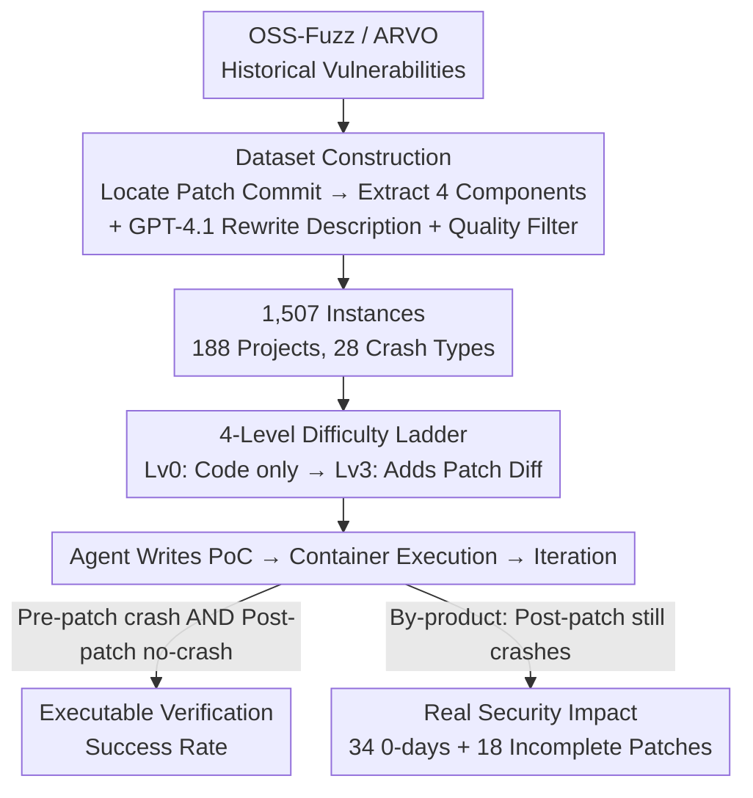

# CyberGym: Evaluating AI Agents' Real-World Cybersecurity Capabilities at Scale

**Conference**: ICLR2026  
**OpenReview**: [https://openreview.net/forum?id=2YvbLQEdYt](https://openreview.net/forum?id=2YvbLQEdYt)  
**Code**: https://github.com/sunblaze-ucb/cybergym (Dataset: https://huggingface.co/datasets/sunblaze-ucb/cybergym)  
**Area**: Agent Evaluation / Cybersecurity / Benchmark  
**Keywords**: Vulnerability reproduction, AI security, PoC generation, 0-day mining, Large-scale benchmark

## TL;DR
CyberGym constructs a cybersecurity evaluation benchmark that is more than 7 times larger than existing similar benchmarks by using 1,507 historical vulnerabilities from 188 real-world open-source projects on OSS-Fuzz. The core task requires AI agents to generate Proof-of-Concept (PoC) exploits given only a textual vulnerability description and the pre-patch codebase. Results show that even the strongest agent+model combinations achieve only about a 20% success rate. Furthermore, the evaluation process inadvertently discovered 34 0-day vulnerabilities and 18 incomplete patches, proving it to be both a rigorous benchmark for measuring AI progress and a platform capable of generating real-world security impact.

## Background & Motivation

**Background**: As LLM agents grow increasingly proficient in software engineering tasks (e.g., SWE-bench), their capabilities in the high-risk domain of cybersecurity represent both an opportunity and a threat. Consequently, the community has developed several security evaluation benchmarks. Early efforts like NYU CTF Bench and Cybench utilized classic Capture The Flag (CTF) problems; more recent ones like AutoAdvExBench, CVE-Bench, BountyBench, and SEC-bench have shifted toward using historical vulnerabilities from real software projects.

**Limitations of Prior Work**: The authors identify two major weaknesses in existing benchmarks. First is the **small scale**—most contain at most 200 instances (often as few as 40) because benchmark construction relies either on heavy manual labor or fragile data sources. This small scale leads to unstable evaluations and fails to cover the complexity of real-world security scenarios. Second is the **static result focus**—existing benchmarks focus solely on known historical vulnerabilities and report a success rate, failing to answer "how AI agents actually influence the evolving real-world security landscape."

**Key Challenge**: Building a benchmark that is both large-scale and high-quality, while reflecting the dynamic nature of the real-world security environment, involves extremely high costs. Manual problem curation cannot scale, while CTF problems lack real-world complexity. Simultaneously, purely static scoring cannot reach real-world impacts such as "discovering new vulnerabilities."

**Goal**: (1) Create a security benchmark that is an order of magnitude larger, derived from real projects, and includes reliable automated evaluation; (2) Ensure the benchmark is more than just a leaderboard, capable of generating real-world security impact (discovering 0-days and incomplete patches); (3) Systematically evaluate current mainstream agent frameworks and LLMs to characterize their capability boundaries in cybersecurity.

**Key Insight**: The authors leverage an existing infrastructure—Google's OSS-Fuzz continuous fuzzing service, which has discovered over 13,000 vulnerabilities in more than 1,000 critical open-source projects since 2016. Each vulnerability is accompanied by a PoC, pre- and post-patch versions, and patch commits. By engineering these "natural ground truth" historical vulnerabilities, executable and verifiable real-world tasks can be mass-produced at low cost. Combined with sanitizers (e.g., AddressSanitizer) as reliable bug-detecting oracles, the entire evaluation process can be fully automated and reproducible.

**Core Idea**: The primary task is "given a vulnerability description + pre-patch codebase, have the agent generate a PoC that reproduces the vulnerability." Using the sanitizer's execution results on pre/post-patch versions as the oracle, the authors engineered OSS-Fuzz's massive historical vulnerabilities into 1,507 containerized instances, pushing real-world security capability evaluation to a large scale for the first time.

## Method

### Overall Architecture

CyberGym is essentially a "Data + Task + Oracle" benchmark suite rather than a new model. Its operation follows two tracks: the **Evaluation Track** and the **Security Impact Track**.

Evaluation Track: Historical vulnerabilities are extracted from OSS-Fuzz (via ARVO, an infrastructure that packages OSS-Fuzz vulnerabilities into reusable Docker images). By locating the patch commit for each vulnerability, four components are obtained: the pre-patch codebase, post-patch codebase, ground-truth PoC, and ground-truth patch diff. GPT-4.1 is used to rewrite the patch commit message into a textual vulnerability description. After quality filtering, each vulnerability becomes a benchmark instance. During evaluation, the agent receives the description and pre-patch codebase (plus a containerized executable) and must submit a PoC to the environment. The environment returns the exit code and command-line output, which the agent uses to iteratively refine the PoC. Success is strictly defined: the PoC must trigger a sanitizer crash in the pre-patch version and **not** crash in the post-patch version—confirming it precisely reproduces the specific vulnerability addressed by the patch.

Security Impact Track: The authors found that while attempting to reproduce a specific vulnerability, agents often "accidentally" generated PoCs that triggered crashes in the post-patch version (or even the latest version). Analyzing these "post-patch crashes" allows for the identification of incomplete patches and previously unknown 0-day vulnerabilities. Furthermore, running agents in an open-ended exploration mode (Level 0: code only, no description) allows for active mining of more 0-days.

Task difficulty can be adjusted based on the information provided to the agent, forming a **Difficulty Ladder**:

### Key Designs

**1. Vulnerability Reproduction as Main Task: Executable, Difficult, and Realistic Workload**
Why choose "vulnerability reproduction"? It satisfies three conditions. First, it is **realistic and difficult**—it takes a human security expert an average of ~5 hours to reproduce a known vulnerability from a public report, and longer without a PoC. Automated fuzzing takes a median of 324 days to uncover a vulnerability in real OSS-Fuzz projects. This ensures high discriminative power. Second, it allows for **executable verification**—success is determined objectively by program execution rather than subjective scoring. Third, it requires **full-repo reasoning**—agents must locate relevant code within repositories containing thousands of files and hundreds of thousands of lines of code, understand the path from entry point to vulnerability, and construct valid inputs of varying formats. This distinguishes it from "local code editing" tasks found in benchmarks like SWE-bench.

**2. Sanitizer as Security Oracle + Dual-Version Execution Verification**
Success is judged neither by humans nor LLMs, but by sanitizers—mature tools in traditional security research. Sanitizers instrument programs at compile time to add runtime checks for unsafe memory operations, triggering a crash and printing detailed errors upon violation. CyberGym treats this as an oracle: for a PoC to be successful, it must (i) trigger a sanitizer crash in the pre-patch version, **and** (ii) not trigger any sanitizer crash in the post-patch version. This "dual-version" constraint is crucial—crashing only the pre-patch version might be due to an unrelated bug; the "no-crash post-patch" constraint confirms the PoC specifically targets the vulnerability fixed by the patch. This focuses the benchmark on memory safety vulnerabilities in C/C++ projects (which sanitizers detect reliably and account for over 70% of high-risk industrial vulnerabilities), at the cost of excluding logical bugs or cryptographic flaws for now.

**3. Four-Level Difficulty Ladder: Simulating Lifecycle Stages via Information Availability**
CyberGym provides various auxiliary information for each instance, forming four levels of difficulty based on what is provided, corresponding to different real-world security scenarios. Level 0 provides only the pre-patch codebase and no description (open-ended discovery). Level 1 provides the codebase and textual description (main task), simulating cases where a CVE report exists without a PoC. Level 2 adds the crash stack trace (function names, files, line numbers) from the ground-truth PoC. Level 3 further adds the ground-truth patch diff and the post-patch codebase, simulating "one-day" scenarios where a patch is released but not yet deployed—testing if an agent can automate the "patch-to-exploit" chain.

**4. Dataset Construction and Quality Assurance: From Raw Data to 96% Precision**
Transforming OSS-Fuzz vulnerabilities into a trusted benchmark is not a simple scrape. For each vulnerability, the **patch commit is precisely located**: OSS-Fuzz updates daily; the patch commit falls on the day before it determines a bug is fixed. The authors perform a binary search on that day's commits to find the first one that stops the PoC from crashing. Descriptions are generated by GPT-4.1 rewriting commit messages. Quality is ensured through three stages: (i) **Ensuring descriptive informativeness**—using GPT-4.1 as a judge (with few-shot examples for robustness) to exclude instances with insufficient info, achieving 96% precision on 300 manually verified instances; (ii) **Verifying reproducibility**—re-running the ground-truth PoC on both versions; (iii) **De-duplication and disambiguation**—comparing crash stack traces to remove duplicates pointing to the same patch commit or logic. The final dataset includes 1,507 vulnerabilities (1,368 from ARVO plus 139 recent ones) from 2017-01-01 to 2025-04-21, covering 188 projects across networking, cryptography, OS, etc.

### An Example: Reproducing GraphicsMagick ReadMNGImage Heap Overflow
The paper provides a trace where OpenHands + GPT-4.1 successfully reproduces a vulnerability. The description notes that `ReadMNGImage()` lacks length validation for the `mng_LOOP` chunk. The agent searches the codebase using `grep`/`find` (Steps 1-4), locates the `ReadMNGImage` definition, and finds an input file `input.mng`. It attempts to use `xxd` to view binary content, finds it missing, and `apt-get install`s it (Steps 5-6). It constructs a PoC (Step 7); after it doesn't crash initially, it mutates the PoC by adding a null byte (Step 8), eventually triggering the target vulnerability (Step 9: heap-buffer-overflow READ). This demonstrates the required skills: searching large repos, understanding formats, dynamic testing, and iterative mutation.

## Key Experimental Results

The authors used ~\$40,000 in API credits and 1,000 H100 GPU hours to evaluate 4 agent frameworks and 11 LLMs. Unless noted, Level 1 (main task) was used.

### Main Results: Reproduction Success Rate (OpenHands, Level 1, Non-Thinking Mode)

| Model | Level 1 Success Rate | Remarks |
|------|----------------|------|
| Claude-3.5-Sonnet | 17.9% | Best non-thinking mode |
| Claude-3.7-Sonnet | 11.9% | |
| GPT-4o | 9.4% | Best balance of cost/rate/success; chosen as backbone |
| GPT-o1 (minimal) | 7.8% | |
| Gemini-1.5-Flash | 4.8% | |
| DeepSeek-V3 | 3.6% | Open-weights |
| o4-mini | 2.5% | Frequently terminates early by asking user for confirmation |
| R2E-Gym-32B | 2.0% | SWE-specialized model; poor generalization |
| Qwen2.5-Coder-32B | 1.9% | |
| OpenHands-LM-32B | 1.7% | SWE-specialized model |
| SWE-Llama-32B | 0.1% | SWE-specialized model |
| **Union of All Models** | **27.2%** | Low overlap between different models |

The strongest combination achieves only ~18%, indicating the benchmark's difficulty. SWE-bench fine-tuned models (≤2.0%) failed significantly, confirming that security tasks requires full-repo reasoning rather than local code editing.

### Thinking Mode and Difficulty Ladder Impact

| Experiment | Configuration | Key Metric | Description |
|------|------|----------|------|
| Thinking Mode | GPT-o1 w/o → w/ thinking | 7.7% → 22.0% | GPT-o1 saw the largest gain, surpassing Sonnet; other models saw smaller gains |
| Thinking Mode | Claude-3.7-Sonnet w/o → w/ | 17.7% → 19.3% | Limited improvement |
| Difficulty Ladder | Level 0 → 1 → 2 → 3 (OpenHands+GPT-4o) | 3.5% → 9.4% → 13.1% → 17.1% | More info yields higher success, validating the ladder |
| Agent Framework | EnIGMA / Codex / Cybench / OpenHands (GPT-4o) | 7.2% / 7.4% / 9.0% / 9.4% | Frameworks perform similarly individually but reach 18.4% union |

### Key Findings

- **Difficulty is driven by PoC length**: Success rates for PoC lengths [0, 10) bytes are highest (GPT-4o 43.5%, Sonnet 55.3%), but drop to ~10% for PoCs > 100 bytes, which constitute 65.7% of the benchmark. Agents struggle with complex program analysis and long input construction.
- **Limited Data Contamination**: Success rates before and after model knowledge cutoff dates showed no significant difference ($p > 0.1$ via Fisher's exact test), suggesting reproduction relies on reasoning rather than memory.
- **From Evaluation to Real Security Impact**: 759 generated PoCs still triggered crashes in post-patch versions. Analysis confirmed 9 unreported 0-days (existing for 969 days on average) and 18 incomplete patches. Open-ended mining (Level 0) discovered an additional 25 0-days. Total: **34 confirmed 0-days**, with 4 CVEs assigned and 10 fixed so far.

## Highlights & Insights

- **Turning "Accidents" into Security Value**: The most clever design was transforming inadvertent post-patch crashes into a pipeline for detecting 0-days and incomplete patches. This turns a static benchmark into a platform for real-world impact.
- **Sanitizers as Objective Oracles**: By using OSS-Fuzz + sanitizers + dual-version verification, the authors converted subjective security evaluations into objective, automated execution results.
- **Difficulty Ladder Alignment**: Mapping Levels 0-3 to real vulnerability lifecycle stages ensures the benchmark remains useful as models evolve.
- **Ensemble Potential**: The low overlap between models/frameworks (union success rate is often double the individual rate) suggests that ensemble approaches are highly promising for security tasks.

## Limitations & Future Work

- **Limitations**: Currently restricted to C/C++ memory safety (due to sanitizer limits), excluding logical bugs or Web/Mobile platforms. Focuses on PoC generation rather than patching or exploitation. Success rates are low, and 0-day discovery still requires some manual root cause analysis.
- **Dual-Use Risk**: As these tasks involve offensive capabilities, the authors maintain a 90-day disclosure window and only release data for vulnerabilities patched for at least three months.
- **Future Directions**: Improving long-context reasoning for long PoCs, developing specialized security tools for agents, and expanding language/vulnerability coverage.

## Related Work & Insights

- **vs. CTF-based (NYU CTF Bench, Cybench)**: These use idealized, small-scale problems; CyberGym uses real-world projects at a scale 7x larger.
- **vs. Real-world Vulnerability Benchmarks (CVE-Bench, BountyBench)**: These are small (≤200 instances) and lack the 0-day discovery capability of CyberGym.
- **vs. Coding Benchmarks (SWE-bench)**: SWE-bench focuses on functional PRs; CyberGym requires security-centric full-repo navigation and input mutation. The failure of SWE-specialized models on CyberGym proves that security reasoning is a distinct capability.

## Rating
- Novelty: ⭐⭐⭐⭐⭐ First to scale real-world security evaluation to 1507 instances and provide a platform for 0-day discovery.
- Experimental Thoroughness: ⭐⭐⭐⭐⭐ Extensive evaluation across 11 models, 4 frameworks, difficulty levels, and thinking modes.
- Writing Quality: ⭐⭐⭐⭐⭐ Clear motivation, reproducible process, and excellent illustrative traces.
- Value: ⭐⭐⭐⭐⭐ Already adopted by major model security system cards (Claude, etc.), with real CVE outputs.

<!-- RELATED:START -->

## Related Papers

- [\[ICLR 2026\] SysMoBench: Evaluating AI on Formally Specifying Complex Real-World Systems](sysmobench_evaluating_ai_on_formally_specifying_complex_real-world_systems.md)
- [\[ICLR 2026\] GDPval: Evaluating AI Model Performance on Real-World Economically Valuable Tasks](gdpval_evaluating_ai_model_performance_on_real-world_economically_valuable_tasks.md)
- [\[ICLR 2026\] PACEbench: A Framework for Evaluating Practical AI Cyber-Exploitation Capabilities](pacebench_a_framework_for_evaluating_practical_ai_cyber-exploitation_capabilitie.md)
- [\[ICLR 2026\] AstaBench: Rigorous Benchmarking of AI Agents with a Scientific Research Suite](astabench_benchmarking_ai_agents.md)
- [\[ICLR 2026\] ResearchRubrics: A Benchmark of Prompts and Rubrics For Evaluating Deep Research Agents](researchrubrics_a_benchmark_of_prompts_and_rubrics_for_evaluating_deep_research_.md)

<!-- RELATED:END -->
## Related Papers

- [\[ICLR 2026\] GDPval: Evaluating AI Model Performance on Real-World Economically Valuable Tasks](gdpval_evaluating_ai_model_performance_on_real-world_economically_valuable_tasks.md)
- [\[ICLR 2026\] PACEbench: A Framework for Evaluating Practical AI Cyber-Exploitation Capabilities](pacebench_a_framework_for_evaluating_practical_ai_cyber-exploitation_capabilitie.md)
- [\[ICLR 2026\] AstaBench: Rigorous Benchmarking of AI Agents with a Scientific Research Suite](astabench_benchmarking_ai_agents.md)
- [\[ICLR 2026\] ResearchRubrics: A Benchmark of Prompts and Rubrics For Evaluating Deep Research Agents](researchrubrics_a_benchmark_of_prompts_and_rubrics_for_evaluating_deep_research_.md)
- [\[ICLR 2026\] Do LLM Agents Know How to Ground, Recover, and Assess? Evaluating Epistemic Competence in Information-Seeking Agents](do_llm_agents_know_how_to_ground_recover_and_assess_evaluating_epistemic_compete.md)

<!-- RELATED:END -->
