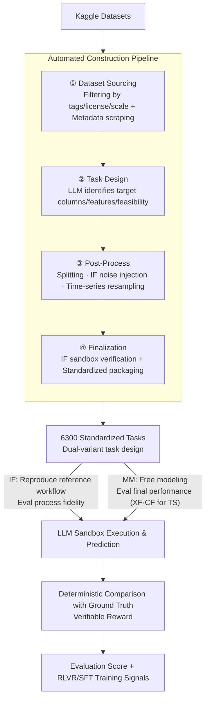

# DARE-bench: Evaluating Modeling and Instruction Fidelity of LLMs in Data Science

**Conference**: ICLR 2026  
**arXiv**: [2602.24288](https://arxiv.org/abs/2602.24288)  
**Code**: [https://github.com/Snowflake-Labs/dare-bench](https://github.com/Snowflake-Labs/dare-bench)  
**Area**: LLM Evaluation  
**Keywords**: data science benchmark, instruction following, ML modeling, RLVR, LLM agent

## TL;DR
DARE-bench is a large-scale verifiable benchmark for data science tasks, containing 6,300 Kaggle-derived tasks. it supports two evaluation categories: ML modeling and instruction following. It provides training sets to support SFT and RL—improving Qwen3-32B by 1.83$\times$ via SFT and Qwen3-4B by over 8$\times$ via RL.

## Background & Motivation

**Background**: LLMs are increasingly utilized as data science agents (for data ingestion, transformation, and modeling). However, existing benchmarks (e.g., DS-1000, DSBench, MLE-bench) suffer from significant flaws: most only evaluate final answer accuracy while ignoring process fidelity; they lack verifiable ground truth; and they feature small task scales (a few hundred) without providing training data.

**Limitations of Prior Work**: (a) Absence of standardized process-aware evaluation—do agents truly follow specified DS workflows? (b) Scarcity of accurately labeled training data, which limits the application of SFT and RL. (c) Existing benchmarks primarily originate from Kaggle competitions with narrow domain coverage (missing critical tasks like time-series forecasting).

**Key Challenge**: Evaluating process fidelity requires deterministic ground truth, yet DS tasks naturally involve stochasticity and environmental dependencies. How can process evaluation be made verifiable?

**Goal**: (a) Construct a large-scale, verifiable DS benchmark that supports training; (b) Cover two complementary capabilities: instruction following and ML modeling; (c) Support RLVR (Reinforcement Learning from Verifiable Rewards) training.

**Key Insight**: Leverage the high reproducibility of data science. By controlling random seeds and providing explicit instructions, faithful process execution produces deterministic results, enabling outcome-based verification of process fidelity.

**Core Idea**: Through engineering determinism (fixed seeds, sandbox execution, reference solutions, and verifiable ground truth), DS process evaluation is transformed into automatically verifiable outcome-based evaluation.

## Method

### Overall Architecture
DARE-bench addresses whether existing LLMs can strictly follow workflows dictated by data scientists while autonomously optimizing models, and whether these evaluations can serve as training signals. Each dataset is used to derive two complementary task types: IF (Instruction Following) requires strict reproduction of a reference workflow to test process fidelity; MM (ML Modeling) allows any method and evaluates only the final prediction performance. Time-series tasks are further categorized by difficulty into XF and CF based on the availability of exogenous features in the test set. These tasks are generated from Kaggle data via a four-stage automated pipeline, totaling 6,300 tasks with verifiable ground truths. During evaluation, LLMs execute self-generated code in a sandbox, and the system automatically scores predictions via deterministic comparison with ground truth, independent of human or LLM judges. Consequently, 95% of tasks can directly serve as training signals for RLVR.

### Key Designs

**1. Automated Construction Pipeline: Utilizing LLMs as auxiliary annotators to convert Kaggle data into standardized tasks with ground truth**

Acquiring 6,300 verifiable tasks manually is impractical; thus, this pipeline is essential for scaling. It converts raw Kaggle data into standardized ML tasks through four stages: (1) Dataset Sourcing uses APIs and crawlers to filter datasets; (2) Task Design employs LLMs to read data previews and descriptions to determine task feasibility and identify column types; (3) Post-Process executes training/test splits and injects noise for IF tasks or performs resampling for time-series tasks; (4) Finalization runs reference solutions in a sandbox for IF tasks to ensure solvability. LLMs handle only auxiliary content (descriptions, metadata, feasibility), while training signals (labels, reference outputs) are derived from real data and deterministic execution to avoid introducing noise.

**2. Dual-Variant Task Design: Separating "process correctness" from "performance" into independent verifiable tasks**

Data science agents are typically used in two ways: following a specific plan or optimizing for the best result. DARE-bench generates two complementary tasks for each dataset. IF requires strict reproduction of a reference workflow (fixed model, hyperparameters, and preprocessing), testing process fidelity. Here, fixed random seeds ensure that "faithful execution" produces a unique, matching result. MM imposes no method constraints, evaluating only final prediction performance to test modeling and hyperparameter tuning capabilities. Time-series tasks are split into XF (Exogenous Features retained in test set) and CF (Canonical Forecasting, only timestamps and entity IDs provided), with CF representing a higher difficulty level.

**3. Verifiable Reward Design: Enabling RLVR for DS tasks similar to math or programming**

RL training requires automated scoring without human intervention. Since the previous designs fix ground truths to deterministic values, reward rules are easily defined. For IF tasks, the ground truth is the output $\mathbf{y}_{ref}$ of the reference solution $\mathcal{C}_{ref}$ under a fixed seed, using binary matching $r = \mathbb{1}[\hat{\mathbf{y}} = \mathbf{y}_{ref}]$. For MM tasks, scoring is based on real labels $\mathbf{y}_{gt}$, using macro-F1 for classification and clipped coefficients of determination $\mathrm{clip}(R^2) = \min\{1, \max\{0, R^2\}\}$ for regression and time-series. Both are purely outcome-based and independent of LLM judges. This allows 95% of the 6,300 tasks to serve as RLVR training signals.

### Loss & Training
- SFT: Fine-tuned Qwen3-32B/4B using the DARE-bench training set.
- RL: Employed the GRPO algorithm with DARE-bench verifiable rewards, requiring no preference data.
- Metrics: Accuracy/F1 for classification, $R^2$/RMSE for regression, and SMAPE/MAE for time-series.

## Key Experimental Results

### Main Results

| Model | Baseline Total | SFT Total | RL Total | Gain |
|------|---------|---------|---------|------|
| gpt-o4-mini | ~45 | - | - | Strongest closed-source struggles with ML modeling |
| Qwen3-32B | 23.25 | ~42.5 (1.83$\times$) | - | Significant improvement via SFT |
| Qwen3-4B | 4.39 | ~25 | **37.40 (8.5$\times$)** | Incredible RL performance |

### Ablation Study

| Task Type | Key Findings |
|---------|---------|
| Classification-IF | Failure to follow seed/hyperparameter instructions is the primary cause of failure. |
| Classification-MM | LLMs frequently select suboptimal models in open modeling scenarios. |
| Time-series-CF | The most challenging subtask; even strong models perform poorly. |
| RL vs SFT | RL significantly outperforms SFT on small models; SFT is sufficient for larger models. |

### Key Findings
- **Even gpt-o4-mini struggles with ML modeling tasks**, indicating that existing LLM data science capabilities are immature.
- **Instruction following is the primary bottleneck**: Models frequently deviate from specified processes (e.g., ignoring seeds or altering preprocessing), leading to IF task failures.
- **RL provides massive gains for small models**: Qwen3-4B improved from 4.39 to 37.40 (8.5$\times$), proving the effectiveness of verifiable rewards for DS agents.
- **Time-series forecasting is the weakest area**: All models performed worst on CF variants, suggesting a lack of deep knowledge in time-series modeling.

## Highlights & Insights
- **Transformation from process fidelity to outcome-based evaluation**: By utilizing DS reproducibility, the study elegantly solves the objectivity problem of process evaluation.
- **Unified Training and Evaluation**: With 95% of the 6,300 tasks available for training, the benchmark supports the "train on benchmark" paradigm.
- **Enormous RL gains for small models**: The 8$\times$ improvement suggests task-specific RL can unlock the potential of small models for DS agent deployment.
- **Superior Scale**: With 6,300 tasks compared to existing DS benchmarks, this represents a significant increase in evaluation breadth.

## Limitations & Future Work
- Kaggle datasets may not fully represent the complexity of real-world industrial data science problems.
- The "determinism" of IF tasks relies on complete control over random seeds, which is not always possible in real DS workflows.
- The benchmark does not evaluate multi-turn interactions or iterative modeling—real DS work often requires multiple experimental iterations.
- Choice of metrics for time-series tasks (e.g., SMAPE vs. MAE) may influence model rankings.

## Related Work & Insights
- **vs. DSBench/MLE-bench**: Larger scale (6,300 vs. 540/75), provides training data, and covers time-series.
- **vs. SWE-bench**: While SWE-bench focuses on software engineering, DARE-bench targets data science, offering complementary utility.
- **vs. RLVR (e.g., DeepSeek-R1)**: DARE-bench extends RLVR scenarios beyond math and code to data science tasks with verifiable rewards.

## Rating
- Novelty: ⭐⭐⭐⭐ The IF+MM dual-variant evaluation and DS process fidelity verification are novel contributions.
- Experimental Thoroughness: ⭐⭐⭐⭐⭐ Extensive model evaluation across SFT and RL with 6,300 tasks.
- Writing Quality: ⭐⭐⭐⭐ Clear structure with detailed pipeline descriptions.
- Value: ⭐⭐⭐⭐ Fills a critical gap in DS agent training and evaluation; RL results are particularly persuasive.

<!-- RELATED:START -->

## Related Papers

- [\[ICLR 2026\] LMGame-Bench: How Good are LLMs at Playing Games?](lmgame-bench_how_good_are_llms_at_playing_games.md)
- [\[ICLR 2026\] PCB-Bench: Benchmarking LLMs for Printed Circuit Board Placement and Routing](pcb-bench_benchmarking_llms_for_printed_circuit_board_placement_and_routing.md)
- [\[ICLR 2026\] Rethinking LLM Evaluation: Can We Evaluate LLMs with 200× Less Data?](rethinking_llm_evaluation_can_we_evaluate_llms_with_200_less_data.md)
- [\[ICLR 2026\] Detecting Data Contamination in LLMs via In-Context Learning](detecting_data_contamination_in_llms_via_in-context_learning.md)
- [\[AAAI 2026\] Benchmarking LLMs for Political Science: A United Nations Perspective](../../AAAI2026/llm_evaluation/benchmarking_llms_for_political_science_a_united_nations_perspective.md)

<!-- RELATED:END -->
