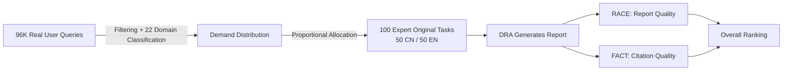

# DeepResearch Bench: A Comprehensive Benchmark for Deep Research Agents

**Conference**: ICLR 2026  
**OpenReview**: [https://openreview.net/forum?id=hQ0K2Hhq7H](https://openreview.net/forum?id=hQ0K2Hhq7H)  
**Code**: [https://github.com/Ayanami0730/deep_research_bench](https://github.com/Ayanami0730/deep_research_bench)  
**Area**: LLM Evaluation / Deep Research Agent / Benchmark  
**Keywords**: Deep Research Agent, Long-form report evaluation, Citation reliability, LLM-as-a-Judge, Automated evaluation  

## TL;DR
Proposes **DeepResearch Bench**, the first systematic benchmark for "Deep Research Agents" (DRA)—comprising 100 PhD-level research tasks across 22 disciplines crafted by experts, supported by two automated and highly human-aligned evaluation frameworks: RACE for report quality and FACT for information retrieval and citation reliability.

## Background & Motivation
- **Background**: Deep Research Agents, represented by OpenAI/Gemini Deep Research, are becoming highly practical LLM agents. Given open-ended research tasks, they automatically retrieve, analyze, and synthesize vast online materials to produce analyst-level comprehensive reports within minutes.
- **Limitations of Prior Work**: There is a lack of benchmarks specifically for evaluating DRAs. The internal reasoning and retrieval processes of DRAs are opaque, with the final report being the only observable output. Furthermore, complex research tasks often lack a fixed ground truth. Existing benchmarks either test isolated abilities (web browsing, information retrieval) or pure generation independent of real-time retrieval, failing to capture the multi-dimensional integrated capabilities of DRAs.
- **Key Challenge**: Evaluating long research reports is an open problem—fixed checklists or static rubrics cannot adapt to diverse tasks and professional domains; direct scoring by LLMs often leads to inflated scores and a lack of discriminative power.
- **Goal**: Establish a task set that is both close to real research needs and sufficiently challenging, and design automated evaluation methods highly consistent with human expert judgment for fair comparison of various DRAs.
- **Core Idea**: **Task side**: Selection is driven by real user query distributions, with tasks originally created by experts; **Evaluation side**: Uses a "Reference report + Task-adaptive weights/criteria" approach for relative scoring (RACE), and a "Sentence-level extraction and source verification" approach to quantify citation quality (FACT).

## Method

### Overall Architecture
The method consists of three components: (a) Based on the statistical distribution of 96,147 real user queries across 22 domains, 100 expert-original bilingual tasks (50 Chinese, 50 English) were developed; (b) **RACE** for report quality—it dynamically generates dimensional weights and scoring criteria for each task, using high-quality reference reports as anchors for relative scoring; (c) **FACT** for retrieval capability—reports are decomposed into "statement-URL" pairs, and each is verified against the original source to calculate citation accuracy and effective citations.

### Key Designs

**1. Real-Demand-Driven Task Construction**  
The credibility of a benchmark depends on whether the tasks reflect real research needs. The authors collected 96,147 real user queries from search-enabled Chatbots, used DeepSeek-V3 to filter 44,019 deep research queries (defined as requiring multi-round retrieval + analysis + report generation), and applied the WebOrganizer 22-domain taxonomy for classification. 100 tasks were then **originally created by PhDs or senior professionals with 5+ years of experience** according to the domain quotas, rather than simply selecting from the 44K queries. This ensures tasks are both realistic and challenging.

**2. RACE: Relative Scoring with Reference Anchoring + Task-Adaptive Criteria**  
Directly asking a Judge LLM to score long reports results in compressed, high scores. RACE fixes four orthogonal top-level dimensions: Comprehensive (COMP), Depth (DEPTH), Instruction Following (INST), and Readability (READ). For each task $t$, the Judge LLM first produces task-level weights $W_d$ for the four dimensions, then generates a set of actionable sub-criteria $\{c_{d,k}\}$ and their normalized weights ($\sum_k w_{d,k}=1$). Scoring uses a reference anchoring strategy: a high-quality report $R_{ref}$ is chosen as a reference, and the Judge LLM scores both the target and reference reports on each criterion. Dimensional scores are aggregated via $W_d$ into $S_{int}$, and the final score is relative:

$$S_{final}(R_{tgt}) = \frac{S_{int}(R_{tgt})}{S_{int}(R_{tgt}) + S_{int}(R_{ref})}$$

This maps scores to a relative coordinate system anchored by the reference report, leading to rankings and proportional differences that are highly linearly correlated with human judgment.

**3. FACT: Quantifying Citation Reliability via Source Verification**  
FACT evaluates whether citations truly support the claims made. It extracts discrete statement-URL pairs $P_t$ from the report, deduplicates them into a unique set $U_t$ (count $N_{u,t}$), and uses the Jina Reader API to fetch the content of cited webpages. The Judge LLM then determines if the webpage supports the corresponding statement (binary support/not-support), yielding the count of supported claims $N_{s,t}$. Two metrics are calculated—Citation Accuracy (measuring precision):

$$\text{C. Acc.} = \frac{1}{|T|}\sum_{t\in T}\frac{N_{s,t}}{N_{u,t}}$$

And Average Effective Citations per task (measuring information abundance):

$$\text{E. Cit.} = \frac{\sum_{t\in T} N_{s,t}}{|T|}$$

These characterize the trade-off between citation accuracy and volume.

## Key Experimental Results

### Main Results (Selected representative results, RACE Overall + FACT)

| Model | RACE Overall | C. Acc. | E. Cit. |
|---|---|---|---|
| LangChain ODR (GPT-5) | **50.60** | 32.94 | 21.06 |
| Gemini-2.5-Pro Deep Research | 49.71 | 78.30 | **165.34** |
| OpenAI Deep Research | 46.45 | 75.01 | 39.79 |
| Claude Research | 45.00 | – | – |
| Kimi Researcher | 44.64 | – | – |
| Doubao Deep Research | 44.34 | 52.86 | 52.62 |
| Perplexity Deep Research | 40.46 | 82.63 | 31.20 |
| Tongyi DeepResearch (Open-source RL) | 40.46 | – | – |
| Claude-3.7-Sonnet w/Search | 40.67 | **93.68** | 32.48 |
| DeepResearcher (Open-source RL) | 10.77 | – | – |

> Evaluation setup: RACE uses Gemini-2.5-pro as the Judge; FACT uses Gemini-2.5-flash for extraction and verification. The reference report is sourced from the April 2025 output of Gemini-2.5-pro Deep Research.

### Ablation Study (RACE components vs. Human Alignment, Table 2)

| Evaluation Method | PAR | OPC | FAP | FAS | Overall |
|---|---|---|---|---|---|
| Vanilla Prompt (Direct Scoring) | 58.89 | 98.89 | 40.30 | 43.75 | 60.46 |
| **RACE (Full)** | **71.33** | 99.54 | **60.24** | **59.12** | **72.56** |
| - No Criteria Weights | 70.67 | 99.62 | 59.83 | 56.27 | 71.60 |
| - No Dim Weights | 70.89 | 99.54 | 60.11 | 57.22 | 71.94 |
| - No Weights | 71.11 | 99.69 | 59.46 | 58.17 | 72.11 |
| - No Reference | 66.56 | 97.46 | 57.51 | 51.23 | – |

### Key Findings
- **Open-source frameworks can match or exceed closed-source models**: LangChain Open Deep Research using GPT-5 achieved a RACE score of 50.60, outperforming Gemini-2.5-Pro Deep Research.
- **Trade-off between Citation Accuracy and Effective Citations**: Gemini-2.5-Pro leads significantly with 165 effective citations (long-context advantage), but its accuracy is lower than Perplexity and significantly lower than Claude-3.7 w/Search (93.68).
- **Modern DRAs outperform traditional "Search-enabled LLMs"**: Single/few-round search LLMs generally lag behind multi-round retrieval DRAs in the same evaluation.
- **RACE is highly aligned with humans**: The pairwise agreement rate (PAR 71.33) of RACE (Full) exceeds the consistency between human annotators.
- **Polarization in open-source RL systems**: Tongyi DeepResearch (40.46) approaches Perplexity Deep Research, whereas DeepResearcher (10.77) fails to produce complete structured reports.

## Highlights & Insights
- **Determining "What to evaluate" before "How to evaluate"**: Using 96k real queries to derive the task distribution anchors the benchmark in real-world needs.
- **Reference Anchoring + Task-Adaptive Criteria** elegantly solves the persistent issue of "score inflation" in LLM judges for long-form text.
- **Complementary RACE/FACT Framework**: One evaluates report quality, the other evaluates citation validity, breaking down opaque DRAs into quantifiable dimensions.
- The RACE/FACT methodology is not limited to deep research and can be transferred to broader long-form or Retrieval-Augmented Generation (RAG) evaluations.

## Limitations & Future Work
- **Small Task Scale (100)**: Limited by high resource consumption per task. While it provides stability, the query-based generation mechanism allows for future expansion.
- **FACT reliance on external scraping**: Incomplete or incorrect scraping by Jina Reader affects metrics. Some systems (e.g., Kimi) lack FACT scores due to UI or formatting issues.
- **Judge reliance on closed-source models**: RACE/FACT both depend on the Gemini series, making evaluation costs and reproducibility susceptible to commercial model iterations.
- **Misinterpretation of relative scores**: Absolute RACE scores appear low and clustered; users should focus on rankings and proportional differences.

## Related Work & Insights
- **Comparison with existing agent benchmarks**: Unlike benchmarks focusing on isolated web browsing or pure generation, this work evaluates the integrated "retrieval + analysis + reporting" capability.
- **Engineering LLM-as-a-Judge**: By using dynamic weights and adaptive criteria, property-level consistency is pushed beyond human levels.
- **Citation reliability evaluation**: The FACT paradigm can be directly migrated to factuality evaluations in RAG or citation-heavy Q&A systems.

## Rating
- Novelty: ⭐⭐⭐⭐ First dedicated benchmark for DRAs; RACE relative scoring and FACT source verification are substantive innovations.
- Experimental Thoroughness: ⭐⭐⭐⭐ Covers nearly 20 commercial/open-source DRAs and search-enabled LLMs, with human alignment from 70+ annotators and multiple ablation studies.
- Writing Quality: ⭐⭐⭐⭐ Clear progression from motivation to construction and verification, with standardized formulas and tables.
- Value: ⭐⭐⭐⭐ Fills a gap in DRA evaluation; open-sourced benchmark and protocols provide high reference value for long-form/RAG evaluation.

<!-- RELATED:START -->

## Related Papers

- [\[ICLR 2026\] ResearchRubrics: A Benchmark of Prompts and Rubrics For Evaluating Deep Research Agents](researchrubrics_a_benchmark_of_prompts_and_rubrics_for_evaluating_deep_research_.md)
- [\[ICLR 2026\] DRBench: A Realistic Benchmark for Enterprise Deep Research](drbench_a_realistic_benchmark_for_enterprise_deep_research.md)
- [\[ICLR 2026\] LiveResearchBench: A Live Benchmark for User-Centric Deep Research in the Wild](liveresearchbench_a_live_benchmark_for_user-centric_deep_research_in_the_wild.md)
- [\[ICLR 2026\] Towards Personalized Deep Research: Benchmarks and Evaluations](towards_personalized_deep_research_benchmarks_and_evaluations.md)
- [\[ICLR 2026\] Characterizing Deep Research: A Benchmark and Formal Definition](characterizing_deep_research_a_benchmark_and_formal_definition.md)

<!-- RELATED:END -->
