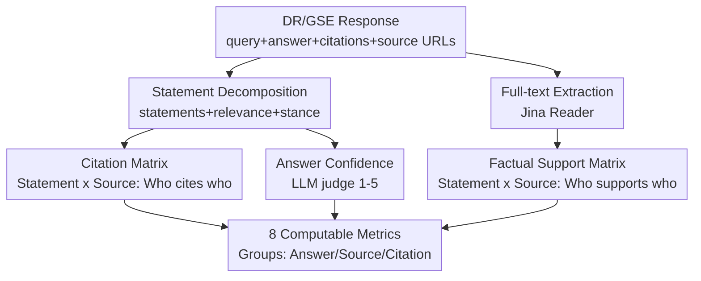

# DeepTRACE: Auditing Deep Research AI Systems for Tracking Reliability Across Citations and Evidence

**Conference**: ICLR2026  
**OpenReview**: [https://openreview.net/forum?id=QkaeTea16Y](https://openreview.net/forum?id=QkaeTea16Y)  
**Code**: https://github.com/SalesforceAIResearch/answer-engine-eval  
**Area**: LLM Evaluation / Agent Auditing  
**Keywords**: Deep Research Agents, Generative Search Engines, Citation Reliability, Factual Support, Sociotechnical Evaluation

## TL;DR
DeepTRACE translates real-world failure modes identified by the community into 8 computable metrics to perform end-to-end auditing of Generative Search Engines (GSE) and Deep Research (DR) agents. It reveals that these systems generally suffer from one-sided expression, overconfidence, and a high volume of statements that "cite sources without actually being supported by them," with citation accuracy ranging only between 40–80%.

## Background & Motivation
**Background**: Generative Search Engines and Deep Research Agents, represented by Perplexity, You.com, Bing Copilot, ChatGPT Deep Research, and Gemini Deep Research, have entered the daily information retrieval workflows of millions. Their selling point is the ability to automatically retrieve web pages, perform multi-step reasoning, and synthesize long-form reports with citations, allowing users to obtain conclusions and verify sources with a single click.

**Limitations of Prior Work**: This pipeline can fail at every stage. LLMs themselves hallucinate and struggle to distinguish factual errors even with authoritative sources. Retrieval stages often provide incorrect citations, attributing statements to irrelevant or non-existent sources. Models encode knowledge within pre-trained weights, making it difficult to ensure outputs rely solely on retrieved documents. Additionally, a tendency toward sycophancy causes systems to cater to the user's implicit stance in the query rather than objective facts.

**Key Challenge**: Existing evaluation benchmarks focus almost exclusively on isolated components of RAG (retrieval quality, summarization quality, or factual correctness of single claims). They lack a framework to audit the "system as a whole" regarding how it presents sources, citations, and uncertainty to the user. Furthermore, most benchmarks are researcher-defined, representing a "tech-centric/positivist" perspective that ignores the social and cognitive consequences of deploying these systems to real users.

**Goal**: To transform 16 common failure modes identified by real users and domain experts in qualitative usability studies (Narayanan Venkit et al., 2025) into an automated, scalable evaluation benchmark that audits DR/GSE systems end-to-end for "what they generate, how they reason, how they cite, and how they manage uncertainty."

**Key Insight**: Anchored in a sociotechnical perspective, the study focuses on three dimensions emerging from user research—relevance and diversity of sources, citation accuracy and transparency, and factuality/balance/framing of generated language. These qualitative insights are parameterized into 8 computable metrics, unified under a pipeline consisting of "statement decomposition + two matrices."

## Method

### Overall Architecture
The input to DeepTRACE is a complete response from any DR/GSE system to a query, and the output consists of computable scores across 8 dimensions. The pipeline first performs "preprocessing" to break the raw response into structured intermediate products, upon which the 8 metrics are defined.

Preprocessing requires extracting four content elements from the response: the user query, the generated answer body, embedded citation markers, and the publicly accessible URLs pointed to by each citation. Since most system APIs do not expose these elements, the authors developed automated browser scripts to scrape them from 4 GSEs (GPT-4.5/5, You.com, Perplexity, BingChat) and various DR configurations. Once these elements are obtained, five processing steps are performed:

1.  **Statement Decomposition**: The answer body is segmented into "statements," and two attributes are assigned to each: `Query Relevance` (binary; whether the statement actually answers the query, where non-informative phrases are marked as irrelevant) and `Pro vs. Con` (ternary; for debate queries, labeling the statement as supporting, opposing, or neutral toward the query's implicit stance).
2.  **Answer Confidence Scoring**: An LLM judge assigns an `Answer Confidence` score to the entire answer on a Likert 1–5 scale (1 = high uncertainty, 5 = high confidence), using prompts with examples of different phrasing levels. This score achieved a Pearson correlation of 0.72 with manual annotations on 100 answers.
3.  **Full-text Source Extraction**: The body text of each source URL is captured using Jina.ai Reader. Approximately 15% of URLs fail due to paywalls or 404 errors; these are excluded from full-text dependent calculations.
4.  **Citation Matrix**: A binary matrix of size `(Number of Statements × Number of Sources)` is constructed, where cell $(i,j)=1$ indicates that the $i$-th statement cites the $j$-th source.
5.  **Factual Support Matrix**: A similar `(Number of Statements × Number of Sources)` matrix is constructed, where cell $(i,j)=1$ indicates that the content of the $j$-th source factually supports the $i$-th statement. This is determined pairwise by an LLM judge, with a Pearson correlation of 0.62 (moderate agreement) with human labels.

The relationship between "Response → Intermediate Products → 8 Metrics" is shown below:

The key lies in the fact that almost all 8 metrics are simple algebraic combinations of these two matrices (Citation Matrix $C$, Factual Support Matrix $S$) and the two statement attributes (relevance, stance). This compresses qualitative "user dissatisfaction" into batch-computable, reproducible numerical values.

### Key Designs

**1. Mapping Community Failure Modes to 8 Computable Metrics: Auditing "Evidence Usage" Rather Than Just "Answer Correctness"**

The core contribution of DeepTRACE is its metric system rather than a specific model. It addresses the pain point that previous benchmarks verify only if a single claim is correct (like FActScore or CoRE), failing to quantify end-to-end reliability issues such as "listing many sources to create an illusion of verification." The 8 metrics are divided into three groups:

*   **Answer Text Group**: `One-Sided Answer`—for debate queries, if the answer does not contain both pro and con statements (=1); `Overconfident Answer`—if the answer is both "one-sided" and has confidence=5; `Relevant Statement` $= \frac{\text{Number of Relevant Statements}}{\text{Total Number of Statements}}$, measuring the "focus" of the answer.
*   **Source Group**: `Uncited Sources` $= \frac{\text{Number of Cited Sources}}{\text{Number of Listed Sources}}$ (empty columns in the Citation Matrix); `Unsupported Statements` $= \frac{\text{Number of Unsupported Statements}}{\text{Number of Relevant Statements}}$ (rows in the Factual Support Matrix where all entries are zero); `Source Necessity` (see Design 2).
*   **Citation Group**: `Citation Accuracy` and `Citation Thoroughness` (see Design 3).

The authors intentionally excluded failure modes involving the "UI layer" from the user research, as they cannot be calculated directly from text/citations/sources and would require human evaluation or computer vision.

**2. Defining "Source Necessity" via Minimum Vertex Cover: Distinguishing "Cited" from "Actually Useful"**

`Source Necessity` addresses the question: Of the sources listed by the system, how many are truly necessary (meaning their removal would leave a statement unsupported) versus just padding. Counting "how many were cited" is insufficient—a source may be cited, but the statement it supports might also be supported by other sources (redundancy). The authors model this as a graph problem: treating the Factual Support Matrix as a "Statement-Source" bipartite graph and finding the minimum vertex cover on the source side using the Hopcroft-Karp algorithm. The sources in the cover set are the "necessary sources." Thus:

$$\text{Source Necessity} = \frac{\text{Number of Necessary Sources}}{\text{Number of Listed Sources}}.$$

This design exposes bloat, such as listing 200 sources where only 5 are necessary. It measures whether a source provides unique support that cannot be replaced.

**3. Defining Citation "Accuracy" and "Thoroughness" via Matrix Overlap**

Citation quality is split into two complementary metrics, both built on the element-wise product of the citation matrix $C$ and the factual support matrix $S$ ($C \odot S$, representing cells that are both cited and truly supportive):

$$\text{Citation Accuracy} = \frac{\sum (C \odot S)}{\sum C}, \qquad \text{Citation Thoroughness} = \frac{\sum (C \odot S)}{\sum S}.$$

`Citation Accuracy` asks: Of the citations provided by the system, how many actually point to supporting sources? The denominator is the total number of citations, punishing incorrect attributions. `Citation Thoroughness` asks: Of all potential valid "statement-source" support relationships, how many did the system actually cite? The denominator is the total number of existing support relationships, punishing the failure to cite valid evidence. Together, they characterize citation behavior fully.

### Loss & Training
This work is an audit/benchmark and does not involve model training. The DeepTrace Corpus contains 303 queries across two categories: 168 Debate queries (from ProCon.org, naturally multi-perspective) and 135 Professional queries (contributed by experts in meteorology, medicine, HCI, etc., which are research-oriented and require multi-hop retrieval). Each query was run through 9 public GSE/DR systems. All results represent snapshots captured via public UIs on August 27, 2025.

## Key Experimental Results

### Main Results
Evaluation targets are categorized into two groups. Key results for Generative Search Engines (GSE):

| System | %One-Sided | %Overconfident | %Rel. Statement | %Unsupp. Statement | %Cit. Accuracy |
| :--- | :--- | :--- | :--- | :--- | :--- |
| You.com | 51.6 | 19.4 | 75.5 | 30.8 | 68.3 |
| BingChat | 48.7 | 29.5 | 79.3 | 23.1 | 65.8 |
| Perplexity | 83.4 | 81.6 | 82.0 | 31.6 | 49.0 |
| GPT-4.5 | 90.4 | 70.7 | 85.4 | 47.0 | 39.8 |

Key results for Deep Research Agents (DR):

| System | Sources | %One-Sided | %Unsupp. Statement | %Source Necessity | %Cit. Accuracy | %Cit. Thoroughness |
| :--- | :--- | :--- | :--- | :--- | :--- | :--- |
| GPT-5(DR) | 18.3 | 54.7 | 12.5 | 87.5 | 79.1 | 87.5 |
| YouChat(DR) | 57.2 | 63.1 | 74.6 | 63.2 | 72.3 | 83.5 |
| PPLX(DR) | 7.7 | 63.1 | 97.5 | 5.5 | 58.0 | 9.1 |
| Copilot(TD) | 3.6 | 94.8 | 90.2 | 31.2 | 62.1 | 13.2 |
| Gemini(DR) | 33.2 | 80.1 | 53.6 | 33.1 | 50.3 | 27.1 |

### Key Findings
- **GSE: Concise and Relevant but Imbalanced**. Relevance rates are generally 75–85%, yet one-sidedness rates reach 50–80% (Perplexity performed worst with 83%+ one-sided debate answers). Perplexity maintained "high confidence" in 90%+ of answers, leading to overconfidence in controversial topics.
- **DR: More Balanced and Thorough but at the Cost of Verbosity + Low Support**. The DR mode reduced overconfidence to <20% (a real advantage of DR pipelines over GSE), but one-sidedness remained high (54.7–94.8%), suggesting DR does not eliminate sycophantic bias. Unsupported statement rates ranged from 53.6% (Gemini) to 97.5% (PPLX)—proving that "listing more sources and writing longer answers" does not equate to reliability.
- **GPT-5(DR) represents a near-ideal counterexample**: 0% uncited sources, only 12.5% unsupported statements, 87.5% source necessity, and 87.5% citation thoroughness. This proves that a well-calibrated system can meet multiple criteria simultaneously.
- **"Listing more sources" can mislead users**: BingChat listed 4 sources on average but more than 1/3 were uncited and only half were necessary. YouChat(DR) had high thoroughness (83.5%) but resulted in 66.3% uncited sources—excessive citation causes "search fatigue," while poorly supported verbose text erodes trust.

## Highlights & Insights
- **Engineering "User Frustration" into Scalable Metrics**: The primary "aha" moment is the conversion of qualitative sociotechnical failure modes into algebraic combinations of two matrices and a few ternary/binary attributes.
- **Minimum Vertex Cover for "Source Necessity" is a portable trick**: Any scenario requiring the measurement of redundancy among evidence or retrieval results (RAG evaluation, retrieval deduplication, multi-document summarization) can reuse this bipartite graph modeling.
- **Separation of Accuracy vs. Thoroughness**: This dual-metric approach cleanly separates "don't cite wrongly" from "don't miss citations," preventing systems from gaming the metrics by only citing one "safe" source.
- **Honest Boundary Setting**: The authors explicitly do not judge "if the answer is correct," do not judge the UI layer, and emphasize that LLM judges provide "descriptive interpretations" rather than ground truth—this restraint increases the benchmark's credibility.

## Limitations & Future Work
- **Acknowledged Limitations**: Audits are restricted to text and citations, ignoring multimodal/UI interactions that also influence user trust. It evaluates alignment with sources rather than external truth. Dependency on LLM judges may introduce bias.
- **Snapshot Vulnerability**: Since findings are based on public UI scrapes rather than fixed API endpoints, conclusions are strictly valid for the 2025-08-27 snapshot.
- **Moderate Judge Consistency**: The Pearson correlation for factual support was only 0.62, meaning absolute values for metrics like "Unsupported Statement" should be interpreted with caution.
- **Future Directions**: Incorporating answer completeness and coherence; modeling 15% failed source fetches (paywalls/broken links) as accessibility reliability signals; and introducing CV/interaction evaluations to cover the remaining failure modes.

## Related Work & Insights
- **vs. FActScore / CoRE**: These focus on the factual correctness of single claims. DeepTRACE shifts focus to "how the system uses retrieval, organizes citations, and expresses confidence."
- **vs. AutoSurvey**: AutoSurvey evaluates academic-style citations; DeepTRACE targets end-to-end GSE/DR systems for general web users.
- **vs. DeepResearch Bench / DRBench / BrowseComp-Plus**: These evaluate the task completion and analysis quality of DR agents from a technical perspective. DeepTRACE differs by basing dimensions on sociotechnical usability studies.
- **vs. RAGAS / ClashEval**: These treat language models as isolated computational systems. DeepTRACE audits them as sociotechnical agents embedded in user applications.

## Rating
- Novelty: ⭐⭐⭐⭐ Uses a new perspective by systematizing community failure modes into 8 metrics and quantifying necessity via graph theory.
- Experimental Thoroughness: ⭐⭐⭐⭐ Covers 9 real systems, 303 queries, and 2,727 samples, with human consistency validation for LLM judges.
- Writing Quality: ⭐⭐⭐⭐ Clear metric definitions with accompanying formulas and examples.
- Value: ⭐⭐⭐⭐⭐ Provides a reproducible and scalable auditing tool for measuring the trustworthiness of Deep Research agents.

<!-- RELATED:START -->

## Related Papers

- [\[ICLR 2026\] Characterizing Deep Research: A Benchmark and Formal Definition](characterizing_deep_research_a_benchmark_and_formal_definition.md)
- [\[ICLR 2026\] Towards Personalized Deep Research: Benchmarks and Evaluations](towards_personalized_deep_research_benchmarks_and_evaluations.md)
- [\[ICLR 2026\] DRBench: A Realistic Benchmark for Enterprise Deep Research](drbench_a_realistic_benchmark_for_enterprise_deep_research.md)
- [\[ICLR 2026\] DeepResearch Bench: A Comprehensive Benchmark for Deep Research Agents](deepresearch_bench_a_comprehensive_benchmark_for_deep_research_agents.md)
- [\[ICLR 2026\] AirQA: A Comprehensive QA Dataset for AI Research with Instance-Level Evaluation](airqa_a_comprehensive_qa_dataset_for_ai_research_with_instance-level_evaluation.md)

<!-- RELATED:END -->
