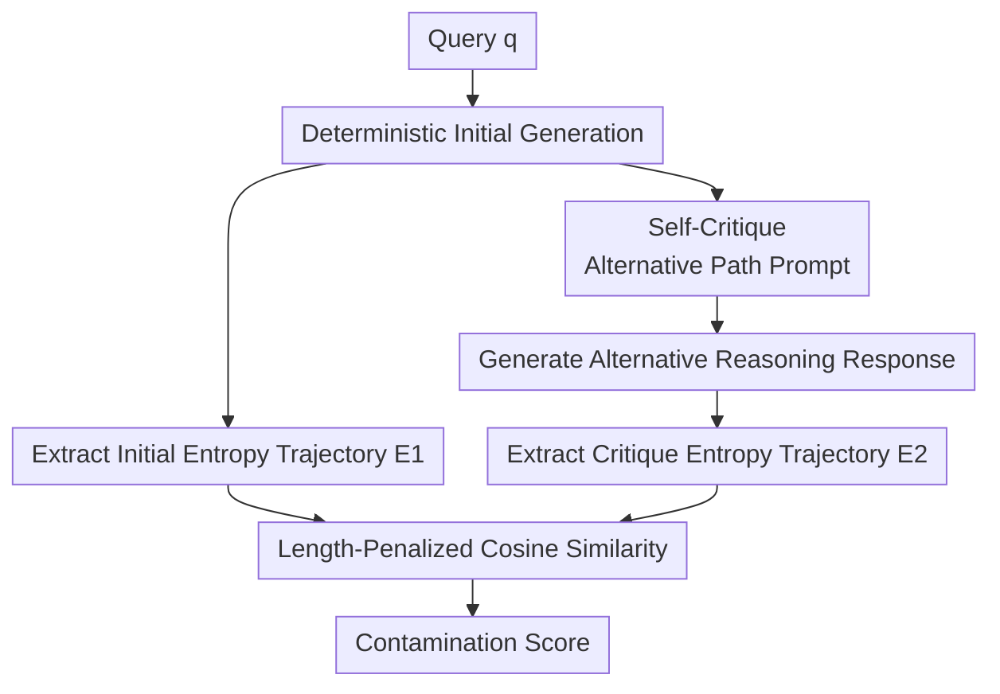

# Detecting Data Contamination from Reinforcement Learning Post-training for Large Language Models

**Conference**: ICLR2026  
**OpenReview**: [https://openreview.net/forum?id=EjiJmiA6ea](https://openreview.net/forum?id=EjiJmiA6ea)  
**Code**: https://github.com/yongding-tao/RL-Data-Contamination  
**Area**: LLM Evaluation / Data Contamination Detection / RL Post-training  
**Keywords**: Data contamination detection, Membership Inference Attack (MIA), RL post-training, entropy collapse, LLM evaluation trustworthiness  

## TL;DR
This paper presents the first systematic study on benchmark data contamination during the RL post-training stage of LLMs. It proposes Self-Critique, which utilizes the similarity of token-level entropy trajectories between two generations to capture policy path dependency on contaminated samples. Furthermore, it constructs the RL-MIA benchmark, demonstrating that traditional likelihood-based detectors perform near random guessing at this stage, while the proposed method significantly and consistently improves AUC.

## Background & Motivation
**Background**: LLM capability evaluation increasingly relies on fixed benchmarks. However, once these benchmarks enter the training data, model scores become mixed with memorization components, making it difficult to represent true generalization ability. Existing data contamination detection is typically viewed as a membership inference attack: given a model and a sample, determine whether it appeared in the training set. Previous methods mainly focused on pre-training and SFT, as both stages center on maximum likelihood, where training samples usually leave detectable traces in token probabilities, perplexity, or low-probability token distributions.

**Limitations of Prior Work**: RL post-training, especially RLVR (Reinforcement Learning with Verifiable Rewards), is becoming a key link in enhancing mathematical, logical, and complex reasoning capabilities. However, there are almost no specialized methods for its contamination detection. Directly applying detectors like PPL, Min-K% Prob, Recall, or CDD encounters a target mismatch: these methods assume that "seen text will resemble training text more," whereas RL optimizes rewards rather than token-by-token imitation of standard answers. A training sample might not have lower perplexity but may cause the model to follow a high-reward reasoning path more rigidly.

**Key Challenge**: Contamination signals in the RL stage are no longer primarily hidden in the likelihood of the sample text but rather in the collapse of policy behavior. After RL, models tend to narrow their search space to increase pass@1, but such policy collapse can also occur on uncontaminated samples. Therefore, observing low-entropy tokens in a single generation is unreliable: both clean and contaminated samples may exhibit sparse entropy distributions. The key difference lies in whether the model can truly deviate from the original path when asked to use an alternative approach.

**Goal**: The authors aim to solve three specific problems: first, to formalize the data contamination detection task for the RL post-training stage; second, to identify RL-specific detection signals distinct from likelihood; and third, to construct a benchmark that isolates RL-stage contamination to avoid conflating pre-training leakage, SFT memorization, and RL contamination.

**Key Insight**: The paper approaches the problem through policy collapse. RL pushes policies on high-reward samples toward narrower reasoning modes. If a benchmark sample is repeatedly rewarded during RL training, the model not only provides the correct answer but also finds it "hard to switch paths." The authors translate this path dependency into an active probe: first, the model generates its most certain answer; then, this answer is fed back into the prompt, requiring the model to re-answer using a different reasoning path. Finally, the entropy sequences of the two generation trajectories are compared for high similarity.

**Core Idea**: Use self-critique to actively force the model to deviate from its initial reasoning path, then use the similarity of token-level entropy trajectories between the two generations to detect policy collapse and sample memorization caused by RL post-training.

## Method
### Overall Architecture
The input to Self-Critique is a query $q$ and an LLM $M$ that has undergone RL post-training; the output is a contamination score, where a higher score indicates a higher likelihood that the query appeared in the RL training set. The process does not estimate the perplexity of the query text itself but compares the model's "initial most certain solution" with the "critique-driven alternative solution" in entropy space. If the two generations exhibit token-level uncertainties that evolve with similar shapes despite the prompt requesting different paths, it suggests the model may have been compressed into the same high-reward path by RL.

The accompanying RL-MIA benchmark uses controlled injection to simulate RL-stage contamination: a subset of benchmark samples is mixed into the RL training corpus. After training, detectors are required to distinguish between injected and held-out clean samples. The focus here is on isolating RL-stage contamination signals rather than reusing public benchmark scores that might have already been seen during pre-training.

### Key Designs
**1. Self-Critique Probe: Turning "Inability to Switch Paths" into a Contamination Signal**

Most traditional detectors passively observe text probabilities. This paper actively creates counterfactual pressure: the model first provides its most confident initial answer $r_1$ using greedy decoding. Subsequently, this answer is attached to the prompt with an explicit instruction to provide a different reasoning path or an alternative solution. The subtlety of this setup is that it is not simply another sampling step; it provides the second generation with a clear reference. If the model maintains flexible reasoning for the query, the second generation should deviate from the initial answer in terms of steps, decision points, and uncertainty distribution. If it has collapsed around a high-reward trajectory during RL, the second generation is easily "sucked back" into the initial path.

Ablations in the appendix verify that this reference point is critical. Skipping the initial answer and only prompting the model to "answer using an unconventional method" leads to detection performance near random, as there is no common anchor, and "difference" becomes noisy instruction-following behavior. Self-Critique fixes a specific baseline and measures the ability to deviate from it, thus mapping more directly to the path dependency brought by RL contamination.

**2. Entropy Trajectory Similarity: Following Strategy Uncertainty Shapes instead of Likelihood**

RLVR reward objectives do not directly increase the token likelihood of the training sample answers; thus, likelihood-based signals like PPL or Min-K% fail. This paper shifts to token-level entropy: at the $t$-th decoding position, entropy is defined as $H_t=-\sum_{v\in V}p_\theta(v\mid x_{<t})\log p_\theta(v\mid x_{<t})$, describing the model's uncertainty about the next token given the current context. A response can be converted into an entropy sequence $E=\{H_t\}_{t=1}^T$. This sequence is more informative than a single average entropy because critical branching points, deterministic clichés, and answer convergence are reflected in its shape.

The detection score utilizes cosine similarity with a length penalty. Specifically, the two entropy sequences $E_1, E_2$ are padded to the same length, then the cosine similarity is calculated and multiplied by the length ratio $\min(|E_1|,|E_2|)/\max(|E_1|,|E_2|)$. This design avoids two issues: first, reasoning trajectories of different lengths cannot be compared element-wise directly; second, if the second answer is significantly shorter or longer, the length itself indicates a change in reasoning mode, which ordinary cosine similarity should not ignore. The final score is $Score(q)=cos(pad(E_1),pad(E_2))\times \min(|E_1|,|E_2|)/\max(|E_1|,|E_2|)$. Higher scores indicate higher similarity and higher probability of contamination.

**3. RL-MIA Benchmark: Isolating RL-Stage Contamination via Controlled Injection**

Evaluating contamination detection directly on public benchmarks often conflates results with pre-training leakage: the model might have seen AIME, GSM8K, or other problems during pre-training. In such cases, the detector identifies historical exposure rather than RL contamination. RL-MIA controls the contamination process explicitly: a subset of benchmark samples is injected into the RL training data, while the rest serve as clean samples. The model is then trained, and detectors are used to determine membership. AIME24 and AIME25 cover real math problems (AIME24 may have pre-training exposure, while AIME25 is more recent); K&K and SAT are synthetic logic tasks that provide cleaner RL-only signals.

The value of this benchmark lies not just in testing Self-Critique, but in providing a testbed with a clear problem definition for future methods. The paper also uses GSM8K for two-stage contamination analysis: PPL serves as a proxy for pre-training contamination to filter out low-leakage samples, and then the enhancement of Self-Critique in identifying RL contamination is observed. Results show that when pre-training signals are low, Self-Critique's AUC increases from 0.59 to 0.88, while a random subset of the same size shows no such improvement, supporting the interpretation that it captures RL-stage path dependency rather than sample volume or difficulty.

**4. Practical Entropy Computation: Top-K Probabilities are Sufficient**

Calculating full token entropy typically requires probabilities for the entire vocabulary, which is unrealistic for many APIs or edge deployments. This paper performs an ablation on Top-K entropy approximation: using only the top $K$ token probabilities to approximate entropy for $K=3,5,10,20,50$. Results show that performance hardly changes with $K$, with AUC on AIME25 staying between 0.70 and 0.72, and K&K between 0.65 and 0.66. This is because next-token distributions often have long tails; most probability mass is concentrated on a few tokens, and the tail contributes minimally to the entropy shape.

This design makes Self-Critique more practical: it requires two generations, which is more expensive than passive methods like PPL but much lighter than CDD, which requires dozens of random samples. Furthermore, entropy can be estimated with just top-k logprobs, meaning the overhead primarily comes from the second generation.

### Loss & Training
Self-Critique is a detection pipeline rather than a newly trained model, so it involves no additional training loss. Implementation uses deterministic generation; the algorithm requires both generations to use greedy decoding or temperature = 0 to minimize sampling randomness interference with entropy curves. Entropy calculation requires per-step token probabilities or top-k probabilities. The RL models in the benchmark are primarily trained using VeRL. Shared settings for Qwen2.5-7B-Instruct and DeepSeek-Math-7B-Instruct include actor learning rate $1.0\times10^{-6}$, train/val batch size $128/512$, prompt length 1024, 8 samples per prompt, and an entropy coefficient of 0.001. Qwen series max generation length is 4096, while DeepSeek-Math uses 3072 due to context constraints.

## Key Experimental Results

### Main Results
| Model | Method | AIME24 AUC | AIME25 AUC | K&K AUC | SAT AUC | Avg AUC |
|------|------|------------|------------|---------|---------|----------|
| Qwen2.5-7B-Instruct | PPL | 0.51 | 0.56 | 0.47 | 0.50 | 0.51 |
| Qwen2.5-7B-Instruct | Recall | 0.61 | 0.65 | 0.47 | 0.62 | 0.59 |
| Qwen2.5-7B-Instruct | Entropy-Noise | 0.57 | 0.63 | 0.52 | 0.77 | 0.62 |
| Qwen2.5-7B-Instruct | Self-Critique | 0.72 | 0.72 | 0.66 | 0.67 | 0.70 |
| DeepSeek-Math-7B-Instruct | PPL | 0.53 | 0.41 | 0.54 | 0.64 | 0.53 |
| DeepSeek-Math-7B-Instruct | Recall | 0.46 | 0.56 | 0.54 | 0.62 | 0.54 |
| DeepSeek-Math-7B-Instruct | Entropy-Noise | 0.56 | 0.69 | 0.52 | 0.45 | 0.55 |
| DeepSeek-Math-7B-Instruct | Self-Critique | 0.67 | 0.61 | 0.63 | 0.67 | 0.64 |

Main results demonstrate two things. First, likelihood-based detectors indeed fail on RL post-training contamination; PPL, Min-K%, and Min-K%++ often fluctuate around 0.5, even performing worse than random guessing in some tasks. Second, active probing is more important than passive attributes, and Self-Critique is more closely aligned with RL mechanisms than random sampling or prefix perturbation: on Qwen2.5-7B-Instruct, the average AUC reaches 0.70, roughly 19% higher than the strongest non-proposed baseline. A similar ~19% improvement is observed on DeepSeek-Math-7B-Instruct.

### Ablation Study
| Ablation / Analysis | Setting | Key Metric | Description |
|-------------|------|----------|------|
| RL Algorithm Gen. | Qwen2.5-3B-Inst on K&K | PPO/GRPO/DAPO AUC: 0.61/0.61/0.60 | Self-Critique is best across three RL algorithms, showing the signal is not an algorithm-specific artifact. |
| Top-K Approximation | Qwen2.5-7B-Instruct | AIME25 AUC 0.70-0.71 ($K=3$ to $50$); K&K 0.64-0.66 | Using very small top-k probabilities can approximate entropy trajectories, lowering deployment barriers. |
| No Initial Anchor | "Direct prompt for unconventional solution" | AUC near random | Without the initial answer as a reference, the second path is incomparable and the probe loses membership meaning. |
| Sampling Strategy | Greedy+Greedy vs Temp Sampling | Greedy+Greedy is optimal | Deterministic generation better exposes the sharp policy distributions caused by RL post-training. |
| Prompt Stability | 5 Paraphrased Prompts | AIME25 AUC SD 0.0251; K&K SD 0.0254 | The method does not depend on the accidental wording of a specific prompt. |
| Two-stage Contam. | GSM8K Low PT Leakage Subset | Self-Critique AUC 0.59 -> 0.88 | When pre-training signals weaken, RL-stage path dependency becomes clearer. |

### Key Findings
- The primary advantage of Self-Critique stems from "active deviation with an anchor." Recall also uses active probing and thus outperforms pure likelihood baselines, but it still relies on log-likelihood. Self-Critique combines self-critique prompts with entropy trajectories, aligning more closely with the policy collapse of RL.
- Entropy is a more suitable metric than edit distance or probability magnitude for this problem. CDD relies on the output consistency of multiple random samples, which is costly and noisy. Entropy-Temp and Entropy-Noise have shown that entropy is sensitive, and Self-Critique further suggests that the probing method must align with RL mechanisms.
- Results are consistent across models and tasks. The paper covers Qwen2.5-7B-Instruct, DeepSeek-Math-7B-Instruct, Qwen2.5-7B-Math, Llama-3.1-8B-Instruct, and settings including PPO, GRPO, DAPO, DPO, TDPO, and RTO.
- The method provides a detection ranking rather than an absolute truth. AUC peaks in the 0.6 to 0.7+ range, indicating that RL-stage contamination detection remains difficult; it is more suitable for benchmark auditing and risk screening than for single-sample conviction.

## Highlights & Insights
- Framing RL contamination detection as "strategy locked into a high-reward path" rather than "text matching training data" is a critical shift. This explains why traditional MIA fails in the RLVR era and points toward reward-aware detectors.
- The Self-Critique probe design is elegant: by generating only one extra time, it explicitly tests the model's ability to deviate from its initial path. Compared to heavy sampling, it acts like a stress test with semantic constraints, saving budget and offering clearer interpretability.
- The RL-MIA benchmark is a major contribution. Without controlled injection, it is hard to determine if a method detects RL contamination, pre-training leakage, or task difficulty. RL-MIA controls the source to make conclusions credible.
- The Top-K entropy approximation ablation is highly practical. Many commercial APIs only return top logprobs; this study shows $K=3$ or $K=5$ is generally sufficient, providing a realistic interface for deployment.
- The two-stage contamination analysis offers an inspiring evaluation strategy: estimate and filter out strong pre-training leakage samples first, then observe RL contamination detection. This layered diagnosis can be migrated to other benchmark auditing scenarios.

## Limitations & Future Work
- Experiments primarily focus on math and logic reasoning tasks. Code generation, open-ended QA, and multi-turn dialogues have more equivalent solutions where policy collapse might not manifest as simple entropy trajectory similarity.
- Model scales are mainly between 0.5B and 8B. RL post-training workflows, sampling control, and logprob exposure for ultra-large closed-source models are more complex. Self-Critique's portability needs verification in API scenarios.
- The method requires access to token probabilities or top-k logprobs. If an interface only returns text, entropy trajectories cannot be calculated directly, possibly requiring approximation via multiple sampled responses or external surrogate models, which introduces new errors.
- Self-Critique relies on the model's ability to follow the "change reasoning path" instruction. For models with weak instruction following, the second generation might just be a repetition or a chaotic change, muddling the detection score with instruction-following ability.
- The current score is better suited for ranking and group auditing; single-sample thresholds remain tricky. While AUC and F1 at the Youden threshold are reported, the transferability of thresholds across models, tasks, and RL algorithms is not fully resolved.

## Related Work & Insights
- **vs PPL / Min-K% / Min-K%++**: These rely on probability anomalies from maximum likelihood training, suitable for pre-training or SFT; this paper handles reward-driven RL where training targets no longer directly lower perplexity, hence the switch to entropy similarity.
- **vs Recall**: Recall uses non-member prefixes to compare relative log-likelihood, which is an active probing idea; Self-Critique inherits this but replaces the perturbation with semantically anchored alternative reasoning requests and the metric with entropy patterns.
- **vs CDD**: CDD uses edit distances of multiple random samples to measure consistency, which is expensive and noise-dependent; Self-Critique uses two deterministic generations anchored by the initial answer, better suited for high-reward path dependency.
- **Insights for LLM Evaluation**: Future benchmark releases should not only track pre-training leaks but also record data encountered during post-training. As RLVR uses public question banks extensively, benchmark auditing must separate "accuracy" from "memorization contamination via RL."
- **Insights for RL Post-training**: Policy collapse is often treated as a training stability or exploration issue; this paper shows it can also be a detectable trace of data contamination. Conversely, contamination detection could become a tool for analyzing the boundaries between generalization and memorization in RL.

## Rating
- Novelty: ⭐⭐⭐⭐⭐ First to systematize RL post-training contamination as an independent problem, proposing signals linked to RL policy collapse.
- Experimental Thoroughness: ⭐⭐⭐⭐ Covers multiple models, tasks, RL algorithms, and ablations, though larger models and more open tasks are needed.
- Writing Quality: ⭐⭐⭐⭐ Clear problem definition and logic; however, some tables are dense, requiring reference to the appendix for full context.
- Value: ⭐⭐⭐⭐⭐ Highly relevant for trustworthy LLM benchmark evaluation, especially given the rapid iteration of RLVR and reasoning models.

<!-- RELATED:START -->

## Related Papers

- [\[ICLR 2026\] Detecting Data Contamination in LLMs via In-Context Learning](detecting_data_contamination_in_llms_via_in-context_learning.md)
- [\[ICLR 2026\] Mapping Post-Training Forgetting in Language Models at Scale](mapping_post-training_forgetting_in_language_models_at_scale.md)
- [\[ICLR 2026\] Rewarding Doubt: A Reinforcement Learning Approach to Calibrated Confidence Expression of Large Language Models](rewarding_doubt_a_reinforcement_learning_approach_to_calibrated_confidence_expre.md)
- [\[ACL 2026\] SPENCE: A Syntactic Probe for Detecting Contamination in NL2SQL Benchmarks](../../ACL2026/llm_evaluation/spence_a_syntactic_probe_for_detecting_contamination_in_nl2sql_benchmarks.md)
- [\[ICLR 2026\] AutoCodeBench: Large Language Models are Automatic Code Benchmark Generators](autocodebench_large_language_models_are_automatic_code_benchmark_generators.md)

<!-- RELATED:END -->
