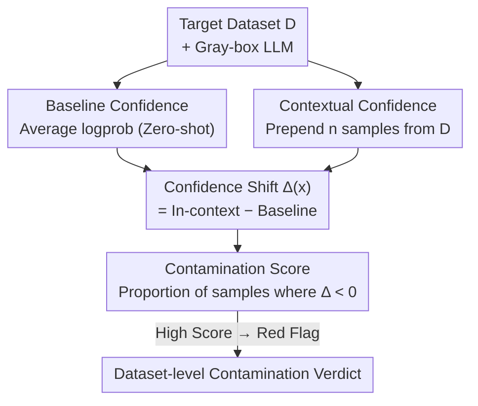

# Detecting Data Contamination in LLMs via In-Context Learning

**Conference**: ICLR2026  
**OpenReview**: [https://openreview.net/forum?id=YlpaaYxx4t](https://openreview.net/forum?id=YlpaaYxx4t)  
**Code**: https://github.com/NVIDIA-NeMo/Evaluator (CoDeC demo notebook)  
**Area**: LLM Evaluation / Data Contamination Detection  
**Keywords**: Data Contamination, In-Context Learning, Membership Inference, Benchmark Leakage, Model Auditing

## TL;DR
The paper proposes CoDeC (Contamination Detection via Context), which determines if an LLM was trained on a specific dataset by observing whether model confidence rises or falls when samples from the same dataset are provided as context. Confidence typically drops for "seen" datasets and rises for "unseen" ones. By requiring only gray-box access to token probabilities and two forward passes, it achieves near-perfect separation (99.9% AUC) at the dataset level.

## Background & Motivation
**Background**: Determining whether a benchmark has "leaked" into an LLM's training set is a fundamental issue for evaluation credibility. Existing approaches primarily follow Membership Inference Attack (MIA) logic: thresholding based on loss/perplexity (Carlini et al.), focusing on the most informative tokens (Min-K%, Shi et al.), using external reference models for score calibration, or performing string overlap checks between training and test sets.

**Limitations of Prior Work**: These methods either require access to training data (overlap checks), necessitate extensive parameter/threshold tuning with uninterpretable raw score scales, or fail on large models where scores for "seen" and "unseen" data overlap significantly. More critically, they often fail to detect contamination resulting from "training on augmented or related distributions" (e.g., synthetic in-distribution data).

**Key Challenge**: Contamination detection requires a criterion that is **automated, applicable across arbitrary models and datasets, free of training corpora priors, and interpretable**. Currently, MIA-based scores are neither comparable nor readable and rely heavily on training data access.

**Goal**: To provide a dataset-level contamination score in a directly interpretable percentage format, using only token probabilities (gray-box) without knowledge of the training corpora, covering both "direct memorization" and "contamination via related distributions."

**Key Insight**: The authors observe a counter-intuitive phenomenon: when providing in-context samples from the same dataset, the model's confidence increases for **unseen datasets** due to additional information (similar to few-shot learning), but decreases for **seen (memorized) datasets**, as the extra context disrupts the already memorized token sequence patterns.

**Core Idea**: Use "whether confidence decreases with added context" as the contamination signal. The contamination level is quantified by the proportion of samples in a dataset whose confidence drops when provided with in-distribution context.

## Method

### Overall Architecture
CoDeC addresses the following: given a language model $M$ and a target dataset $D=\{x_i\}_{i=1}^N$, quantify whether $D$ (or similar data) was included in the training set of $M$. The mechanism involves comparing the average log probability of a sample under a "zero-shot" setting vs. a setting where several samples from the same dataset are prepended. The contamination score is the proportion of samples where confidence drops. This process is lightweight, requiring two forward passes per sample and only reading logits.

### Key Designs

**1. Contextual Confidence Shift as a Signal: Seen Drops, Unseen Rises**

The discriminative power of CoDeC stems from a core observation: the LLM's response to in-context samples depends on prior exposure. For **unseen** datasets, in-distribution samples act as few-shot examples that improve generalization, raising confidence. For **seen (memorized)** datasets, these samples provide no new information and instead disrupt the memorized token patterns (the "interrupted memorization" phenomenon observed by Razeghi et al.), causing confidence to fall. The **sign** of the shift serves as a natural, interpretable criterion without requiring reference models or threshold calibration.

**2. The CoDeC Pipeline: From Single Sample Δ to Dataset Contamination Rate**

The process consists of four steps: ① Baseline Prediction: Calculate the average log-likelihood $\text{logprob}_{\text{baseline}}(x)$ for each $x$ in $D$. ② Contextual Prediction: Sample $n$ examples $x_1,\dots,x_n$ from $D\setminus\{x\}$ to form the prefix $x_1|\dots|x_n|x$ and calculate $\text{logprob}_{\text{in-context}}(x)$. ③ Shift Calculation: 

$$\Delta(x)=\text{logprob}_{\text{in-context}}(x)-\text{logprob}_{\text{baseline}}(x)$$

④ Aggregation: The dataset contamination score is the proportion of samples with a confidence decrease:

$$S_{\text{CoDeC}}(D)=\frac{1}{N}\sum_{i=1}^{N}\mathbb{1}[\Delta(x_i)<0]$$

The resulting score is naturally between 0–100%. Experiments show a single in-context sample ($n=1$) provides a strong signal, while increasing $n$ further separates seen and unseen data at a higher computational cost.

**3. Model-Agnostic + Gray-box + Robustness to Augmentation**

CoDeC is effective because: ① **Dataset-Specific Priors**: Models internalize the style and structure of trained datasets; additional context provides no marginal gain. ② **Contextual Disruption of Memory**: In-context samples interfere with memorized sequences. ③ **ICL as Fine-tuning Dynamics**: Contaminated models behave like saturated fine-tuned models with minimal "learning" gain from ICL. ④ **Loss Landscape**: Overfitted (contaminated) models reside in narrow local minima easily perturbed by new context. Consequently, CoDeC detects contamination via **augmentation or related distributions**, as simple data manipulation cannot mask distribution-level memorization.

## Key Experimental Results

### Main Results
The method was validated on models with **open weights and open training data** (serving as ground truth): Pythia / GPT-Neo / RWKV-4 (Pile), OLMo (Dolma), and Nemotron-v2 / Nemotron-H (Nemotron-CC), covering Transformer, RNN, and hybrid architectures. The testbed included "Seen" subsets and "Unseen" data released after the training cutoff.

| Model | CoDeC (Ours) | Vanilla loss | Min-K% | Zlib |
|------|-------------|--------------|--------|------|
| Pythia 410M | 100.0% | 75.0% | 76.2% | 92.3% |
| Pythia 12B | 100.0% | 76.9% | 82.3% | 92.3% |
| GPT-Neo 20B | 100.0% | 76.9% | 83.5% | 92.7% |
| RWKV-4 14B | 99.6% | 77.3% | 81.5% | 92.7% |
| OLMo 7B | 100.0% | 65.6% | 72.7% | 78.1% |
| Nemotron-H 56B | 100.0% | 82.2% | 86.7% | 92.0% |
| **All (Mean)** | **99.9%** | 75.7% | 78.5% | 89.6% |

CoDeC achieves nearly 100% AUC, whereas baseline scores for seen/unseen data overlap heavily.

### Ablation Study

| Configuration | Key Finding |
|------|---------|
| Context Size $n$ | $n=1$ yields a strong signal; larger $n$ improves separation but increases cost. |
| Dataset Size | 100 samples provide a stable estimate; 1000 samples reduce variance to <1%. |
| Training Process | Scores spike and stabilize very early (approx. 2% into training). |
| Fine-tuning Contamination | CoDeC scores exceed 90% for all datasets after fine-tuning. |
| Contamination Transfer | Fine-tuning on MMLU raises scores for related QA tasks but not for unrelated text. |

### Key Findings
- **Early Detectability**: Contamination scores lock in very early in training, making CoDeC suitable for real-time monitoring of benchmark leakage.
- **Robustness to Augmentation**: Synthetic rewriting or noise cannot lower CoDeC scores, as it captures distribution-level memory.
- **Relative Thresholding**: Highly diverse unseen datasets may score up to 60%; absolute values should be interpreted alongside cross-model comparisons.
- **Capacity and Generalization**: Larger models generally show lower CoDeC scores on unseen data, suggesting they favor generalization over rote memorization.

## Highlights & Insights
- **Memorization vs. Generalization as an Observable Shift**: The method relies purely on the sign of logprob changes after adding context, achieving near-perfect separation without reference models.
- **Inherent Interpretability**: The 0–100% output allows evaluators to treat high scores as immediate "red flags" without arbitrary scaling.
- **Coverage of Related Distributions**: Unlike traditional MIA checking for strict membership, CoDeC detects contamination introduced via synthetic or similarly distributed data.
- **ICL as a Probe**: Viewing ICL as a "fine-tuning probe" suggests that sensitivity to context reflects whether a model is in a narrow overfitted local minimum.

## Limitations & Future Work
- Adversarial datasets (drastic de-duplication or mixed sources) might interfere with scores. 
- Some unseen or mixed data may score near 50%, which complicates interpretation without a comparative baseline.
- Currently a **dataset-level** criterion; fine-grained **sample-level** inference remains a future direction.
- Absolute scores can be misled by dataset diversity; a comparative multi-model approach is recommended.

## Related Work & Insights
- **vs. MIA (Vanilla Loss / Min-K% / Zlib)**: These methods require threshold calibration and suffer from seen/unseen overlap. CoDeC uses the sign of the shift and requires no training data access.
- **vs. Overlap Checks**: Overlap checks require training corpora and only find verbatim copies. CoDeC is gray-box and detects distribution-level memorization.
- **vs. Perturbation Methods (DetectGPT)**: Both use behavior changes under perturbation, but CoDeC perturbs the context rather than the sample itself, linking it to learning dynamics.

## Rating
- Novelty: ⭐⭐⭐⭐⭐ 
- Experimental Thoroughness: ⭐⭐⭐⭐⭐ 
- Writing Quality: ⭐⭐⭐⭐ 
- Value: ⭐⭐⭐⭐⭐ 

<!-- RELATED:START -->

## Related Papers

- [\[ICLR 2026\] In-Context Learning for Pure Exploration](in-context_learning_for_pure_exploration.md)
- [\[ICLR 2026\] In-Context Learning of Temporal Point Processes with Foundation Inference Models](in-context_learning_of_temporal_point_processes_with_foundation_inference_models.md)
- [\[ACL 2026\] SPENCE: A Syntactic Probe for Detecting Contamination in NL2SQL Benchmarks](../../ACL2026/llm_evaluation/spence_a_syntactic_probe_for_detecting_contamination_in_nl2sql_benchmarks.md)
- [\[ICLR 2026\] Preference Leakage: A Contamination Problem in LLM-as-a-judge](preference_leakage_a_contamination_problem_in_llm-as-a-judge.md)
- [\[ICML 2025\] Sample Efficient Demonstration Selection for In-Context Learning](../../ICML2025/llm_evaluation/sample_efficient_demonstration_selection_for_in-context_learning.md)

<!-- RELATED:END -->
