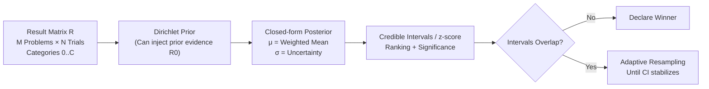

# Don't Pass@k: A Bayesian Framework for Large Language Model Evaluation

**Conference**: ICLR 2026  
**OpenReview**: [https://openreview.net/forum?id=PTXi3Ef4sT](https://openreview.net/forum?id=PTXi3Ef4sT)  
**Code**: [https://github.com/mohsenhariri/scorio](https://github.com/mohsenhariri/scorio)  
**Area**: LLM Evaluation / Benchmarking Methodology  
**Keywords**: Pass@k, Bayesian evaluation, Dirichlet prior, credible intervals, rank stability, computationally efficient evaluation  

## TL;DR
This paper reformulates "LLM evaluation" as a statistical inference problem. It replaces Pass@k and avg@N with a Bayesian posterior estimate under a Dirichlet prior (Bayes@N). By utilizing closed-form posterior means and credible intervals, it provides stable rankings with fewer samples and introduces transparent decision rules where winners are declared only when intervals do not overlap.

## Background & Motivation

**Background**: Pass@k is the most common metric for reporting LLM reasoning abilities (especially in mathematical reasoning and code generation), estimating the probability of at least one success in $k$ attempts. avg@N (average accuracy over $N$ trials, equivalent to Pass@1) is another standard practice.

**Limitations of Prior Work**: On small but expensive benchmarks (such as math competition sets like AIME with only dozens of problems), these metrics exhibit three structural flaws:

- **Unstable Rankings**: When the number of trials $N$ is limited and $k$ is close to $N$, Pass@k suffers from high variance. Minor fluctuations in correctness can flip model rankings, making results highly sensitive to decoding strategies and random seeds.
- **Difficulty in Quantifying Uncertainty**: Pass@k lacks a closed-form expression for variance, necessitating computationally intensive approximations like bootstrapping to estimate intervals.
- **Lack of Decision Rules & Support for Grading**: While avg@N is more stable, it is computationally expensive. Moreover, it lacks a principled way to determine if a performance gap is a true signal or noise and does not naturally handle rubric-based grading (e.g., partial correctness, formatting errors, refusals).

**Key Challenge**: Evaluation is currently the weakest link in the LLM pipeline—results dictate which models are adopted, what progress is announced, and where resources are allocated. Yet, the community continues to rely on convenient but fragile success-rate metrics, leading to unreliable or misleading conclusions in compute-constrained scenarios.

**Goal**: To provide a unified, computationally efficient evaluation protocol that makes uncertainty explicit, offering stable rankings with fewer samples while handling both binary and graded evaluations.

**Core Idea**: **Model the result of each problem as "categorical" rather than purely binary and apply a Dirichlet prior to obtain closed-form solutions for the posterior mean and credible intervals for any weighted rubric.** The paper proves that under a uniform prior, the Bayesian posterior mean is "rank-equivalent" to the average accuracy (avg@N), explaining why avg@N is empirically robust while providing principled uncertainty measures for free.

## Method

### Overall Architecture
For an LLM evaluated on $M$ problems, each problem is run $N$ times due to sampling randomness, forming an $M \times N$ result matrix $R$, where elements $R_{\alpha i} \in \{0, \dots, C\}$ represent the score of the $i$-th trial for the $\alpha$-th problem ($C+1$ categories, $C=1$ for binary). The framework treats the true category probability vector $\boldsymbol\pi_\alpha$ for each problem as an unknown and performs Bayesian inference using a Dirichlet prior. It outputs the posterior mean $\mu$ and uncertainty $\sigma$ of a target performance metric $\bar\pi$, which drive a protocol for "ranking + significance determination + adaptive sampling."

### Key Designs

**1. Categorical Results + Weighted Rubrics: Generalizing "Pass/Fail" to Customizable Metrics.** Instead of only recording 0/1, every trial can fall into $C+1$ categories such as "correct, partially correct, format error, refusal, or rubric-level." Given a weight vector $w=(w_0,\dots,w_C)$, the target metric is defined as the weighted average of the category probabilities across all problems: $\bar\pi=\frac{1}{M}\sum_{\alpha=1}^{M}\sum_{k=0}^{C} w_k\,\pi_{\alpha k}$. Setting $w_k=k$ reduces this to the average category label (or average accuracy in the binary case). General $w$ allows the framework to express step-by-step reasoning scores, partial credits, or judge-based grading without ad-hoc aggregation.

**2. Closed-form Bayesian Estimator + Uncertainty: $\mu$ and $\sigma$ without Bootstrapping.** Under a Dirichlet prior, the posterior mean $\mu(R)$ of the performance metric $\bar\pi$ is the Bayes optimal estimator minimizing the quadratic loss $L(\bar\pi_{\text{est}})=\mathbb E_{R,\pi}(\bar\pi_{\text{est}}(R)-\bar\pi)^2$. Both the mean $\mu$ and the variance $\sigma^2(R)$ (quantifying uncertainty) have closed-form expressions as shown in Algorithm 1 (with category counts $\nu_{\alpha k}$, $\mu=w_0+\frac{1}{MT}\sum_\alpha\sum_j \nu_{\alpha j}(w_j-w_0)$, where $T=1+C+D+N$). This allows for point estimates and intervals to be computed instantly with negligible overhead. Optional prior data $R_0$ (an $M \times D$ matrix) can inject historical evidence, such as stable rubric distributions from similar tasks, to accelerate convergence.

**3. Credible Interval Driven Significance: Declaring Winners Only When Intervals Do Not Overlap.** When the number of problems $M$ is large, the posterior approximates a Gaussian $P(\bar\pi|R)\sim\mathcal N(\mu,\sigma^2)$. The performance difference $\Delta\bar\pi$ between two models also follows a normal distribution with mean $\tilde\mu=\mu-\mu'$ and standard deviation $\tilde\sigma=\sqrt{\sigma^2+\sigma'^2}$. The confidence in the ranking can then be calculated via the absolute z-score $z=|\mu-\mu'|/\sqrt{\sigma^2+\sigma'^2}$, where $\rho=\frac12(1+\mathrm{erf}(z/\sqrt2))$ ($z=1.645$ corresponds to $\rho=0.95$). The practical protocol is: report the posterior mean + credible interval; **do not declare a winner if intervals overlap**, and adaptively increase sampling until the interval narrows to a predefined threshold. This naturally supports online or sequential evaluation. Notably, these intervals do not rely on the Central Limit Theorem and are more robust than CLT approximations in small-sample LLM scenarios (avoiding issues like escaping the $[0,1]$ range).

**4. Rank Equivalence to Average Accuracy: Explaining Why avg@N is Robust.** The paper proves (Appendix B) that under a uniform prior, $\mu$ and the naive weighted average accuracy differ only by a positive affine transformation. Therefore, **the ranking of Bayes@N is identical to avg@N**, and this rank equivalence holds for any finite $N$ (not just as $N\to\infty$). This provides a theoretical explanation for the empirical robustness of avg@N while equipping it with a principled measure of uncertainty for free. The paper further uses Bayes@$N_{\max}$ ($N_{\max}=80$ in experiments) as the "gold standard" reference ranking and uses Kendall's $\tau_b$ to measure the consistency between small-$N$ rankings and the gold standard.

## Key Experimental Results

### Main Results: Convergence Speed on Real Math Benchmarks
Evaluating 11 LLMs on four math reasoning sets (AIME'24, AIME'25, HMMT'25, BrUMO'25) with up to $N=80$ trials. Using Bayes@80 / avg@80 as the gold standard, the average Kendall's $\tau$ of various methods vs. the gold standard was compared ($10^4$ bootstrap iterations).

| Method | Convergence Behavior (vs. Gold Standard) |
| :--- | :--- |
| **Bayes@N / avg@N** | Curves overlap perfectly across four datasets; reach $\tau>0.90$ at $N=10$, and $\tau\approx1$ at $N\approx80$ (AIME'25 converges to ≈0.95). |
| Pass@2 / 4 / 8 | Higher bias and variance at small $N$; frequently **fails to converge** on AIME'24/'25. |
| Pass^k / G-Pass@k / mG-Pass@k | Slower convergence on HMMT/BrUMO. |

Convergence trend (convergence@n, the average trials needed to reach the same ranking as $N_{\max}=80$): On HMMT/BrUMO, Pass-series require ≈69.5 / ≈48.5 trials, whereas Bayes@N requires only ≈44.2 / ≈27.1 trials—**Bayes@N secures a stable ranking with significantly fewer samples.**

### Ablation Study: "Biased Coin" Experiments with Known Ground Truth
Simulating LLMs using 11 sets of biased coins with known success rates $\bar\pi$ (including a deliberate tie at 0.3642), with $M=30$ problems and up to 80 trials:

| Method | Kendall's $\tau$ Convergence with True Ranking |
| :--- | :--- |
| **Bayes@N** | High starting $\tau$, reaches $\tau=1$ fastest. |
| Pass@k and variants | Large variance/bias at small $N$, slow convergence. |

Results from row-wise and column-wise bootstrapping were nearly identical, indicating that convergence is insensitive to the ordering of answers in $R$.

### Key Findings
- **CI Reveals Indistinguishable Ties**: Without CI, Bayes@80 rankings are mostly consistent with the gold standard (only LLM9/LLM10 swapped). With 95% CI included, multiple models become indistinguishable—for example, two models with $\bar\pi=0.608$ vs $0.6213$ cannot be distinguished at 95% confidence even at $N=80$. Distinguishing them reliably would require roughly tripling $N$. This quantifies the fact that "rankings of similar models are inherently difficult to determine reliably."
- Non-uniform priors (using information from base, older, or quantized versions of models) show potential to further accelerate convergence (preliminary synthetic demonstrations provided in the appendix).

## Highlights & Insights
- **Reframing Evaluation as Statistical Inference**: Rather than inventing an ad-hoc metric, the paper provides a unified language of "posterior mean + credible interval," with binary and graded evaluations being special cases.
- **Elegant Rank Equivalence Theorem**: Proving that Bayes@N and avg@N rankings are identical "reassures" practitioners (avg@N was not wrong) while providing the missing uncertainty measure without relying on CLT, ensuring well-behaved intervals even in small samples.
- **Actionable Decision Rules**: The "no winner if intervals overlap" rule combined with adaptive sampling directly addresses the phenomenon of over-interpreting tiny gaps and frequent leaderboard shuffling.
- **Computational Efficiency**: The closed-form $\mu, \sigma$ allow for real-time monitoring of interval widths and on-demand allocation of extra trials, making it highly friendly to real-world evaluation under compute constraints.

## Limitations & Future Work
- **Prerequisite of Gaussian Approximation**: Significance titration relies on the posterior approximating a Gaussian as $M$ grows; the reliability of this approximation on benchmarks with very few problems needs caution.
- **Prior Design Still Maturing**: Accelerating convergence via non-uniform priors was only shown in preliminary synthetic tests. Systemic research is needed on how to safely reuse historical evidence without introducing bias.
- **Limited Scope of Validation**: Experiments focused on mathematical reasoning (AIME/HMMT/BrUMO). Performance under more complex rubrics like code generation, open-ended generation, or judge-based scoring remains to be verified.
- **Problem Independence Assumption**: Both bootstrapping and closed-form derivations assume independence between problems/trials, which may require adjustment for benchmarks with inherent correlations.

## Related Work & Insights
- **Efforts to Replace/Improve Pass@k**: Variants like G-Pass@k, mG-Pass@k, and Pass^k attempt to mitigate Pass@k's instability. This paper integrates them into a unified Bayesian perspective and outperforms them in convergence speed.
- **Small-sample Bayesian Intervals**: This echoes observations that uniform priors (Beta(1,1) in the binary case) provide better-calibrated credible intervals than CLT approximations for samples smaller than a few hundred.
- **Inspiration**: For any scenario involving ranking models on small, expensive benchmarks (beyond just LLMs), this work suggests reporting intervals instead of point estimates and using "non-overlapping intervals" as the threshold for declaring differences. The combination of categorical rubrics + Dirichlet distribution provides a clean aggregation paradigm for "judge-based" evaluations.

## Rating
- **Novelty**: ⭐⭐⭐⭐ — Reframes LLM evaluation as Bayesian inference; provides Dirichlet closed-form solutions and the avg@N rank equivalence theorem. Clear vision with theoretical support, though the underlying statistical tools are established.
- **Experimental Thoroughness**: ⭐⭐⭐ — Solid argumentation using ground-truth simulations and four real math benchmarks against various Pass@k variants. However, it is confined to mathematical reasoning, and the rubric grading capability has not been fully tested on real graded data.
- **Writing Quality**: ⭐⭐⭐⭐ — The logic from pain points to methodology to proof to verification is smooth. The four pain points are clearly numbered, and both formulas and algorithms are complete.
- **Value**: ⭐⭐⭐⭐ — Directly addresses real pain points in community evaluation methodology. Provides a plug-and-play, auditable, and computationally efficient protocol (with open-source scorio) with strong potential for practical adoption.

<!-- RELATED:START -->

## Related Papers

- [\[ICLR 2026\] Cost-of-Pass: An Economic Framework for Evaluating Language Models](cost-of-pass_an_economic_framework_for_evaluating_language_models.md)
- [\[NeurIPS 2025\] Bayesian Evaluation of Large Language Model Behavior](../../NeurIPS2025/llm_evaluation/bayesian_evaluation_of_large_language_model_behavior.md)
- [\[ICLR 2026\] SparseEval: Efficient Evaluation of Large Language Models by Sparse Optimization](sparseeval_efficient_evaluation_of_large_language_models_by_sparse_optimization.md)
- [\[ICLR 2026\] Multi-turn Evaluation of Anthropomorphic Behaviours in Large Language Models](multi-turn_evaluation_of_anthropomorphic_behaviours_in_large_language_models.md)
- [\[ICLR 2026\] Pitfalls in Evaluating Language Model Forecasters](pitfalls_in_evaluating_language_model_forecasters.md)

<!-- RELATED:END -->
