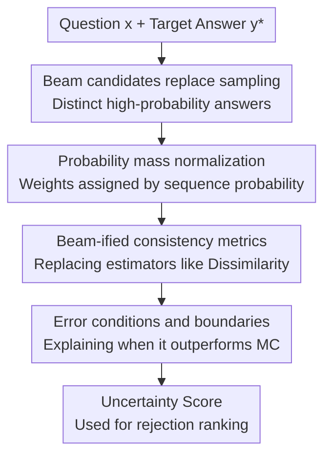

# Don't Throw Away Your Beams: Improving Consistency-based Uncertainties in LLMs via Beam Search

**Conference**: ICLR2026  
**OpenReview**: [https://openreview.net/forum?id=igcQRiVlgu](https://openreview.net/forum?id=igcQRiVlgu)  
**Code**: https://github.com/IINemo/lm-polygraph/tree/beam-uncertainty  
**Area**: LLM Evaluation / Uncertainty Estimation  
**Keywords**: LLM Uncertainty Estimation, Consistency Assessment, Beam Search, Short-answer QA, Prediction-Rejection  

## TL;DR
This paper points out that multinomial sampling in short-answer QA frequently repeats high-probability answers, leading to high variance in consistency-based uncertainty estimation. By replacing sampling candidates with probability-weighted beam search candidates, the authors demonstrate stable improvements in PRR, ROC-AUC, and PR-AUC across six QA datasets and six models.

## Background & Motivation
**Background**: LLM uncertainty estimation (UQ) aims to answer a practical question: given a model's answer $y^*$, can we judge its reliability? Existing methods are roughly categorized into information-based methods (token likelihood), reflective methods (self-reported confidence), and consistency-based methods (generating multiple candidates to check for agreement). Consistency-based methods are attractive because they compare the semantic support across generated answers rather than just looking at individual token probabilities.

**Limitations of Prior Work**: Consistency-based methods typically use multinomial sampling to generate $M$ candidates and then calculate the similarity or semantic clustering relationship between these candidates and the target answer $y^*$. However, the output distribution of short-answer QA is often peaked: answers may just be a name, a number, or a few words. In such cases, sampling easily draws the same high-probability answer repeatedly. The paper shows that on TriviaQA, when the output is only 2 to 4 tokens, the proportion of duplicate samples can reach approximately 30% to 50%. These redundant samples waste generation budget and cause uncertainty scores to fluctuate significantly between runs.

**Key Challenge**: The candidate set for consistency-based UQ should ideally satisfy three conditions: semantic diversity, representation of the model distribution, and stability across runs. However, ordinary sampling in peaked distributions is trapped by the highest probability paths, lacking diversity. Increasing temperature to force diversity often introduces low-quality, low-probability outliers. Consequently, the candidate generation process itself becomes the bottleneck for uncertainty estimation.

**Goal**: The authors do not intend to "use beam search to generate better answers," but rather "use beam search to generate a candidate set more suitable for consistency estimation." Specifically, the paper aims to reduce duplicates, lower estimation variance, and respect the model's probability distribution under the same budget $M$, integrating this improvement into existing consistency-based and hybrid UQ metrics.

**Key Insight**: Beam search naturally maintains several high-probability candidate paths during decoding. For short-answer QA, these top-$M$ paths usually cover a significant portion of the probability mass and are inherently more stable than independent sampling. The key observation is: since beam search has already listed the most likely answers identified by the model, these beams should not be discarded after decoding only to perform additional redundant sampling for uncertainty estimation.

**Core Idea**: Replace multinomial samples with probability-weighted beam search candidates to re-estimate the consistency between candidate answers and the target answer, thereby making LLM confidence ranking more stable and accurate for short answers.

## Method

### Overall Architecture
The overall workflow is straightforward: given a question $x$ and the target answer $y^*$ generated by the model, instead of using random sampling for auxiliary candidates, a beam search with width $M$ is run to obtain a set of distinct high-probability candidates $B_M(x)=\{b^{(1)},\dots,b^{(M)}\}$. Subsequently, the sequence probability of each beam is used for normalized weighting. These weighted candidates are then fed into consistency-based UQ metrics such as Dissimilarity, Eccentricity, CoCoA, and EigVecDissimilarity to output an uncertainty score (where higher values indicate higher uncertainty).

The focus of this framework is not the invention of a new confidence function, but the replacement of the "candidate set approximator" within existing functions. The original approximator used $M$ independent samples, which were prone to repetition and instability; the proposed approximator uses weighted top-$M$ beams, which are better suited for peaked distributions in short-answer scenarios.

### Key Designs
**1. Beam Search Candidates as a Replacement for Sampling: Fixing Redundancy via Distinct High-Probability Answers**

Basic consistency metrics estimate the expected semantic dissimilarity between a target answer $y^*$ and all possible model outputs: $U_D(y^*|x)=\mathbb{E}_{y\sim p(\cdot|x)}[1-s(y,y^*)]$. Traditional methods use Monte Carlo (MC) estimation, averaging $M$ sampled candidates $y^{(i)}$: $\hat U^{MC}_D=\frac{1}{M}\sum_i(1-s(y^{(i)},y^*))$. The issue is that high-probability answers are frequently sampled repeatedly, making the actual number of effective candidates much smaller than $M$.

This paper changes the source to beam search: using beam width $M$ yields $B_M(x)=\{b^{(1)},\ldots,b^{(M)}\}$. This step changes the candidate set from "whatever is randomly sampled" to "explicitly enumerated top paths of the model distribution." For short-answer questions like "Who sang Thriller?", sampling might repeatedly yield variations of "Michael Jackson" or "Prince," whereas beam search more easily lists distinct candidates like "Michael Jackson," "Prince," and "Bruno Mars," allowing the consistency score to truly reflect competing explanations in the answer space.

**2. Probability Mass Normalization: Not Treating Low-Probability Beams as Equal Evidence**

Treating beam candidates as $M$ equally weighted samples would introduce bias: lower-ranking beams might be low-probability or even nonsensical, and an equal weight average would exaggerate their impact on uncertainty. Thus, the paper uses the autoregressive sequence probability of each beam for restricted top-$M$ normalization: $w_i=\frac{p(b^{(i)}|x)}{\sum_{j=1}^{M}p(b^{(j)}|x)}$. The final beam-based Dissimilarity is $\hat U^b_D(y^*|x)=\sum_i w_i(1-s(b^{(i)},y^*))$.

This weighting serves two purposes. First, it preserves the "distinct candidate" advantage of beam search without wasting budget on repetitions. Second, it pulls the candidate importance back to the model's probability distribution, preventing a 10th-ranked beam from being treated the same as the 1st-ranked one. Probability mass analysis in the appendix supports this: beam probabilities drop rapidly, with the first few often contributing most of the mass, making mass-aware weighting closer to the model's true preference than a simple average.

**3. Beam-ified Consistency Metrics: Replacing the Candidate Generator as a Reusable Layer**

The paper extends this weighted beam approach to multiple existing metrics beyond Dissimilarity. Eccentricity originally constructs a similarity matrix $W$ between the target and sampled candidates, using low-spectral features of the graph Laplacian to form semantic embeddings, then comparing the embedding of $y^*$ with the mean of the candidates. This paper replaces the mean with a weighted mean: $\hat U^b_{Ecc}=\|v^*_b-\sum_i w_i v^b_i\|_2^2$, giving high-probability beams more influence over the semantic center.

White-box hybrid methods like CoCoA multiply model-based probability uncertainty $u(y^*|x)$ by a consistency signal. This paper retains $u(y^*|x)$ and simply replaces the consistency term from $\hat U^{MC}_D$ to $\hat U^b_D$, yielding $\hat U^b_{CoCoA}=u(y^*|x)\cdot \hat U^b_D(y^*|x)$. EigVecDissimilarity follows a similar logic: using Laplacian embeddings to capture joint semantic structure and calculating a probability-weighted average distance from $y^*$ to each beam embedding. Consequently, beam search is treated as a candidate estimation layer reusable across various consistency-based UQ methods.

**4. Error Conditions and Boundaries: Using Beam Probability Mass to Explain Superiority over Monte Carlo**

The authors provide an intuitive theoretical condition explaining why beam-weighted estimation excels in peaked distributions. Let the total probability mass covered by the beam set be $m_B=\sum_i p(b^{(i)}|x)$, the average dissimilarity inside and outside the beam set be $\mu_B$ and $\bar\mu_B$, and the MC variance be $\sigma^2/M$. The beam estimation error stems from the top-$M$ truncation, specifically $(1-m_B)^2(\mu_B-\bar\mu_B)^2$. When $(1-m_B)|\mu_B-\bar\mu_B|<\sigma/\sqrt{M}$, the Mean Squared Error (MSE) of the beam-weighted estimate is smaller than that of MC.

Furthermore, a distribution-independent sufficient condition is $m_B>1-\frac{1}{2\sqrt{M}}$. For $M=10$, the threshold is approximately $0.842$; if the top-10 beams cover over 84.2% of the mass, the beam estimate is theoretically guaranteed to be better. This is not a necessary condition; if the gap $|\mu_B-\bar\mu_B|$ is small, beam estimation may still be superior even with lower coverage. In experiments, beam search outperforms sampling on many samples where the sufficient condition is not met, suggesting the practical break-even point is often more relaxed than the conservative boundary.

### Mechanism
Assume the question is "Which Beethoven symphony is known as The Pastoral?". The greedy answer is "6". If multinomial sampling generates 10 candidates, it might yield "sixth", "6", "seventh", "sixteenth", where correct and incorrect semantics are mixed and synonyms repeat. Dissimilarity can only give a score based on the average similarity of these random candidates; changing the random seed changes the candidate composition.

With beam search, the model provides candidates ordered by sequence probability: e.g., "sixth", "6", "6th", "ninth", "seventh". If the top candidates are semantically consistent with "6" and incorrect ones like "ninth" only appear at low ranks, the weighted uncertainty will not be exaggerated by tail-end mistakes. Conversely, if high-probability beams themselves split into contradictory answers, the weighted consistency score will rise significantly, correctly indicating low confidence.

This example illustrates the core logic: it's not about having more candidates, but about the candidate set covering the competing answers the model actually considers, with each candidate's influence matching its weight in the model's distribution.

### Loss & Training
The paper does not train new models or introduce any loss functions for optimization. All methods are inference-time UQ estimators: given an existing LLM, a question, a target answer, and a candidate generation strategy, a scalar uncertainty score is calculated.

Main hyperparameters and implementation choices: $M$ is set to 10 by default; beam candidates are normalized by sequence probability $p(b^{(i)}|x)$ to obtain $w_i$; the similarity function $s(\cdot,\cdot)$ uses the entailment probability of DeBERTa-large tuned on MNLI; Laplacian feature selection for Eccentricity and EigVecDissimilarity uses a threshold $\alpha=0.9$. Evaluation primarily uses greedy decoding for $y^*$, with additional tests using the top-1 beam.

## Key Experimental Results

### Main Results
The main experiments cover six QA datasets: TriviaQA, Web Questions (closed-book), CoQA, HotpotQA (open-book), and CommonsenseQA, ARC-Challenge (multiple choice). Models include base and instruct versions of Gemma 3 4B, Llama 3.1 8B, and Qwen 3 8B. The primary metric is the Prediction-Rejection Ratio (PRR), measuring whether uncertainty scores can prioritize rejecting low-quality answers (quality measured by AlignScore alignment with gold answers).

| Method | Llama 3.1 8B base | Llama 3.1 8B instruct | Gemma 3 4B base | Gemma 3 4B instruct | Qwen 3 8B base | Qwen 3 8B instruct |
|------|-------------------|------------------------|-----------------|----------------------|----------------|---------------------|
| Dissimilarity | .505 | .379 | .630 | .206 | .477 | .327 |
| Dissimilarity + beamsearch | .543 | .417 | .650 | .252 | .478 | .355 |
| Eccentricity | .453 | .368 | .563 | .231 | .396 | .251 |
| Eccentricity + beamsearch | .505 | .397 | .603 | .285 | .410 | .345 |
| EigVecDissimilarity | .463 | .370 | .561 | .236 | .425 | .256 |
| EigVecDissimilarity + beamsearch | .510 | .414 | .598 | .301 | .450 | .376 |
| CocoaMSP | .505 | .404 | .587 | .314 | .461 | .334 |
| CocoaMSP + beamsearch | .521 | .426 | .615 | .345 | .473 | .347 |
| CocoaPPL | .523 | .397 | .628 | .312 | .461 | .327 |
| CocoaPPL + beamsearch | .536 | .412 | .649 | .339 | .461 | .337 |

The most important takeaway is that the beam-version is higher in almost every row. Dissimilarity + beamsearch achieves the best PRR on three base models; CocoaMSP + beamsearch performs best on Llama and Gemma instruct models. Simply changing the candidate generation method yields consistent improvements across various metrics.

The paper also reports ROC-AUC and PR-AUC. For Gemma 3 4B base, Dissimilarity's average ROC-AUC improves from .836 to .848, and CocoaPPL from .835 to .846. Average PR-AUC for CocoaPPL increases from .789 to .801. This confirms that the PRR conclusions are not an isolated phenomenon.

### Ablation Study
| Setting | Key Findings | Description |
|----------|----------|------|
| $M$ from 1 to 15 | Beam search is usually higher than sampling for $M \ge 2$; on TriviaQA, $M \approx 3$ to 5 is near saturation | Beam covers useful candidates faster with a small budget; $M=1$ is greedy, providing little info |
| Output Length Buckets | Beam advantage is most significant for 2–4 tokens; gap narrows above 7 tokens | Consistent with the repetition curve; sampling is most redundant for short answers |
| Sampling Strategy Comparison | Standard beam is a robust default; hybrid multinomial-beam can win but requires tuning $B$ | Hybrid strategies were not made the primary method due to inconsistent gains and tuning costs |
| Restricted-mass floor $\epsilon$ | $\epsilon=0$, $10^{-5}$, $10^{-3}$, etc., all give strong results; no single optimal value | Small floor stabilizes low-probability beam weights; optimal value depends on task |
| Beam-ified Semantic Entropy / Degree Matrix | Semantic Entropy PR-AUC improved from .401 to .472, but remains weaker than Dissimilarity | Input-level uncertainty does not fully align with the goal of ranking current answer correctness |
| Top-1 beam as $y^*$ | Beam-weighted metrics still outperform the original methods in most cases | Useful for systems that already use beam decoding for deployment |

### Key Findings
- Beam search benefits are concentrated in short-answer QA because the output space is small and peaked, making multinomial sampling's repetition problem most severe.
- Probability weighting is essential: beam candidates are distinct but vary greatly in probability; equal weighting overestimates the impact of tail-end candidates.
- The improvements are valid across multiple consistency metrics, suggesting the bottleneck lies in candidate set approximation rather than specific similarity functions.
- Beam search does not magically improve all sampling-based targets; for instance, gains for Degree Matrix are limited, and Semantic Entropy remains weaker than $y^*$-conditional methods.
- Theoretical conditions provide an explainable boundary: beam estimation is likely to be superior when the top-$M$ beams cover sufficient probability mass or when the dissimilarity gap inside/outside the beam set is small.

## Highlights & Insights
- The most clever aspect of this paper is shifting focus from designing complex new UQ scores to investigating "what candidates are used to approximate existing scores." Many consistency-based UQ failures result from candidate sets contaminated by repeated sampling rather than flawed similarity functions.
- The title "Don't throw away your beams" is accurate: if a system already uses beam search or can obtain beams at a low cost, discarding them to perform sampling is inefficient. Turning candidates generated during decoding into confidence estimators is a natural engineering improvement with clear experimental success.
- While the theoretical analysis is conservative, it provides a clear diagnostic variable: beam set probability mass $m_B$. This suggests future systems could dynamically choose candidate strategies—using beams when coverage is high and mixing in sampling when the distribution is flatter.
- The paper explicitly positions "uncertainty" as predictive uncertainty for the current answer $y^*$, rather than the overall openness of the input question. This distinction explains why answer-conditional methods like Dissimilarity/CoCoA outperform input-level metrics like Semantic Entropy.
- Extension to other tasks is straightforward: any scenario requiring "candidate consistency" for confidence—such as RAG, fact-checking, medical QA, or code completion—could benefit from replacing random candidates with probability-weighted top-$M$ beams.

## Limitations & Future Work
- The paper primarily evaluates a white-box setting, as it requires sequence probabilities $p(b^{(i)}|x)$. In black-box API scenarios, weights must be approximated via empirical frequency, logprob APIs, or external calibration models, which might yield different results.
- Experiments focus on short-form QA. In long-form generation, where the answer space is more open, beam search might lead to mode collapse or length bias; its superiority over sampling in those contexts requires separate validation.
- The method depends on the semantic similarity function $s$ and quality metrics like AlignScore. Main experiments use NLI models to estimate semantic consistency, but such models might be less reliable for math reasoning, code, or specialized domains like medicine.
- Beam search has its own decoding biases, favoring high-probability, conservative candidates. It might miss low-probability but semantically significant alternatives. Hybrid beam-sampling strategies show potential but require more robust adaptive policies.
- Computational overhead differences across deployment pipelines are not fully discussed. If a system uses greedy decoding, running beam search incurs extra costs; the "nearly free" claim mainly applies when beams are already used or when candidate generation is already required for UQ.

## Related Work & Insights
- **vs. Semantic Entropy**: Semantic Entropy clusters multiple generations into semantic sets to measure overall uncertainty; this work focuses on the reliability of a specific answer $y^*$. Results show that answer-conditional metrics are more suitable for prediction-rejection tasks.
- **vs. Lin et al.’s Eccentricity / EigValLaplacian**: These methods use similarity graphs and Laplacians to capture joint semantic structure but default to sampled candidates. This work retains the graph-theoretic ideas but replaces candidate generation and weighting, improving stability in short-answer scenarios.
- **vs. CoCoA**: CoCoA combines model probability and sample consistency. This paper does not replace CoCoA but rather improves the consistency term within it, making it complementary.
- **vs. Uncertainty-aware Decoding**: Unlike work that uses UQ to improve generation (e.g., MBR decoding, uncertainty-guided search), this work uses decoding candidates to improve UQ, targeting better ranking and rejection of existing answers.
- **Insight**: Future work could design an adaptive candidate mixer that first estimates the mass and semantic split of top beams to decide whether to use pure beams, beam+sampling, or high-temperature sampling. This could extend the advantages seen in peaked short-answer distributions to more open-ended tasks.

## Rating
- **Novelty**: ⭐⭐⭐⭐☆ Simple idea that hits a key bottleneck; high value in interpreting beam search as a UQ estimator.
- **Experimental Thoroughness**: ⭐⭐⭐⭐⭐ Extensive testing across six datasets, six models, and numerous metrics/ablations.
- **Writing Quality**: ⭐⭐⭐⭐☆ Clear narrative where theoretical conditions and experimental results support each other.
- **Value**: ⭐⭐⭐⭐⭐ Highly practical for confidence estimation in short-answer QA, especially for rejection systems that can reuse decoding candidates.

<!-- RELATED:START -->

## Related Papers

- [\[ICLR 2026\] RedacBench: Can AI Erase Your Secrets?](redacbench_can_ai_erase_your_secrets.md)
- [\[ICLR 2026\] Complementing Self-Consistency with Cross-Model Disagreement for Uncertainty Quantification](complementing_self-consistency_with_cross-model_disagreement_for_uncertainty_qua.md)
- [\[ICLR 2026\] Don't Pass@k: A Bayesian Framework for Large Language Model Evaluation](dont_passk_a_bayesian_framework_for_large_language_model_evaluation.md)
- [\[ACL 2026\] HumanLLM: Benchmarking and Improving LLM Anthropomorphism via Human Cognitive Patterns](../../ACL2026/llm_evaluation/humanllm_benchmarking_and_improving_llm_anthropomorphism_via_human_cognitive_pat.md)
- [\[ICLR 2026\] FinSearchComp: Towards a Realistic, Expert-Level Evaluation of Financial Search and Reasoning](finsearchcomp_towards_a_realistic_expert-level_evaluation_of_financial_search_an.md)

<!-- RELATED:END -->
