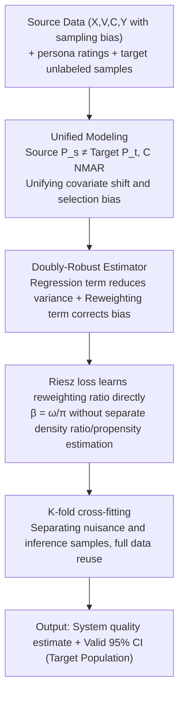

# Doubly-Robust LLM-as-a-Judge: Externally Valid Estimation with Imperfect Personas

**Conference**: ICLR2026  
**arXiv**: [2509.22957](https://arxiv.org/abs/2509.22957)  
**Code**: [lguerdan/doubly-robust-llm-judge](https://github.com/lguerdan/doubly-robust-llm-judge)  
**Area**: LLM Evaluation  
**Keywords**: LLM-as-a-Judge, Doubly-Robust Estimation, External Validity, Persona Prompting, Evaluation Sampling Bias  

## TL;DR
Proposes a doubly-robust estimation framework that combines imperfect LLM persona ratings with biased human ratings to produce statistically valid quality estimates of GenAI systems even when covariate shift and selection bias coexist.

## Background & Motivation
With the widespread deployment of generative AI systems, the **external validity** of evaluations has become a core issue—can laboratory evaluation results generalize to real-world deployment scenarios?

Existing evaluation pipelines face two types of **evaluation sampling bias**:

1.  **Covariate shift**: The distribution of the annotator population used during evaluation (e.g., MTurk crowdsourced workers, often younger and highly educated) differs from the target deployment population (e.g., medical chatbot users, often older females).
2.  **Selection bias**: Annotators tend to abandon ratings for sensitive content (i.e., whether a rating is completed depends on annotator/content features), violating the MCAR (Missing Completely at Random) assumption.

Existing statistical frameworks such as PPI++ and RePPI assume i.i.d. sampling of source and target data and that missingness is completely random. When these assumptions are violated, it leads to severe coverage failure. This paper aims to propose an estimation method that provides valid confidence intervals under sampling bias.

## Core Problem
How to leverage inexpensive but imperfect LLM persona ratings and biased but ground-truth human ratings to obtain statistically valid estimates of system quality parameters on a target distribution under the simultaneous conditions of covariate shift and selection bias?

## Method

### Overall Architecture
The method addresses a scenario where only two unreliable data sources are available: cheap but systematically biased LLM persona ratings, and ground-truth human ratings collected under sampling bias. The paper formalizes this as an M-estimation problem and constructs a doubly-robust estimator by combining both data sources. First, covariate shift and selection bias are unified into a single estimation objective. Then, the estimator is composed of a regression term (calculating predicted means on a large set of unlabeled target samples to reduce variance) and a reweighting term (correcting residuals on source samples while simultaneously adjusting for persona bias and sampling bias). The difficult-to-learn reweighting ratio is learned directly in one step using the Riesz loss. Finally, the entire system is placed into a K-fold cross-fitting framework to train nuisance functions and perform inference. A key property is double robustness—as long as **one** of the two nuisance functions (regression or reweighting) is estimated well enough, the confidence interval remains valid, thereby maintaining coverage in the presence of both types of sampling bias.

### Key Designs

**1. Unified Modeling of Evaluation Sampling Bias: Unifying covariate shift and selection bias into a single estimation objective**

For the method to hold, the first step is to clarify why evaluations become distorted. The paper models each rating record as a random tuple $Z = (X, V, C, Y, \hat{Y})$, where $X$ represents annotator features (age, gender, region), $V$ represents embeddings of the evaluated content, $C$ is the rating completion indicator ($Y$ is observed only if $C=1$), $Y$ is the human rating, and $\hat{Y}$ is the LLM persona rating. The inconsistency between the source distribution $P_s$ (actually recruited annotators) and the target distribution $P_t$ (real deployment population) creates covariate shift, while $C$ depending on annotator and content features (sensitive content is more likely to be abandoned) creates selection bias. Both types of bias are thus unified into the single goal of "estimating the target distribution quality parameter $\theta_t$ (e.g., $\mathbb{E}_t[Y]$)". Placing them in the same framework is the prerequisite for constructing the debiased estimator and allows the method to generalize to more general statistics like variance and quantiles.

**2. Doubly-Robust Estimator: Letting the regression and reweighting terms back each other up**

Given a unified objective, how to estimate it stably? Using regression alone converges too slowly when the correlation between persona ratings and human ratings is low, while using inverse propensity weighting alone (density ratio $\omega_0$ multiplied by the inverse of completion probability $1/\pi_0$) suffers from variance explosion in high-dimensional text spaces. The paper combines both into an estimator where they back each other up:

$$\hat{\theta} = \frac{1}{N_t}\sum_{i=1}^{N_t}\hat{\mu}(W_i^t, \hat{Y}_i^t) + \frac{1}{N_s}\sum_{j=1}^{N_s}\hat{\alpha}(W_j^s, C_j^s)\{Y_j^s - \hat{\mu}(W_j^s, \hat{Y}_j^s)\}$$

The left term (regression term) calculates predicted means using a regression model $\hat{\mu}$ on target samples, leveraging large unlabeled data to reduce variance. The right term (reweighting term) uses a reweighting function $\hat{\alpha}$ to perform weighted correction on the residuals $Y - \hat{\mu}$ of source samples, correcting both persona rating bias and sampling bias. This "predicted mean + weighted residual" structure provides double robustness: as long as 

$$\|\hat{\alpha} - \alpha_0\|_{L^2} \cdot \|\hat{\mu} - \mu_0\|_{L^2} = o_\mathbb{P}(N_t^{-1/2})$$

is satisfied, meaning the **product** of the two nuisance function estimation errors decays at a parametric rate, the estimate is valid. This implies that $\hat{\mu}$ and $\hat{\alpha}$ only need to reach a non-parametric rate of $N_t^{-1/4}$, and if one is estimated accurately enough, it can compensate for the poor estimation of the other, ensuring the confidence interval still holds. This is why it is more bias-resistant than PPI++/RePPI, which rely on one-sided assumptions (i.i.d. or MCAR).

**3. Riesz loss for direct ratio learning: Bypassing the difficulty of separate density ratio and propensity estimation in high-dimensional spaces**

Despite double robustness, $\hat{\alpha}$ in the reweighting term is difficult to learn: it depends on the ratio $\beta_0(w) = \omega_0(w)/\pi_0(w)$. Conventional methods learn the density ratio $\hat{\omega}$ and completion probability $\hat{\pi}$ separately and then divide them; the errors from both estimations are further amplified by division in high-dimensional text spaces, leading to out-of-control variance. The paper uses the Riesz loss to learn this ratio directly in one step:

$$\beta_0 = \arg\min_\beta \{\mathbb{E}_s[C \cdot \beta(W^s)^2] - 2\mathbb{E}_t[\beta(W^t)]\}$$

The optimal solution to this objective is exactly the required $\beta_0$, requiring no explicit estimation of any probability densities. To make it computable on text, content features are first embedded using a sentence transformer (MiniLM-L6-v2) and then reduced to 15 dimensions using UMAP, allowing the reweighting function to be estimated stably even in high-dimensional text spaces. This is the direct reason why DR (Riesz) maintains significantly lower variance than DR (Classical) on PRISM/DICES.

**4. K-fold cross-fitting: Avoiding overfitting bias when using the same data for nuisance training and inference**

A final hidden danger is that debiased estimation requires independence between the nuisance models and the samples being debiased; otherwise, the model may overfit on samples it has seen, introducing additional bias into the estimate. The paper resolves this with $K$-fold cross-fitting: the debiased estimate for each fold uses only the $\hat{\mu}$ and $\hat{\alpha}$ trained on the other $K-1$ folds to calculate contributions for the current fold, and finally averages across all folds. This ensures sample separation between the estimate and nuisance models, maintaining theoretical guarantees while allowing all data to participate in inference, maximizing the efficiency of scarce human ratings.

## Key Experimental Results

### Persona Simulation Framework (PSF)
Proposed three experimental settings with increasing realism:

| Dataset | Type | Rating Task | Scale |
|--------|------|----------|------|
| Fully Synthetic | Fully Synthetic | — | Nuisance functions known |
| Semi-Synthetic PRISM | Real dialogues + LLM ratings | helpfulness (1-100) | 1000 dialogues × 50 ratings |
| Semi-Synthetic DICES | Real dialogues + Human ratings | harmfulness (1-4) | 300 dialogues × 25 ratings |

### Main Results (Average of 40 trials)
Performance of DR (Riesz) across three datasets:

- **Coverage**: Synthetic 1.00, PRISM 0.93, DICES 0.86, far exceeding the second-best method RePPI (0.56/0.66/0.40).
- **Bias (MAE)**: Synthetic 0.03, PRISM 0.46, DICES 0.02, all being the lowest.
- DR (Riesz) achieves valid coverage on PRISM and DICES when persona quality $\rho \geq 0.65$.
- Using real LLMs (GPT-5, Claude Sonnet 3.5, etc.) for persona ratings also effectively improves estimation quality.

### Key Findings
1. DR (Riesz) has the lowest bias and highest coverage among all baselines.
2. Riesz loss significantly outperforms traditional separate $\hat{\omega}, \hat{\pi}$ estimation methods, especially in high-dimensional text spaces.
3. Even when the correlation between persona ratings and human ratings is moderate ($\rho \approx 0.4$), it still improves estimation.

## Highlights & Insights
- **Solid Theoretical Contribution**: Generalizes doubly-robust estimation to an M-estimation framework that simultaneously handles covariate shift and selection bias, supporting not only mean estimation but also various statistics like variance and quantiles.
- **Clever Application of Riesz Loss**: Avoids the difficulty of separately estimating density ratios and propensity scores in high-dimensional spaces by directly learning the required reweighting function.
- **Scientific Experimental Design**: The PSF framework systematically controls persona quality, covariate shift, and selection bias, and is open-sourced for the community.
- **Clear Practical Significance**: Addresses the real-world pain point of insufficient annotator population representativeness in current AI safety evaluations.

## Limitations & Future Work
- Relies on the **no-concept-drift** assumption ($P_s(Y|W) = P_t(Y|W)$), i.e., annotators with the same features provide the same rating distribution for the same content, which may not hold in reality.
- Content embeddings use MiniLM-L6-v2 + UMAP reduction to 15 dimensions; the impact of information loss on estimation quality requires more analysis.
- The scale of human ratings in experiments is limited (DICES only has 300 dialogues × 25 ratings); performance in larger-scale scenarios remains to be verified.
- The generation strategy for persona ratings still relies on hand-crafted prompts; the sensitivity of persona quality to different prompt designs has not been fully explored.

## Related Work & Insights

| Method | Handles Covariate Shift | Handles Selection Bias | Uses Persona Ratings | Coverage Guarantee |
|------|:-:|:-:|:-:|:-:|
| PPI++ | ✗ | ✗ | ✓ | i.i.d. only |
| RePPI | ✗ | ✗ | ✓ | MCAR only |
| IPW | ✓ | ✓ | ✗ | High Variance |
| **DR (Riesz) (Ours)** | **✓** | **✓** | **✓** | **doubly-robust** |

Compared to PPI++/RePPI, this work relaxes the MCAR assumption; compared to traditional IPW, it significantly reduces variance in high-dimensional spaces via the Riesz loss; compared to pure persona evaluation, it provides theoretically guaranteed bias correction.

## Rating
- Novelty: ⭐⭐⭐⭐ — Combines doubly-robust estimation with LLM persona ratings and formalizes evaluation sampling bias.
- Experimental Thoroughness: ⭐⭐⭐⭐ — The PSF framework is well-designed with complementary synthetic and semi-synthetic experiments, though the scale of real human ratings is small.
- Writing Quality: ⭐⭐⭐⭐⭐ — Theoretical derivation is clear, problem motivation is well-articulated, and experimental visualizations are intuitive.
- Value: ⭐⭐⭐⭐ — Provides a theoretically rigorous bias correction tool for GenAI evaluation with clear practical application prospects.

<!-- RELATED:START -->

## Related Papers

- [\[ICLR 2026\] Noisy but Valid: Robust Statistical Evaluation of LLMs with Imperfect Judges](noisy_but_valid_robust_statistical_evaluation_of_llms_with_imperfect_judges.md)
- [\[ICLR 2026\] Preference Leakage: A Contamination Problem in LLM-as-a-judge](preference_leakage_a_contamination_problem_in_llm-as-a-judge.md)
- [\[ICML 2026\] Reasoning Is Not Free: Robust Adaptive Cost-Efficient Routing for LLM-as-a-Judge](../../ICML2026/llm_evaluation/reasoning_is_not_free_robust_adaptive_cost-efficient_routing_for_llm-as-a-judge.md)
- [\[ACL 2025\] YESciEval: Robust LLM-as-a-Judge for Scientific Question Answering](../../ACL2025/llm_evaluation/yescieval_llm_judge_science.md)
- [\[ICLR 2026\] BiasScope: Towards Automated Detection of Bias in LLM-as-a-Judge Evaluation](biasscope_towards_automated_detection_of_bias_in_llm-as-a-judge_evaluation.md)

<!-- RELATED:END -->
