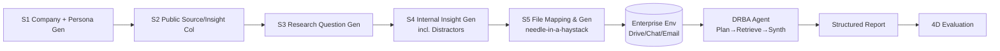

# DRBench: A Realistic Benchmark for Enterprise Deep Research

**Conference**: ICLR 2026  
**OpenReview**: [https://openreview.net/forum?id=IGYQ4c92e2](https://openreview.net/forum?id=IGYQ4c92e2)  
**Code**: [https://github.com/ServiceNow/drbench](https://github.com/ServiceNow/drbench)  
**Area**: LLM Evaluation / Agent Evaluation / Deep Research  
**Keywords**: Deep Research, Enterprise Agent, Benchmark, Insight Recall, Multi-source Retrieval, LLM-as-a-judge  

## TL;DR
DRBench constructs the first deep research benchmark oriented toward enterprise scenarios. It requires Agents to simultaneously mine and synthesize key insights from public web pages and private enterprise data (emails, chats, PPTs, tables, PDFs). Evaluated across four dimensions—Insight Recall, Factuality, Distractor Avoidance, and Report Quality—it reveals significant deficiencies in current Agents regarding enterprise insight recall (even the strongest GPT-5 achieves only ~37%).

## Background & Motivation
- **Background**: Deep research (transforming high-level strategic questions into sub-questions, retrieving evaluative materials, and producing evidence-based summaries) is becoming a popular application for LLM Agents. Modular Agent architectures like Local Deep Researcher, DeepResearcher, and OpenHands have already emerged.
- **Limitations of Prior Work**: Existing deep research benchmarks (Deep Research Bench, DeepResearch Bench, GAIA, Mind2Web 2, etc.) are almost entirely **web-based retrieval** tasks, evaluating narrow dimensions such as answer accuracy, document recall, or report factuality. Enterprise-oriented benchmarks (TheAgentCompany, OSWorld, WorkArena) focus on computer-use operations rather than deep research.
- **Key Challenge**: Valuable insights in real enterprises are scattered across heterogeneous private systems such as PDFs, tables, emails, and internal chats, and **must be cross-referenced with public web information**. However, no existing benchmark simultaneously examines "private + public" dual-source retrieval, insight recall, distractor avoidance, and report quality.
- **Goal**: To build a reproducible deep research evaluation bed that integrates public web retrieval with private enterprise data, closely mimicking real workflows.
- **Core Idea**: **"Needle-in-a-haystack insight injection + Multi-source enterprise environment + Atomic insight evaluation."** Human-verified ground truth insights are injected into synthetic files distributed across multiple enterprise applications, mixed with plausible distractor insights. The Agent's ability to recall true insights, avoid distractors, and cite correctly is measured at the atomic insight granularity.

## Method

### Overall Architecture
DRBench consists of three parts: (1) A **five-stage task generation pipeline** (large-scale LLM generation + manual verification by three annotators) producing 100 tasks and 1,093 ground truth insights across 10 domains such as Sales, Cybersecurity, and Compliance. (2) A **reproducible enterprise search environment**, where generated data is ingested into real applications like Nextcloud (cloud drive), Mattermost (chat), and RoundCube (email), allowing Agents to both crawl the public web and use APIs to access private data. (3) A **four-dimensional evaluation framework** (Insight Recall, Distractor Avoidance, Factuality, Report Quality), all based on LLM-as-a-judge. The paper also includes a baseline Agent (DRBA) as a reference implementation.

### Key Designs

**1. Five-stage "Human-in-the-loop" task generation pipeline: Balancing realism and controlled difficulty.** Tasks are neither handwritten nor purely generated by LLMs but are produced through a five-step relay with manual verification at each stage. S1 uses LLMs to generate synthetic company profiles (industry, products, market position, competitors) and cross-departmental personas (e.g., Compliance Manager), which are refined by experts to form the Task Context $C$. S2 retrieves candidate URLs within that company context, **restricting to authoritative sites with dates from journals or industry reports** to ensure insight "time invariance"; annotators select one as the Task URL and extract public insights $I_p$. S3 uses the company profile, persona, Task URL, and $I_p$ to have the LLM propose open-ended research questions $Q$, which annotators filter and refine. S4 generates internal insights $I_l$ aligned with business operations based on $I_p$ and $Q$, while **simultaneously generating plausible but irrelevant distractor insights $I_d$**. S5 assigns each insight to a modality (Email/Chat/PDF/docx, etc.). Difficulty is adjusted by the number of insights, file types, and application types, categorized into easy/medium/hard.

**2. Needle-in-a-haystack file synthesis: Drowning true insights in realistic noise.** The S5 file generation module performs three steps for each insight to be injected: first, creating a file skeleton based on the modality (document structure or chat configuration); second, inserting the relevant or distractor insight into an appropriate section; finally, filling the rest of the file with **realistic but irrelevant content**. Each file thus becomes a "haystack," and the Agent must precisely find the "needle" among many distracting details. Annotators sample files to ensure coherence and lack of self-contradiction. A task typically spans 2–4 applications and 3–16 supporting files, replicating the fragmentation of enterprise data ecosystems.

**3. Atomic-level four-dimensional evaluation: Diagnostic rather than black-box scoring.** The evaluation deliberately avoids treating the report as a single output. Instead, an LLM first decomposes the report into atomic insights, which are then compared against ground truth, supporting "partial credit" and fault localization. **Insight Recall**: Each predicted insight is matched against ground truth via an LLM Judge; a match counts as recall. To prevent Agents from "gaming the system" by copying entire original files, the Judge **only considers the first $k=$ (ground truth insights $+ 5$)** insights. **Distractor Avoidance** $= 1 - \text{distractor recall}$, measuring precision (whether distractors were mistakenly included). **Factuality** follows the FactScore logic: an insight is deemed non-factual if it lacks a citation or cites a non-existent source; otherwise, `text-embedding-3-large` retrieves top-5 snippets from cited documents for the Judge to determine if evidence supports the claim. **Report Quality** has the Judge score six dimensions (depth, relevance, persona consistency, coherence, non-contradiction, completeness) from 1–10 and averages them.

**4. DRBA Baseline Agent: Reference implementation of a four-stage enterprise research workflow.** To provide a comparable starting point, the authors implemented DRBA, organized into research planning $\rightarrow$ action planning $\rightarrow$ adaptive research loop $\rightarrow$ report writing. Research planning supports two modes: **CRP (Complex Research Planning)** generates structured plans including investigation areas, expected sources, and success criteria; **SRP (Simple Research Planning)** performs lightweight sub-question decomposition. The **AAP (Adaptive Action Planning)** in the research loop iteratively selects tools, stores content in a vector database, and adaptively generates new actions based on research gaps until completion or reaching the iteration limit. Reports are output in a structured "insight + citation" format (rather than free-form raw reports) for evaluation.

## Key Experimental Results

### Main Results (FullBenchmark, 100 tasks, GPT-4o as backbone and Judge)
Performance of DRBA under different planning module combinations (higher is better):

| Configuration | Insight Recall | Factuality | Distractor Avoid. | Report Quality | Harmonic Mean |
| :--- | :--- | :--- | :--- | :--- | :--- |
| Base DRBA | 13.18 | 58.04 | 95.76 | 88.23 | 34.82 |
| + SRP | 13.42 | **62.11** | 96.62 | 89.74 | 35.68 |
| + CRP | 13.31 | 59.53 | **97.14** | 87.92 | 35.21 |
| + AAP | **15.97** | 60.37 | 96.48 | **90.08** | **39.74** |
| + SRP + AAP | 14.83 | 55.29 | 96.55 | 88.96 | 37.34 |
| + CRP + AAP | 14.19 | 52.08 | 96.47 | 87.54 | 35.89 |

### Ablation Study: Different backbone models (Sub-set of FullBenchmark)

| Backbone | Planning | Insight Recall | Factuality | Distractor Avoid. | Report Quality | Harmonic Mean |
| :--- | :--- | :--- | :--- | :--- | :--- | :--- |
| GPT-5 | - | 36.52 | **72.11** | 93.22 | 93.41 | **63.81** |
| GPT-5 | CRP | **37.48** | 62.33 | 91.71 | 92.03 | 62.02 |
| Llama-3.1-405B | CRP | 18.33 | 65.72 | 95.04 | 89.01 | 43.70 |
| DeepSeek-V3.1 | CRP | 28.21 | 67.09 | 93.96 | 85.57 | 55.03 |
| Qwen-2.5-72B | CRP | 24.39 | 55.74 | 95.12 | 87.51 | 49.46 |

### Key Findings
- **Insight recall is a major bottleneck for the entire field**: Even the strongest GPT-5 only recalls about 37% of ground truth insights, while open-source models range between 16–28%. This suggests Agents generally rely on prior knowledge or web content rather than truly mining critical facts from enterprise files.
- **Distractor resistance is surprisingly strong** (Distractor Avoidance generally >93%), indicating that "not being misled" is not the issue; the problem lies in "failing to find decisive insights."
- **AAP (Adaptive Action Planning) provides the most significant gain**, simultaneously improving recall and report quality. However, stacking CRP/SRP with AAP yields no significant gain and sometimes reduces factuality, suggesting overlapping planning strategies introduce redundancy or instability.
- **Public web retrieval is nearly a total failure**: When required information is not in private files and should be searched online, no Agent successfully retrieved relevant content from the public web. They issued broad queries like "grocery store customer trust" instead of targeted searches for specific regulations (e.g., FSMA 204), exposing a lack of "missing knowledge detection + problem definition" capabilities.
- **Qualitative Analysis**: Strong models not only extract numbers but also bind them to the correct temporal/business context (e.g., "85% as of Q2 2024"). Weaker models often repeat isolated numbers while losing qualifiers, resulting in surface-level correctness but zero recall.

## Highlights & Insights
- **The first truly "public + private" dual-source enterprise deep research benchmark**, filling the gap where existing benchmarks were either purely web-based or purely computer-use.
- **The design of needle-in-a-haystack injection + distractor insights** is clever: it pits recall against precision, testing both "finding the info" and "not grabbing everything."
- **Atomic-level diagnostic evaluation** is far more informative than end-to-end scoring. It identifies specific failures (missing/unsupported/irrelevant) and uses the $k=$ ground truth $+ 5$ cutoff to elegantly block the "copy-paste" exploit.
- The conclusions provide a clear "critical path": **Adaptive planning + Missing knowledge detection** are the two primary levers for advancing enterprise deep research.

## Limitations & Future Work
- **Measuring recall without precision-based "utility"**: Whether insights not matching ground truth are still valuable for the answer is difficult to determine automatically and is currently ignored, potentially underestimating the breadth of useful findings.
- **The $+5$ buffer is empirical**: While it prevents scoring exploits, it is somewhat arbitrary and lacks a principled definition of "how much additional insight should be included."
- **Synthetic data**: Companies, personas, internal insights, and files are all LLM-synthesized with manual sampling. Distributional differences and potential biases compared to real enterprise data remain to be verified.
- **Heavy reliance on LLM Judge (GPT-4o)**: There is potential self-preference bias if the tested model is the same as the judge (though the authors claim atomic claims reduce judge variance).
- **Future Work**: Explicitly developing "missing knowledge detection $\rightarrow$ proactive web search," expanding to more domains and modalities, and introducing real anonymized enterprise data are natural extensions.

## Related Work & Insights
- **Deep Research Benchmarks** (Deep Research Bench, DeepResearch Bench, DeepResearchGym, ResearcherBench, Mind2Web 2, GAIA): The core difference of DRBench is the requirement for "public + private" dual sources and the provision of an interactive enterprise environment.
- **Enterprise/Computer-use Environments** (TheAgentCompany, OSWorld, WorkArena, CRMArena-Pro): These provide real environments but only evaluate operation execution, not comprehensive deep research capabilities.
- **Deep Research Agents** (Local Deep Researcher, Deep-Searcher, DeepResearcher, OpenHands/OpenManus/smolagents): DRBench systematically exposes their weaknesses in an enterprise context.
- **Evaluation Methodology**: The Insight Recall approach follows DeepResearch Bench, Factuality draws from FactScore + TREC-RAG, and Report Quality is inspired by G-Eval—a good example of integrating multiple existing evaluation paradigms into a unified testbed.
- **Insight**: When conducting Agent evaluations, the combination of "diagnostic atomic evaluation + anti-gaming cutoff + distractor injection" is highly reusable. Furthermore, this paper clearly identifies "missing knowledge detection" as the true bottleneck for current deep research Agents, providing high guidance value for system developers.

## Rating
- **Novelty**: ⭐⭐⭐⭐ First public+private dual-source enterprise deep research benchmark; clear increments in problem definition and environment construction.
- **Experimental Thoroughness**: ⭐⭐⭐⭐ Covers 100 tasks/10 domains, multiple backbones (GPT/Llama/Qwen/DeepSeek), planning strategy ablations, qualitative analysis, and error reports; though synthetic data realism could be further validated.
- **Writing Quality**: ⭐⭐⭐⭐ Clear hierarchy among pipeline, environment, and evaluation; Figures 1–3 make pipeline/Agent architectures very intuitive.
- **Value**: ⭐⭐⭐⭐ Provides a reproducible testbed for enterprise deep research and identifies three key unsolved problems: weak insight recall, failed public search, and lack of missing knowledge detection.

<!-- RELATED:START -->

## Related Papers

- [\[ICLR 2026\] LiveResearchBench: A Live Benchmark for User-Centric Deep Research in the Wild](liveresearchbench_a_live_benchmark_for_user-centric_deep_research_in_the_wild.md)
- [\[ICLR 2026\] DeepResearch Bench: A Comprehensive Benchmark for Deep Research Agents](deepresearch_bench_a_comprehensive_benchmark_for_deep_research_agents.md)
- [\[ICLR 2026\] Characterizing Deep Research: A Benchmark and Formal Definition](characterizing_deep_research_a_benchmark_and_formal_definition.md)
- [\[ICLR 2026\] ResearchRubrics: A Benchmark of Prompts and Rubrics For Evaluating Deep Research Agents](researchrubrics_a_benchmark_of_prompts_and_rubrics_for_evaluating_deep_research_.md)
- [\[ICLR 2026\] Towards Personalized Deep Research: Benchmarks and Evaluations](towards_personalized_deep_research_benchmarks_and_evaluations.md)

<!-- RELATED:END -->
