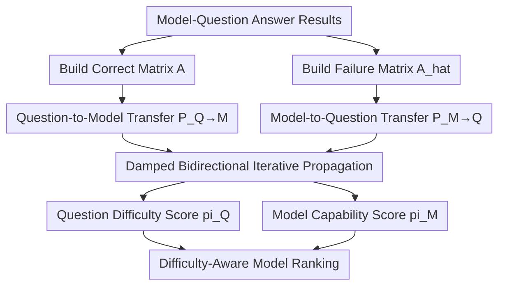

# EIP: Weighted Ranking of LLMs by Quantifying Question Difficulty

**Conference**: ICLR 2026  
**OpenReview**: [https://openreview.net/forum?id=jnX5GJIoYt](https://openreview.net/forum?id=jnX5GJIoYt)  
**Code**: https://github.com/Leozz04/EIP  
**Area**: LLM Benchmarking  
**Keywords**: Question Difficulty Modeling, Bi-directional Propagation, Model Ability Ranking, Human Consistency, Non-parametric Evaluation

## TL;DR
This paper proposes Empirical Interaction Propagation (EIP), which models the binary interactions of "model correctly/incorrectly answering questions" as a bi-directional graph propagation system. By jointly estimating question difficulty and model ability, EIP achieves a finer-grained LLM ranking that aligns closely (90%) with human judgment of difficulty compared to pure accuracy metrics.

## Background & Motivation
**Background**: Current mainstream LLM leaderboards mostly rank models based on overall accuracy or average accuracy across sub-tasks, implicitly assuming each question carries approximately equal information. This approach is fragile when the question difficulty distribution shifts, as model performance structures may vary significantly across easy and difficult questions.

**Limitations of Prior Work**: When two models have similar overall accuracy, a single accuracy metric cannot distinguish "which model is stronger on difficult questions." The paper provides an intuitive example: some models do not dominate in overall accuracy but exhibit significantly higher accuracy on hard subsets; traditional rankings tend to flatten these capability differences.

**Key Challenge**: An evaluation system must satisfy two criteria: first, it must interpretably characterize "how hard a question is and how strong a model is"; second, it must be computationally feasible on large-scale data. While Item Response Theory (IRT) methods can perform joint difficulty-ability modeling, they often face challenges such as heavy parameter fitting, high sample requirements, and high deployment costs in large-scale LLM evaluation.

**Goal**: The authors aim to construct an evaluation framework that does not rely on complex parametric assumptions, converges quickly on large-scale model-question interaction matrices, and aligns with human difficulty judgments.

**Key Insight**: A key observation of EIP is that "difficulty" and "ability" are naturally defined by each other: questions that even strong models fail are harder; models that solve high-difficulty questions are stronger. Consequently, the authors formulate this mutual definition process directly as iterative bi-directional propagation on a graph, rather than fixing one side to estimate the other.

**Core Idea**: Construct a directed bipartite graph between models and questions. Through "success edges" and "failure edges," damped propagation is performed, eventually utilizing a unique steady-state distribution to simultaneously obtain question difficulty scores and model ability scores.

## Method

### Overall Architecture
EIP first collects model results (correct/incorrect) on questions to form a binary matrix $A \in \{0,1\}^{Q\times M}$, where $A_{q,m}=1$ indicates model $m$ answered question $q$ correctly. Subsequently, a complementary failure matrix $\hat{A}=(\mathbf{1}-A)^\top$ is constructed. Bi-directional propagation is established between "question nodes" and "model nodes": question difficulty propagates to models that solved them, and model ability propagates to questions that defeated them.

To avoid periodicity issues in bipartite graph random walks, EIP incorporates a damping term (similar to PageRank's teleport) in each update round, ensuring the process is ergodic and aperiodic, thus converging to a unique steady-state distribution. The final output consists of two sets of scores: $\pi_Q$ (question difficulty) and $\pi_M$ (model ability).

### Key Designs
**1. Bipartite Graph Bilateral Semantic Modeling: Encoding "Success" and "Failure" Separately**

While many evaluations only retain "accuracy," EIP explicitly distinguishes between two types of edges: $q \rightarrow m$ (success) and $m \rightarrow q$ (failure). This adds semantic meaning to the propagation: solving highly difficult questions yields more ability gain for a model, while being failed by strong models raises the question's difficulty. Formally, EIP defines the interdependent relationships:

$$
\pi_m \propto \sum_{q \in Success(m)} \frac{\pi_q}{S(q)},\qquad
\pi_q \propto \sum_{m \in Fail(q)} \frac{\pi_m}{F(m)}
$$

Where $S(q)$ is the number of models that solved question $q$, and $F(m)$ is the number of questions model $m$ failed. This normalization prevents "popular easy questions" or "consistently failing models" from causing uncontrolled amplification in propagation.

**2. Row-Stochastic Transition Matrix + Damped Iteration: Ensuring Stable Global Ranking**

The paper formulates the propagation using two row-stochastic matrices:
$P_{Q\to M}=\mathrm{diag}(A\mathbf{1}_M)^{-1}A$,
$P_{M\to Q}=\mathrm{diag}(\hat{A}\mathbf{1}_Q)^{-1}\hat{A}$.
Update steps are then alternated:

$$
\pi_Q^{(t+1)}=\alpha P_{M\to Q}^{\top}\pi_M^{(t)}+(1-\alpha)\frac{\mathbf{1}_Q}{Q}
$$

$$
\pi_M^{(t+1)}=\alpha P_{Q\to M}^{\top}\pi_Q^{(t+1)}+(1-\alpha)\frac{\mathbf{1}_M}{M}
$$

The damping parameter $\alpha \in (0,1)$ prevents the system from oscillating in the bipartite graph and theoretically guarantees the existence of a unique steady state. The authors emphasize that this is key to EIP being both stable and fast in large-scale evaluations.

**3. Pre-filtering Extreme Questions: Reducing Dead Nodes and Enhancing Propagation Effectiveness**

If a question is answered correctly or incorrectly by all models, it provides almost no information for distinguishing model abilities and creates boundary nodes during propagation. EIP filters these extreme questions before graph construction, ensuring retained questions satisfy $0<\sum_j A_{ij}<M$. In a setup with 35,550 questions and 30 models, extreme questions accounted for approximately 2%. Filtering them does not affect the overall conclusions but significantly improves the signal density of the propagation.

**4. Continuous Score Extension: Generalizing from Binary to Partial Credit Tasks**

EIP supports more than just binary scoring. For open-ended questions, a continuous score matrix $A^c \in [0,1]^{Q\times M}$ can be used with transition matrices updated in the same form:
$P_{Q\to M}=\mathrm{diag}(S)^{-1}A^c$,
$P_{M\to Q}=\mathrm{diag}(F)^{-1}\hat{A}^c$.
This allows EIP to smoothly migrate to "partially correct" evaluation scenarios like free-form generation without reinventing a new ranking method.

### An Illustrative Example
Assume 3 models (A, B, C) and 4 questions (q1, q2, q3, q4).
q1 and q2 are easy, q3 and q4 are harder. The results are:

| Question | A | B | C |
|----------|---|---|---|
| q1 (Easy) | 1 | 1 | 1 |
| q2 (Easy) | 1 | 1 | 0 |
| q3 (Med)  | 1 | 0 | 0 |
| q4 (Hard) | 0 | 0 | 0 |

Intuitively, A should be the strongest because it solves q3; B follows; C is the weakest. Pure accuracy yields A=75%, B=50%, C=25%, which distinguishes them but fails to explain "where the difference between B and C comes from." EIP propagation amplifies the weight of q3 (because it was only solved by the strong model), further widening the ability gap between A and B/C. Meanwhile, q4 is pre-filtered or placed at the extreme difficulty endpoint, not entering the core propagation.

This example highlights the core value of EIP: it does not just count "how many were correct," but "what the difficulty structure of the correct questions was."

### Loss & Training
EIP is essentially a non-neural framework and lacks a traditional loss function backpropagation. It relies on iterative updates until convergence, using $L_1$ change as the stopping criterion:

$$
\delta_Q=\|\pi_Q^{(t+1)}-\pi_Q^{(t)}\|_1,\qquad
\delta_M=\|\pi_M^{(t+1)}-\pi_M^{(t)}\|_1
$$

The process stops when both $\delta_Q$ and $\delta_M$ are less than a threshold $\epsilon$. Experiments show that the number of iterations is nearly constant (approx. 9 rounds) even at scale, which is crucial for engineering deployment.

## Key Experimental Results

### Main Results
The paper validates EIP across 30 models and 35,550 questions, covering BBH, GPQA, GSM8k, HellaSwag, MATH, and MMLU-Pro. The core conclusion is that while EIP is generally positively correlated with accuracy, it produces meaningful re-rankings between adjacent models, particularly rewarding models that are "more stable on difficult questions."

| Metric Dimension | EIP Result | Comparative Conclusion |
|------------------|------------|------------------------|
| Consistency with Human Judgment | 90% Consensus | Significantly better than Simple Rank and IRT variants |
| Correlation with Accuracy | Kendall's $\tau=0.8492$ | Aligned with traditional metrics but finer-grained |
| Stability (Removing Models) | Question difficulty correlation remains 0.9382 with 15/30 models removed | Ranking is robust to model pool changes |
| Computational Efficiency | ~0.00597s for 30 models × 35,550 questions | Significantly faster than 1PL/2PL/Multi-IRT |

### Ablation Study
The authors analyze the impact of model pool composition on difficulty estimation quality, concluding that a "heterogeneous model mix" is significantly better than "same-scale model pools." Additionally, EIP maintains near-linear growth and a fixed number of iterations across different $Q\times M$ scales.

| Configuration | Observation Metric | Result and Interpretation |
|---------------|-------------------|---------------------------|
| Same-scale pools (small/medium/large) | Human Consistency | Only 38.6% to 64.3%, relatively low |
| Mixed-scale pool (whole) | Human Consistency | 90.0%, indicating complementary biases improve estimation |
| Large-scale synthetic matrix | Convergence Rounds | Fixed at approx. 9 rounds |
| Increasing $Q\times M$ | Time per round | Near-linear increase, consistent with $O(QM)$ |

### Key Findings
- EIP does not negate accuracy but adds a layer of "difficulty-weighted structural information," explaining ranking phenomena where accuracy is similar but capabilities differ.
- Open-source model pools have great potential for estimating difficulty distributions: difficulty rankings show high Spearman correlation (0.96) compared to the full model pool.
- Model families often maintain a similar "difficulty response shape" across parameter scales, suggesting evaluation should focus on capability structure rather than just absolute scores.

## Highlights & Insights
- The greatest highlight is transforming "question difficulty" from a verbal concept into a computable, verifiable, and scalable object. While many papers advocate for difficulty-awareness, few successfully implement a unified formula for large-scale experiments.
- EIP is engineered with restraint: the core consists of matrix construction and iterative propagation without complex parameter fitting. For evaluation systems, "reproducibility + low maintenance" is more practical than pursuing complex models.
- The 90% human consistency indicates that EIP's difficulty definition is not purely a mathematical artifact but is strongly coupled with human intuition, which is vital for building credible leaderboards.
- The paper reveals a neglected fact: evaluation results depend heavily on the model pool composition. Using a single-scale model pool to label difficulty leads to systematic bias; a mixed pool behaves more like "collective judgment."

## Limitations & Future Work
- EIP still depends on the quality of the observed answer matrix. Bias from prompt leaks, inconsistent evaluation protocols, or scoring noise will be inherited by the propagation.
- The method currently acts as a "posterior evaluation framework" and does not directly explain why a model fails on specific difficult questions (it excels at ranking but not causal attribution).
- Although continuous score extensions are provided, main experiments focus on binary accuracy. For subjective generation tasks, continuous score reliability and labeling consistency will be the next bottleneck.
- A feasible extension is to incorporate question meta-information (knowledge points, reasoning chain length, domain tags) for post-propagation analysis to provide joint explanations of "difficulty score + difficulty source."

## Related Work & Insights
- **vs Simple Rank (Ranking by error count)**: Simple Rank uses only first-order statistics and ignores "who failed the question." EIP distinguishes the informational value between being failed by a weak model versus a strong model.
- **vs IRT (1PL/2PL/Multi-IRT)**: IRT has a clear statistical tradition but faces fitting costs and stability challenges at the scale of LLM evaluations. EIP chooses a non-parametric propagation route, sacrificing some parametric interpretability for deployment efficiency and robustness.
- **vs Pure Accuracy Leaderboards**: Accuracy is suitable for coarse ranking; EIP is suited for fine ranking and capability structure analysis. They are not mutually exclusive and should ideally be reported together.
- **Insights for Future Work**: EIP can be used as a "test bank builder," prioritizing questions that maximize model discrimination to create high-information-density dynamic benchmarks.

## Rating
- Novelty: ⭐⭐⭐⭐☆ (Systematizes joint difficulty-ability estimation via non-parametric propagation; simple and practical)
- Experimental Thoroughness: ⭐⭐⭐⭐⭐ (30 models, 35,550 questions; covers human evaluation, robustness, scalability, and simulation)
- Writing Quality: ⭐⭐⭐⭐☆ (Clear main line with dense experimental info; some symbols require cross-referencing with appendices)
- Value: ⭐⭐⭐⭐⭐ (Direct methodological value for LLM leaderboards and benchmark construction; low-cost implementation)

<!-- RELATED:START -->

## Related Papers

- [\[ACL 2026\] Question Difficulty Estimation for Large Language Models via Answer Plausibility Scoring](../../ACL2026/llm_evaluation/question_difficulty_estimation_for_large_language_models_via_answer_plausibility.md)
- [\[ICLR 2026\] Textual Bayes: Quantifying Prompt Uncertainty in LLM-based Systems](textual_bayes_quantifying_prompt_uncertainty_in_llm-based_systems.md)
- [\[ICLR 2026\] Harnessing Temporal Databases for Systematic Evaluation of Factual Time-Sensitive Question-Answering in LLMs](harnessing_temporal_databases_for_systematic_evaluation_of_factual_time-sensitiv.md)
- [\[NeurIPS 2025\] EvaLearn: Quantifying the Learning Capability and Efficiency of LLMs via Sequential Problem Solving](../../NeurIPS2025/llm_evaluation/evalearn_quantifying_the_learning_capability_and_efficiency_of_llms_via_sequenti.md)
- [\[ICLR 2026\] CogniLoad: A Synthetic Natural Language Reasoning Benchmark With Tunable Length, Intrinsic Difficulty, and Distractor Density](cogniload_a_synthetic_natural_language_reasoning_benchmark_with_tunable_length_i.md)

<!-- RELATED:END -->
