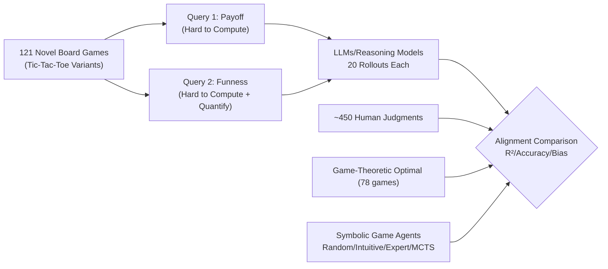

# Evaluating Language Models' Evaluations of Games

**Conference**: ICLR 2026  
**OpenReview**: [https://openreview.net/forum?id=kefUcn22mk](https://openreview.net/forum?id=kefUcn22mk)  
**Code**: TBD  
**Area**: LLM Evaluation / Computational Cognitive Science  
**Keywords**: Meta-reasoning, Game Evaluation, Human Alignment, Reasoning Models, Resource Rationality  

## TL;DR
This paper proposes a novel evaluation paradigm—shifting from assessing whether AI "can play a game" to whether it "can judge if a game is worth playing." Using 121 novel board games and over 450 human judgments, the authors systematically compare how well language/reasoning models align with humans, game-theoretic optimal solutions, and symbolic game agents across two types of queries: "payoff estimation (fairness)" and "funness evaluation."

## Background & Motivation
- **Background**: From Chess and Go to Poker, ARC-AGI, and Pokémon, AI reasoning has long been measured by "problem-solving" (playing games). The community continuously invents new games to test the flexibility of AI reasoning.
- **Limitations of Prior Work**: Reasoning involves not just "solving a problem" but also the higher-order capability of "judging whether the problem itself is worth solving." Humans evaluate whether a task or goal is worth their limited time and effort before acting, a "problem evaluation" capability almost entirely ignored by existing benchmarks.
- **Key Challenge**: Judging a game is inherently more "ambiguous" than judging a player. Players have objective win/loss outcomes, but "whether a game is good" often lacks an objective answer. Different evaluation queries vary significantly across two dimensions—"hard to compute" and "hard to quantify"—requiring distinct human data and baselines.
- **Goal**: Establish a formal framework for assessing "AI's evaluation of games" and empirically investigate whether modern language/reasoning models can produce evaluations aligned with humans (or game-theoretic optima).
- **Core Idea**: **[From Evaluating Solutions to Evaluating Evaluations]** Shift the evaluation target from strategy $\pi(a_t \mid s_t)$ (actions) to game attributes $\psi(G)$ (payoff, funness). By selecting queries along two orthogonal dimensions—**hard to compute** and **hard to quantify**—the task of "evaluating AI's judgment" itself becomes measurable.

## Method

### Overall Architecture
The authors formally represent a game $G$ as a quadruple of states $S$, actions $A$, rules $T$, and a reward function $R$. While traditional benchmarks evaluate the strategy $\pi_G$, this paper evaluates the estimation of a game attribute $\psi(G)$. Two types of queries are selected: **payoff/fairness** (hard to compute) and **funness** (both hard to compute and hard to quantify). Language/reasoning models perform 20 rollouts for each of the 121 novel Tic-Tac-Toe variants. These are compared against ~450 human judgments, game-theoretic optimal (GTO) solutions for 78 games, and a set of symbolic agents explicitly simulating play.

### Key Designs

**1. Two-Dimensional Evaluation Query Space.** Not all judgments are worth testing; identifying if a game is competitive or cooperative is trivial. The authors propose two orthogonal dimensions: **Hard to Compute** (e.g., estimating payoff requires complex state-space search) and **Hard to Quantify** (e.g., "funness," where scoring criteria lack consensus). Payoff falls into "hard to compute," while funness occupies the top-right "hard to compute + hard to quantify" quadrant. This guided the need for distribution-based comparisons for subjective queries.

**2. Multi-level Benchmarks: Humans, GTO, and Four Symbolic Agents.** Evaluating "AI's evaluation" requires appropriate yardsticks. The study uses **Humans** (for collaborative "thought partner" alignment) and **GTO** (for absolute rationality). It also introduces a gradient of symbolic agents from Collins et al. (2025)—including Random, "Intuitive Gamer" (novice-like), "Expert" (depth-5 search), and MCTS—to determine where models sit on the rationality vs. human-alignment axes.

**3. Distribution-level Similarity Metrics + Inference Token Auditing.** The primary metric is $R^2$ between model averages and human judgments across 121 games. **Split-half correlation** of human data ($R^2=0.82$) defines the ceiling for human alignment. For the 78 GTO-solved games, accuracy and mean absolute deviation are also calculated. Crucially, **inference token count** is audited as a "resource cost" to diagnose if models exhibit "resource rationality" by dynamically allocating computation based on problem difficulty.

**4. Reasoning Trajectory Coding.** For open-source models (e.g., DeepSeek-R1) or models with CoT, the authors used o3 to label trajectories. They tracked which factors were mentioned for funness (Balance, Challenge, Duration, Strategic Richness, Novelty) and the proportion of "explicit simulation" used for payoff estimation versus analogies or mathematical shortcuts.

## Key Experimental Results

### Main Results (Model/Human vs. GTO, 78 games)

| Reasoner | $R^2$ | Accuracy | Deviation |
|---|---|---|---|
| Human | 0.62 | 0.69 | 0.32 |
| Intuitive Gamer | 0.69 | 0.75 | 0.25 |
| Expert Gamer | 0.87 | 0.92 | 0.08 |
| MCTS | 0.89 | 0.91 | 0.06 |
| Random | 0.39 | 0.57 | 0.43 |
| GPT-4 (Direct) | 0.31 | 0.60 | 0.42 |
| DeepSeek v3 (CoT) | 0.40 | 0.63 | 0.38 |
| DeepSeek R1 | 0.43 | 0.64 | 0.40 |
| Gemini 2.5 Pro | 0.66 | 0.84 | 0.22 |
| o1 | 0.50 | 0.72 | 0.35 |
| o3 | 0.71 | 0.83 | 0.27 |
| GPT-5 | 0.82 | 0.88 | 0.15 |

> Higher $R^2$ indicates proximity to GTO. Non-reasoning models performing direct inference are furthest from GTO, while CoT and reasoning models approach it, with GPT-5 being the most rational.

### Ablation Study (Factor Mentions in Funness Evaluation Trajectories)

| Model | Balance | Challenge | Duration | Strategic Richness | Novelty |
|---|---|---|---|---|---|
| LLaMA 3.1 70B (CoT) | 47.5% | 97.1% | 53.0% | 99.5% | 56.8% |
| GPT-4 (CoT) | 55.6% | 98.6% | 67.9% | 98.6% | 54.5% |
| DeepSeek v3 (CoT) | 71.7% | 95.7% | 70.9% | 98.1% | 65.4% |
| DeepSeek R1 | 85.7% | 99.7% | 90.8% | 99.3% | 62.3% |
| Gemini 2.5 Flash | 74.6% | 99.9% | 76.5% | 100.0% | 48.3% |
| Gemini 2.5 Pro | 86.2% | 100.0% | 77.5% | 100.0% | 73.8% |

> Nearly all models focus on "Challenge" and "Strategic Richness," but disagree significantly on "Balance" and "Duration"—explaining the variance in funness scores.

### Key Findings
- **Reasoning > Non-reasoning**: Reasoning models generally align better with human game evaluation than non-reasoning ones. Direct answers from non-reasoning models across different families (GPT-4/DeepSeek-v3) show similar but incorrect "fairness" biases, failing to replicate human judgment.
- **Non-monotonic Alignment**: In the OpenAI family, a "rise then fall" pattern emerges: GPT-4 → o1 → o3 improved alignment with both humans and GTO. However, from o3 → GPT-5, **GTO alignment continued to improve while human alignment decreased**; the more "optimal" the model became, the less it resembled "semi-rational" humans.
- **Funness is "Sawtooth"**: Cross-model performance on funness is unstable (stronger models aren't necessarily more human-like), confirming the inherent difficulty of "hard to quantify" queries.
- **Incoherent Resource Usage**: Inference token usage is highly unpredictable across models and games. "Novel" games (further from Tic-Tac-Toe) do not consume more tokens, and token counts show no correlation with accuracy. Models actually used fewer tokens to evaluate "funness" despite its ambiguity.

## Highlights & Insights
- **Paradigm Elevation**: Shifting evaluation from "solving problems" to "judging problems" mirrors cognitive science traditions of meta-reasoning and resource rationality, opening a neglected dimension for AGI benchmarks.
- **Evidence of "Rational but Alien"**: The non-monotonic relationship explicitly decouples "human alignment" and "optimization." This poses a fundamental question for AI safety and collaboration: which target should the model align with?
- **Distribution over Mean**: The emphasis on using full human distributions (including bimodal ones) and split-half correlation ceilings is methodologically superior to simple mean-matching.
- **Call for Resource Rationality**: The chaotic token usage points to a future research direction: "meta-reasoning agents" that dynamically allocate compute based on problem difficulty.

## Limitations & Future Work
- **Narrow Game Domain**: Limited to 121 2-player competitive grid-based Tic-Tac-Toe variants. While strategically rich, they do not represent the full complexity of real-world or asymmetric decisions.
- **Opaque Closed-Source Models**: Most SOTA models do not expose reasoning trajectories, limiting the verification of "explicit simulation" to open-weights models like DeepSeek-R1.
- **Subjective "Funness" Ground Truth**: Funness was intentionally left for humans and models to define, leading to a lacks of objective yardsticks and reliance on distribution comparisons.
- **Future Work**: Design resource-rational agents that allocate compute based on query type/difficulty; expand to multi-player and asymmetric games; characterize how different evaluation strategies shape judgment distributions.

## Related Work & Insights
- **Meta-reasoning / Resource Rationality**: Connects to the traditions of Griffiths and Lieder regarding the decision-making process of "which problem to solve" (representation, decomposition, strategy selection).
- **LLM Reasoning Evaluation**: While most work focuses on "solving" (math, code, planning), this paper fills the gap by focusing on "judging."
- **Insight**: "Evaluative Power" can be treated as an independent, formalizable capability. The tension between human alignment and GTO peak suggests that collaborative "thought partner" AI must make explicit trade-offs.

## Rating
- **Novelty**: ⭐⭐⭐⭐⭐ Elevating the evaluation target from problem-solving to problem-judgment is a significant and clear new paradigm.
- **Experimental Thoroughness**: ⭐⭐⭐⭐ 121 games × 450+ humans × multi-family models × dual queries × multiple benchmarks is solid, though limited by the game domain.
- **Writing Quality**: ⭐⭐⭐⭐ The framework (Hard to Compute × Hard to Quantify) is clear, and the arguments are coherent.
- **Value**: ⭐⭐⭐⭐⭐ Provides a reusable methodology for "evaluating evaluations" and yields critical insights on human-optimal trade-offs and resource rationality.

<!-- RELATED:START -->

## Related Papers

- [\[ICLR 2026\] RefineBench: Evaluating Refinement Capability of Language Models via Checklists](refinebench_evaluating_refinement_capability_of_language_models_via_checklists.md)
- [\[ICLR 2026\] Towards Personalized Deep Research: Benchmarks and Evaluations](towards_personalized_deep_research_benchmarks_and_evaluations.md)
- [\[ICLR 2026\] LMGame-Bench: How Good are LLMs at Playing Games?](lmgame-bench_how_good_are_llms_at_playing_games.md)
- [\[ICLR 2026\] CMPhysBench: A Benchmark for Evaluating Large Language Models in Condensed Matter Physics](cmphysbench_a_benchmark_for_evaluating_large_language_models_in_condensed_matter.md)
- [\[NeurIPS 2025\] Can Large Language Models Master Complex Card Games?](../../NeurIPS2025/llm_evaluation/can_large_language_models_master_complex_card_games.md)

<!-- RELATED:END -->
