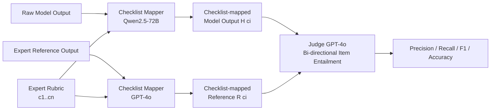

# ExpertLongBench: Benchmarking Language Models on Expert-Level Long-Form Generation Tasks with Structured Checklists

**Conference**: ICLR 2026  
**OpenReview**: [https://openreview.net/forum?id=nJvgBolRcR](https://openreview.net/forum?id=nJvgBolRcR)  
**Code/Leaderboard**: [https://huggingface.co/spaces/launch/ExpertLongBench](https://huggingface.co/spaces/launch/ExpertLongBench)  
**Area**: LLM Evaluation / Benchmark / Long-form Generation  
**Keywords**: expert-level evaluation, long-form generation, checklist-based evaluation, rubric, LLM-as-a-judge  

## TL;DR
The authors propose EXPERTLONGBENCH (11 expert-level long-form generation tasks across 9 domains) and the CLEAR evaluation framework. By using expert-designed rubrics to decompose both model outputs and reference answers into checkable checklists, the study finds that even the strongest model, Gemini-2.5-Pro, achieves an average F1 of only 33.4, indicating a massive performance gap in expert-level long-form generation for current LLMs.

## Background & Motivation
- **Background**: Existing expert-level benchmarks (MMLU, GPQA) narrow tasks into multiple-choice questions or short answers for ease of evaluation. Although ExpertQA involves expert domains, it remains a QA task with answers of approximately 100 words, rather than end-to-end real expert workflows.
- **Limitations of Prior Work**: Real expert tasks (writing legal case summaries, drafting clinical records, generating ESG reports) often require reading ultra-long inputs (up to 200,000 tokens) and producing long outputs (exceeding 5,000 tokens) while strictly adhering to domain-specific norms. Current evaluations lack both appropriate long-text tasks and fine-grained evaluation methods for each task.
- **Key Challenge**: Evaluation of open-ended long-form generation either relies on subjective high-level criteria like "helpfulness" or "relevance" (unstable LLM-as-a-judge) or atomic fact decomposition (lack of task specificity leading to inconsistent evaluation). Crucially, expert tasks generally **lack reference answers**, making evaluation ungrounded and recall estimation impossible.
- **Goal**: To establish a benchmark that closely mirrors real expert workflows, requires long-form input/output, and provides expert reference answers with checkable rubrics, accompanied by a reproducible, low-cost evaluation framework aligned with expert judgment.
- **Key Insight**: **Perform grounded evaluation using "expert-designed rubrics → checkable checklists"**. Both model outputs and human references are extracted into structured checklists based on rubric items. Bi-directional semantic entailment is then performed item-by-item to calculate precision/recall/F1, rather than relying on a judge's overall impression.

## Method

### Overall Architecture
The work consists of two parts: (1) The **EXPERTLONGBENCH** dataset—1050 samples across 11 tasks in 9 domains, each containing task inputs, expert-written references, and checklist-mapped references verified by domain experts; (2) The **CLEAR** evaluation framework—given a model output, a checklist mapper first extracts checklist items according to the rubric, then a judge performs bi-directional comparison between the model's checklist and the reference checklist, finally aggregating scores at the sample/task level.

### Key Designs

**1. Expert-level Long-form Task Set: Defining "Expert Capability" through Real Workflows.** EXPERTLONGBENCH covers 11 tasks across 9 domains: Legal (multi-document case summary T1, fact statement generation T2), Materials (synthesis explanation T3), Education (teaching alignment assessment T4, feedback generation T5), Medical (clinical records T6, diagnostic reasoning T9), Chemistry (molecular description T7), Biology (protein description T8), Finance (ESG reporting T10), and Cybersecurity (risk description T11). Tasks are selected based on three criteria: clear rubrics can be defined, solving and evaluating require domain expertise, and they are rooted in real expert processes. Metadata shows maximum inputs exceeding 200,000 tokens (T2 average 187k) and maximum references exceeding 5,000 tokens (T2 average 5,155), far surpassing existing datasets. For instance, in a complex legal case, a senior lawyer may read dozens to hundreds of files and spend over 10 hours to complete a summary. Six tasks use newly collected data, five are adapted from existing data, and both public and private subsets are provided to prevent data contamination.

**2. Expert-designed Rubrics and Checklist-mapped References: Making "Correctness" Explicit.** For each task, domain experts collaboratively designed a checklist-style rubric applicable to all samples (e.g., the T1 legal summary requires accurately identifying the cause of action, relevant laws/constitutional basis, and relief sought). Rubric design is time-consuming (T1 rubric took experts over 10 hours). With the rubric, GPT-4o is used with "role-playing" prompts to extract content corresponding to each checklist item $c_i$ from the human reference as completely as possible. If missing, it returns "N/A," forming the checklist-mapped reference $\{R(c_i)\}_{i=1}^n$. This extraction is verified by both humans and LLMs, achieving over 90% faithfulness and coverage on T1 and T6, ensuring high-quality "reference-side" checklists.

**3. CLEAR Evaluation: Item-by-item Checking via Bi-directional Semantic Entailment.** Given model output, checklist items $\{H(c_i)\}$ are extracted following the §3 process, using the open-source Qwen2.5-72B as the mapper to save costs (averaging 90.1 F1 on T1/T6/T7/T8, verifying its accuracy). GPT-4o serves as the judge to perform **bi-directional binary judgments** for each checklist item: ① whether the semantics of reference $R(c_i)$ are contained in model $H(c_i)$, and ② whether $H(c_i)$ is contained in $R(c_i)$. Based on this, checklist precision (proportion of model items contained in reference), recall (proportion of reference items contained in model), and accuracy (proportion of mutual entailment) are defined:

$$\text{Precision}=\frac{\#\{c_i: R(c_i)\subseteq H(c_i)\}}{n},\quad \text{Recall}=\frac{\#\{c_i: H(c_i)\subseteq R(c_i)\}}{n},\quad F_1=\frac{2PR}{P+R}$$

Sample-level metrics are averaged across checklist items, and task-level metrics are averaged across samples. This design of "mapping to structured items, then performing grounded item-by-item checking" transforms open-ended long-form evaluation into an objective verification process with reference-based recall estimation.

**4. Cost-Reproducibility Justification of Evaluation Components.** The paper systematically verifies the reliability and affordability of this configuration: For the mapper, Qwen2.5-72B outperforms Llama-3.3-70B and Mistral-Large. For the judge, the Cohen's Kappa between GPT-4o and Gemini-2.0-Flash is 0.81–0.89 (near-perfect agreement), and Pearson correlation between Qwen2.5-72B and GPT-4o scoring reaches 0.88. This implies the entire pipeline can be driven by open-source models for cost efficiency. Compared to domain experts, GPT-4o's rubric judgments achieve 91.3%–92% agreement with experts on T7/T8.

## Key Experimental Results

### Main Results (Average F1 of 15 LLMs on EXPERTLONGBENCH, 0–100)

| Model | T1 | T2 | T5 | T6 | Avg |
|---|---|---|---|---|---|
| Gemini-2.5-Pro | 25.4 | 10.0 | 47.9 | 44.0 | **33.4** |
| GPT-5 | 27.2 | 10.3 | 56.5 | 54.7 | 31.0 |
| o3 | 25.3 | 8.1 | 43.5 | 52.5 | 29.3 |
| Qwen3-32B | 17.7 | 3.6 | 33.0 | 47.6 | 28.1 |
| GPT-4o | 13.2 | 6.2 | 29.9 | 25.3 | 26.5 |
| Claude-3.7-Sonnet | 11.5 | 0.9 | 35.0 | 26.1 | 23.2 |
| Claude-3.5-Haiku | 2.8 | 1.1 | 9.7 | 10.9 | 19.3 (Min) |

- The strongest model, Gemini-2.5-Pro, achieves an average F1 of only **33.4**. T2 (Legal Fact Statement Generation) is the hardest, with all models scoring F1 < 11.

### Key Findings (Ablation/Diagnostics)

| Phenomenon | Conclusion |
|---|---|
| Model scaling | Larger models within the same family are generally better, but **not consistent across all tasks** (e.g., Mistral-Nemo outperforms Mistral-Large on T10). |
| Test-time scaling (o3/Qwen3/Gemini-2.5-Pro) | Does **not substantially improve** domain expert-level reasoning; the gap with experts remains large. |
| Proprietary vs Open | Proprietary is **not always superior**; Claude is relatively weak in expert workflows. |
| Checklist Coverage vs F1 | **Negatively correlated**: High coverage is accompanied by low accuracy—content may look compliant but is actually incorrect. |
| RAG agent (T1/T2) | Performs **worse** than direct full-text reading, indicating global context is critical for expert tasks. |

### Highlights & Insights
- Models can generate content matching **67%+** of required aspects, yet are far from correct—posing a risk of content that "appears expert-aligned but is actually misleading."
- CLEAR can be fully driven by open-source models: The correlation between Qwen2.5-72B and GPT-4o scores reaches 0.88, with inter-judge agreement Kappa of 0.81–0.89.

## Highlights & Insights
- **Operationalizing "Expert-Aligned Evaluation" into Checklists**: Converting rubrics into grounded bi-directional item-by-item checks allows for recall estimation and avoids the subjective drift of LLM-as-a-judge.
- **Exposing the "High Coverage $\neq$ High Quality" Red Flag**: Models are good at stacking content that "looks complete" but contains heavy errors, providing a crucial warning for deployment in real expert scenarios.
- **Reproducibility + Low Cost**: Demonstrates the entire evaluation pipeline can run on open-source models with results highly consistent with GPT-4o, lowering the barrier for community reproduction.
- **Public/Private Subsets + Long-term Maintenance**: Balances transparency with anti-contamination measures, ensuring the benchmark has a long lifecycle.

## Limitations & Future Work
- **Reliance on LLMs as Mapper and Judge**: Checklist extraction and judgment are still performed by LLMs. Although consistency is high, errors might amplify in tasks with more rubric items or subtle semantics.
- **Expensive Rubric Creation**: High-quality rubrics require hours of expert labor, making rapid scaling difficult. The paper notes that "automatically generating high-quality checklists" remains an open problem.
- **Limited Granularity of Binary Judgments**: Simplifying each item to a 0/1 entailment may lose information regarding partial correctness or partial coverage.
- **Limited Domain Coverage**: While 11 tasks across 9 domains are diverse, they are far from covering all professional scenarios. Private subsets also limit fully open reproduction.

## Related Work & Insights
- Compared to MMLU/GPQA (MCQs), ExpertQA (short answers), and DOLOMITES/ResearchQA (methodology writing/research QA), this work fills the gap for "end-to-end expert workflows + long input/output + reference grounding."
- Methodologically, it builds on fact decomposition (FActScore) and checklist evaluation (WildBench, BiGGenBench, TICK, CheckEval, RocketEval, LLM-Rubric, HealthBench), but solves their lack of "domain specificity" or "reference grounding" via expert rubrics and reference grounding.
- Insight: Long-form generation evaluation should prioritize being "structured, checkable, and grounded" over holistic scoring. The "high coverage, low accuracy" phenomenon suggests future work should focus on factual correctness and domain knowledge grounding rather than just content completeness.

## Rating
- **Novelty**: ⭐⭐⭐⭐ Converting expert rubrics into grounded checklist evaluations and systematically covering real long-form workflows across 9 domains represents a significant increment in both methodology and data.
- **Experimental Thoroughness**: ⭐⭐⭐⭐⭐ Comprehensive evaluation across 15 cutting-edge models and 11 tasks, plus multi-dimensional diagnostics on mapper/judge selection, scaling, test-time scaling, RAG, and human-machine consistency.
- **Writing Quality**: ⭐⭐⭐⭐ Clear progression from motivation to construction to evaluation. Figure 1 pipeline and Tables 1/2 are high in information density.
- **Value**: ⭐⭐⭐⭐⭐ Provides a high-difficulty, anti-contamination, and reproducible expert-level long-form benchmark. It has long-term reference value for pushing LLMs toward real professional applications.

<!-- RELATED:START -->

## Related Papers

- [\[ICLR 2026\] LFQA-E: Carefully Benchmarking Long-form QA Evaluation](lfqa-e_carefully_benchmarking_long-form_qa_evaluation.md)
- [\[ICLR 2026\] FinSearchComp: Towards a Realistic, Expert-Level Evaluation of Financial Search and Reasoning](finsearchcomp_towards_a_realistic_expert-level_evaluation_of_financial_search_an.md)
- [\[ICLR 2026\] RefineBench: Evaluating Refinement Capability of Language Models via Checklists](refinebench_evaluating_refinement_capability_of_language_models_via_checklists.md)
- [\[ICLR 2026\] Addressing Pitfalls in the Evaluation of Uncertainty Estimation Methods for Natural Language Generation](addressing_pitfalls_in_the_evaluation_of_uncertainty_estimation_methods_for_natu.md)
- [\[ACL 2026\] Illusions of the Gold Standard: A Large-scale Analysis of Human Evaluation Protocols for Long-form Text Generation](../../ACL2026/llm_evaluation/illusions_of_the_gold_standard_a_large-scale_analysis_of_human_evaluation_protoc.md)

<!-- RELATED:END -->
