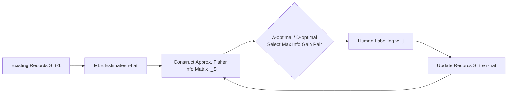

# Fewer Battles, More Gain: An Information-Efficient Framework for Arena-based LLM Evaluation

**Conference**: ICLR 2026  
**OpenReview**: [https://openreview.net/forum?id=XUVqFRp9oi](https://openreview.net/forum?id=XUVqFRp9oi)  
**Code**: [https://github.com/Liuz-rui/Adaptive-Arena](https://github.com/Liuz-rui/Adaptive-Arena)  
**Area**: LLM Evaluation / Arena Evaluation  
**Keywords**: Arena Evaluation, ELO Rating, Fisher Information, Active Sampling, A/D-optimal Experimental Design, Labeling Efficiency  

## TL;DR
The selection of "which two models should battle" in an Arena is modeled as an optimal experimental design problem. By utilizing the A-optimal/D-optimal criteria of the Fisher Information Matrix to actively select battles with the highest information gain, the framework achieves more reliable rankings with the same amount of human labeling, effectively realizing "fewer battles, more gain."

## Background & Motivation
- **Background**: Arena evaluation (e.g., Chatbot Arena) estimates rankings through pairwise model battles and human preference labeling using ELO/Bradley-Terry models. Since it closely aligns with real human preferences, it has become a mainstream LLM evaluation method, with over 190 models active on such platforms.
- **Limitations of Prior Work**: Existing Arena systems rely almost entirely on **exhaustive or random** pairing, generating a massive volume of redundant matches. Chatbot Arena requires tens of thousands of battles to produce reliable rankings. With increasingly rapid model iterations and a constant influx of new models, this "blind pairing" consumes excessive human labeling resources and slows down evaluation cycles, showing poor scalability.
- **Key Challenge**: Traditional efficient evaluation methods aimed at "reducing evaluation samples" (e.g., TinyBenchmarks, MetaBench) are designed for **static QA**, where information-dense questions are selected. However, Arena involves **dynamic pairwise battles** where rankings rely on **iterative human judgment** without fixed ground-truth answers. The assumptions of these static methods fail in this context and cannot be directly applied. Meanwhile, most Arena-related research (ELO variants, UDA, etc.) focuses only on improving ranking accuracy, **collectively ignoring labeling efficiency**.
- **Goal**: Achieve the same evaluation quality as a "full battle set" using as few battle labels as possible, without sacrificing ranking reliability.
- **Core Idea**: **Use statistical uncertainty to guide pairing**. The authors observe that under sparse conditions, ELO capability estimation exhibits asymptotic normality, with its variance characterized by the inverse of the Fisher Information Matrix. Consequently, "selecting battle pairs" is transformed into a classic optimal experimental design problem—**selecting the model pair that maximizes the growth of Fisher Information (and thus minimizes variance) at each step**.

## Method

### Overall Architecture
The proposed method (Adaptive Arena) adds an **active pairing selector** on top of standard ELO/Bradley-Terry evaluation. It first uses MLE to estimate current capabilities $\hat{r}_{t-1}$ from existing battle records, constructs an approximate Fisher Information Matrix based on these estimates, and then employs A-optimal or D-optimal criteria to select the pair with the "maximum information gain" from all candidate model pairs for labeling. After labeling, capabilities are updated, and the process repeats. The entire workflow is a closed loop of "estimate capability $\to$ calculate information $\to$ select battle $\to$ obtain label $\to$ re-estimate."

### Key Designs

**1. Mapping Efficiency to Fisher Information: Asymptotic Normality of Sparse Arenas.** The authors use the Bradley-Terry model to define the winning probability $P_{ij}=\frac{1}{1+e^{-C(r_i-r_j)}}$ and estimate capabilities by minimizing the negative log-likelihood via MLE: $L_S(r)=-\sum_{(i,j,w_{ij})\in S}[w_{ij}\ln P_{ij}+w_{ji}\ln P_{ji}]$. The key insight is that by viewing the Arena as an Erdős–Rényi random graph $G(N,q_N)$, as long as the edge probability satisfies $q_N=\omega(\frac{\log N}{N})$, the ELO estimate is **unique** and **asymptotically normal**: $\sqrt{|S|}(\hat r_n-r^*_n)\xrightarrow{d}\mathcal N(0,I_S(r^*)^{-1})$. This implies that the estimation variance is determined by the inverse of the Fisher Information Matrix. Thus, "improving efficiency" is equivalent to "**shrinking $I_S(r^*)^{-1}$ as quickly as possible**"—a clear, optimizable statistical objective. The information matrix is given by the Hessian: $I_S(r)=C^2\sum_{(i,j)\in S}P_{ij}P_{ji}(e_i-e_j)(e_i-e_j)^\top$, where each battle adds a rank-1 information block to the matrix.

**2. A-optimal Pairing: Directly Compressing Estimation Variance.** Since the true capability $r^*$ is unknown, the authors approximate it using the current estimate $\hat r_{t-1}$ to calculate the information matrix. The A-optimal criterion selects the pair that minimizes the "trace of the inverse information matrix" (i.e., the sum of variances for all model estimates):

$$(i_t,j_t)=\arg\min_{1\le i<j\le N}\mathrm{tr}\Big[\big(I_{S_{t-1}}(\hat r_{t-1})+I_{\{(i,j)\}}(\hat r_{t-1})\big)^{-1}\Big].$$

It pursues **balanced reliability across models**, prioritizing information for models with the highest variance. Using Theorem 1, the authors prove that if $q_N=\omega(\frac{\log N}{N})$, the matrix is almost surely positive definite (both invertible and having a positive determinant), which matches the minimum condition of Lemma 1 without requiring every pair to have battled at least once as in Ada-Pair ($q_N=1$).

**3. D-optimal Pairing: Using Determinant to Avoid Inversion.** A-optimal selection requires matrix inversion at each step, resulting in high complexity ($O(N^{\beta+3})$). D-optimal selection instead **maximizes the determinant of the information matrix**, which is geometrically equivalent to minimizing the volume of the confidence ellipsoid and reducing overall uncertainty:

$$(i_t,j_t)=\arg\max_{1\le i<j\le N}\big|I_{S_{t-1}}(\hat r_{t-1})+I_{\{(i,j)\}}(\hat r_{t-1})\big|.$$

This eliminates inversion, reducing complexity to $O(N^{\beta+2})$, and is the primary method recommended in the paper. To prevent the determinant from exploding exponentially with the sample size, Theorem 2 introduces a numerical treatment using normalized geometric information density $D(S_t)=|I_{S_t}(r)|^{1/(N-1)}$ (where the $(N-1)$-th root grows linearly with samples) to avoid numerical overflow.

**4. Engineering: Incremental Updates + Top-K Concurrency.** Although the computational complexity is higher than random or nearest-neighbor pairing, the core philosophy is to "**exchange computation for human labor**"—provided the system can provide pairs within the time limit of a user request. Two optimizations are implemented: (1) **Incremental updates** for the information matrix, adding the current battle's information block to the previous matrix rather than recomputing; (2) To handle system concurrency, each request returns the **Top-K pairs with the highest information gain** (experimentally $K=10$). The authors argue that even a 50% efficiency improvement is equivalent to achieving the same results with half the labels in a continuous Arena operation, yielding massive long-term benefits.

## Key Experimental Results

### Main Results
Evaluated on two real datasets (Chatbot, PPE) including their simulation versions, using ELO/m-ELO scorers. Performance is measured by Pairwise consistency (agreement rate with the full ELO ranking). Results (average across five runs and four step sizes):

| Selection Strategy | Chatbot | PPE | Real Avg | Simu Avg | Total |
|---|---|---|---|---|---|
| Random (Baseline) | 0.8797 | 0.8021 | 0.8316 | 0.8439 | 0.8409 |
| Nearest | 0.8825 | 0.7995 | 0.8398 | 0.8407 | 0.8410 |
| Ada-Pair (Official) | 0.8835 | 0.8040 | 0.8423 | 0.8496 | 0.8437 |
| A-optim | 0.8880 | 0.8033 | 0.8418 | 0.8506 | 0.8456 |
| **D-optim** | **0.8941** | **0.8122** | **0.8466** | **0.8577** | **0.8531** |

D-optim leads across all scenarios and is the **only method that significantly outperforms the Random baseline**.

### Ablation Study
Comparison of the improved time version (selecting Top-10 per round), verifying that incremental updates + Top-K do not degrade performance:

| Strategy (Improved) | Total Pairwise |
|---|---|
| Nearest | 0.8459 |
| Ada-Pair | 0.8421 |
| A-optim | 0.8434 |
| **D-optim** | **0.8581** |

The improved version of D-optim **increased accuracy by an additional ~0.5%** compared to the original, indicating that high D-Info pairs were effectively prioritized, validating the D-Info design.

### Key Findings
- **Fastest Information Gain**: In cumulative A-Info/D-Info curves, the proposed method shows the steepest slope (fastest information accumulation), while Ada-Pair’s gain is nearly identical to Random.
- **Sampling Distribution Matters**: D-optim tends to select **pairs with similar true capabilities** (denser near the diagonal) while maintaining diverse coverage. Nearest-neighbor over-concentrates on similar models, while Ada-Pair is too uniform.
- **A-optimal "Anchor" Side-Effect**: Because ELO fixes the capability of the last model, A-optimal tends to resample it as an "anchor." While this boosts A-Info, it may introduce bias affecting Arena sustainability. D-optim is largely unaffected and better suited for Arenas.
- **Nearest-Neighbor Failure in LLM Arenas**: Arenas inherently involve high tie probabilities (where models answer different questions), causing the "pair similar capabilities" strategy to fail compared to traditional competitive sports.

## Highlights & Insights
- **Elegant Perspective Shift**: Translates the engineering problem of "pairing scheduling" into the well-established statistical framework of **optimal experimental design (A/D-optimality)**, supported by solid theoretical foundations (uniqueness, asymptotic normality, positive definiteness, and info growth upper bounds).
- **D-optimal as a Pragmatic Choice**: Replacing inversion with the determinant reduces complexity, stabilizes numerical values, and avoids the anchor bias of A-optimal—balancing theory and engineering effectively.
- **Plug-and-Play**: Functions as an independent "pairing selector" that can be seamlessly integrated into existing Arena platforms (compatible with ELO/m-ELO) without changing scoring logic, lowering adoption barriers.
- **Compute-for-Human-Labor Philosophy**: Explicitly acknowledges higher computational complexity but justifies it by showing that saving expensive human labels in the long run is highly cost-effective for continuous Arena operations.

## Limitations & Future Work
- **Moderate Absolute Improvement**: Total Pairwise consistency increased from 0.8409 (Random) to 0.8531 (D-optim). While "significant" statistically, the single-step gain is relatively small (about 1.2 percentage points).
- **Complexity Scaling**: $O(N^{\beta+2})$ is manageable for hundreds of models, but scalability for the ever-expanding model counts in Arenas requires further verification (larger-scale experiments are in the appendix but less emphasized in the main text).
- **Heuristic Reliance**: The method relies on $\hat r_{t-1}$ approximating $r^*$ to calculate information; pairing quality might be affected during "cold starts" when estimates are inaccurate.
- **Ground Truth Proxy**: The evaluation uses results from a full ELO run as the ground truth, measuring the ability to "approximate the whole with a subset" rather than absolute alignment with true human preference.
- **Unresolved A-optimal Bias**: The authors suggest an improvement by "rotating the fixed anchor model and averaging," but this was not implemented due to complexity and remains for future work.

## Related Work & Insights
- **Arena Evaluation**: While previous works like Bradley-Terry/ELO and UDA focus on ranking accuracy and bias mitigation, this paper is the first to treat "labeling efficiency" as a primary concern.
- **Efficient Evaluation**: Methods like TinyBenchmarks and MetaBench reduce evaluation samples for static QA. This work points out why these fail for dynamic pairwise battles and fills the gap for Arena-side efficiency.
- **Insights**: Any scenario involving "active collection of expensive labels" (active learning, preference data collection, RLHF pairing) can adapt this "Fisher Information/Optimal Experimental Design" approach—first define the variance structure of the estimator, then sample to compress that variance as quickly as possible.

## Rating
- **Novelty**: ⭐⭐⭐⭐ First to highlight labeling efficiency in Arenas and provide a theoretically grounded solution using A/D-optimal design.
- **Experimental Thoroughness**: ⭐⭐⭐⭐ Covers two real datasets plus simulations, multiple scorers, and various baselines, with detailed analysis of information curves and sampling heatmaps.
- **Writing Quality**: ⭐⭐⭐⭐ Clear motivation, natural transition from theory to method, and good use of equations paired with intuitive examples.
- **Value**: ⭐⭐⭐⭐ A plug-and-play solution that can directly reduce human labeling costs for LLM evaluation infrastructure.

<!-- RELATED:START -->

## Related Papers

- [\[ICLR 2026\] LLM-as-a-Prophet: Understanding Predictive Intelligence with Prophet Arena](llm-as-a-prophet_understanding_predictive_intelligence_with_prophet_arena.md)
- [\[ICLR 2026\] DISCO: Diversifying Sample Condensation for Efficient Model Evaluation](disco_diversifying_sample_condensation_for_efficient_model_evaluation.md)
- [\[ICLR 2026\] Computer Agent Arena: Toward Human-Centric Evaluation and Analysis of Computer-Use Agents](computer_agent_arena_toward_human-centric_evaluation_and_analysis_of_computer-us.md)
- [\[ICLR 2026\] SparseEval: Efficient Evaluation of Large Language Models by Sparse Optimization](sparseeval_efficient_evaluation_of_large_language_models_by_sparse_optimization.md)
- [\[ICLR 2026\] Do LLM Agents Know How to Ground, Recover, and Assess? Evaluating Epistemic Competence in Information-Seeking Agents](do_llm_agents_know_how_to_ground_recover_and_assess_evaluating_epistemic_compete.md)

<!-- RELATED:END -->
