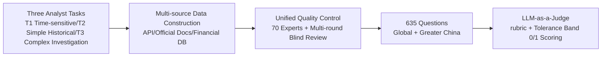

# FinSearchComp: Towards a Realistic, Expert-Level Evaluation of Financial Search and Reasoning

**Conference**: ICLR 2026  
**OpenReview**: [https://openreview.net/forum?id=8AJbbbe2ni](https://openreview.net/forum?id=8AJbbbe2ni)  
**Code**: GitHub / HuggingFace open-sourced (provided in the paper)  
**Area**: LLM Evaluation / Financial Search Agent Benchmark  
**Keywords**: Financial Search, Agent Evaluation, Time-sensitive Data, End-to-end Agent, LLM-as-a-Judge  

## TL;DR
FinSearchComp is the first fully open-source, end-to-end open-domain financial search and reasoning agent benchmark. It comprises 635 analyst tasks across Global and Greater China markets annotated by 70 financial experts. Evaluations of 21 models reveal that the strongest, Grok 4 (web), still lags behind human experts by 6.1 percentage points.

## Background & Motivation
**Background**: Search has become core infrastructure for LLM agents, and finance serves as an ideal testbed for evaluating search and knowledge reasoning capabilities. Analysts perform multi-step retrieval, verification, and synthesis daily on highly time-sensitive and professional data.

**Limitations of Prior Work**: Existing financial QA benchmarks (FinQA, ConvFinQA, FinanceQA, BizFinBench, etc.) almost all **pre-collect context**, bypassing open-domain search and tool calls. Consequently, they fail to measure real-world retrieval capabilities and deviate from actual analyst workflows. A few providing end-to-end evaluation (e.g., Finance Agent Benchmark) are limited to custom systems and use historical data—allowing models to succeed via **rote memorization** rather than real-time retrieval.

**Key Challenge**: Constructing "realistic, complex, and reliable" financial search tasks requires deep professional expertise. Furthermore, **time-sensitive data is extremely difficult to evaluate** (answers change constantly, API latency exists, and different sources have rounding discrepancies), leading to a long-standing absence of open financial search datasets.

**Goal**: To build the first fully open-source, end-to-end open-domain financial search benchmark covering time-sensitive data, accurately reproducing analyst workflows and providing a reproducible evaluation framework.

**Key Insight**: The combination of **task design aligned with analyst workflows**, **intensive expert annotation with multi-stage quality control**, and **rubric-guided LLM-as-a-Judge tolerance evaluation** ensures the benchmark is realistic, reliable, and reproducible.

## Method

### Overall Architecture
FinSearchComp revolves around "Three Task Categories → Multi-source Data Construction → Unified Quality Control → Tolerance Evaluation." The three tasks range from easy to difficult, corresponding to real-time data acquisition, targeted historical queries, and cross-period complex investigations. Each category uses different data construction pipelines but shares a unified quality control process. Finally, a rubric-guided LLM judge provides 0/1 scores within a tolerance band.

### Key Designs

**1. Three-layer Task Family: Decomposing analyst workflows into an increasing retrieval-reasoning gradient**. FinSearchComp defines three task categories corresponding to core daily analyst activities. **T1 Time-sensitive data acquisition** (e.g., IBM's latest closing price) has a retrieval depth of 1 and a time span of 1 day. it tests rapid retrieval and verification under strict time constraints, with challenges in freshness, calendar alignment, and ticker alias/conflict resolution. **T2 Simple historical queries** (e.g., Starbucks' total assets on 2020-09-27 were $\$29374.5M$) are targeted factual queries, where difficulties lie in reporting cycles (FY/TTM/Quarterly), data restatements, and unit/currency consistency. **T3 Complex historical investigation** (e.g., the largest single-month gain of S&P 500 between 2010-2025 = 2020-04, $+12.68\%$) requires $>1$ multi-hop retrieval across 184 months, with unit normalization and corporate action adjustments. These form a monotonically increasing difficulty gradient from T1 to T3, confirmed by experimental results showing a corresponding performance decline across all models.

**2. Intensive Expert Annotation + Multi-stage QC to ensure reliability**. The dataset was completed by 70 financial experts (50 annotators + 20 senior arbitrators), all holding advanced finance degrees and hailing from institutions like Citadel, JPMorgan, and CITIC Securities, totaling approximately 240 expert hours. Quality control has four lines of defense: selection of reliable data sources (official documents, government sites, professional databases) combined with multi-source cross-validation; **disambiguation strategies** to avoid inconsistent metrics (e.g., split-adjusted prices), explicit definition standards (Static PE vs. PE TTM), and setting numerical interval answers for metrics prone to retroactive revision; and **blind review verification**—after an expert creates a question, 1-2 other experts solve it independently without seeing the answer. Senior experts arbitrate discrepancies, modifying or rejecting questions where necessary.

**3. Rubric-guided LLM-as-a-Judge Tolerance Evaluation to address the difficulty of evaluating time-sensitive data**. Because answers change dynamically and contain minor reasonable fluctuations (revisions, rounding), the authors employ an LLM judge rather than a fixed standard answer. Scoring uses a 0-1 error metric. The judge function $J(A, R)$ returns 1 if the candidate answer $A$ satisfies the predefined rubric $R$, and 0 otherwise. The final score is $S(A, R) = J(A, R)$. To tackle T1's three time-sensitivity challenges (time difference between response and evaluation, API data latency, and inability to query price at a specific second), evaluations are initiated **after market close**, with differentiated tolerance bands set by asset class (stocks, forex). In manual audits of approximately 400 instances, the LLM judge achieved ~95% agreement with human labels (T1 ≈ 91.5%, T2 ≈ 96%, T3 ≈ 97-99.8%), validating the reliability of the evaluation protocol.

## Key Experimental Results

### Main Results (Average T1 Time-sensitive Task Scores, Selected Top Models)

| Model | Global Subset | Greater China Subset |
|------|---------------|----------------------|
| Human Performance | 100.0 | 100.0 |
| Grok 4 (web) | 87.3 | 84.7 |
| GPT-5-T (web) | 76.9 | 81.1 |
| DouBao (web) | 59.0 | **88.3** |
| YuanBao-R1 (web) | 56.0 | 82.0 |
| HunYuan-T1 (web) | 53.0 | 84.7 |

Overall: On the Global subset, Grok 4 (web) leads with 68.9%, outperforming the runner-up GPT-5-Thinking (web) by 5.0pp, yet still lagging behind human experts by 6.1pp. On the Greater China subset, DouBao (web) leads, with all models lagging behind humans by over 34pp.

### Ablation Study (Gains from Search / Financial Plugins)

| Configuration | T1 | T2 | T3 |
|------|----|----|----|
| Avg. Gain: No Search → With Search | +40.8 | +29.0 | +8.1 |
| DeepSeek-R1: web → YuanBao Financial Plugin (T1) | +31.9 | — | — |

Without search, all models score 0 on T1 (inability to access real-time data). For T2/T3, models rely on pre-trained parametric memory to achieve non-zero but very low scores due to facts being outdated or misaligned.

### Key Findings
- **Finding 1**: Task difficulty increases monotonically from T1 to T3, with all model performances declining accordingly, verifying that T3's multi-hop retrieval, temporal reasoning, and entity disambiguation are indeed harder.
- **Finding 2**: Grok 4 and GPT-5-Thinking approach expert levels on the Global subset, with their advantage increasing as difficulty rises (peaking at T3), suggesting their strength lies in multi-step reasoning, temporal alignment, and entity disambiguation rather than simple retrieval.
- **Significant Regional Effects**: The "nationality" of models and tools significantly impacts performance—Chinese models lead substantially on the Greater China subset, reflecting differences in training corpora coverage and retrieval infrastructure.
- **Financial Plugins > General Search**: Specialized plugins directly connected to real-time/historical financial data provide a 31.9pp improvement on T1.

## Highlights & Insights
- **The first fully open-source end-to-end financial search benchmark**, filling the gap in testing "both open-domain search and knowledge reasoning," with tasks directly aligned with real analyst workflows rather than artificial puzzles.
- **Deep expert involvement** is the primary barrier: 70 front-line financial experts, ~240 expert hours, and blind arbitration make this benchmark difficult to replicate at low cost or "game" through shortcuts.
- **Diagnostic value of failure mode analysis**: The paper categorizes recurring failure modes such as shallow search, stale/misaligned temporal evidence, cross-unit/currency aggregation errors, and report calendar misalignment (e.g., mistaking opening price for closing price, or over-complicating simple queries like "Market Cap" into multi-step processes). These provide clear targets for future improvements.

## Limitations & Future Work
- **Fixed Evaluation Window** (2025-08-01 to 08-20): T1 answers change with the market. Reproducibility relies on snapshots rather than real-time data; long-term use requires re-collecting time-sensitive answers.
- **Reliance on LLM Judge**: Despite 95% human agreement, biases in the judge model and rubric design may still introduce errors in edge cases.
- **Scope of Coverage**: Currently focused on Global (Western) and Greater China subsets across 10 topics; emerging markets, derivatives, and alternative data are not yet covered.
- The paper primarily diagnoses failure modes without proposing solutions. How to teach agents to "call professional plugins, align timelines, and resolve conflicting evidence" remains an open question for the community.

## Related Work & Insights
- **Difference from General Browsing Benchmarks**: Benchmarks like BrowseComp only test multi-step navigation to find short verifiable facts, avoiding long-document synthesis, disambiguation, and domain knowledge. FinSearchComp emphasizes multi-source evidence integration and time-sensitivity, closer to knowledge-intensive decision-making.
- **Difference from Financial QA**: FinQA/ConvFinQA/MultiFinBen/BizFinBench all provide pre-set contexts and bypass search. FinSearchComp is end-to-end and open-domain, requiring real tool calls.
- **Inspiration**: This work demonstrates a paradigm of "Deep Expert Involvement + Time-sensitive Tolerance Evaluation," which can be transferred to other knowledge-work domains requiring time-sensitive retrieval and multi-source verification, such as news monitoring, policy tracking, clinical trials, and climate science.

## Rating
- **Novelty**: ⭐⭐⭐⭐ First fully open-source end-to-end benchmark with time-sensitive data, filling a genuine gap; significant innovation in task design and evaluation protocol.
- **Experimental Thoroughness**: ⭐⭐⭐⭐ Evaluated 21 models (web products + APIs), including human baselines, search/plugin ablations, cross-task and cross-market analysis, and human consistency verification for the LLM judge.
- **Writing Quality**: ⭐⭐⭐⭐ Clear motivation, distinct three-layer structure (tasks/QC/evaluation), and actionable failure mode analysis.
- **Value**: ⭐⭐⭐⭐ Fully open-source data and framework with direct value for financial agent research. High barrier to entry for annotation makes it resilient to benchmark saturation.

<!-- RELATED:START -->

## Related Papers

- [\[ICLR 2026\] ExpertLongBench: Benchmarking Language Models on Expert-Level Long-Form Generation Tasks with Structured Checklists](expertlongbench_benchmarking_language_models_on_expert-level_long-form_generatio.md)
- [\[ICLR 2026\] DRBench: A Realistic Benchmark for Enterprise Deep Research](drbench_a_realistic_benchmark_for_enterprise_deep_research.md)
- [\[ACL 2026\] K-MetBench: A Multi-Dimensional Benchmark for Fine-Grained Evaluation of Expert Reasoning, Locality, and Multimodality in Meteorology](../../ACL2026/llm_evaluation/k-metbench_a_multi-dimensional_benchmark_for_fine-grained_evaluation_of_expert_r.md)
- [\[ACL 2026\] Aggregate vs. Personalized Judges in Business Idea Evaluation: Evidence from Expert Disagreement](../../ACL2026/llm_evaluation/aggregate_vs_personalized_judges_in_business_idea_evaluation_evidence_from_exper.md)
- [\[ICLR 2026\] ChemEval: A Multi-level and Fine-grained Chemical Capability Evaluation for Large Language Models](chemeval_a_multi-level_and_fine-grained_chemical_capability_evaluation_for_large.md)

<!-- RELATED:END -->
