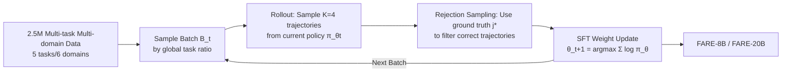

# Foundational Automatic Evaluators: Scaling Multi-Task Generative Evaluator Training for Reasoning-Centric Domains

**Conference**: ICLR 2026  
**OpenReview**: [https://openreview.net/forum?id=89Ei7PVpNl](https://openreview.net/forum?id=89Ei7PVpNl)  
**Code**: To be confirmed  
**Area**: LLM Evaluation / Generative Evaluator / Reward Models  
**Keywords**: Automatic Evaluator, LLM-as-Judge, Generative Reward Model, Multi-task Training, Rejection Sampling SFT, Reasoning Verification  

## TL;DR
This paper takes a counter-intuitive approach—rather than chasing new methods like RL, it pushes "data scaling" to the extreme. By meticulously curating 2.5 million training samples across 5 evaluation tasks and multiple reasoning domains, the authors use simple and stable iterative Rejection Sampling SFT to train the FARE series evaluators (8B and 20B). FARE-8B challenges larger RL-specific evaluators, while FARE-20B surpasses 70B+ open-source evaluators. They demonstrate significant efficacy in real-world downstream scenarios such as re-ranking, RL verification, and domain-specific continued training.

## Background & Motivation
**Background**: LLMs have permeated the evaluation phase of the entire model development lifecycle—acting as judges for benchmarks, generative reward models for preference optimization, and as verifiers/critics during inference. Different scenarios require distinct evaluation capabilities: alignment requires pairwise comparison; monitoring output needs step-level fine-grained error detection; and RL training requires reward signals in "unverifiable domains" beyond mathematics. Simultaneously, the domains requiring evaluation are expanding explosively (from math to general reasoning and agent tool tracking).

**Limitations of Prior Work**: The open-source automatic evaluation community has failed to simultaneously satisfy the requirements of "multi-task + multi-domain." Instead, research has clustered around training **task-specific evaluators with small data scales**. Recent works have mostly focused on methodological innovation (such as applying RLVR to evaluator training), but RLVR is computationally expensive and the training pipelines are fragile, leading these evaluators to typically be trained on small datasets for single tasks.

**Key Challenge**: Evaluators must be both "flexible" (switching evaluation capabilities based on settings) and "general" (maintaining performance across domains). However, the mainstream route (RL/online training) is naturally difficult to scale, while the traditional teacher-model distillation SFT introduces **distribution shift** (inconsistency between the teacher model and the policy model distributions, where teacher selection heavily influences downstream performance).

**Goal**: To prove that "simple data scaling" rather than "fancy methodology" is the correct path for training foundation evaluators—creating evaluators that are both comprehensive and high-performing, while maintaining **efficiency** (low latency, suitable for re-ranking/RL rollout verification).

**Core Idea**: **[Data-Driven]** Expand training data from the 20k–60k samples of recent works to **2.5 million samples**, covering 5 types of tasks and 6 major domains; **[Semi-Online Training]** Use iterative Rejection Sampling SFT (RS-SFT) to replace teacher distillation and RL—fine-tuning by sampling correct evaluation trajectories from the policy model itself. This avoids teacher distribution shift while maintaining lightweight and stable weight updates, allowing for stable scaling to millions of samples.

## Method

### Overall Architecture
FARE formalizes the automatic evaluator as a mapping $\pi_\theta: \mathcal{X} \to \mathcal{Y}$, where the input $x=(p,q,R)$ (evaluation protocol $p$, original question $q$, set of candidate responses $R$) and the output $y=(c,j)$ (natural language critique $c$ and final judgment $j$). The entire pipeline is divided into two parts: first, **large-scale multi-task data curation** (real + synthetic data, 2.5 million samples), and then using **iterative Rejection Sampling SFT** to train a post-trained LLM (Qwen3-8B-Base / gpt-oss-20B) into an evaluator through rolling batch training.

### Key Designs

**1. Multi-task Multi-domain Data Curation: Completing the evaluation capability map with "Existing + Synthetic" data.** FARE deconstructs evaluation into 5 types of tasks—pairwise comparison, step-level error localization, reference-based verification, reference-free verification, and single-rating scoring, covering 6 domains: math, code, tool use, dialogue, general reasoning, and safety. Data comes from two sources: **Existing data** (1.4M) taken from verified evaluators/preference datasets, converting RLHF and DPO preference pairs into pairwise samples, and converting correct/incorrect responses in objective domains (like math) into verification samples with hand-written rubrics. Finding that existing data had three weaknesses (low verification task ratio, pairwise data favoring dialogue over reasoning, and a lack of new challenging data), the authors added **synthetic data** (43.2%): first, **programmatic error injection** (e.g., injecting type errors, redundant parameters, or syntax errors into correct function calls); second, **generate-then-grade**—for a question $q$ with a verifiable truth $a$, using 12 generators from 6 model families to sample up to 20 responses each, then constructing verification and pairwise samples based on correctness to inject diverse response distributions and cutting-edge reasoning challenges. The final ratio is approximately 33% pairwise, 24% step-level, 18.4% ref-based verification, 13.1% ref-free verification, and 11.4% single-rating.

**2. Iterative Rejection Sampling SFT (RS-SFT): Semi-online training combining the best of two paradigms.** Evaluator training data typically only contains the ground truth judgment $j^\star$ without the ground truth critique $c^\star$. Thus, past approaches relied on teacher distillation (distribution shift) or RL (expensive and fragile). FARE uses semi-online RS-SFT: partitioning $N$ samples into fixed-size $N_{\text{rollout}}$ disjoint rollout batches $B_t$. Initializing $\pi_{\theta_0}$ from an existing post-trained LLM, it repeatedly executes for $t=0,\dots,T-1$: **Rollout**: sample $K=4$ responses from the current policy $\pi_{\theta_t}$ for $x_{i,t}$ (temperature 0.9); **Rejection Sampling**: use ground truth $j^\star_{i,t}$ to judge each trajectory, randomly keeping one correct trajectory to form $D_t$, or discarding the sample if no correct response exists; **Policy Update**:

$$\theta_{t+1}=\arg\max_\theta \sum_{(x,y)\in D_t}\log \pi_\theta(y\mid x)$$

Since the answer space for evaluation is a **closed discrete vocabulary** (A/B for pairwise, yes/no for verification), correctness can be determined directly by ground truth, **obviating the need for an external reward model** to rank samples—this is the key difference from STaR/RAFT (STaR re-initializes each round and samples greedily, while RAFT depends on an external reward model). Each $B_t$ samples unseen data according to the global task ratio, ensuring consistent task mixing. This design of "sampling correct trajectories from the policy itself + lightweight SFT updates" avoids teacher distribution shift and allows stable scaling to millions of samples.

**3. Direct Judgment Data + Continuous Curriculum: Optimizing efficiency and hard tasks on top of scaling.** To isolate judgment signals and support low-latency inference, the authors convert a **fixed proportion** of samples in $D_t$ into **direct judgment data**—discarding the generated critique $c$ and rewriting the protocol $p$ so the model directly outputs judgment $j$, allowing FARE to be prompted to "omit critique" for faster inference. Additionally, a **batch-wise continuous curriculum** is introduced: calculating the pass rate for $K=4$ rollouts for each $(x,y)\in D_t$ and sorting them in descending order—samples with 4/4 correct are updated first, while those with 1/4 are updated last. This curriculum has negligible impact on pairwise domains but shows significant gains for step-level evaluation. For the base models, FARE-8B starts from Qwen3-8B-Base (finding post-trained versions "over-trained," they used Qwen2.5-32B-Instruct SFT data to cold-start it into Qwen3-8B-ColdStart), and FARE-20B starts from gpt-oss-20B (20B total parameters, 3.6B active).

## Key Experimental Results

### Main Results
Covering three core benchmarks: pairwise, step-level, and ref-based verification (abridged):

| Model | JudgeBench | RJB | RM-Bench | When2Call | ProcessBench(Overall) | VerifyBench-Hard |
|---|---|---|---|---|---|---|
| RM-R1-14B | 46.86 | 43.70 | 79.6 | 19.89 | – | – |
| CompassJudger-14B | 50.29 | 37.69 | 77.7 | 44.56 | – | – |
| **FARE-8B** | **55.71** | **51.05** | 79.2 | **80.33** | 63.5 | 78.40 |
| EvalPlanner-70B | 56.60 | – | 82.1 | – | – | – |
| J1-70B | 60.00 | – | 82.7 | – | – | – |
| gpt-oss-120B | 70.29 | 58.26 | 92.0 | 70.00 | 83.5 | 88.30 |
| **FARE-20B** | **64.29** | **57.05** | **90.5** | 76.67 | **84.4** | 85.10 |
| GPT-5 | 84.86 | 79.57 | 93.8 | 75.78 | 84.6 | 90.50 |

- FARE-8B is the strongest small-scale evaluator: achieving 13.71 and 6.57 absolute percentage points higher than J1-8B and RM-R1-14B respectively on JudgeBench.
- FARE-20B uses 3.5× fewer total parameters and nearly 20× fewer active parameters to surpass 70B-grade dense evaluators; it nearly matches GPT-5 on ProcessBench (84.4 vs 84.6) and shows the greatest advantage on the hardest benchmarks like OlympiadBench and OmniMATH.

### Ablation Study

| Ablation Dimension | Finding |
|---|---|
| Direct Judgment Ratio | Including an appropriate amount of direct judgment data isolates the judgment signal and supports "critique-free" acceleration. |
| Continuous Curriculum | Impacts on pairwise are negligible, but improvements for step-level evaluation are significant. |
| Test-time Scaling (SC@32) | Self-consistency voting brings extra gains; the gap between FARE-8B/20B and baselines widens with more votes. |

### Key Findings
- **Downstream Re-ranking**: Acting as a test-time reranker, FARE-20B achieves near-oracle re-ranking performance on MATH.
- **RL Verifier**: As a verifier for general domain RL training, FARE improves downstream RL model performance by up to **14.1%** compared to string-match verifiers.
- **Domain Continued Training**: Continued training from a FARE initialization to create FARE-Code results in **65%** higher performance in test-case quality evaluation compared to gpt-oss-20B.

## Highlights & Insights
- **A powerful counterexample to "Method > Data"**: In a field dominated by RL discourse, the authors prove with a simple iterative RS-SFT + large-scale data that scaled data + stable training can beat specialized RL evaluators with a much simpler pipeline.
- **Leveraging the verifiability of evaluation tasks**: The answer space for evaluation is closed and discrete, allowing rejection sampling to judge correctness directly via ground truth. This eliminates the need for RAFT-style external reward models, making "semi-online" both cheap and stable.
- **Efficiency as a first-class citizen**: Deliberately choosing base models with no/minimal CoT, avoiding having the evaluator generate reference answers (which degrades "evaluation" into harder "generation" and causes performance collapse when references are wrong), and providing a direct judgment mode—all serve low-latency deployment.
- **Downstream Transferability**: Beyond brushing static benchmarks, verification in three real-world downstream scenarios proves that FARE is an excellent initialization point for continued training.

## Limitations & Future Work
- **Still within the SFT paradigm**: Although the authors eschew RL, it remains to be seen whether pure RS-SFT reaches the upper bound in unverifiable domains that require fine-grained preference shaping.
- **Dependence on ground truth judgment**: The "reward-model-free" advantage of rejection sampling relies on evaluation tasks having closed discrete ground truths; it is not directly applicable to truly subjective or open-ended evaluations lacking an objective $j^\star$.
- **Data curation cost**: 2.5 million multi-task multi-domain samples + the "generate-then-grade" process with 12 generators involves massive engineering, setting a high barrier for reproduction.
- **Gap with cutting-edge closed models**: While FARE-20B matches GPT-5 on ProcessBench, a significant gap remains on pairwise reasoning benchmarks like JudgeBench.

## Related Work & Insights
- **Foundation Evaluator Lineage**: Following the route of "large-scale multi-protocol offline training" by Vu et al., Wang et al., and Cao et al., the idea stems from multi-task learning (T0/T5/FLAN)—data scaling brings cross-task generalization.
- **Self-Taught Evaluator (STE) / EvalPlanner**: These are closest to this work, but STE uses STaR-style policy re-initialization and only samples a few seed problems in-the-loop, making it hard to scale to other tasks like step-level. FARE breaks this limit using unified multi-task batches + rolling SFT without re-initialization.
- **STaR / RAFT / RS-SFT**: The method skeleton is adapted from these rejection sampling/self-training algorithms; the key innovation is using evaluation verifiability to remove the reward model.
- **Insight**: When a subtask's "answer space is naturally verifiable," semi-online rejection sampling SFT may be a more stable and scalable choice than RL; decoupling "evaluation" from "generation" and insisting that evaluators only judge rather than write references is a practical principle for maintaining robustness and efficiency.

## Rating
- Novelty: ⭐⭐⭐⭐ — The method itself is simple (RS-SFT is not new), but the stance of "Data Scaling > Methodology," the use of verifiability to bypass reward models, and merging multi-tasks into unified rolling training present clear synthesis-level novelty.
- Experimental Thoroughness: ⭐⭐⭐⭐⭐ — 7 core benchmarks + 3 downstream scenarios, including multiple size baselines, PRM comparisons, test-time scaling, and curriculum/direct-judgment ablations.
- Writing Quality: ⭐⭐⭐⭐ — Clear formalization, well-explained motivation and desiderata, and high information density in tables/figures.
- Value: ⭐⭐⭐⭐⭐ — An open-source SOTA evaluator where 20B surpasses 70B+; provides a real 14.1% gain in RL verification, offering direct tool value to the training/evaluation ecosystem.

<!-- RELATED:START -->

## Related Papers

- [\[ICLR 2026\] MLE-Smith: Scaling MLE Tasks with Automated Multi-agent Pipeline](mle-smith_scaling_mle_tasks_with_automated_multi-agent_pipeline.md)
- [\[ICLR 2026\] AutoMetrics: Approximate Human Judgments with Automatically Generated Evaluators](autometrics_approximate_human_judgments_with_automatically_generated_evaluators.md)
- [\[ACL 2025\] MARS: Benchmarking the Metaphysical Reasoning Abilities of Language Models with a Multi-task Evaluation Dataset](../../ACL2025/llm_evaluation/mars_benchmarking_the_metaphysical_reasoning_abilities_of_language_models_with_a.md)
- [\[ICLR 2026\] LiveResearchBench: A Live Benchmark for User-Centric Deep Research in the Wild](liveresearchbench_a_live_benchmark_for_user-centric_deep_research_in_the_wild.md)
- [\[ICLR 2026\] CatalystBench: A Comprehensive Multi-Task Benchmark for Advancing Language Models in Catalysis Science](catalystbench_a_comprehensive_multi-task_benchmark_for_advancing_language_models.md)

<!-- RELATED:END -->
