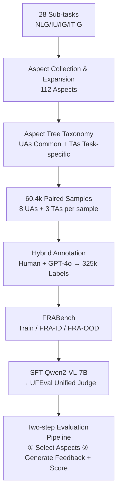

# FRABench and UFEval: Unified Fine-grained Evaluation with Task and Aspect Generalization

**Conference**: ICLR 2026  
**OpenReview**: [https://openreview.net/forum?id=7WdY3Cojy9](https://openreview.net/forum?id=7WdY3Cojy9)  
**Code**: TBD  
**Area**: MLLM Evaluation / Fine-grained Evaluation / Multimodal Judge Models  
**Keywords**: MLLM-as-a-Judge, Fine-grained Evaluation, Aspect Generalization, Task Generalization, Evaluation Benchmark, DPO Preference Alignment  

## TL;DR
The authors propose a hierarchical "Aspect Tree" covering 112 evaluation aspects and construct FRABench, a fine-grained evaluation dataset with 60.4k pairs and 325k labels spanning four task categories: text generation, image understanding, image generation, and interleaved image-text generation. They further train UFEval, the first unified judge model with dual "task + aspect" generalization capabilities. The core thesis is that evaluation aspects are naturally interconnected, and joint multi-task learning yields synergistic gains.

## Background & Motivation
**Background**: "MLLM-as-a-Judge" (using large models as judges to score open-ended outputs) has become the mainstream paradigm for evaluating the generation quality of multimodal models. This has evolved from coarse-grained holistic scoring (e.g., ImageReward, Auto-J) to fine-grained multi-aspect evaluation (e.g., Themis, LLaVA-Critic, VisionReward).

**Limitations of Prior Work**: Existing judge models face two rigid constraints. First is **aspect limitation**—they are trained on specific evaluation aspects (e.g., fluency for text, quality for images) and fail when encountering unseen aspects. Second is **task/modality limitation**—a model typically serves a single task or modality (either NLG or image generation), with extremely narrow coverage. As shown in Table 1, the previously most versatile model, Auto-J, only supports NLG, while VisionReward covers only 37 aspects of image generation.

**Key Challenge**: To create a unified judge capable of evaluating "any task and any aspect," large-scale, multimodal, aspect-level annotated training resources are essential. However, such data did not exist, as existing datasets almost exclusively provide labels for "overall quality" rather than fine-grained aspects. This resource gap has been the bottleneck for training unified evaluators.

**Goal**: To first bridge the data gap by creating FRABench, and then use it to train a unified fine-grained judge (UFEval) capable of generalizing across four task types and various aspects.

**Key Insight**: **[Evaluation aspects are inherently interconnected and generalizable]** The authors argue that evaluation aspects share internal correlations—for example, engagement, naturalness, and creativity are semantically similar; learning one can transfer to unseen aspects. **[Multi-task joint learning provides synergistic gains]** Learning multiple visual tasks/aspects simultaneously promotes mutual improvement; for instance, learning object alignment in image captioning helps assess character consistency in multi-image scenarios. These two hypotheses form the foundation of the paper.

## Method

### Overall Architecture
The method consists of two major parts: first, building a hierarchical "Aspect Tree" (taxonomy) by consolidating 112 aspects through literature review and cross-task migration, and then constructing the FRABench dataset using mixed "Human + GPT-4o" annotation based on selected relevant aspects for each sample. Finally, UFEval is developed by performing SFT on a Qwen2-VL-7B backbone using this data. The evaluation follows a two-step pipeline: "select aspects, then score."

### Key Designs

**1. Hierarchical "Aspect Tree": Organizing 112 discrete aspects into common vs. task-specific subtrees.** The authors initially collected existing evaluation aspects from 28 sub-tasks under four major categories (covering all six combinations of text/image-text input $\times$ text/image/image-text output). For tasks with scarce aspects like Interleaved Text-Image Generation (ITIG), they used cross-task migration—e.g., since both story generation (NLG) and visual story completion (ITIG) involve narrative, aspects like "engagingness" were adapted. The tree uses "overall" as the root, branching into **Universal Aspects (UAs)**—which are task-agnostic and measure output quality based on modality (e.g., fluency for text, fidelity for images)—and **Task-specific Aspects (TAs)**—which are tied to task completion (e.g., engagingness for story generation, accuracy for mathematical reasoning). For aspects without existing hierarchies, a **bidirectional matching strategy** was used: if a name appeared in an existing node's definition, it became a child node; conversely, if a root name appeared in the aspect's definition, the aspect was moved up as a parent. Unmatched aspects were set as new roots to avoid misclassification.

**2. Pairwise Fine-grained Dataset Construction: Multi-aspect tagging with hybrid annotation for cost and bias control.** FRABench utilizes pairwise comparison rather than pointwise scoring, as pointwise is more susceptible to context bias and pairwise is better suited for reward model training. The process started by generating paired responses for questions across 28 sub-tasks—29.3k from public datasets and 30.1k generated using various MLLMs—then assigning an average of **8 UAs + 3 TAs** to each pair based on the aspect tree. Labels were sourced in two ways: some reused human annotations from ImageRewardDB (with GPT-4o adding feedback), while most missing human labels were annotated via GPT-4o. Two engineering details were critical: when evaluating UAs, **only the response was provided without the original query**, as GPT often conflates "correctness" with general quality; to mitigate position bias, half of the response positions in the majority class samples were swapped and re-labeled to balance the "Response 1 > Response 2" samples. The result is **325k** fine-grained labels.

**3. Task/Aspect Dual-axis OOD Split: Validating "two types of generalization."** To rigorously test generalization, FRABench was divided into a training set, an in-distribution test set (FRA-ID), and an out-of-distribution test set (FRA-OOD). The split was carefully designed along the "seen/unseen" axes: training and FRA-ID used 18 randomly selected sub-tasks covering 22 UAs + 35 TAs. **FRA-OOD consisted of 10 entirely unseen sub-tasks, containing both 28 seen UAs (to test task generalization) and 27 unseen TAs (to test aspect generalization)**. This allowed for the clean separation of variables. Additionally, extra human annotations were collected for FRA-ID-H and FRA-OOD-H (6.9k/6.0k) as gold standards for human alignment.

**4. SFT Unified Judge + Two-step Evaluation Pipeline.** UFEval uses Qwen2-VL-7B-Instruct as a base and undergoes SFT on the training set. During inference, it follows two steps: first, it selects appropriate aspects from the TAs and UAs trees based on task attributes and output modality (e.g., if a prompt asks for a "cat next to an orange dog" but there is no cat, a hallucination aspect like "Context Inconsistency" is triggered; if the output is text, text-branch aspects are selected from UAs). Then, it generates feedback and scores for the selected aspects. This design allows the model to flexibly adapt to any task-aspect combination.

## Key Experimental Results

### Main Results (OOD Generalization, Average Accuracy, Excerpt from FRA-OOD-H)

| Method | Task Generalization (NLG/IU/IG/ITIG) | Aspect Generalization (NLG/IU/IG/ITIG) |
|------|------|------|
| GPT-4o | 84.0 / 82.1 / 72.3 / 93.1 | 83.2 / 82.1 / 74.2 / 93.1 |
| Claude-3.5 | 83.0 / 76.5 / 63.1 / 91.0 | 82.6 / 76.5 / 65.1 / 91.0 |
| Qwen2VL-72B | 78.3 / 75.3 / 48.6 / 83.7 | 77.3 / 75.3 / 53.8 / 83.7 |
| Qwen2VL-7B (Base) | 50.9 / 65.9 / 40.9 / 44.3 | — |
| **UFEval (Ours, 7B)** | **79.0 / 80.9 / 62.1 / 90.6** | **78.3 / 80.9 / 66.1 / 90.6** |

The 7B UFEval approaches or matches GPT-4o/Claude-3.5 on most tasks, significantly outperforming the original Qwen2VL-7B base, validating its dual generalization capabilities.

### Ablation Study (Multi-task Synergistic Gains / DPO Applications)

| Experiment | Configuration | Results |
|------|------|------|
| Multi-task Synergy (IU Eval) | IU-only vs. Joint IU+IG | Joint training yielded higher overall accuracy |
| IU Model DPO (LLaVA-Next-7B, MMHal↑) | Baseline 2.05 / LLaVA-Critic 2.24 / **UFEval 2.41** | UFEval generated preference data yielded best alignment |
| IG Model DPO (SDXL, HPSv2↑) | Baseline 28.1 / Pick-a-Pic 28.7 / **UFEval 29.9** | Outperformed human dataset Pick-a-Pic |

### Key Findings
- **Aspect Generalizability**: UFEval maintains high accuracy on unseen TAs, supporting the core hypothesis of "interconnected aspects $\rightarrow$ transferability."
- **Multi-task Synergy**: Jointly learning IU and IG is more accurate than learning IU alone, confirming mutual gains across multiple visual tasks/aspects.
- **Downstream Utility**: Preference data automatically constructed by UFEval for DPO outperformed LLaVA-Critic and Pick-a-Pic in image understanding (MMHal, LLaVABench) and generation (HPSv2, ImageReward), proving it is a high-quality tool for producing preference data.

## Highlights & Insights
- **Modeling Aspects as First-class Citizens**: Systematically organizing 112 aspects into a UA/TA dual-tree hierarchy and distinguishing "output quality" from "task completion" is a valuable asset in itself.
- **Sophisticated OOD Split Design**: Testing task and aspect generalization separately prevents the confounding of variables where both might influence results simultaneously.
- **Precision in Engineering**: Intentional exclusion of the query when evaluating UAs (to prevent correctness from polluting quality judgments) and position-swap balancing are effective labeling quality controls.
- **Dual Functionality**: The judge model directly feeds back into alignment (DPO), bridging the gap between "evaluator" and "reward data generator."

## Limitations & Future Work
- **GPT-4o Label Dependency**: The majority of the 325k labels were generated by GPT-4o (with human labels only for three aspects), meaning the judge's upper bound is somewhat constrained by GPT-4o's preferences.
- **7B Model Capacity**: UFEval is based on Qwen2-VL-7B; a noticeable gap remains between it (62.1) and GPT-4o (72.3) on difficult tasks like image generation.
- **Manual Taxonomy Construction**: While matching rules were used for the aspect tree, human judgment was still involved, leaving space for discussions on objectivity and reproducibility.
- **Pairwise Paradigm**: While pairwise comparison avoids pointwise bias, real-world deployment often requires absolute scores; the conversion from pairwise to absolute scoring was not fully explored.

## Related Work & Insights
- **Coarse-grained Single-task Evaluation**: PandaLM, Auto-J, and ImageReward provide holistic scores but lack the granularity to diagnose specific flaws and are prone to aspect bias.
- **Fine-grained Single-task Evaluation**: Themis (NLG), LLaVA-Critic (IU), and VisionReward (IG) have moved toward multi-aspect assessment but have poor cross-task/cross-aspect scalability; X-Eval explored aspect generalization but focused solely on NLG and is not open-source.
- **Inspiration**: The most valuable takeaway is the approach of "building a structured taxonomy of evaluation dimensions first, then organizing training data accordingly." This transforms "evaluation generalization" from an abstract concept into a measurable engineering problem. The UFEval-to-DPO loop also suggests that a unified judge can be the core engine of a data flywheel.

## Rating
- **Novelty**: ⭐⭐⭐⭐ The first unified multimodal judge with dual "task + aspect" generalization. The combination of aspect tree taxonomy and dual-axis OOD splitting is innovative and supported by experiments.
- **Experimental Thoroughness**: ⭐⭐⭐⭐ Covers OOD generalization across four tasks, multiple public as-a-Judge benchmarks, multi-task synergy ablation, and downstream DPO applications; however, absolute performance on IG tasks is relatively weak.
- **Writing Quality**: ⭐⭐⭐⭐ Logical flow from hypothesis to data, model, and validation. Table 1 clearly positions the work, and labeling details are well-documented.
- **Value**: ⭐⭐⭐⭐ FRABench (60.4k/325k) and the aspect tree are reusable community resources; the unified judge + preference generation paradigm has direct utility for multimodal alignment.

<!-- RELATED:START -->

## Related Papers

- [\[ICLR 2026\] Reliable Fine-Grained Evaluation of Natural Language Math Proofs](reliable_fine-grained_evaluation_of_natural_language_math_proofs.md)
- [\[ICLR 2026\] ChemEval: A Multi-level and Fine-grained Chemical Capability Evaluation for Large Language Models](chemeval_a_multi-level_and_fine-grained_chemical_capability_evaluation_for_large.md)
- [\[ACL 2026\] IF-Critic: Towards a Fine-Grained LLM Critic for Instruction-Following Evaluation](../../ACL2026/llm_evaluation/if-critic_towards_a_fine-grained_llm_critic_for_instruction-following_evaluation.md)
- [\[ACL 2026\] LoCar: Localization-Aware Evaluation of In-Vehicle Assistants through Fine-Grained Sociolinguistic Control](../../ACL2026/llm_evaluation/locar_localization-aware_evaluation_of_in-vehicle_assistants_through_fine-graine.md)
- [\[ACL 2026\] Rethinking Meeting Effectiveness: A Benchmark and Framework for Temporal Fine-grained Automatic Meeting Effectiveness Evaluation](../../ACL2026/llm_evaluation/rethinking_meeting_effectiveness_a_benchmark_and_framework_for_temporal_fine-gra.md)

<!-- RELATED:END -->
