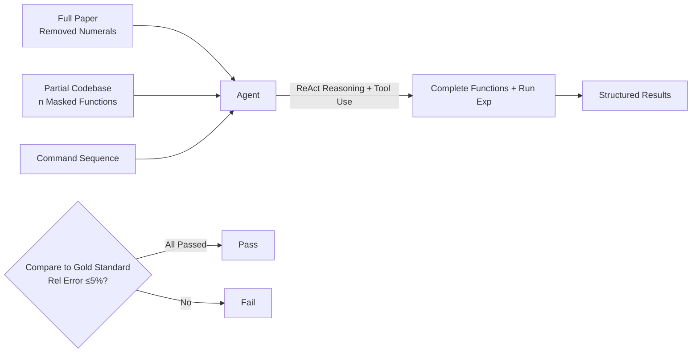

# From Reproduction to Replication: Evaluating Research Agents with Progressive Code Masking

**Conference**: ICLR 2026  
**OpenReview**: [https://openreview.net/forum?id=qBcHWGBnIb](https://openreview.net/forum?id=qBcHWGBnIb)  
**Code**: [https://github.com/j1mk1m/AutoExperiment](https://github.com/j1mk1m/AutoExperiment)  
**Area**: LLM Evaluation / Research Agent Benchmark / Code Generation  
**Keywords**: Research Agent, Experimental Reproduction, Progressive Code Masking, Pass@k, Interactive Agent, Test-time Computation  

## TL;DR
The AUTOEXPERIMENT benchmark is proposed: an Agent is provided with a paper, a codebase with several core functions "progressively masked," and execution commands. The Agent must complete the missing code, run experiments, and report results. By adjusting the number of masked functions $n$, the benchmark continuously interpolates between "reproduction" and "replication," quantifying the true capability boundaries of research Agents.

## Background & Motivation
- **Background**: Advances in autonomous code generation have sparked expectations for "AI Agents accelerating scientific discovery"—enabling Agents to run experiments and verify ideas independently. While many code generation benchmarks exist (HumanEval, MBPP, SWE-Bench, etc.) and research-oriented benchmarks have surfaced, they typically evaluate either "reproduction" (providing full code to run) or "replication" (writing code from scratch based only on paper text).
- **Limitations of Prior Work**: These benchmarks have **fixed** difficulty levels—either too simple (all code provided) or too difficult (no code provided), failing to characterize the continuous spectrum between the two. In reality, researchers often work with "partially usable code + paper descriptions" and must complete core logic on existing scaffolding.
- **Key Challenge**: There is a lack of a high-quality testbed that allows for **continuously adjustable difficulty** while ensuring strong correspondence between "paper description $\leftrightarrow$ code implementation." This prevents us from answering "to what extent Agents can independently implement scientific experiments."
- **Goal**: Construct a benchmark with controllable difficulty to quantify the performance decay of Agents across the "reproduction to replication" process, examining the impact of interactivity, test-time computation, and natural language context.
- **Core Idea**: **Progressive Code Masking**—starting from paper codebases verified by peer replication, $n$ core functions are progressively masked (replaced with `NotImplementedError`). Using $n$ as a difficulty "knob" unifies reproduction and replication into a continuous spectrum.

## Method

### Overall Architecture
Each task in AUTOEXPERIMENT contains three inputs: the full paper (with all **numerical results removed** to prevent cheating), a codebase with $n$ key functions masked, and a sequence of commands to run the experiment. The Agent must complete missing functions in a Docker sandbox, execute commands, and report experimental values in a structured format. Evaluation compares reported results with the "Gold Standard" output from the original code; a test case passes if the relative error is $\le 5\%$, and a sample is considered "Pass" only if all test cases within it pass.

### Key Designs
**1. Progressive Masking as a Difficulty Knob: Connecting Reproduction and Replication via $n$.** The authors selected 4 peer-verified papers from the ML Reproducibility Challenge (MLRC) that are both "reproducible and replicable." They masked 85 core functions (averaging 26.3 lines with 15.9 function/library calls). Every masked function triggers a runtime error to ensure it is "indispensable." When $n$ functions are masked simultaneously, each combination becomes a sample: $n=1$ yields 85 samples; at $n=5$, the combinations explode (e.g., $\binom{23}{n}$ for a single paper with 23 functions). To manage runtime, each $n$ is sampled at most 100 times. As $n$ increases, the difficulty transitions smoothly from "filling one function" to "rewriting the entire codebase."

**2. Interactive Agent Architecture vs. Fixed Agentless Pipeline.** The Agent is defined by five components: initial prompt, tool definitions (repo navigation, file editing, script execution), step-by-step strategy (**ReAct** for the main experiment), history management (Full history), and backbone LLM. A key comparison is made between "dynamic interaction" and a "fixed agentless three-step pipeline (Retrieval $\rightarrow$ Code Filling $\rightarrow$ Result Extraction)." The latter uses text-embedding-3-small for top-k cosine similarity retrieval between text and code before a one-shot completion. Each sample is limited to 50 actions, 30 minutes, and a \$1 budget, running in a pre-configured Docker conda environment for safety and reproducibility.

**3. Anti-Data Contamination Design.** Since newer models might have seen these public repos during training, the authors argue low contamination risk through two points: first, even at $n=1$, the strongest Agent's pass rate is $<40\%$, which is too low for a contaminated model. Second, using Shi et al. 2024’s detection, Qwen2.5-1.5B, Qwen2.5-Coder-32B, and openhands-lm-32b showed contamination scores of only 35%/51%/57%, well below the 85% threshold. Furthermore, the benchmark supports continuous generation of new dataset versions to resist future contamination.

**4. Multi-dimensional Evaluation Metrics: Pass@1, Pass@k, Pass^k, and Verifier.** Beyond Pass@1, Pass@k (generating $k$ solutions and picking the best) measures the potential Upper Bound with a "Perfect Verifier." Pass^k ($k$ solutions all correct) measures stability. A "Model Verifier" is also introduced to examine how much of the Pass@k gain current models can recover as re-rankers. These metrics directly address whether investment in verifiers or search is worthwhile.

## Key Experimental Results

### Main Results: Performance Decay under Progressive Masking (Pass@1, %)

| Backbone | $n{=}1$ | $n{=}2$ | Trend |
|---|---|---|---|
| Claude-3.7-Sonnet | 36.5 | 9.6 | Sharp Decline |
| GPT-4o | 35.3 | 8.5 | Sharp Decline |
| Claude-3.5-Sonnet | 31.8 | 9.6 | Sharp Decline |
| GPT-4o-mini | 27.1 | 2.1 | Near Failure |

From $n=1$ to $n=2$, performance **crashes by 70–90%** on average; by $n=5$, most models have negligible pass rates—confirming that difficulty increases exponentially as one approaches replication from scratch.

### Ablation Study

| Dimension | Setting A | Setting B | Conclusion |
|---|---|---|---|
| Interactivity (GPT-4o) | Fixed 8.3 | Dynamic 35.3 | Dynamic interaction **>4.0x** gain |
| Interactivity (o3-mini) | Fixed 27.8 | Dynamic 33.3 | Dynamic still superior |
| Pass@k (GPT-4o) | Pass@1 35.3 | Pass@5 48.2 | Gap of **+12.9pt** |
| Pass@k (Claude-3.5) | Pass@1 31.8 | Pass@5 42.2 | Gap of **+10.4pt** |
| NL Context ($n{=}1$) | No-ctx 34.1 | Full-ctx 35.3 | Negligible difference |
| NL Context ($n{=}4$) | No-ctx Fail | Full-ctx Better | NL becomes crucial as $n$ grows |

### Key Findings
- **Interactivity is Core**: Dynamic Agents significantly outperform fixed agentless pipelines, partly due to **debugging capabilities**—69.4% of first attempts crash, but 29.1% of those runs recover to a runnable state, and 18.6% eventually achieve correct code. Pure reasoning models in fixed paradigms cannot benefit from this multi-step debugging (o1 crash rate 75.0%, o3-mini 66.7%).
- **Increasing Steps is More Effective than Increasing Reasoning Tokens**: In the fixed setting, increasing reasoning tokens only raised o1/o3-mini from 11.1%/8.3% to a peak of 22.2%/27.8%; in the dynamic setting, increasing interaction steps allowed saturation at approximately 38.9%.
- **Large Pass@k Gap**: The $>10$ pt gap between Pass@1 and Pass@5 means there is massive room for improvement through "better verifiers/RL strategies" via re-ranking; model self-verification only recovers a fraction of the oracle potential.
- **Natural Language Dependency Increases with Difficulty**: At $n=1$, info can often be inferred from surrounding code style, making paper text almost useless. However, as $n$ increases and less code is available for reference, paper descriptions become critical.

## Highlights & Insights
- **The "Difficulty Knob" is an Elegant Design**: Using an integer $n$ to unify reproduction and replication—previously disparate benchmark types—into a continuous spectrum allows identifying the "cliff point" for each model and decouples trends across various factors.
- **Using MLRC Papers as Seeds**: Baselines are built on codebases that are already peer-verified to be replicable, ensuring the "paper $\leftrightarrow$ code" correspondence is verifiable. This prioritizes quality over quantity, forming the bedrock of the benchmark's credibility.
- **Quantifying "Debugging" as the Critical Path**: By measuring crash rates, recovery rates, and final success rates, the authors provide a mechanistic explanation for why interactive Agents are stronger, rather than relying on vague attributions.
- **Pass@k Gap as a Research Agenda**: This gap points directly toward "Verifier re-ranking / Search / RL" as immediate avenues for improvement.

## Limitations & Future Work
- **Small Scale**: Only 4 papers and 85 functions result in narrow domain coverage. While the "quality first" argument holds, generalization across disciplines is unclear.
- **Aging Model Suite**: Main experiments focus on GPT-4o/Claude-3.5/3.7 and o1/o3-mini; the absolute values may become obsolete as newer reasoning Agents emerge.
- **5% Relative Error Threshold is Heuristic**: Some experiments were "curtailed" (e.g., reduced training steps) to save time; while claimed to align with original tests, this may affect decision boundaries.
- **Future Work**: A workflow for sustainable dataset generation is provided to resist contamination. The natural next step is to close the Pass@k gap using verifiers, search, or RL to turn offline potential into online gains.

## Related Work & Insights
- **Code Generation Benchmarks**: HumanEval, MBPP, APPS, and SWE-Bench evaluate general/repo-level coding but miss the unique challenge of "implementing scientific experiments."
- **Research Reproduction/Replication Benchmarks**: Bogin et al. (2024) evaluate "reproduction" (running, not writing), while Starace et al. (2025) and Hua et al. (2025) evaluate "replication" (writing from scratch). AUTOEXPERIMENT differentiates itself by modularizing the space between them via $n$.
- **Agent Architecture vs. Agentless**: Drawing from ReAct (Yao et al. 2023) and Agentless (Xia et al. 2024) successes on SWE-Bench, this work provides evidence that dynamic interaction is significantly superior to fixed pipelines, suggesting scientific experiment tasks rely more on online debugging than patch repairs.
- **Test-time Computation**: Following Muennighoff et al. (2025), the study finds that expanding steps is far more cost-effective than expanding reasoning tokens for this specific task.

## Rating
- **Novelty**: ⭐⭐⭐⭐ The "progressive masking + $n$ as a difficulty knob" provides a simple and original perspective for unified benchmark design.
- **Experimental Thoroughness**: ⭐⭐⭐⭐ Multidimensional ablations on models, interactivity, compute, Pass@k, and contamination are solid. Slightly limited by paper/function scale.
- **Writing Quality**: ⭐⭐⭐⭐ Clear motivation, well-linked figures and findings, and concise summaries of key takeaways.
- **Value**: ⭐⭐⭐⭐ Provides a controllable and credible testbed for automated science Agents, with the Pass@k gap clearly defining the path forward.

<!-- RELATED:START -->

## Related Papers

- [\[ICLR 2026\] ResearchRubrics: A Benchmark of Prompts and Rubrics For Evaluating Deep Research Agents](researchrubrics_a_benchmark_of_prompts_and_rubrics_for_evaluating_deep_research_.md)
- [\[ICLR 2026\] DeepResearch Bench: A Comprehensive Benchmark for Deep Research Agents](deepresearch_bench_a_comprehensive_benchmark_for_deep_research_agents.md)
- [\[ICLR 2026\] AstaBench: Rigorous Benchmarking of AI Agents with a Scientific Research Suite](astabench_benchmarking_ai_agents.md)
- [\[ICLR 2026\] Do LLM Agents Know How to Ground, Recover, and Assess? Evaluating Epistemic Competence in Information-Seeking Agents](do_llm_agents_know_how_to_ground_recover_and_assess_evaluating_epistemic_compete.md)
- [\[ICLR 2026\] HackWorld: Evaluating Computer-Use Agents on Exploiting Web Application Vulnerabilities](hackworld_evaluating_computer-use_agents_on_exploiting_web_application_vulnerabi.md)

<!-- RELATED:END -->
