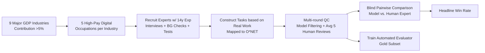

# GDPval: Evaluating AI Model Performance on Real-World Economically Valuable Tasks

**Conference**: ICLR 2026  
**OpenReview**: [https://openreview.net/forum?id=hcuEdq6eKD](https://openreview.net/forum?id=hcuEdq6eKD)  
**Code**: [Hugging Face dataset: GDPval](https://huggingface.co/datasets/openai/gdpval); Automated scoring service: evals.openai.com  
**Area**: LLM Evaluation / Real-World Economic Value Task Benchmarking  
**Keywords**: Economic value tasks, knowledge work, human expert comparison, win rate, O*NET, multimodal deliverable, automated evaluator  

## TL;DR
GDPval is a benchmark proposed by OpenAI for "real economic value digital knowledge work": covering 9 industries with the largest contributions to US GDP, 44 occupations, and 1,320 real tasks constructed by professionals with 14 years of experience. Using "model vs. human expert blind win rate" as the core metric, the study finds that the delivery quality of frontier models is linearly approaching industry experts year by year.

## Background & Motivation
- **Background**: Mainstream methods for measuring the economic impact of AI rely on macro indicators such as adoption rates, usage patterns, and attributed GDP growth. However, history shows that technology diffusion (e.g., electricity, airplanes, computers) often takes decades due to regulatory, cultural, and procedural lags.
- **Limitations of Prior Work**: These macro indicators are **lagging indicators**—by the time economic data shows an impact, model capabilities have already changed. Conversely, existing AI benchmarks go to another extreme: either academic reasoning puzzles (HLE, MMLU, GPQA) or single-domain focuses (e.g., SWE-bench), which are neither close to real work outputs nor representative of broad occupations.
- **Key Challenge**: To evaluate AI's economic relevance **before** large-scale adoption, one must directly measure model capabilities. However, "real economic value work" is both difficult to construct (requiring domain expertise and real deliverables) and difficult to score automatically (involving subjective dimensions like structure, style, aesthetics, and relevance).
- **Goal**: Construct a benchmark that is **realistic, broad-coverage, long-horizon, economically priced, and non-saturating** to directly measure the delivery capability of frontier models on real knowledge work.
- **Core Idea**: **Top-down occupation selection starting from GDP**—first selecting 9 major industries contributing >5% to GDP, then choosing the 5 highest-paid "digitally-focused" occupations per industry. Tasks are constructed by senior practitioners based on real work outputs. **Abandoning automated scoring as the primary metric in favor of "Model Deliverable vs. Human Expert Deliverable" blind pairwise win rates**, ensuring the metric never saturates and can evolve with stronger baselines.

## Method

### Overall Architecture
GDPval is not a model method but a data construction and evaluation pipeline: "Occupation prioritization → Expert recruitment → Task construction → Multi-round quality control → Human/automated blind scoring." The final product consists of 1,320 tasks in the full set (≥30 per occupation) and 220 tasks in the open-source gold subset (5 per occupation). Each task comprises a request (with up to 38 reference files) and an expert deliverable, with the core metric being the pairwise blind win rate.

### Key Designs
**1. Top-down Occupational Representative Sampling: Representing the Economy, Not the Dataset**  
GDPval’s representativeness stems from rigorous economic sampling. It uses 2024 Q2 industry value-added data to filter 9 industries contributing >5% to GDP (covering ~$3T in annual wages). Within each industry, the 5 occupations contributing most to total wages that are "primarily digital" are selected. "Digital nature" is determined by labeling all O*NET tasks for an occupation as digital/non-digital via GPT-4o, weighted by O*NET relevance/importance; if weighted tasks are ≥60% digital, the occupation is included. This aligns with the Acemoglu & Autor task framework, validating economic representativeness.

**2. Expert-Driven Task Construction and Economic Valuation**  
Tasks are constructed by senior practitioners based on deliverables they have actually produced, then mapped back to O*NET tasks. The barrier to entry is high: ≥4 years of experience (average 14 years), promotion/management history, and passing video interviews, background checks, and training. Each task is labeled with difficulty, representativeness, duration, and quality. Its **dollar value** is estimated as (Expert Completion Time × Median Hourly Wage from OEWS). Tasks are naturally long-horizon—averaging 7 hours, with high-end tasks taking weeks—and require handling multimodal formats like CAD, images, video, audio, slides, and spreadsheets.

**3. Blind Win Rate as a Non-saturating Main Metric + Multi-round QC**  
Since automated scoring for complex subjective deliverables is difficult, GDPval uses **pairwise blind comparison by experts** as the primary metric. Deliverables from models and experts are de-identified and ranked by experts in the same occupation. The "Win Rate" (including ties) accommodates subjective factors like aesthetics and relevance and **has no upper bound**—human baselines can be replaced by stronger models. Each task undergoes model filtering and an average of 5 human expert reviews. Formally, for model $m$, the win rate is:
$$\text{WinRate}(m)=\frac{1}{|T|}\sum_{t\in T}\mathbb{E}_{g}\big[\mathbb{1}[\text{deliverable}_m(t)\succeq_g \text{deliverable}_{human}(t)]\big]$$
where $g$ is the expert rater and $\succeq_g$ denotes "not inferior to" (win or tie).

**4. Experimental Automated Evaluator: Cheap and Fast but Auxiliary**  
To reduce costs (human comparisons average >1 hour), the authors trained an automated scoring model for the gold subset. It achieves a **66% agreement rate** with experts, only 5% lower than the 71% inter-rater agreement among humans. However, due to self-preference biases, the authors **recommend human comparison as the primary method**, with the automated evaluator as a convenience tool for open research.

## Key Experimental Results

### Main Results (Gold Subset, Model vs. Human Expert Blind Win Rate)
Evaluation included GPT-4o, o4-mini, o3, GPT-5, Claude Opus 4.1, Gemini 2.5 Pro, and Grok 4. Each prompt was sampled 3 times with 3 raters per sample.

| Observation | Result |
|-------------|--------|
| Best Model | **Claude Opus 4.1**, winning or tying against experts in **47.6%** of cases. |
| Claude Strengths | Aesthetics (document formatting, slide layout), superior on .pdf/.xlsx/.ppt files. |
| GPT-5 Strengths | Instruction following (format, completeness), superior on pure text tasks. |
| Time Trend | Performance of OpenAI frontier models on GDPval **increases approximately linearly over time**. |

### Key Findings
- Frontier models are **approaching industry experts** on real economic tasks, with a linear improvement trajectory.
- **Capability differentiation** is emerging: Claude excels in multimodal/aesthetic tasks, while GPT-5 excels in text/instruction following, suggesting a single total score is insufficient.
- Many failures are "obvious formatting errors" fixable via prompting/scaffolding, indicating a clear path for refinement.
- **Human-AI Collaboration**: The "Model + Expert Supervision" setup can **save both time and money** compared to experts working alone.

## Highlights & Insights
- **Integrating the "Economy" into Benchmarks**: Sampling based on GDP/Wages/O*NET ensures the benchmark reflects the US economic structure rather than dataset biases.
- **Non-saturating Win Rate**: Using relative win rates against humans avoids the saturation issues of traditional accuracy metrics.
- **Complexity and Realism**: Long-horizon tasks (7h avg) with up to 38 reference files and complex formats (CAD/Video) reach the complexity of actual knowledge work.
- **Actionable Improvement Signals**: Failure analysis shows many losses are due to detail/format errors, which can be mitigated via scaffolding.

## Limitations & Future Work
- **Coverage**: Limited to self-contained digital knowledge work; physical tasks, tasks requiring tacit knowledge, or those involving PII/interpersonal communication are excluded.
- **Sampling Constraint**: Only covers the top 9 industries and top 5 high-pay roles due to budget constraints.
- **Auto-evaluator Reliability**: Models tend to favor their own outputs, and human rating remains the bottleneck.
- **Moving Baseline**: As models surpass human experts, new baselines will be needed.

## Related Work & Insights
- **vs. Reasoning Benchmarks**: Complements reasoning-heavy benchmarks like HLE/GPQA by focusing on professional output quality.
- **vs. Economic Frameworks**: Connects AI capability measurement with economic frameworks (Acemoglu & Autor 2011) via task-level digitization analysis.
- **Insight**: "Top-down sampling from external ground truth (GDP/O*NET)" is a paradigm for constructing representative benchmarks that could be adapted for healthcare or law.

## Rating
- Novelty: ⭐⭐⭐⭐
- Experimental Thoroughness: ⭐⭐⭐⭐⭐
- Writing Quality: ⭐⭐⭐⭐
- Value: ⭐⭐⭐⭐⭐

<!-- RELATED:START -->

## Related Papers

- [\[ICLR 2026\] SysMoBench: Evaluating AI on Formally Specifying Complex Real-World Systems](sysmobench_evaluating_ai_on_formally_specifying_complex_real-world_systems.md)
- [\[ICLR 2026\] CyberGym: Evaluating AI Agents' Real-World Cybersecurity Capabilities at Scale](cybergym_evaluating_ai_agents_real-world_cybersecurity_capabilities_at_scale.md)
- [\[ACL 2026\] Beyond Itinerary Planning: A Real-World Benchmark for Multi-Turn and Tool-Using Travel Tasks](../../ACL2026/llm_evaluation/beyond_itinerary_planning-a_real-world_benchmark_for_multi-turn_and_tool-using_t.md)
- [\[ICLR 2026\] Pitfalls in Evaluating Language Model Forecasters](pitfalls_in_evaluating_language_model_forecasters.md)
- [\[ICLR 2026\] PACEbench: A Framework for Evaluating Practical AI Cyber-Exploitation Capabilities](pacebench_a_framework_for_evaluating_practical_ai_cyber-exploitation_capabilitie.md)

<!-- RELATED:END -->
