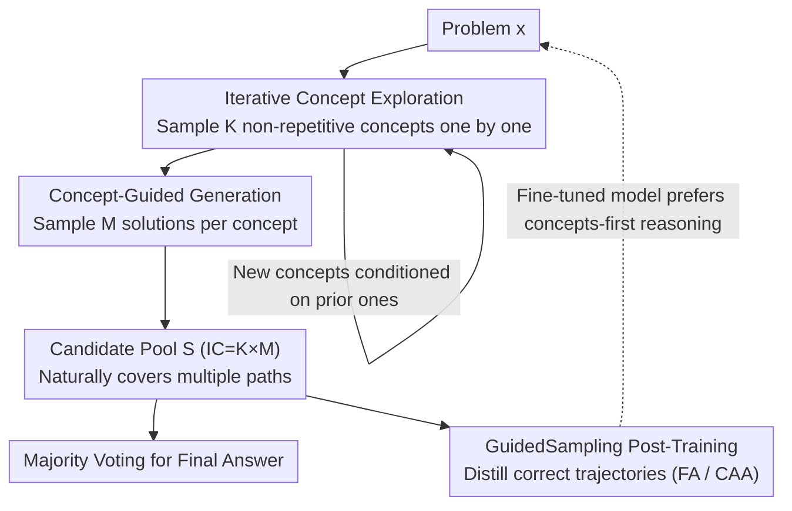

# GuidedSampling: Steering LLMs Towards Diverse Candidate Solutions at Inference-Time

**Conference**: ICLR 2026  
**arXiv**: [2510.03777](https://arxiv.org/abs/2510.03777)  
**Code**: [GitHub](https://github.com/DivijH/sampling_inference)  
**Area**: LLM Evaluation  
**Keywords**: inference-time scaling, repeated sampling, diversity, concept exploration, pass@k

## TL;DR

Ours proposes GuidedSampling, an inference algorithm that explicitly decouples the implicit exploration and generation processes of Repeated Sampling (RS) into two stages: first iteratively generating diverse problem-solving concepts/theorems, and then generating candidate solutions based on each concept. This achieves an average improvement of approximately 21.6% on pass@50 and 9.7% on pass@5 after fine-tuning.

## Background & Motivation

**Background**: Inference-time scaling is a critical direction for enhancing LLM performance—spending more compute during the inference phase is often more cost-effective than using the same compute to train a larger model. The simplest algorithm is Repeated Sampling (RS): repeatedly sampling multiple candidate solutions for the same input and then selecting an answer via majority voting or pass@k.

**Limitations of Prior Work**: RS suffers from a severe lack of diversity—LLMs are trained to generate a single correct response for a given input, leading to multiple samples revolving around only a few concepts. Quantitative analysis confirms this: Llama-3.2-3B uses only 2.75 different concepts on average when generating 100 candidate solutions for HumanEval, with 37% of problems attempting only one concept; in MATH maximum value problems, 892/1000 RS solutions utilized the "AM-GM inequality," and most were incorrect.

**Key Challenge**: While Tree-of-Thought (ToT) can improve diversity through tree search, it incurs extremely high computational overhead by explicitly evaluating every intermediate candidate thought at each step. The question then becomes: can we achieve ToT-level diversity while maintaining the cost level of RS?

**Core Idea**: Explicitly separate the "exploration" (which concept to use) and "generation" (writing the solution based on the concept) stages that are implicitly coupled in RS—first explore multiple concepts at low cost, then use them individually to guide generation, achieving high diversity within an RS-equivalent budget.

## Method

### Overall Architecture

The poor diversity of Repeated Sampling (RS) stems from implicitly merging "exploration" (which concept/theorem to use) and "generation" (writing the full solution based on that concept) into a single sampling step—the model quietly selects a concept for each sample, often converging on the same one (e.g., 892/1000 samples using the same failing AM-GM approach). The core mechanism of GuidedSampling is to explicitly split these into two sequential stages: first, in the **Exploration Phase**, $K$ non-repetitive concepts are iteratively sampled; second, in the **Generation Phase**, $M$ candidate solutions are generated for each concept. The candidates are pooled to select an answer via majority voting or pass@k. The total budget $IC = K \times M$ remains unchanged, so the cost barely increases, yet the solution space—previously locked by implicit concepts—is explicitly expanded at the high-level "concept" dimension. Furthermore, the correct trajectories produced by this process serve as high-quality synthetic data for distilling the model during post-training, internalizing the "concepts-first" habit into the model weights.

### Key Designs

**1. Iterative Concept Exploration: Mapping the "How" before Solving**

This addresses the bottleneck where RS solutions share the same implicit concept. GuidedSampling instead generates a sequence of concepts: given problem $x$, the $k$-th concept is sampled conditioned on all previous concepts:

$$c_k \sim p_\theta(\cdot \mid x, c_{1:(k-1)})$$

Feeding prior concepts back into the context explicitly signals the model that "these paths are taken, try something new," forcing it toward directions RS would rarely reach. The process iterates until $K$ concepts are collected or the model determines no more useful concepts exist (supporting early stopping). Here, a "concept" is defined as a theorem or approach name (e.g., "AM-GM Inequality," "Cauchy-Schwarz Inequality"), acting as high-level guidance that is explored once and reused, incurring much lower overhead than ToT which evaluates thoughts at every step.

**2. Concept-Guided Generation: Locking Candidates to Distinct Paths**

After obtaining the concept set $\mathcal{C}=\{c_1,\dots,c_K\}$, $M$ candidate solutions are sampled for each $c_k$: $s_k^{(m)} \sim p_\theta(s \mid x, c_k)$. All candidates are combined into the pool $\mathcal{S}=\bigcup_{k=1}^{K}\mathcal{S}_k$. By explicitly binding solutions to concepts, the pool naturally covers diverse paths rather than clustering on one implicit concept. Empirically, GuidedSampling produces 17.63% more unique concepts than RS (e.g., reducing AM-GM usage from 892/1000 to 77/1000 in MATH, reallocating budget to Cauchy-Schwarz, Chebyshev, etc.), which directly drives pass@k gains. There is a key exploration-generation trade-off: $K$ and $M$ vary inversely under a fixed budget $IC$; if $K$ is too small, it reverts to RS; if $K$ is too large, the generation budget $M$ per concept is insufficient to complete any path. A "sweet spot" exists ($K=0$ effectively makes GuidedSampling traditional RS).

**3. GuidedSampling Post-Training: Distilling Diverse Trajectories**

The (verified correct) trajectories produced during inference serve as high-quality synthetic data for fine-tuning. The paper proposes two formats: FA (Final-Answer Only), which discards concepts and supervises $(x, s)$; and CAA (Concept-Augmented Answer), which concatenates the concept set and the answer into a single target sequence $(x, \text{concat}(\mathcal{C}, s))$. CAA allows the model to learn the full "explore multiple concepts, then reach a specific solution" process, internalizing multiple reasoning strategies into the weights. Consequently, CAA significantly outperforms FA—achieving a 9.7% average improvement in pass@5 over the strongest baseline and generalizing to out-of-domain benchmarks like GPQA, HumanEval, and OlympiadBench.

### Loss & Training

Both formats utilize standard Maximum Likelihood Estimation (MLE) for fine-tuning. The FA mode supervises the answer directly: $\mathcal{L}_{FA} = -\mathbb{E}_{(x,s) \sim \mathcal{D}_{FA}} [\log P_\theta(s \mid x)]$. The CAA mode targets the concatenation of concepts and the answer $y = \text{concat}(\mathcal{C}, s)$, with the loss $\mathcal{L}_{CAA} = -\mathbb{E}_{(x,\mathcal{C},s) \sim \mathcal{D}_{CAA}} [\log P_\theta(y \mid x)]$, equivalent to teaching the model to output concepts before the solution. The paper provides a theoretical guarantee (Theorem 1): when $k_{min} \cdot P(\mathcal{C}_r \mid x) > 1$ (i.e., the model has a sufficient probability of generating relevant concepts and those concepts provide a significant amplification factor), GuidedSampling strictly outperforms RS on pass@k. This also explains why models with weak conceptual capabilities (like Qwen2.5-3B in the coding domain) do not see gains.

## Key Experimental Results

### Main Results

Pass@50 improvements (averaged across Llama-3.2-3B, Qwen2.5-3B, Gemma-3-27B):

| Benchmark | RS Baseline | GuidedSampling | Gain |
|-----------|-------------|----------------|------|
| MATH | — | — | +21.8% |
| GPQA-Diamond | —| — | +11.87% |
| HumanEval | — | —| +11.28% |
| OlympiadBench | —| — | +3.08% |
| **Average** | — | — | **+16.01%** |

### Ablation Study

Fine-tuned pass@5 comparison (Llama-3.2-3B-Instruct):

| Training Strategy | MATH | GPQA | HumanEval | Olympiad | Average |
|-------------------|------|------|-----------|----------|---------|
| RS | 44.78 | 40.08 | 55.78 | 10.83 | 37.87 |
| STaR | 46.23 | 38.41 | 57.35 | 10.62 | 38.15 |
| ToT | 56.63 | 44.44 | 49.51 | 18.36 | 42.24 |
| FA (Ours) | 47.98 | **50.61** | 55.95 | 20.21 | 43.69 |
| CAA (Ours) | **60.06** | 40.23 | **59.03** | **21.66** | **45.25** |

Diversity Analysis: RS produces 4.04 unique concepts on average vs. GuidedSampling produces 4.75 unique concepts (+17.63%).

### Key Findings

1. GuidedSampling outperforms RS on nearly all model-benchmark combinations. An exception is Qwen2.5-3B on HumanEval, where it regresses due to weak concept generation in the coding domain (averaging only 1.13 concepts).
2. A "sweet spot" exists for the exploration-generation allocation: increasing $K$ initially improves performance but eventually causes a decline as the per-concept budget $M$ becomes insufficient.
3. Early concepts ($k=1$-$5$) have higher average quality (19.8%→16.2%), but late-stage concepts ($k \geq 6$) are crucial for a minority of difficult problems requiring deep exploration.
4. **Domain Limitations**: GuidedSampling performs 3.28% worse than RS on CommonSenseQA, suggesting it is unsuitable for domains where concepts are not well-defined.
5. The CAA training mode significantly outperforms FA, proving that learning the complete "concepts then solutions" trajectory is more effective.
6. Regarding computational overhead, concept generation is a one-time sequential call, which is negligible compared to the total volume of 100 samples in RS.

## Highlights & Insights

1. **Elegant Design Philosophy**: Achieves massive gains simply by decoupling "implicit exploration + generation" into "explicit exploration → guided generation."
2. **Sound Theoretical Analysis**: Theorem 1 precisely identifies the necessary and sufficient conditions for GuidedSampling to beat RS; the two paths (concept coverage + irrelevant concept recovery) provide a clear analytical framework.
3. **Dual Value of Post-training**: GuidedSampling acts not just as an inference strategy but also as a high-quality synthetic data generator—CAA fine-tuning significantly improves pass@k.
4. The AM-GM inequality example is highly compelling: 892/1000 RS solutions failure due to sticking to a single theorem.
5. **High Composability**: The method can be layered with techniques like RL (e.g., pass@k optimization) and majority voting.

## Limitations & Future Work

1. **Obvious Domain Constraints**: Ineffective for tasks where concepts are hard to define (common sense reasoning); applicability is limited to domains with clear concepts/theorems.
2. **Strong Model Dependency**: Qwen2.5-3B can only generate 1.13 concepts for HumanEval—models with weak conceptual abilities cannot benefit.
3. The concept exploration phase is iterative and cannot be parallelized, becoming a bottleneck for very large $K$.
4. Primary experiments were conducted on 3B-class small models; performance on 7B+ models requires verification.
5. Concept quality evaluation relies entirely on extraction by Qwen2.5-32B—inaccuracy in the extractor could bias diversity metrics.

## Related Work & Insights

- **Repeated Sampling** (Cobbe et al., 2021): The simplest inference-time scaling, but lacks diversity.
- **Tree-of-Thought** (Yao et al., 2023): Structured exploration but with high compute cost; GuidedSampling finds a better balance between diversity and efficiency.
- **Self-Taught Reasoner (STaR)** (Zelikman et al., 2022): Uses reasoning trajectories for fine-tuning but lacks explicit diversity management.
- Insight: The exploration-generation decoupling can be extended to code generation (planning algorithms before implementation) and scientific discovery.

## Rating

- **Novelty**: ⭐⭐⭐⭐ The decoupling idea is simple and effective, though the core concept ("think of methods before solving") is relatively intuitive.
- **Experimental Thoroughness**: ⭐⭐⭐⭐ Covers multiple benchmarks and models with theoretical analysis and post-training, though mainly focused on 3B models.
- **Writing Quality**: ⭐⭐⭐⭐ Clear structure with an excellent motivating example (AM-GM), though some details (like the precision of concept definitions) could be clearer.
- **Value**: ⭐⭐⭐⭐ Provides practical value for inference-time scaling, though domain limitations (need for well-defined concepts) reduce generality.

<!-- RELATED:START -->

## Related Papers

- [\[AAAI 2026\] Test-time Diverse Reasoning by Riemannian Activation Steering](../../AAAI2026/llm_evaluation/test-time_diverse_reasoning_by_riemannian_activation_steering.md)
- [\[ICLR 2026\] Harnessing Temporal Databases for Systematic Evaluation of Factual Time-Sensitive Question-Answering in LLMs](harnessing_temporal_databases_for_systematic_evaluation_of_factual_time-sensitiv.md)
- [\[AAAI 2026\] OptScale: Probabilistic Optimality for Inference-time Scaling](../../AAAI2026/llm_evaluation/optscale_probabilistic_optimality_for_inference-time_scaling.md)
- [\[ICML 2025\] Bounded Rationality for LLMs: Satisficing Alignment at Inference-Time](../../ICML2025/llm_evaluation/bounded_rationality_for_llms_satisficing_alignment_at_inference-time.md)
- [\[ICLR 2026\] Multi-LLM Adaptive Conformal Inference for Reliable LLM Responses](multi-llm_adaptive_conformal_inference_for_reliable_llm_response.md)

<!-- RELATED:END -->
