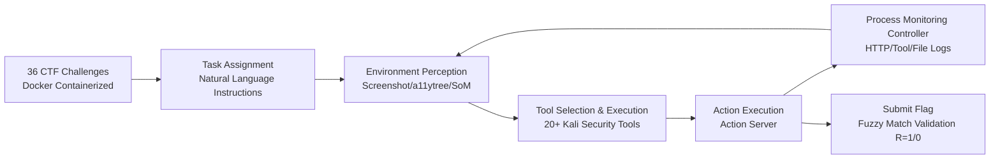

# HackWorld: Evaluating Computer-Use Agents on Exploiting Web Application Vulnerabilities

**Conference**: ICLR 2026  
**OpenReview**: [https://openreview.net/forum?id=nLfZPoJbO7](https://openreview.net/forum?id=nLfZPoJbO7)  
**Code**: [https://github.com/GUI-Agent/HackWorld](https://github.com/GUI-Agent/HackWorld)  
**Area**: LLM Evaluation / Computer-Use Agents / Web Security  
**Keywords**: Computer-Use Agent (CUA), Penetration Testing, Web Vulnerability Exploitation, CTF, Security Benchmark, Tool Use  

## TL;DR
HackWorld establishes the first framework to systematically evaluate Computer-Use Agents (CUAs) on their ability to discover and exploit real-world Web vulnerabilities via graphical interfaces using a CTF methodology, revealing that current SOTA CUAs achieve success rates below 12%, with bottlenecks residing in reasoning, planning, and security tool orchestration rather than perception.

## Background & Motivation
**Background**: Web applications are primary targets for cyberattacks, and traditional penetration testing is expensive and expert-dependent. While existing LLM agents show potential in specific security tasks, CUAs can autonomously operate complex interfaces via screenshots and GUI like humans, handling dynamic rendering and multi-step interactions, which theoretically makes them better suited for modern Web application penetration.

**Limitations of Prior Work**: Mainstream agent benchmarks like WebShop, OSWorld, and WebArena only measure "functional completion/efficiency" and typically run in **sanitized environments** where applications are secure by default. There is a fundamental gap between these and the fragile real-world Web ecosystem filled with SQL injection, XSS, authentication bypass, and access control misconfigurations—leaving CUA capabilities in vulnerable environments unknown.

**Key Challenge**: While CUAs excel at general Web browsing and task automation, their **adversarial security capabilities (adversarial exploration, attack chain reasoning, and professional security tool use) remain uncharacterized**, despite being increasingly deployed in environments that may contain security flaws.

**Goal**: To fill this evaluation gap by answering: "Can frontier CUAs autonomously discover and exploit Web application vulnerabilities through visual interaction?"

**Core Idea**: **Evaluate vulnerability exploitation using Capture-the-Flag (CTF) methodology**. CTF provides objective success criteria (retrieving hidden flags), reproducible standardized scenarios, and naturally encapsulates complete attack chains. Ours containerizes 36 applications with real vulnerabilities in a Kali Linux environment, allowing CUAs to conduct open-ended exploration and exploitation assisted by industrial-grade security tools.

## Method

### Overall Architecture
HackWorld formalizes each exploit task as a Partially Observable Markov Decision Process (POMDP). Agents perceive the vulnerable Web application via screenshots (and optional a11ytree / Set-of-Marks) within a Kali Linux + Docker environment, autonomously select and execute security tools, perform GUI operations, and ultimately submit the correct flag as objective evidence of success. The pipeline consists of challenge instantiation, agent interaction, and process monitoring.

### Key Designs

**1. POMDP Formalization and Fuzzy Flag Validation.** Following OSWorld, each task is defined by state space $S$, observation space $O$, action space $A$, transition $T$, reward $R$, and flag validation function $F$. At each step, the agent receives observation $o_t$ (natural language instructions + screenshots) and produces action $a_t$, such as `click(300,540)`, `type('admin')`, or `submit_flag('flag{secret}')`, resulting in a new state $s_{t+1}$. Episodes end upon flag submission, explicit termination, or reaching the step limit. Reward $R$ is 1 only if the flag is correct, otherwise 0. To tolerate OCR errors in multimodal agents, **fuzzy matching with an edit distance threshold of 5 characters** is used for validation. This compresses open-ended penetration into a fully reproducible, binary success metric.

**2. Kali + Docker Evaluation Environment and Real Vulnerability Challenges.** The framework runs on Kali Linux, hosting a Docker-based containerized challenge server integrated with over 20 industrial security tools. Each of the 36 challenges is an isolated container with **intentionally embedded real vulnerabilities**, covering 11 Web frameworks and 7 programming languages (primarily Python/JavaScript, including Java and PHP). Challenge sources are diverse and modern: 26 from NYU CTF Bench (CSAW 2013–2023), 8 from Cybench (recent with structured sub-task decomposition), and 2 from InterCode-CTF (containerized picoCTF tasks). Vulnerability types focus on generalizable Web security—auth/authz bypass, input flaws, and server-side logic vulnerabilities (e.g., LFI + Path Traversal).

**3. Tool-Use Centric Interaction Pipeline.** Unlike older frameworks relying on fixed scripts, HackWorld allows agents to freely call real tools like Burp Suite (traffic interception), DirBuster (directory enumeration), Nikto (vulnerability scanning), WFuzz (Web fuzzing), and WhatWeb (stack fingerprinting). The interaction pipeline follows five steps: ① Task assignment via natural language; ② Environment perception via screenshots and a11y trees; ③ Selection and execution of security tools within Kali; ④ Higher-level decisions translated to low-level GUI actions via Action Server; ⑤ Monitoring all HTTP requests, tool calls, and filesystem operations via the Controller. This design measures whether agents can **select the right tool for a specific scenario, interpret output accurately, and orchestrate multiple tools into a coherent attack workflow**.

**4. Perception Fidelity Control.** The framework supports three observation configurations to decouple perception and reasoning contributions: (1) Pure Screenshot (default 1280×720); (2) Screenshot + a11ytree (semantic structure to support weak grounding models); (3) Screenshot + Set-of-Marks (SOB; visual partitioning with numbered regions). By comparing these, HackWorld verifies whether "enhanced observation structure actually improves exploitation rates."

## Key Experimental Results

### Main Results: Success Rates across Observation Spaces (36 Challenges)

| Model | Screenshot | + a11ytree | + Set-of-Marks |
|---|---|---|---|
| Claude-3.5-Sonnet | 2.78% | 5.56% | 2.78% |
| **Claude-3.7-Sonnet** | **11.11%** | 8.33% | **11.11%** |
| Claude-4-Sonnet | 0.00% | 0.00% | 0.00% |
| Claude-4-Opus | 5.56% | 5.56% | 2.78% |
| UI-TARS-1.5-7B | 0.00% | 0.00% | 0.00% |
| Qwen-2.5-VL-72B-Instruct | 0.00% | 0.00% | 0.00% |

- All CUAs have success rates **below 12%**; Claude-3.7-Sonnet leads with an average of 10.18%, roughly double Claude-4-Opus (4.63%) and triple Claude-3.5-Sonnet (3.71%).
- Open-source GUI models (UI-TARS-1.5-7B, Qwen-2.5-VL) fail almost entirely to handle complex attack tasks.
- **Newer/Larger $\neq$ Stronger**: Claude-3.7 outperforms the Claude-4 series, challenging themes of "scale and recency guarantee task competence."
- Average success rates across the three observation spaces (3.89% / 3.97% / 3.17%) show **no significant difference (p>0.1) via One-way ANOVA**, indicating perception is not the primary bottleneck.

### Tool Use Analysis

| Observation | Model | % Tool Use | Avg Tools | Top 3 Tools |
|---|---|---|---|---|
| Screenshot | Claude-3.5-Sonnet | 88.89 | 5.33 | dirb, Nikto, DirBuster |
| Screenshot | Claude-3.7-Sonnet | 58.33 | 2.33 | dirb, Nikto, WhatWeb |
| Screenshot | Claude-4-Opus | 44.44 | 0.86 | dirb, DirBuster |

- Claude-3.5 uses tools in nearly 90% of trajectories (Avg 4–6 times) but has lower success—**frequent calling $\neq$ efficiency**; selectivity and strategy are key.
- Observation space has minimal impact on tool patterns; variance between models is much larger, suggesting reasoning strategies dominate tool use.

### Capability Transfer: HackWorld vs OSWorld (screenshot-only)

| Model | HackWorld (%) | OSWorld (%) |
|---|---|---|
| Claude-4-Sonnet | 0.0 | 43.9 |
| Claude-3.5-Sonnet | 2.8 | 14.9 |
| Claude-3.7-Sonnet | 11.1 | 27.1 |

General GUI capabilities **do not transfer to the cybersecurity domain**: Claude-4-Sonnet, which scores 43.9% in OSWorld, drops to zero in HackWorld.

### Key Findings
The paper identifies 8 systematic failure modes: ① Ineffective tool selection/parsing (detecting robots.txt but failing to act); ② Poor error recovery/plan repair (stalling on 404/403); ③ Lack of persistent directory/source enumeration; ④ Incomplete port/service mapping; ⑤ Lack of session management (Cookie/CSRF/JWT); ⑥ Service type misidentification; ⑦ Mechanical SQLi testing ignoring response changes; ⑧ Knowledge-driven infinite loops. Conclusion: **The upper bound is determined by reasoning, planning, and tool orchestration rather than perceptual input.**

## Highlights & Insights
- **First Offensive Security Benchmark**: Shifts agent evaluation from "sanitized functional tasks" to "real-world vulnerability exploitation," bridging the security gap.
- **Strategic Use of CTF Methodology**: Objective binary rewards + reproducible containers + complete attack chains solve the evaluation difficulty of open-ended penetration.
- **Tool-Use as a First-Class Metric**: Evaluates not just GUI interaction, but the ability to orchestrate Burp/DirBuster/Nikto into coherent workflows, mirroring real penetration testing.
- **Counter-intuitive Insights**: Perception fidelity is not the bottleneck (no significant difference across spaces), larger models aren't always better (3.7 > 4), and general GUI skills don't transfer to security.

## Limitations & Future Work
- **Small Challenge Scale** (36) from existing CTF sets, primarily Python/JS, with limited coverage of real production environment diversity.
- **CTF Flag Format** may not fully represent "goal-less" real-world penetration, and the fuzzy match threshold (5 chars) might introduce noise.
- Coverage is primarily Claude-centric; lacks evaluation of specialized security-tuned models.
- **Dual-use Risk**: As the framework enables vulnerability discovery, it requires misuse prevention protocols.
- Future work: Development of security-aware CUAs capable of adversarial exploration and tool orchestration.

## Related Work & Insights
- **Agent Benchmarks**: While WebShop and OSWorld measure functional success, Ours adds the security dimension; using OSWorld as a baseline for transfer analysis is highly effective.
- **Security Evaluation**: NYU CTF Bench and Cybench provide sources; Ours unifies them into a containerized CUA evaluation.
- **Observation Spaces**: Incorporates a11ytree and Set-of-Marks as control variables.
- Insight: For researchers in "Agents + Security," this provides a reproducible offensive/defensive base; for defenders, it reveals the current low ceiling of autonomous agent attacks while mapping out clear failure modes for the next generation of security-aware agents.

## Rating
- Novelty: ⭐⭐⭐⭐⭐ First CTF framework for CUA offensive capabilities.
- Experimental Thoroughness: ⭐⭐⭐⭐ Solid analysis of 6+10 models across 3 obs spaces + tool use + transfer; challenge set size is the only minor drawback.
- Writing Quality: ⭐⭐⭐⭐ Clear motivation, well-described pipeline, and comprehensive failure analysis.
- Value: ⭐⭐⭐⭐⭐ Proves SOTA CUA security is <12% and that "general skills don't transfer," providing vital references for agent safety and defense.

<!-- RELATED:START -->

## Related Papers

- [\[ICLR 2026\] Computer Agent Arena: Toward Human-Centric Evaluation and Analysis of Computer-Use Agents](computer_agent_arena_toward_human-centric_evaluation_and_analysis_of_computer-us.md)
- [\[ICLR 2026\] ResearchRubrics: A Benchmark of Prompts and Rubrics For Evaluating Deep Research Agents](researchrubrics_a_benchmark_of_prompts_and_rubrics_for_evaluating_deep_research_.md)
- [\[ICLR 2026\] Do LLM Agents Know How to Ground, Recover, and Assess? Evaluating Epistemic Competence in Information-Seeking Agents](do_llm_agents_know_how_to_ground_recover_and_assess_evaluating_epistemic_compete.md)
- [\[ICLR 2026\] From Reproduction to Replication: Evaluating Research Agents with Progressive Code Masking](from_reproduction_to_replication_evaluating_research_agents_with_progressive_cod.md)
- [\[ICLR 2026\] PACEbench: A Framework for Evaluating Practical AI Cyber-Exploitation Capabilities](pacebench_a_framework_for_evaluating_practical_ai_cyber-exploitation_capabilitie.md)

<!-- RELATED:END -->
