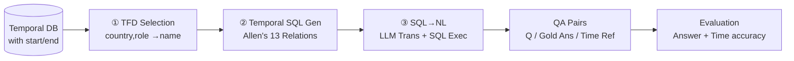

# Harnessing Temporal Databases for Systematic Evaluation of Factual Time-Sensitive Question-Answering in LLMs

**Conference**: ICLR 2026  
**Code**: [https://github.com/ssoy0701/tdbench](https://github.com/ssoy0701/tdbench)  
**Area**: LLM Evaluation / Time-Sensitive Question Answering (TSQA)  
**Keywords**: Time-Sensitive QA, Temporal Databases, Temporal Functional Dependencies, Allen’s Interval Algebra, Temporal Hallucination  

## TL;DR
This paper introduces TDBench, which utilizes temporal databases and database technologies (Temporal Functional Dependencies, Temporal SQL, and temporal joins) as an automated engine for constructing TSQA datasets. It generates questions covering 13 types of temporal constraints without manual intervention and introduces a "time accuracy" metric, revealing that LLMs often hallucinate incorrect temporal references in their explanations (21.7% on average) even when providing the correct answer.

## Background & Motivation
- **Background**: Facts change over time (e.g., "Who is the current President of the United States?"). Time-Sensitive Question Answering (TSQA) is widely used to evaluate two types of LLM capabilities: **temporal reasoning** (understanding temporal contexts like "before 2019" or "during the 5th Winter Olympics") and **temporal alignment** (answering in a way that reflects current world facts).
- **Limitations of Prior Work**: Existing TSQA benchmarks **rely heavily on human effort**. Designing diverse temporal contexts is limited by manual writing or a small set of fixed templates (e.g., Dhingra uses 9, Margatina uses 16), restricting diversity. Furthermore, as time-sensitive knowledge evolves, benchmarks require continuous maintenance—RealTimeQA, for instance, has stopped updating due to high manual costs.
- **Key Challenge**: Achieving "scalable, comprehensive, and continuously maintainable" TSQA evaluation is bottlenecked by the manual design of contexts, templates, and answers. Meanwhile, traditional evaluations only assess answer correctness, **overlooking temporal hallucinations in model explanations**.
- **Goal**: To construct a TSQA framework that requires no manual labor, automatically refreshes questions as data updates, covers comprehensive temporal constraints, and enables fine-grained verification of temporal references.
- **Core Idea**: **Adapt mature temporal database design theories directly as question generators.** This involves using Temporal Functional Dependencies (TFD) for knowledge selection, Temporal SQL (based on Allen’s interval algebra) to encode 13 types of temporal relationships, and temporal joins to create implicit multi-hop questions. Finally, LLMs translate SQL into natural language, while answers are retrieved by executing the SQL.

## Method

### Overall Architecture
TDBench splits TSQA construction into "automated QA pair generation from temporal databases" and "simultaneous evaluation of answers and temporal references." Given a uni-temporal database table with `start`/`end` validity intervals, the construction pipeline follows three steps: TFD-based attribute selection → Temporal SQL generation with temporal constraints → LLM-driven SQL-to-NL translation and SQL execution for gold answers. The evaluation component uses the SQL-encoded temporal constraints to automatically verify the correctness of temporal references in model explanations alongside answer accuracy.

### Key Designs

**1. Automated Knowledge Selection via TFD: Theoretical grounding for "what to ask."** Temporal Functional Dependencies extend standard functional dependencies to the temporal dimension. While a standard FD $X \to Y$ requires $X$ to uniquely determine $Y$ across the entire table, a TFD $X \xrightarrow{T} Y$ only requires this to hold when validity intervals overlap. For example, `country, role` $\xrightarrow{T}$ `name` indicates that "at any given time, a specific role in a country is held by one person, but the holder can change over time." TDBench generates questions using attribute sets that satisfy TFDs: $X$ values are placed in the question, and $Y$ values serve as the answer (e.g., "Who was the [role] of [country]?"). Since TFDs are fundamental to temporal database design, this logic generalizes to any schema, **eliminating the need for manual preprocessing to identify "time-relevant fields."**

**2. Temporal SQL + Allen’s Interval Algebra: Expanding from 4-6 constraints to 13.** Instead of generating natural language questions directly, the framework first generates temporal SQL queries, utilizing built-in temporal operators (e.g., `BETWEEN`, `DATEDIFF`) to express rich contexts. The `Genqueries` algorithm builds basic queries using TFD attributes ($X$ in `WHERE`, $Y$ in `SELECT`) and appends temporal constraints based on **Allen’s 13 mutually exclusive and exhaustive interval relationships** (before, after, meet, met-by, overlap, equal, start, finish, during, contain, etc.). Each relationship corresponds to a specific SQL condition: e.g., the `meet` relationship (`a.end = b.end - b.length`) tracks a "President whose term ended exactly half a year before a specific date"; `overlap` uses `a.end IS NULL` to represent "currently in office." This coverage exposes LLM weaknesses in rare temporal relationships compared to the standard 4-6 types (in/from-to/before/after).

**3. SQL-to-NL + Database Retrieval: Balancing linguistic diversity and answer reliability.** On the question side, GPT-4o acts as a SQL-to-text translator (achieving 91.5% accuracy in a zero-shot setting), translating a single SQL query into multiple questions with varied phrasing but identical answers. On the answer side, **LLMs are not used to generate answers; instead, gold answers are retrieved by executing the SQL on the database.** This ensures linguistic diversity while guaranteeing that answers strictly follow database facts. When the database updates (e.g., a new president), corresponding QA pairs refresh automatically, fundamentally solving the maintenance bottleneck and reducing costs compared to "pure LLM generation."

**4. Time Accuracy Metric: Identifying hidden "correct answer, wrong reference" errors.** The authors observed that LLMs often provide the correct answer but hallucinate incorrect times in their explanations (e.g., naming the correct King of Sweden but providing the wrong coronation date). Time accuracy is defined as the correctness of temporal references (`start`/`end` dates) in the explanation. **The verification process is automated** because the SQL constraint itself encodes which temporal reference is required for the question (e.g., `meet` requires checking the `end` date, `after` requires `start`, and seven others require both). Since models may include extraneous temporal information, an LLM-judge is used instead of exact matching, reaching 91.1% accuracy in manual spot checks. Three metrics are reported: Answer Accuracy (A), Time Accuracy (T), and the strict metric where both are correct (AT).

**5. Implicit Multi-hop Questions via Temporal Joins: Increasing difficulty without manual effort.** By performing **temporal natural joins** on two tables (joining only tuples with overlapping validity intervals), implicit temporal constraint questions are generated. For example, joining an Olympics table and a Leaders table by `country` yields "the leader of the host nation at the time." Using the inferred TFD from the joined table (`game_edition, role` $\xrightarrow{T}$ `name`), the system generates questions like "Who was the [role] of the host country during [game edition]?"—replacing explicit dates with implicit contexts like "the 1988 Summer Olympics," which requires event-event reasoning.

## Key Experimental Results

Setup: 8 LLMs (GPT-3.5/4/4o, Llama3.1-70B, Mixtral-8x7B, Gemma2-27B, Qwen2-72B, Granite3.1-8B, temperature 0); two data sources—Wikipedia (Countries/Athletes/Organizations/Olympics, 6,177 questions) and platforms like Kaggle (Same-sex marriage laws/Carbon tax/UNESCO heritage/Netflix, covering Law/Environment/Culture/Society, 1,704 questions).

### Main Results: Temporal Alignment Task (A=Answer only, AT=Answer + Time, Δ=A−AT)

| Model | Wiki A | Wiki AT | Wiki Δ | Law AT | Heritage AT | Netflix AT |
|---|---|---|---|---|---|---|
| GPT-3.5 | 47.5 | 22.4 | 25.1 | 39.9 | 26.5 | 19.1 |
| GPT-4o | 73.9 | 48.8 | 25.1 | 54.0 | 53.3 | 25.9 |
| Llama3.1-70B | 64.6 | 56.7 | 7.9 | 44.9 | 39.7 | 28.6 |
| Gemma2-27B | 69.3 | 32.8 | 36.5 | 29.8 | 22.0 | 27.7 |
| Granite3.1-8B | 49.6 | 26.1 | 23.5 | 28.6 | 4.5 | 14.9 |
| **Average** | **56.9** | **35.2** | **21.7** | **40.7** | **28.6** | **22.4** |

### Key Findings
- **Temporal Hallucinations are Pervasive**: On Wikipedia, the average drop from A to AT is **21.7%**, meaning roughly one-fifth of correct answers are accompanied by incorrect temporal references. Traditional evaluations focusing only on answers miss these "factual inconsistencies."
- **Domain-Specific Capability Gaps**: GPT-4o performs best in Law, Carbon Tax, and Heritage domains, while Llama3.1-70B leads in the Netflix domain, proving TDBench's ability to evaluate application-specific data beyond Wikipedia.
- **Portability to Existing Benchmarks**: Applying time accuracy to Dyknow (by modifying the system prompt to require `start` dates) yielded a 0.96 F1 for temporal alignment responses, improving benchmark correctness relative to manual verification.
- **Wider Constraint Coverage**: Covering 13 temporal constraints vs. the usual 4-6 allows for pinpointing temporal blind spots that existing benchmarks cannot detect.

## Highlights & Insights
- **Cross-disciplinary Synergy**: Using mature temporal database theories (TFD / Temporal SQL / Temporal Join) as a "formal engine" for question generation provides theoretical guarantees for question selection, answer retrieval, and verification—moving away from ad-hoc manual design.
- **Self-Maintaining Benchmark**: Questions are dynamically determined by database content. Updating the data refreshes the benchmark, directly addressing the maintenance issues that led to the stagnation of benchmarks like RealTimeQA.
- **Time Accuracy as an Underrated Dimension**: It reveals that "being correct does not mean being reliable." This shifts hallucination evaluation from the answer level to the temporal reference level within explanations, enabled by automated SQL-based verification.

## Limitations & Future Work
- The study focuses on **uni-temporal** data models (validity intervals) and does not cover more complex temporal semantics like bi-temporal models (including transaction time).
- The pipeline relies on LLMs in two places: SQL-to-text translation (91.5% accuracy) and temporal reference LLM-judging (91.1%). Neither is 100%, introducing minor noise into the benchmark and evaluation.
- Question quality is constrained by whether the input database's TFDs are correctly defined. Handling missing or invalid TFDs requires additional processing (discussed in the appendix) and is not fully automated in the main flow.
- Implicit multi-hop questions depend on finding temporal-joinable related tables; domain-specific data may be difficult to scale in difficulty if related event tables are missing.

## Related Work & Insights
- **TSQA Benchmarks**: Existing works like TimeQA, TempLAMA, RealTimeQA, and Dyknow are mostly Wikipedia/Wikidata-centric and built using manual effort or fixed templates. TDBench complements these as a "database-driven + domain-specific + auto-maintained" alternative.
- **Temporal Databases**: The methodology is rooted in Jensen & Snodgrass's temporal database theories (TFDs, temporal joins, Allen’s interval algebra).
- **Hallucination Evaluation**: While prior work noted LLMs hallucinate in explanations, this paper formalizes this as "temporal reference errors" and provides an automated metric for verification.
- **Insight**: Using formal data structures and query languages as question generators is a generalizable strategy to reduce manual costs and ensure controllable, reproducible evaluations. This can be extended to other evaluation tasks requiring structured facts (e.g., counting, aggregation, multi-constraint reasoning).

## Rating
- **Novelty**: ⭐⭐⭐⭐ — The use of temporal database techniques as a TSQA engine combined with the "time accuracy" metric is a novel and substantive bridge between DB theory and LLM evaluation.
- **Experimental Thoroughness**: ⭐⭐⭐⭐ — Covers 8 major LLMs, multiple data domains, and three metrics, with verified portability to existing benchmarks.
- **Writing Quality**: ⭐⭐⭐⭐ — The logic from motivation to method to metrics is clear; Figure 1 and the tabular examples make abstract SQL construction intuitive.
- **Value**: ⭐⭐⭐⭐ — Provides an automated, comprehensive TSQA framework that identifies temporal hallucinations. Open-sourcing the code and data makes it highly practical for the evaluation community.

<!-- RELATED:START -->

## Related Papers

- [\[ICLR 2026\] EIP: Weighted Ranking of LLMs by Quantifying Question Difficulty](eip_weighted_ranking_of_llms_by_quantifying_question_difficulty.md)
- [\[ICLR 2026\] GuidedSampling: Steering LLMs Towards Diverse Candidate Solutions at Inference-Time](guidedsampling_steering_llms_towards_diverse_candidate_solutions_at_inference-ti.md)
- [\[ACL 2025\] YESciEval: Robust LLM-as-a-Judge for Scientific Question Answering](../../ACL2025/llm_evaluation/yescieval_llm_judge_science.md)
- [\[ACL 2026\] ReTraceQA: Evaluating Reasoning Traces of Small Language Models in Commonsense Question Answering](../../ACL2026/llm_evaluation/retraceqa_evaluating_reasoning_traces_of_small_language_models_in_commonsense_qu.md)
- [\[ACL 2026\] ReCoQA: A Benchmark for Tool-Augmented and Multi-Step Reasoning in Real Estate Question and Answering](../../ACL2026/llm_evaluation/recoqa_a_benchmark_for_tool-augmented_and_multi-step_reasoning_in_real_estate_qu.md)

<!-- RELATED:END -->
