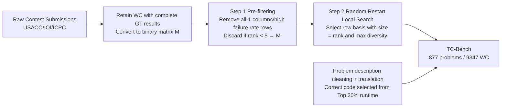

# How Many Code and Test Cases Are Enough? Evaluating Test Cases Generation from a Binary-Matrix Perspective

**Conference**: ICLR 2026  
**OpenReview**: [https://openreview.net/forum?id=RomWar2kVN](https://openreview.net/forum?id=RomWar2kVN)  
**Code**: [https://github.com/Luowaterbi/TC-Bench](https://github.com/Luowaterbi/TC-Bench)  
**Dataset**: [https://huggingface.co/datasets/Luoberta/TC-Bench](https://huggingface.co/datasets/Luoberta/TC-Bench)  
**Area**: LLM Evaluation / Test Case Generation / Code Evaluation Benchmark  
**Keywords**: Test case generation, Binary matrix, Matrix rank, Diagnostic basis, Score inflation, Competitive programming  

## TL;DR
This paper formalizes the evaluation of test case generation methods as finding a "diagnostic basis"—a subset with a rank equal to the matrix rank and maximized internal diversity—within a binary matrix of "Wrong Code × Test Cases." Based on this, it constructs TC-Bench, a compact benchmark resistant to score inflation, revealing that even the strongest methods achieve a HackRate of only approximately 60%.

## Background & Motivation

**Background**: The ability of LLMs to solve algorithmic problems heavily relies on test cases for correctness verification. Since Golden Test cases (GT) are scarce and expensive, several methods have emerged to automatically augment test cases (AT) using LLMs. These methods themselves require evaluation; the core challenge is assessing the "usefulness" of ATs, specifically how many Wrong Codes (WC) they can exclude (hack).

**Limitations of Prior Work**: Common practices involve collecting as many WCs as possible and running all ATs to see how many are excluded. This leads to two critical issues: 1) The computational cost is the product of the number of ATs and WCs, which is prohibitive given the hundreds of thousands of submissions in competitive programming. 2) **Score Inflation**: WC sets are often dominated by large numbers of trivial, repetitive errors. Core defects that are difficult to detect account for only a tiny fraction. Consequently, a mediocre method that only catches common errors and a strong method capable of identifying rare corner cases may receive similar scores, causing the benchmark to lose discriminative power.

**Key Challenge**: On one hand, "collecting more WCs" leads to redundancy and inflation; on the other hand, heuristic selection of only a few difficult WCs (e.g., TCG choosing 5) is overly sparse and lacks coverage. Since one WC does not equal one type of error, the fundamental questions remain: **How many WCs are sufficient to represent the entire error space? How many test cases are sufficient to distinguish them?** There are currently no principled answers to these seemingly independent questions.

**Goal**: To provide a theoretical framework that simultaneously answers "what is the minimum number of WCs required" and "what is the minimum number of test cases required," and to construct a compact, diverse, and anti-inflation evaluation benchmark based on this framework.

**Core Idea**: **[Rank = Diagnostic Dimension]** Each WC's execution result on GT (AC=0, WA=1) is treated as a binary "failure signature" vector. All WCs are stacked into an $n \times d$ binary matrix $M$. The **rank** of this matrix precisely characterizes the number of independent error modes (determining how many WCs should be selected). Furthermore, since row rank equals column rank, it provides a tight upper bound on the number of test cases needed to distinguish all error modes. By maximizing internal diversity under the rank constraint, an optimal "diagnostic basis" is obtained.

## Method

### Overall Architecture
The approach recasts "benchmark construction" as a matrix analysis and combinatorial optimization problem. First, the correctness results of WCs for each problem on GT are converted into a binary matrix $M$ (rows = WCs, columns = test cases, failures recorded as 1). The rank is used to determine the number of WCs to retain for that problem. Then, among all "row bases" satisfying the rank condition, the set with the lowest average Jaccard similarity (highest diversity) among members is selected as the diagnostic basis. As this selection is NP-hard, the authors use WrongSelect (pre-filtering + random restart local search) for efficient approximation, followed by a data cleaning pipeline to produce TC-Bench.

### Key Designs

**1. Binary Matrix and "Diagnostic Basis" Modeling: Translating abstract errors into computable linear algebra objects.** The result of a WC on a GT sequence (e.g., `["AC", "WA", "WA"]`) is encoded as a binary vector `[0, 1, 1]`, termed the "failure signature." Signatures of all WCs form a matrix $M \in \{0, 1\}^{n \times d}$, where $M_{ij} = 1$ indicates that the $i$-th WC fails on the $j$-th test case. An ideal WC subset $I$ must be **complete yet non-redundant**—in linear algebra, this corresponds exactly to a **row basis**: row vectors in $I$ are linearly independent and $|I| = \mathrm{rank}(M)$, spanning all independent error modes without excess. Remarkably, since row rank equals column rank, $|I|$ is also the theoretical upper bound for the number of test cases required to distinguish all independent error modes—answering both initial questions simultaneously.

**2. Diversity Objective and Jaccard Similarity: Selecting the most "orthogonal" basis among valid candidates.** The basis satisfying the rank condition is not unique. An ideal basis should consist of mutually orthogonal signatures (non-overlapping error modes). Since orthogonal bases rarely exist in real data, the objective is to maximize diversity. The overlap between two signatures is measured by Jaccard similarity: $J(r_i, r_j) = \dfrac{r_i \cdot r_j}{\|r_i\|_1 + \|r_j\|_1 - r_i \cdot r_j}$. The global goal is to minimize the average Jaccard similarity across all member pairs in the basis: $\min_I F(I) = \dfrac{1}{\binom{|I|}{2}} \sum_{r_i, r_j \in I, i < j} J(r_i, r_j)$. A lower $F(I)$ indicates a more diverse basis with a wider diagnostic range and higher information efficiency.

**3. Pre-filtering in WrongSelect: Removing noise that allows "free-riding" on scores.** The quality of the final basis depends on the candidate pool. The authors clean noise from both columns and rows. **Column Analysis (Problem-level)**: If $M$ contains an all-1 column, it means all WCs fail on that case. This may stem from incremental GT difficulty, insufficient WCs, or trivial problems; crucially, all-1 columns provide a backdoor for score bloating. Problems containing all-1 columns are discarded (approx. 5%). **Row Analysis (Code-level)**: WCs with a failure rate higher than threshold $\tau = 80\%$ (proportion of 1s in a row) fail on almost all private cases. They are "background noise" that any mediocre test set can exclude, inflating scores and weakening discriminative power; these are removed (approx. 13% of WCs). Finally, problems with $\mathrm{rank}(M') < 5$ are discarded to ensure sufficiently rich error modes.

**4. Random Restart Local Search: Approximating the NP-hard optimal diagnostic basis via swapping and restarts.** Starting from a randomly selected valid basis in the filtered $M'$, the neighborhood is defined as all bases reachable by swapping one member inside the basis with one outside while maintaining the rank property. If a better neighbor (lower $F(I)$) exists, the algorithm transitions to it until local optimum convergence. To avoid poor local optima from initialization, multiple random restarts (1000 iterations for both internal and external loops) are performed to find the global best. The paper demonstrates this with a small $R' = 2$ example: an initial basis $[[0,0,1], [0,1,1]]$ with $F=0.5$ is improved to $[[0,0,1], [0,1,0]]$ with $F=0$ (perfect diversity) after a swap. In practice, both loops converge rapidly and are easily parallelizable.

## Key Experimental Results

### Main Results: Performance of 13 LLMs and 5 Methods on TC-Bench (Excerpts)

PassRate (PR) = Proportion of valid ATs; HackRate (HR) = Proportion of WCs successfully excluded (WA/RE/TLE are all considered excluded).

| LLM | Method | PR | HR |
|---|---|---|---|
| Qwen2.5-Coder-32B | LCB | 59.65 | 58.10 |
| Qwen2.5-Coder-32B | HT | 66.53 | 43.76 |
| Deepseek-V3 | LCB | 46.58 | 58.83 |
| Qwen-Coder-Plus | LCB | 77.73 | **61.46** |
| GPT-4o | LCB | 68.51 | 57.55 |
| Claude4 | LCB | 55.49 | 62.08 |
| Claude4 | HT | 71.56 | **62.96** |
| Claude4-Thinking | LCB | 75.79 | 62.35 |

The strongest combination, Claude4 + HT, achieves a HackRate of only ~63%, revealing a clear performance ceiling in current technology.

### Ablation Study: Score Bias Caused by Different Code Selection Strategies (Claude-4-Thinking, 100-problem subset)

| Benchmark Construction | Representativeness | LCB Performance |
|---|---|---|
| All WC (Full error codes, TCGBench) | Highly inflated | ≈100% |
| TestCase-Eval (Randomly sample 20) | Similar trend to All WC | Close to full set |
| TCG (Heuristics, select 5) | Poor coverage of complex tasks | Lower |
| **TC-Bench (Basis selection by rank)** | Balanced budget based on intrinsic rank | **~50%** |

### Key Findings
- **High PassRate $\neq$ High HackRate**: For multiple models, CRUX has a significantly higher PassRate than ALGO, but a lower HackRate—it is possible to inflate PassRate by generating many simple test cases.
- **Method Impact Outweighs Base Model**: On Qwen2.5-Coder-32B, the HackRate of LCB is nearly 40% higher than CRUX; conversely, Qwen2.5-Coder-32B and Deepseek-V3 differ by only ~1% under LCB despite size differences. This suggests test case generation is a specialized task underrepresented in pre-training data, making it difficult to improve via scaling parameters alone.
- **Rank = Upper Bound of Necessary Test Cases**: An error space with rank $R$ has only $R$ linearly independent diagnostic dimensions; additional test cases are mere linear combinations of existing ones and provide no new information. Using rank as a budget avoids "over-testing" easy problems and "under-testing" complex ones.
- **Extreme Compression**: The final WC set accounts for less than 2% of original submissions. Combined with a principled number of test cases, evaluation costs are reduced near-quadratically.

## Highlights & Insights
- **Elegant Cross-disciplinary Modeling**: The seemingly engineering-heavy task of "benchmark construction" is mapped cleanly to linear algebra ("row basis/rank") and combinatorial optimization ("maximum diversity subset"). Two historically isolated problems (how many WCs and how many test cases) are unified by a single quantity (matrix rank).
- **Root Cause Diagnosis of Score Inflation**: The paper explicitly points out that full or random sampling fails to eliminate redundant error modes, which is the true source of inflation. Meanwhile, a heuristic hard limit of 5 cases allows future methods to achieve full marks by covering only 5 patterns. TC-Bench finds the optimal point between the two by "budgeting by rank."
- **Anti-cheating for the Future**: The benchmark's goal is not just current discriminative power but also preventing future methods from "gaming" the system by covering a fixed small subset, demonstrating consideration for long-term benchmark validity.

## Limitations & Future Work
- **Domain Binding to Competitive Programming + C++**: Data is sourced exclusively from USACO/IOI/ICPC with only C++ WA submissions retained. Generalization to general software engineering, other languages, or non-competitive scenarios remains unverified.
- **Binary AC/WA Simplification**: Failure signatures only distinguish pass/fail, losing fine-grained information like WA vs. TLE vs. RE. This may collapse semantically different errors with the same behavior into the same pattern.
- **Rank as Reachable Bound**: Rank provides an upper bound on required test cases, but the paper does not delve into the construction of the "actual minimum test cases," and the diagnostic basis relies on the assumption of high-quality GT.
- **Correct Code Selection Sensitivity**: Experiments show that overly loose or strict correct code sets bias results. The current heuristic of "Top 20% runtime, randomly choosing 8" mitigates this but remains unprincipled.

## Related Work & Insights
- **Test Case Augmentation (AT) Methods**: CRUX (direct I/O generation), PSEUDO (multi-solution voting for output), and ALGO (input generator + brute-force oracle) are methods independent of the correct code. LCB/HT rely on executing correct code for output. TC-Bench serves as the "judge" for these methods.
- **Comparison with Existing Benchmarks**: TCGBench (full WC), TestCase-Eval (random 20), and TCG (heuristic 5) represent the inflated and under-covered camps, respectively. This paper provides a unified critique and a compromise via rank theory.
- **Inspiration**: The paradigm of "encoding object behavior into a binary matrix → characterizing intrinsic complexity via rank → maximizing diversity under rank constraints" can be transferred to any scenario requiring "maximum diagnostic power with minimal samples," such as adversarial sets, unit test minimization, or model capability probes.

## Rating
- Novelty: ⭐⭐⭐⭐⭐ Unified two fundamental questions (WC count and test case count) through matrix rank in an elegant manner.
- Experimental Thoroughness: ⭐⭐⭐⭐ 13 LLMs × 5 methods + comparison with 3 existing benchmarks reveals the mechanism of score inflation. Binary simplification and language binding limit its breadth.
- Writing Quality: ⭐⭐⭐⭐ The three-column comparison in Figure 1 and concrete matrix examples make abstract theory clear and easy to follow.
- Value: ⭐⭐⭐⭐ Provides an anti-inflation, low-cost yardstick for test case generation, exposing a ~60% SOTA performance ceiling, offering direct reference value for the code RLVR and evaluation communities.

<!-- RELATED:START -->

## Related Papers

- [\[ICLR 2026\] Train-before-Test Harmonizes Language Model Rankings](train-before-test_harmonizes_language_model_rankings.md)
- [\[ICLR 2026\] Towards Self-Evolving Agent Benchmarks: Validatable Agent Trajectory via Test-Time Exploration](towards_self-evolving_agent_benchmarks_validatable_agent_trajectory_via_test-tim.md)
- [\[AAAI 2026\] LLM-as-a-Judge for Scalable Test Coverage Evaluation](../../AAAI2026/llm_evaluation/llm-as-a-judge_for_scalable_test_coverage_evaluation_accuracy_operational_reliab.md)
- [\[ACL 2026\] MultiFileTest: A Multi-File-Level LLM Unit Test Generation Benchmark and Impact of Error Fixing Mechanisms](../../ACL2026/llm_evaluation/multifiletest_a_multi-file-level_llm_unit_test_generation_benchmark_and_impact_o.md)
- [\[ICLR 2026\] From Reproduction to Replication: Evaluating Research Agents with Progressive Code Masking](from_reproduction_to_replication_evaluating_research_agents_with_progressive_cod.md)

<!-- RELATED:END -->
