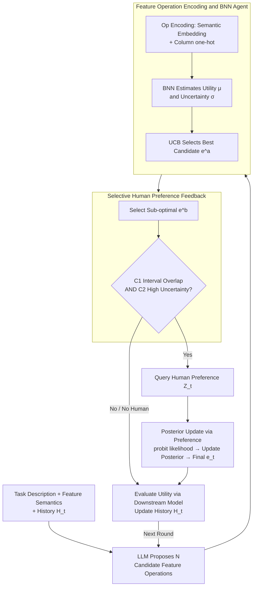

# Human-LLM Collaborative Feature Engineering for Tabular Learning

**Conference**: ICLR 2026  
**arXiv**: [2601.21060](https://arxiv.org/abs/2601.21060)  
**Code**: None  
**Area**: AutoML / Tabular Learning  
**Keywords**: Feature Engineering, Human-in-the-loop, Bayesian Optimization, LLM, Tabular Data

## TL;DR

A human-LLM collaborative feature engineering framework is proposed, which decouples LLM feature operation proposals from the selection process. It models operation utility and uncertainty via Bayesian Neural Networks (BNN) to guide selection and selectively introduces human preference feedback. The approach achieves an average error rate reduction of 8.96% to 11.23% across 18 tabular datasets.

## Background & Motivation

**Background**: LLMs are widely used in tabular learning for automated feature engineering (AFE), generating meaningful feature transformation operations through semantic understanding (e.g., CAAFE, OCTree).

**Limitations of Prior Work**: Existing methods utilize the LLM as both the proposer and the selector of feature operations. Relying entirely on internal LLM heuristics lacks calibrated estimates of operation utility and uncertainty, leading to repeated exploration of low-yield operations and suboptimal performance under limited iteration budgets.

**Key Challenge**: There is a conflict between the LLM's strong capability in generating diverse feature transformation candidates and its weak capability in making optimal selections among them.

**Goal**: How to decouple LLM operation proposal from selection and effectively integrate human expert knowledge during the selection process to improve feature engineering efficiency.

**Key Insight**: Leveraging Bayesian Optimization principles, explicit surrogate models are used to replace the LLM's implicit selection, and a selective human feedback mechanism is designed to control the cost of expert participation.

**Core Idea**: The LLM is responsible only for proposing candidate feature operations. Selection is guided by the UCB strategy of a BNN, and human preference feedback is selectively introduced when uncertainty is high.

## Method

### Overall Architecture

The method decomposes each round of feature engineering into "Proposal" and "Selection": The LLM only generates $N$ candidate feature transformation operations (15 per round in the implementation) based on task descriptions, feature semantics, and historical performance. The actual decision of which operation to apply is delegated to a Bayesian Neural Network (BNN) surrogate model. This model first encodes each operation into a vector and then estimates the expected utility $\mu_t(e)$ and uncertainty $\sigma_t^2(e)$, with the optimal candidate $e_t^a$ picked by the UCB strategy. When the surrogate model is uncertain, the framework selectively chooses a sub-optimal candidate $e_t^b$ to request a preference from a human expert. This feedback is integrated into the posterior probabilistically to determine the selected operation. Finally, the actual utility is evaluated on a downstream model, $H_t$ is updated, and the process moves to the next round.

### Key Designs

**1. Feature Operation Encoding and BNN Surrogate Model: Replacing Implicit LLM Selection with Calibrated Explicit Estimation**

Existing methods let the LLM both propose and select, meaning "which operation is better" is left entirely to the language model's internal heuristics, which can neither quantify utility nor express uncertainty. This paper uses a BNN as a surrogate model for scoring. The challenge lies in encoding the natural language operations generated by the LLM into vectors: the embedding for each operation consists of a semantic embedding $\phi_{\text{embedding}}(e)$ (from text-embedding-3-small) concatenated with a column usage encoding $\phi_{\text{column}}(e) \in \{0,1\}^d$. The latter uses a one-hot vector to mark which columns are affected, specifically resolving ambiguity when semantic descriptions of different column operations are similar. The BNN learns the parameter posterior $q_t(\boldsymbol{\theta}) = \mathcal{N}(\boldsymbol{\theta}; \boldsymbol{M}_t, \boldsymbol{\Sigma}_t)$ via variational inference, providing both the predictive mean $\mu_t(e)$ and variance $\sigma_t^2(e)$. BNNs are preferred over Gaussian Processes (GP) as they scale better in high-dimensional, language-derived feature spaces and better fit non-stationary structures.

**2. Selective Human Preference Feedback: Consulting Experts Only When Necessary**

Introducing human feedback can correct surrogate model bias, but querying every round imposes a heavy cognitive load. Therefore, after selecting the optimal candidate $e_t^a$ and sub-optimal candidate $e_t^b$ via UCB, a query is triggered only if two conditions are met: (1) confidence interval overlap $\text{UCB}_t(e_t^b) > \text{LCB}_t(e_t^a)$, indicating uncertainty in their relative ranking; and (2) sufficiently high uncertainty $\sqrt{\beta_t}(\sigma_t(e_t^a) + \sigma_t(e_t^b)) \geq \gamma_\kappa$, suggesting the potential gain from the query exceeds the query cost $\gamma_\kappa$ (set to 4). Together, these gates ensure experts are only involved when their feedback provides significant utility gain.

**3. Posterior Update via Preference Feedback: Probabilistic Integration of Human Advice**

Upon receiving the human preference $Z_t$ between $e_t^a$ and $e_t^b$, the framework does not simply adopt the choice but treats it as an observation to be integrated into the posterior. Preferences are modeled via a probit likelihood: $\mathcal{P}(Z_t | \boldsymbol{\theta}, e_t^a, e_t^b) = \Phi(\eta Z_t [\hat{g}(\phi(e_t^a); \boldsymbol{\theta}) - \hat{g}(\phi(e_t^b); \boldsymbol{\theta})])$. The variational posterior is updated to $q_t'(\boldsymbol{\theta})$ accordingly, and the final decision is made based on the updated UCB values. This approach is robust to noisy feedback; if a human makes an occasional error, the probabilistic integration pulls evidence together rather than being completely derailed by a single incorrect feedback.

### Loss & Training

The BNN is trained by minimizing the ELBO: $\text{KL}(q_t(\boldsymbol{\theta}) \| \mathcal{P}(\boldsymbol{\theta})) - \mathbb{E}_{q_t(\boldsymbol{\theta})}[\log \mathcal{P}(H_t | \boldsymbol{\theta})]$, balancing fitting historical observations $H_t$ with staying close to the prior. The UCB exploration coefficient is $\beta_t = 2\log(|\mathcal{S}_t|\pi^2 t^2 / 3\delta)$ with $\delta=0.1$, which increases with round $t$ to maintain exploration. The human query cost threshold is $\gamma_\kappa=4$.

## Key Experimental Results

### Main Results

| Dataset | Metric | Ours (w/o human) | Ours (w/ human) | Prev. SOTA | Gain (w/ human) |
|--------|------|------|------|------|------|
| 13 Classification (MLP) | AUROC(%) | 85.3 | 85.5 | 84.7 (OCTree) | 8.96% Error reduction |
| 13 Classification (XGBoost) | AUROC(%) | 87.4 | 87.4 | 86.7 (OCTree) | 11.23% Error reduction |
| flight (MLP) | AUROC(%) | 96.9 | 97.3 | 94.8 (OCTree) | +48.1% Error reduction |
| conversion (XGBoost) | AUROC(%) | 93.5 | 93.9 | 92.4 (OCTree) | +11.5% Error reduction |

### Ablation Study

| Configuration | Metric | Description |
|------|------|------|
| Different LLM Backbone (GPT-5) | MLP Avg 85.9→86.5 | Ours (w/ human) is optimal with GPT-5 |
| Different LLM Backbone (GPT-3.5) | MLP Avg 84.6→85.1 | Advantage maintained even with weaker backbones |
| User Study (ALG vs Control) | Performance: p=0.011 | ALG framework significantly improves user performance |
| User Study (ALG vs Control) | Completion Time: p<0.001 | ALG framework significantly reduces completion time |

### Key Findings

- LLM-based methods overall outperform traditional AutoML (OpenFE, AutoGluon), validating the value of semantic understanding in feature engineering.
- Explicit modeling of utility and uncertainty results in error rate reductions of 7.24% and 9.02% respectively compared to relying solely on LLM heuristics.
- Human preference feedback consistently brings additional improvements, while the computational overhead (BNN+UCB) accounts for only 2.2% of total time.

## Highlights & Insights

- Applying Bayesian Optimization concepts to LLM-driven feature engineering by decoupling proposal and selection is an elegant engineering design. Theoretical guarantees of UCB for balancing exploration/exploitation turn the selection process from a black box into a transparent mechanism.
- The two conditions of the selective query mechanism (confidence interval overlap + uncertainty gating) have solid theoretical support (Lemma 3.1-3.2), achieving an optimal trade-off between human cognitive cost and information gain.

## Limitations & Future Work

- Human feedback was simulated by GPT-4o in experiments; the actual user study was conducted only on a single dataset, limiting generalizability.
- The calibration quality of the BNN surrogate model may be poor in early rounds when data is sparse; the cold-start problem is not fully discussed.
- The framework only considers the utility of individual operations and does not model interaction effects between multiple operation combinations.

## Related Work & Insights

- **vs CAAFE**: CAAFE lets the LLM both propose and select operations, making it prone to local optima; the proposed decoupling allows for sustained discovery of high-value operations.
- **vs OCTree**: OCTree uses decision tree feedback to guide the LLM, but still relies on the LLM's internal heuristics for selection; this work uses BNN for more calibrated utility estimation.
- **vs Traditional Bayesian Optimization**: Traditional BO uses GP as a surrogate, which is effective in low-dimensional spaces; this work uses BNN to handle high-dimensional language embedding spaces.

## Rating

- Novelty: ⭐⭐⭐⭐ The framework design of decoupling proposal/selection and introducing human feedback is novel with complete theoretical analysis.
- Experimental Thoroughness: ⭐⭐⭐⭐ Validated from multiple perspectives including 18 datasets, user studies, and computational scalability analysis.
- Writing Quality: ⭐⭐⭐⭐ Clear motivation, rigorous theoretical derivation, and comprehensive experimental presentation.
- Value: ⭐⭐⭐ Practical application scenarios are clear, though LLM API costs are required; the method has good generalizability.

<!-- RELATED:START -->

## Related Papers

- [\[ECCV 2024\] Image-Feature Weak-to-Strong Consistency: An Enhanced Paradigm for Semi-Supervised Learning](../../ECCV2024/llm_evaluation/image-feature_weak-to-strong_consistency_an_enhanced_paradigm_for_semi-supervise.md)
- [\[ACL 2026\] TabReX: Tabular Referenceless eXplainable Evaluation](../../ACL2026/llm_evaluation/tabrex_tabular_referenceless_explainable_evaluation.md)
- [\[ICLR 2026\] In-Context Learning for Pure Exploration](in-context_learning_for_pure_exploration.md)
- [\[NeurIPS 2025\] Toward Engineering AGI: Benchmarking the Engineering Design Capabilities of LLMs](../../NeurIPS2025/llm_evaluation/toward_engineering_agi_benchmarking_the_engineering_design_capabilities_of_llms.md)
- [\[ICLR 2026\] AutoMetrics: Approximate Human Judgments with Automatically Generated Evaluators](autometrics_approximate_human_judgments_with_automatically_generated_evaluators.md)

<!-- RELATED:END -->
