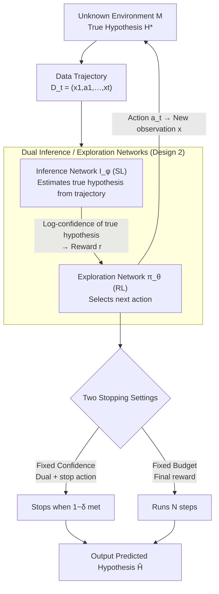

# In-Context Learning for Pure Exploration

**Conference**: ICLR 2026  
**arXiv**: [2506.01876](https://arxiv.org/abs/2506.01876)  
**Code**: Available (Attached to paper)  
**Area**: LLM Evaluation  
**Keywords**: In-Context Learning, Pure Exploration, Hypothesis Testing, Best Arm Identification, Transformer

## TL;DR

The paper proposes ICPE (In-Context Pure Exploration), an in-context learning framework combining supervised and reinforcement learning. It uses Transformers to directly learn exploration strategies from experience, achieving near-optimal instance-adaptive performance in active sequential hypothesis testing/pure exploration problems without explicit modeling of information structures.

## Background & Motivation

In active sequential hypothesis testing (also known as pure exploration), an agent must actively control the data collection process to efficiently identify the correct hypothesis. This problem is pervasive in medical diagnosis, image recognition, and recommendation systems. Current methods face three major challenges:

**Inductive bias is difficult to encode**: Designing adaptive exploration strategies requires a profound understanding of problem structure, which is especially difficult when the underlying information structure is unknown.

**Limitations of RL methods**: Traditional RL methods often perform poorly when the relevant information structure is not adequately represented.

**Limitations of BAI methods**: Classical methods such as Best Arm Identification (BAI), while theoretically elegant, typically rely on explicit modeling assumptions, and the optimization problem becomes non-convex in complex environments like MDPs.

Core Problem: Can an agent **autonomously** discover and exploit underlying structures from experience to enhance exploration efficiency?

## Method

### Overall Architecture

ICPE addresses active sequential hypothesis testing: given an unknown environment $\mathcal{M}$ (where the true hypothesis is $H^*$), the agent must decide how to gather data step-by-step to identify $H^*$ as quickly and accurately as possible. The core idea is to decompose this task into a pair of mutually reinforcing Transformers: the **Inference Network** $I_\phi$ is responsible for "reading data and making judgments," using supervised learning to estimate the true hypothesis from the collected trajectory $\mathcal{D}_t = (x_1, a_1, \ldots, x_t)$; the **Exploration Network** $\pi_\theta$ is responsible for "choosing where to sample next," using reinforcement learning to select actions that improve the inference network's predictions.

The entire pipeline is a closed loop: in each step, the exploration network selects an action applied to the environment, receives a new observation, and extends the trajectory; the inference network reads this longer trajectory to provide a confidence level for the true hypothesis, which is then converted into a reward for the exploration network. Consequently, a self-reinforcing cycle emerges: "Accurate inference → Reliable reward → Smarter exploration → Informative data → Even more accurate inference." Inductive biases do not need to be manually engineered; they are learned by the network from experience. This architecture is adapted to two stopping settings based on task requirements—either stopping early with a fixed error tolerance (Fixed Confidence) or running for a fixed number of steps (Fixed Budget)—before outputting the predicted hypothesis $\hat{H}$.

### Key Designs

**1. Pure Exploration reformulated as MDP: Leveraging RL for "Active Data Selection"**

Classical Best Arm Identification methods rely on explicit modeling assumptions; as environments become complex (e.g., MDPs), optimization objectives become non-convex and intractable. ICPE reformulates the entire exploration process as a sequential decision-making process: the state $s_t = (\mathcal{D}_t, \emptyset_{t:N})$ consists of the historical trajectory padded with tokens to a maximum length $N$, and the action space $\mathcal{A}$ includes an additional "stop" action in fixed-confidence settings. Thus, "which data to sample next" becomes a standard MDP decision solvable by RL; the underlying information structure no longer needs to be pre-encoded into the algorithm but is instead discovered by the network from experience—this is why the approach outperforms greedy information gain methods in structured environments like "magic-action."

**2. Dual Inference/Exploration Networks: Closing the loop with Confidence Rewards**

Implementation of the MDP solution relies on two specialized Transformers. The Inference Network $I_\phi(H \mid \mathcal{D}_t)$ uses supervised learning to approximate the posterior $\mathbb{P}(H^* = H \mid \mathcal{D}_t)$, focusing solely on estimating the hypothesis from current data. The Exploration Network is defined by a greedy policy from a Q-network $Q_\theta(\mathcal{D}_t, a)$, focusing on action selection. While decoupled, they are functionally linked: the log-confidence of the true hypothesis provided by $I_\phi$ serves as the reward signal for $\pi_\theta$. As the inference network improves, the reward becomes more reliable, leading the exploration network to learn strategies for extracting more information, which in turn provides more informative data to the inference network. This mutual reinforcement is key to ICPE's ability to approach instance optimality without manual inductive bias.

**3. Two Stopping Settings: Dual + Stop Action for Fixed Confidence, Final Reward for Fixed Budget**

The same architecture applies different rewards based on the task. **Fixed Confidence** aims to minimize stopping time $\tau$ subject to $\mathbb{P}(\hat{H}_\tau = H^*) \geq 1 - \delta$, which is a constrained optimization problem. ICPE uses a Lagrangian multiplier $\lambda$ to convert this into a dual problem $\min_{\lambda \geq 0} \max_{I, \pi} V_\lambda(\pi, I)$, incorporating the constraint into the reward:

$$r_\lambda(z) = -1 + d \cdot \lambda \log I_{\bar{\phi}}(H^* \mid s')$$

Every step incurs a $-1$ penalty to encourage efficiency, while a positive reward is issued based on the inference network's log-confidence when the termination indicator $d$ is triggered. A critical detail is the dedicated "stop" action: its Q-value depends only on history, allowing the agent to "simulate stopping" at any state to perform retrospective updates (even if the actual action was not "stop"). This facilitates a form of curriculum learning, allowing the agent to learn when to terminate based on problem difficulty. **Fixed Budget** is simpler: the budget is fixed at $N$ steps to maximize identification accuracy. The stop action is removed, intermediate rewards are zero, and a final reward $r_N = h(\hat{H}_N; \mathcal{M})$ is calculated at the last step to force the network to extract maximum information within the limit.

**4. Multi-Time-Scale Alternating Optimization: Asynchronous Update Rhythms**

Since the dual variables, inference network, and policy network are coupled, simultaneous updates can lead to instability. ICPE employs different convergence scales: the slowest scale updates the dual variable $\lambda$ (using a small learning rate $\beta$ and projected gradient $\lambda \leftarrow \max[0, \lambda - \beta(\hat{p} - 1 + \delta)]$ based on predicted accuracy $\hat{p}$); the intermediate scale trains the inference network $I_\phi$ via cross-entropy supervised learning; the fastest scale trains the policy network $Q_\theta$ using DQN with a Replay Buffer. Additionally, target networks $Q_{\bar{\theta}}$ and $I_{\bar{\phi}}$ are maintained (synced every $T_\theta$ / $T_\phi$ steps) to stabilize bootstrapping. The slow scale provides a stable reward landscape for the fast scale to explore, preventing divergence.

### Loss & Training

The inference network uses cross-entropy: $\mathcal{L}_{\text{inf}}(\phi) = -\frac{1}{|B|}\sum \log I_\phi(H^* \mid \mathcal{D}_{t+1})$ (equivalent to minimizing KL divergence from the true posterior). The policy network uses DQN's TD loss, with additional stopping action loss under fixed confidence. The backbone is a GPT-2 configured Transformer—3 layers, 2 attention heads, 256 hidden dimensions, GELU activation—optimized with Adam, using a learning rate annealed between $10^{-4}$ and $10^{-6}$. Fixed-budget and fixed-confidence models are trained independently with their respective rewards and Q-functions.

## Key Experimental Results

### Main Results

**1. Deterministic Bandit (Fixed Budget)**

| K (Actions) | ICPE Accuracy | DQN | Uniform | I-DPT |
|-----------|-----------|-----|---------|-------|
| 4-20 | ≈1.0 | Gradual Decline | Rapid Decline | Moderate |

- ICPE spontaneously learned the optimal strategy of "selecting each action exactly once."

**2. Stochastic Bandit (Fixed Confidence, $\delta=0.1$)**

| K | ICPE Avg. Stopping Time | TaS | TTPS | Uniform |
|---|----------------|-----|------|---------|
| 4-14 | Lowest | Moderate | Moderate | Highest |

- ICPE approaches the theoretical lower bound in sample complexity.

**3. Magic Action Bandit (Hidden Information Structure)**

| $\sigma_m$ | ICPE | I-IDS | Theoretical Lower Bound |
|-----------|------|-------|---------|
| 0.0-1.0 | Near Bound | Significantly Higher | - |

- ICPE outperforms I-IDS across all noise levels.

**4. MNIST Pixel Sampling**

| Method | Accuracy | Avg. Sampled Regions |
|------|--------|-------------|
| ICPE | Highest | Fewer |
| Deep CMAB | Moderate | More |
| Uniform | Lowest | Same |

### Ablation Study

| Configuration | Key Metric | Description |
|------|---------|------|
| Fixed Confidence vs. Fixed Budget | Fixed Confidence is superior | The stop action introduces a curriculum learning effect |
| ICPE Policy vs. Approx. TaS | TV Distance variation | ICPE utilizes prior information |
| Class-Specific Sampling | ICPE shows most variation | Chi-square tests confirm significantly different strategies across digits |

### Key Findings

1. **ICPE Spontaneously Discovers Optimal Strategies**: It learns to select each action exactly once in deterministic bandits and discovers $O(\log_2 K)$ search strategies in binary search tasks.
2. **Maximum Advantage in Structured Environments**: In the "Magic Action" environment, ICPE identifies and exploits information chains that greedy information-gain methods like IDS fail to use.
3. **The Stop Action is Vital for Fixed Confidence**: It acts as a form of curriculum learning, enabling the agent to adapt to problem difficulty.
4. **Context-Adaptive Policies**: In the MNIST task, sampling strategies vary significantly and meaningfully across different digit classes.

## Highlights & Insights

- **Elegance of Dual-Network Design**: The Inference Network $I$ provides reward signals to the Exploration Network $\pi$, creating a virtuous cycle—Improved $I$ → More accurate rewards → Better $\pi$ exploration → More informative data → Further improved $I$.
- **Algorithm Discovery Capability**: ICPE automatically discovers a probabilistic version of binary search (stopping time exactly matches $\log_2 K$).
- **Theoretical Proof of IDS Suboptimality** (Theorem B.1): The paper proves that greedy information gain strategies (IDS) are suboptimal in structured environments with "magic actions" due to their inability to perform long-term planning.
- **Connection to Cognitive Science**: The dual-network architecture of ICPE parallels the concept of a cognitive map (Exploration Network) combined with goal-directed evaluation (Inference Network).

## Limitations & Future Work

1. **Finite Hypothesis Space $\mathcal{H}$**: Current hypotheses $\mathcal{H}$ are finite sets; this needs extension to continuous cases (active regression).
2. **Dependence on Prior Distribution $\mathcal{P}(\mathcal{M})$**: Assumes the task distribution is known and static.
3. **Oracle Assumption**: Requires a perfect verifier during training, which may not be available in practice.
4. **Transformer Horizon Limits**: Constrained by a fixed maximum context length $N$.
5. **Scalability**: Currently validated on small-scale problems; scaling to larger tasks requires architectural and training improvements.
6. Potential for integration with LLMs to leverage linguistic priors for assisted exploration.

## Related Work & Insights

- **Relation to RL²**: Similarly represents policies via the hidden state of an RNN/Transformer, but targets identification rather than cumulative reward.
- **Difference from ICEE**: ICEE handles the exploration-exploitation tradeoff (return-conditioned learning), whereas ICPE focuses strictly on pure identification.
- **Connection to Track-and-Stop**: ICPE identifies strategies similar to TaS in some cases but achieves better performance by utilizing prior information.
- Insight: Combining In-Context Learning (ICL) capacity with sequence modeling creates a platform for automated algorithm design.

## Rating

- Novelty: ⭐⭐⭐⭐⭐ (Introducing ICL to pure exploration with an elegant dual-network design)
- Experimental Thoroughness: ⭐⭐⭐⭐⭐ (Progressive validation from simple bandits to MNIST and MDPs)
- Writing Quality: ⭐⭐⭐⭐ (Solid combination of theory and experiments, though the paper is lengthy)
- Value: ⭐⭐⭐⭐⭐ (Provides a general deep learning framework for active hypothesis testing)

<!-- RELATED:START -->

## Related Papers

- [\[ICLR 2026\] In-Context Learning of Temporal Point Processes with Foundation Inference Models](in-context_learning_of_temporal_point_processes_with_foundation_inference_models.md)
- [\[ICLR 2026\] Detecting Data Contamination in LLMs via In-Context Learning](detecting_data_contamination_in_llms_via_in-context_learning.md)
- [\[ICML 2025\] Sample Efficient Demonstration Selection for In-Context Learning](../../ICML2025/llm_evaluation/sample_efficient_demonstration_selection_for_in-context_learning.md)
- [\[ICLR 2026\] Towards Self-Evolving Agent Benchmarks: Validatable Agent Trajectory via Test-Time Exploration](towards_self-evolving_agent_benchmarks_validatable_agent_trajectory_via_test-tim.md)
- [\[ICLR 2026\] Human-LLM Collaborative Feature Engineering for Tabular Learning](human-llm_collaborative_feature_engineering_for_tabular_data.md)

<!-- RELATED:END -->
