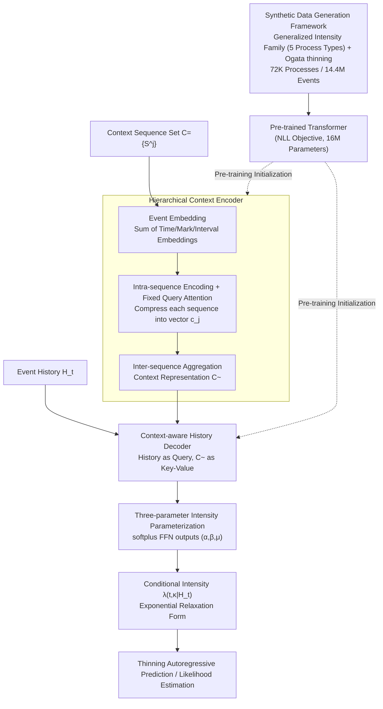

# In-Context Learning of Temporal Point Processes with Foundation Inference Models

**Conference**: ICLR 2026  
**arXiv**: [2509.24762](https://arxiv.org/abs/2509.24762)  
**Code**: [OpenFIM](https://fim4science.github.io/OpenFIM/intro.html)  
**Area**: LLM Evaluation  
**Keywords**: Temporal Point Processes, Foundation Inference Models, In-Context Learning, Hawkes Processes, Conditional Intensity Function

## TL;DR

Proposes FIM-PP—the first foundation inference model for Marked Temporal Point Processes (MTPP). By pre-training a Transformer on 72K synthetic point processes (14.4 million events) to perform in-context inference of conditional intensity functions, it achieves zero-shot performance comparable to specialized models trained for hours. After minutes of fine-tuning, it sets a new SOTA across four real-world datasets for multi-event prediction.

## Background & Motivation

**Background**: Marked Temporal Point Processes (MTPP) represent the standard framework for modeling asynchronous, irregular event sequences, widely used in financial trading, social media propagation, neural spikes, and epidemiology. The core mathematical object is the conditional intensity function $\lambda(t,\kappa|\mathcal{H}_t)$—the instantaneous rate of occurrence for each event category at a future time given the event history. Classical Hawkes processes model excitation/inhibition between events via linear self-exciting kernels, while subsequent neural methods (NHP, A-NHP, etc.) introduce RNNs/Transformers to encode history, yet they follow the "one model per dataset" paradigm.

**Limitations of Prior Work**: Models must be trained from scratch for every new event sequence dataset, often taking hours, and learned representations cannot be transferred across systems. Meanwhile, although foundation models have emerged in fields like NLP, ODE, and SDE (e.g., ODEFormer, FIM-MJP), the event sequence domain remains a blank. Furthermore, while popular generative methods (diffusion, flow matching) offer high prediction accuracy, they completely sacrifice the interpretability of the intensity function—failing to reveal the excitation/inhibition structures between events.

**Key Challenge**: To satisfy three objectives simultaneously: (1) zero-shot generalization across datasets, (2) high-precision multi-step prediction, and (3) preservation of the interpretability of the conditional intensity function—whereas existing methods fulfill at most two.

**Key Insight**: This work draws from the Foundation Inference Model (FIM) paradigm—pre-training a "recognition network" on large-scale synthetic data to learn the inference of underlying dynamical parameters from a set of in-context event sequences. The key observation is that if the family of conditional intensity functions in the synthetic data is sufficiently broad, the pre-trained model can encode powerful priors, enabling zero-shot inference or extremely fast fine-tuning on real-world data.

**Core Idea**: Pre-train a Transformer on large-scale synthetic MTPPs covering five types of processes, enabling it to directly infer the three analytical parameters ($\alpha, \beta, \mu$) of the conditional intensity function from a set of in-context sequences, thereby achieving zero-shot/fast-tuning interpretable event sequence prediction.

## Method

### Overall Architecture

The workflow of FIM-PP is divided into two stages. **Pre-training Stage**: Define a broad family of conditional intensity functions (covering classical Hawkes, Poisson, periodic processes, high initial excitation processes, and non-monotonic kernel processes). Sample a large number of MTPPs from this family and simulate event sequences using the Ogata thinning algorithm to generate "(context sequence set, event history, ground-truth intensity)" triplets as training data. **Inference Stage**: Given a set of context event sequences $\mathcal{C}=\{\mathcal{S}^j\}$ from the same system and an event history $\mathcal{H}_t$, the model first compresses the context into fixed representations using a **hierarchical encoder**, then combines it with the current history via a **context-aware history decoder**. Finally, a feed-forward network outputs the three analytical parameters of the conditional intensity function $\hat{\lambda}(t,\kappa|\mathcal{H}_t)$, which can be used directly for likelihood estimation or autoregressive future event prediction via the thinning algorithm.

### Key Designs

**1. Synthetic Data Generation Framework: Feeding broad priors with a family of generalized intensity functions**

The success of zero-shot transfer in pre-training depends on how many types of event dynamics the synthetic data covers. The authors do not limit themselves to classical Hawkes but define a generalized conditional intensity function:

$$\lambda(t,\kappa|\mathcal{H}_t)=\max\Big(0,\ \mu_\kappa(t)+\sum_{(t',\kappa)\in\mathcal{H}_t} z_{\kappa\kappa'}\gamma_{\kappa\kappa'}(t-t')\Big)$$

Five families of processes are sampled to fill the distribution: (a) Classical Hawkes (constant base intensity + exponential decay kernel), (b) Poisson (constant base intensity, no interaction kernel), (c) Periodic processes (sinusoidal base intensity), (d) High initial excitation (Gamma distribution base intensity), and (e) Non-monotonic shifted kernels (Rayleigh distribution kernel). Interaction structures $z_{\kappa\kappa'}\in\{-1,0,1\}$ are randomly sampled for each mark pair $(\kappa,\kappa')$, corresponding to inhibition, no effect, and excitation. Simulations via Ogata thinning result in 72K point processes and 14.4 million events. A surprise benefit of this broad coverage is that the model can correctly infer power-law kernels (Figure 4) never seen during training, suggesting it learns local relaxation behaviors rather than specific kernels.

**2. Hierarchical Context Encoder: Intra-sequence then inter-sequence to bypass $O(N^2)$ complexity**

During inference, the model ingests a set of context sequences $\mathcal{C}=\{\mathcal{S}^j\}$ from the same system. Since the number and length of sequences vary, they must be compressed into a fixed dimension. Instead of concatenating all events into one ultra-long sequence (which hits the $O(N^2)$ attention bottleneck), the authors use a two-level compression: Each event $(t_i, \kappa_i, \Delta t_i)$ passes through three embedding networks ($\phi_t, \phi_\kappa, \phi_{\Delta t}$, with sinusoidal activations for time) to get event embedding $\mathbf{u}_i$. Within a single sequence, event embeddings are processed by a Transformer encoder $\Psi_\text{enc}^\text{cont}$, followed by a learnable fixed query $\mathbf{q}^\text{cont}$ using attention to compress the sequence into a single vector $\mathbf{c}_j$. Finally, all $\mathbf{c}_j$ are aggregated into the context representation $\tilde{\mathbf{C}}$ by a second encoder $\Psi_\text{enc}^\text{comb}$. This allows the context scale to grow freely without exhausting memory.

**3. Context-Aware History Encoder + Three-parameter Intensity Parameterization: Combining analytical forms with neural parameters for flexibility and interpretability**

To output intensity, the model combines the context with the current history $\mathcal{H}_t$. The embedding of $\mathcal{H}_t$ serves as the query for a Transformer decoder $\Psi_\text{dec}^\text{hist}$, while $\tilde{\mathbf{C}}$ acts as the key-value, yielding history encoding $\mathbf{h}_t^\text{hist}$. This is concatenated with mark embeddings and passed through three independent FFNs (with softplus activation) to output $(\hat{\alpha}, \hat{\beta}, \hat{\mu})$. The conditional intensity is then formulated in an exponential relaxation form:

$$\hat{\lambda}(t,\kappa'|\mathcal{H}_t)=\hat{\mu}+(\hat{\alpha}-\hat{\mu})\exp\!\big(-\hat{\beta}(t-t_\text{last})\big)$$

Intuitively, as a new event occurs, the intensity jumps to $\hat{\alpha}$ and then relaxes exponentially to the baseline $\hat{\mu}$ at rate $\hat{\beta}$. While it uses only three parameters like a Hawkes process, the key difference is that these parameters are history- and mark-dependent (outputs of the neural network), allowing it to locally fit behaviors far beyond fixed Hawkes processes, such as Rayleigh or power-law kernels. This compromise between an "analytical skeleton" and "neural complexity" preserves expressivity while allowing users to read the excitation/inhibition structure from the intensity curve.

### Loss & Training

The training objective is the standard negative log-likelihood (NLL) for the next event: $\mathcal{L}_\text{NLL}=\sum_\kappa \int_0^T \hat{\lambda}(s,\kappa|\mathcal{H}_s)ds - \sum_{(t,\kappa)\in\mathcal{T}}\hat{\lambda}(t,\kappa|\mathcal{H}_t)$. During training, the number of context sequences, truncation lengths, and mark counts are randomly subsampled to ensure the model adapts to varying real-world data scales. The model has only 16M parameters and supports up to 22 marks. Fine-tuning uses the same NLL optimization on the target dataset, taking only minutes with memory consumption under 11GB.

## Key Experimental Results

### Main Results: Multi-event Prediction (N=20)

Comparison with 7 baselines across four real-world datasets (Taxi, StackOverflow, Amazon, Retweet), reporting OTD (Optimal Transport Distance, lower is better) and sMAPE (Symmetric Mean Absolute Percentage Error, lower is better):

| Method | Taxi OTD | SO OTD | Amazon OTD | Retweet OTD | Taxi sMAPE | SO sMAPE | Amazon sMAPE | Retweet sMAPE |
|:---|:---:|:---:|:---:|:---:|:---:|:---:|:---:|:---:|
| HYPRO | 21.60 | 42.40 | 38.6 | 61.03 | 93.8 | 111.00 | 82.5 | 106.11 |
| A-NHP | 24.76 | 42.59 | 39.5 | 60.63 | 97.4 | 108.54 | 84.3 | 107.23 |
| CDiff | 21.01 | 41.25 | 37.7 | 60.66 | 88.0 | 106.18 | 82.0 | 106.18 |
| FIM-PP (zs) | 23.15 | 49.26 | 46.2 | 60.24 | **76.8** | 96.36 | 128.6 | 99.07 |
| **FIM-PP (f)** | **17.91** | **39.80** | **37.2** | **59.44** | 76.8 | **88.25** | **81.2** | **87.59** |

Fine-tuned FIM-PP (f) achieved the best OTD across all 4 datasets and best sMAPE in 3/4. Zero-shot FIM-PP (zs) already outperformed all baselines on the Retweet dataset.

### One-event Prediction (N=1)

| Method | Taxi RMSE$_{\Delta t}$ | Taxi Acc | Taxi sMAPE | Taobao RMSE$_{\Delta t}$ | Taobao Acc | Taobao sMAPE |
|:---|:---:|:---:|:---:|:---:|:---:|:---:|
| A-NHP | 0.32 | **0.91** | 85.13 | 0.53 | 0.47 | 129.13 |
| CDiff | 0.34 | **0.91** | 87.12 | **0.52** | **0.48** | 127.12 |
| FIM-PP (zs) | **0.15** | 0.41 | 69.37 | 1.41 | 0.09 | 163.34 |
| FIM-PP (f) | **0.15** | 0.69 | **63.02** | 9.31 | 0.39 | 138.46 |

FIM-PP leads significantly in time prediction metrics (RMSE, sMAPE) but lags behind in mark accuracy—likely because the Taxi dataset has a fixed mark alternation pattern and Taobao is dominated by a single mark, both of which are out-of-distribution patterns not covered by the synthetic prior.

### Ablation Study

| Configuration | Description |
|:---|:---|
| Pre-training vs. Scratch | Same architecture; pre-training initialization converges faster and yields better final performance (Appendix Figure 5). |
| Number of Context Sequences | Performance plateaus with significantly fewer than 2000 context sequences (Figure 6). |
| Unseen Kernel Generalization | Zero-shot inference correctly predicts intensity curves for power-law kernels never seen during training (Figure 4). |
| Window N=5/10/20 | FIM-PP (f) consistently outperforms baseline average performance across all prediction window lengths. |

### Key Findings

- **Zero-shot is competitive**: Without any target domain training, FIM-PP (zs) outperforms specialized models that require hours of training on the Retweet data, indicating the synthetic prior encodes powerful inductive biases.
- **Highly efficient fine-tuning**: Fine-tuning on all datasets takes only minutes and 11GB of VRAM, significantly outperforming baselines and faster than baseline training by over an order of magnitude.
- **Mark prediction is a weak spot**: Zero-shot mark accuracy is only 0.41 (Taxi) and 0.09 (Taobao). Although fine-tuning improves this, it still lags behind specialized models because the synthetic prior does not cover dataset-specific patterns like "fixed alternation" or "single-mark dominance."
- **Surprising prior generalization**: Zero-shot intensity estimation remains accurate even for unseen power-law kernels, suggesting the three-parameter exponential relaxation form possesses stronger local adaptation than expected.

## Highlights & Insights

- **First Foundation Inference Model for TPP**: FIM-PP fills a gap in foundation models for the event sequence domain. Similar to LLMs in NLP, it demonstrates the viability of the "synthetic pre-training + in-context inference" paradigm for non-linguistic domains.
- **Analytical intensity parameterization balances flexibility and interpretability**: The $(\alpha, \beta, \mu)$ parameters, despite their simplicity, can fit complex local behaviors far beyond Hawkes because they are history- and mark-dependent. This design philosophy is transferable to other scenarios requiring interpretable dynamical modeling.
- **Hierarchical sequence encoding avoids long-sequence bottlenecks**: Encoding sequences independently before aggregation allows the context size to grow freely, a general trick for handling set-like inputs.
- **Synthetic prior quality determines the zero-shot ceiling**: The failure in mark prediction highlights specific blind spots in the prior (alternation patterns, dominant marks), providing a clear direction for future improvements.

## Limitations & Future Work

- **Insufficiently universal synthetic prior**: Current process families do not cover structural mark patterns (e.g., fixed alternation), leading to poor zero-shot mark prediction. Expanding the prior to more mark dynamics is a priority.
- **Fixed mark cap**: The model is trained with a maximum of 22 marks; exceeding this limit prevents utilizing the full context. Dynamic mark embeddings or grouping strategies could address this.
- **Intensity parameterization limits**: The exponential relaxation form, while flexible, has limited capability to fit multi-modal kernels. Multi-component mixture parameterization could be explored.
- **Integration with intensity-free methods**: Intensity-free methods (diffusion, flow matching) have advantages in prediction precision; combining them with FIM-PP’s interpretable inference is a key future direction.

## Related Work & Insights

- **vs. CDiff (Diffusion-based Event Prediction)**: CDiff directly generates event sets with high precision but sacrifices intensity interpretability. FIM-PP outperforms CDiff on most metrics after fine-tuning while retaining physical semantics.
- **vs. NHP / A-NHP (Neural Hawkes)**: These methods rely on conditional intensity but require training from scratch per dataset. FIM-PP eliminates this burden via synthetic pre-training and outperforms them by 10-30% in OTD after fine-tuning.
- **vs. FIM-MJP / FIM-SDE (Other Foundation Inference Models)**: FIM-PP extends the FIM paradigm from Markov Jump Processes/SDEs to Point Processes, validating the universality of the "synthetic pre-training + analytical parameterization + in-context inference" framework.

Core Insight: **The design quality of the synthetic prior determines the generalization ceiling of foundation inference models.**

## Rating

| Dimension | Score |
|:---:|:---:|
| Novelty | ⭐⭐⭐⭐⭐ |
| Technical Depth | ⭐⭐⭐⭐ |
| Experimental Thoroughness | ⭐⭐⭐⭐ |
| Writing Quality | ⭐⭐⭐⭐ |
| Value | ⭐⭐⭐⭐ |
| Overall | ⭐⭐⭐⭐ |

> Powerfully introduces foundation inference models to temporal point processes. The synthetic pre-training and in-context learning approach is highly inspiring, with impressive zero-shot performance and SOTA results after fine-tuning. The main limitation lies in the scope of the synthetic prior.

<!-- RELATED:START -->

## Related Papers

- [\[ICLR 2026\] In-Context Learning for Pure Exploration](in-context_learning_for_pure_exploration.md)
- [\[ICLR 2026\] Detecting Data Contamination in LLMs via In-Context Learning](detecting_data_contamination_in_llms_via_in-context_learning.md)
- [\[ICML 2025\] Sample Efficient Demonstration Selection for In-Context Learning](../../ICML2025/llm_evaluation/sample_efficient_demonstration_selection_for_in-context_learning.md)
- [\[ICLR 2026\] Rewarding Doubt: A Reinforcement Learning Approach to Calibrated Confidence Expression of Large Language Models](rewarding_doubt_a_reinforcement_learning_approach_to_calibrated_confidence_expre.md)
- [\[ICLR 2026\] GuidedSampling: Steering LLMs Towards Diverse Candidate Solutions at Inference-Time](guidedsampling_steering_llms_towards_diverse_candidate_solutions_at_inference-ti.md)

<!-- RELATED:END -->
