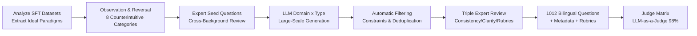

# Inverse IFEval: Can LLMs Unlearn Stubborn Training Conventions to Follow Real Instructions?

**Conference**: ICLR 2026  
**OpenReview**: [https://openreview.net/forum?id=sTwMHXReLc](https://openreview.net/forum?id=sTwMHXReLc)  
**Code**: [Inverse IFEval @ Hugging Face](https://huggingface.co/) (Publicly declared in the paper; specific links are in the text)  
**Area**: LLM Evaluation / Instruction Following Benchmark  
**Keywords**: Instruction following, counterintuitive instructions, cognitive inertia, LLM-as-a-Judge, alignment overfitting, OOD instructions  

## TL;DR
This paper proposes **Inverse IFEval**, an instruction-following benchmark that systematically reverses the "ideal labeling paradigm" of SFT. Using 8 categories of "counterintuitive instructions" and 1012 bilingual Chinese-English problems, it specifically measures whether LLMs can break free from the "cognitive inertia" implanted by alignment training to execute real-world instructions that conflict with training habits.

## Background & Motivation
- **Background**: Mainstream benchmarks like IFEval, MMLU, and Arena-Hard measure "conventional" abilities—factual correctness, knowledge recall, and format compliance. Models perform exceptionally well on these instructions that "align with training habits."
- **Limitations of Prior Work**: SFT/RLHF labeling almost always follows an "idealized paradigm"—answers must be correct, formats must be standardized, code must include comments, and text must be readable. Models overfit on massive volumes of such corpora, forming what authors call **cognitive inertia**. When encountering instructions that conflict with the training paradigm (e.g., "strictly forbid any bullet points," "please give a deliberately wrong answer," "write prose without paragraph breaks"), models subconsciously "correct" the user and revert to training habits, leading to instruction-following failure.
- **Key Challenge**: Real-world needs include long-tail, abnormal, and dynamically changing requirements that post-training cannot exhaustively cover. A model's compliance with such **OOD instructions** is the true touchstone of instruction-following robustness, yet existing benchmarks almost entirely ignore this dimension. The tension between "training for standardization" and "users occasionally needing to break standards" is neglected in current evaluations.
- **Goal**: Define and quantify a new evaluation dimension—**Counter-Cognitive / Counterintuitive Ability**—the ability of a model to override its own training conventions and faithfully execute counterintuitive instructions, establishing a diagnostic and reusable benchmark.
- **Core Idea**: **"Do As I Say, Not As You Were Trained."** First, summarize several "golden rules" of SFT labeling, then **reverse** each into an adversarial instruction to form 8 categories of challenges designed to test if a model dares to violate its trained preferences.

## Method

### Overall Architecture
The construction of Inverse IFEval follows a five-step human-in-the-loop pipeline: "Observation—Reversal—Generation—Filtering—Human Review." Ideal labeling paradigms (e.g., "follow best practices," "ensure readability," "answers must be correct") are extracted from mainstream SFT datasets and reversed into 8 counterintuitive instruction types. Experts write seed questions → LLMs perform large-scale expansion via a domain × type template → automatic filtering (length constraints, semantic deduplication) → triple expert verification. The result is 1012 questions (506 English, 506 Chinese) across 23 disciplines with detailed scoring rubrics, evaluated by an optimized LLM-as-a-Judge matrix with $98\%$ accuracy.

### Key Designs

**1. Observation-Reversal: Reversing SFT rules into 8 counterintuitive categories.** The authors, drawing from SFT labeling experience, identified paradigms like factuality, best practices, readability, and prompt conciseness. The core mechanism involves **reversing** these: requiring a correct answer becomes "Deliberately Incorrect Answers (DIA)"; requiring commented code becomes "Code without Comments (CC)"; requiring standardized formatting becomes "Counter-Conventional Formatting (CCF)" (e.g., disabling all bullet points/paragraphs). The 8 categories are: Question Correction (fixing errors in the prompt itself), Intentional Textual Flaws, Code without Comments, Counter-Conventional Formatting, Deliberately Incorrect Answers, Instructional Induction, Mid-turn Instruction Modification, and Counterfactual Answering. These scenarios are rare in standard training corpora and thus expose cognitive inertia.

**2. Five-step human-in-the-loop pipeline + Triple quality control.** To ensure tasks are "cleanly reversed with single test points" and avoid ambiguity, three gates are used: seed questions require **unanimous approval** from experts with diverse backgrounds (product/engineering/operations); the generation stage produces 20 candidates per domain × type before cross-model verification; the expert review stage enforces **type consistency**, **instructional clarity**, and **rubric calibration** to ensure distinguishability. The final 1012 questions are strictly aligned across Chinese and English (506 each) and cover 23 disciplines, with CS being the most frequent ($20.2\%$).

**3. Adaptive Judge Matrix: Tailoring judge models and templates to specific instructions to raise accuracy from $88\%$ to $98\%$.** Assessing counterintuitive tasks is difficult because determining if a model "actually violated training habits" requires nuanced semantic judgment. This is engineered into a "Type × Optimal Configuration" matrix: (i) **Judge Selection**—testing multiple SOTA models per category to pick the most accurate; (ii) **Template Optimization**—selecting templates based on context dependency; (iii) **System Prompt Strengthening**—embedding fine-grained logic and few-shot examples to visualize scoring standards.

## Key Experimental Results

### Main Results: Overall scores of 21 mainstream LLMs on Inverse IFEval

| Model | English Overall | Chinese Overall |
|------|------|------|
| o3-high | **75.66** | **76.52** |
| o3-mini | 74.67 | 75.26 |
| GPT-5-high | 73.72 | 76.02 |
| Gemini-2.5-pro | 70.55 | 74.47 |
| Claude-4-Opus-Thinking | 67.16 | 73.81 |
| GPT-4.1 | 50.33 | 47.46 |
| GLM-4.5 (Open Source) | 58.30 | 66.96 |
| Qwen3-235B-A22B-Thinking | 54.22 | 70.62 |
| DeepSeek-R1-0528 | 50.00 | 56.92 |
| Qwen3-235B-A22B-Instruct | 40.28 | 43.28 |
| Qwen3-30B-A3B-Instruct | 30.43 | 31.42 |

> Even the strongest o3-high scored only around $76$, significantly lower than its scores on conventional IFEval, indicating that counterintuitive instructions pose a substantial challenge to all models.

### Key Findings
- **Deeper overfitting makes reversal harder**: Pure SFT/Instruct models (e.g., Qwen3-Instruct) performed worst, confirming the benchmark targets "alignment overfitting."
- **Thinking mechanisms are key to counterintuitive ability**: Reasoning processes provide extended compute to "digest" abnormal constraints and allow for System-2 style self-correction rather than reflexive token generation based on SFT preferences.
- **Scale correlation**: Within the Qwen3 series, larger parameter counts correlated with higher counterintuitive scores.
- **QC (Question Correction) is the hardest**: Most models scored lowest here (Claude-4-Sonnet English scored $21.48$), showing models are heavily locked into the inertia that "the user's prompt must be correct."
- **Language disparities**: While scores across languages were generally similar, some open-source models (e.g., Qwen3-Thinking) scored significantly higher in Chinese than in English, suggesting counterintuitive compliance is influenced by training data distribution.

## Highlights & Insights
- **The "Reversal Paradigm" is a sharp evaluation philosophy**: Instead of creating new knowledge, reversing "golden rules" turns the qualitative problem of "alignment overfitting" into a quantifiable 8-dimensional diagnostic.
- **IQ test analogy**: While these instructions lack "daily utility," like IQ tests, they serve as OOD stress tests for model generalization.
- **Judge Engineering ($88\% \to 98\%$)**: Replacing a single judge with a matrix of types, optimal configurations, and reinforced prompts provides a reusable methodology for LLM-as-a-Judge evaluations.
- **A call for alignment research**: Future alignment should not just pursue fluency and factuality but also preserve adaptability in unconventional contexts to avoid creating stubborn cognitive inertia.

## Limitations & Future Work
- **"Unnatural" tasks**: The 8 instruction categories are somewhat artificially constructed and lack direct utility, leaving a gap between the benchmark and real long-tail needs.
- **Reliance on LLM-as-a-Judge**: Despite $98\%$ accuracy, whether a judge model's own cognitive inertia biases the results remains a concern.
- **Diagnosis without solutions**: The paper focuses on identifying the problem; methods to mitigate cognitive inertia (e.g., counterintuitive data augmentation) are left for future work.
- **Disciplinary coverage**: While covering 23 fields, the distribution is uneven (CS at $20\%$), and counterintuitive patterns across cultures and more languages require expansion.

## Related Work & Insights
- **vs IFEval / IFEval-Code / Sysbench**: While these focus on conventional compliance, Inverse IFEval is the first large-scale benchmark ($1012$ questions, bilingual) to systematically reverse training paradigms.
- **vs MMLU / Arena-Hard**: These measure knowledge and human preference, whereas this paper measures the "willingness to violate trained preferences," a truly orthogonal dimension.
- **Echoing Reasoning Model Research**: Experiments provide evidence that thinking mechanisms improve non-reasoning task performance through System-2 style drafting and self-evaluation.
- **Insights**: (1) "Reversal Paradigms" can be used to create diagnostic sets for any scenario where models over-correct users (e.g., creative writing, red teaming). (2) Mixing small amounts of counterintuitive samples into alignment data might directly mitigate cognitive inertia.

## Rating
- **Novelty**: ⭐⭐⭐⭐⭐ — The "Reversal of SFT Paradigm" perspective is sharp and novel.
- **Experimental Thoroughness**: ⭐⭐⭐⭐ — Covers 21 mainstream models, bilingual results, and thinking/non-thinking comparisons, though lacks verification of mitigation methods.
- **Writing Quality**: ⭐⭐⭐⭐ — Clear motivation ("Do As I Say, Not As You Were Trained") and well-documented pipeline.
- **Value**: ⭐⭐⭐⭐⭐ — Targets a real pain point and serves as both a diagnostic tool and a lighthouse for alignment research.

<!-- RELATED:START -->

## Related Papers

- [\[ICCV 2025\] A Real-world Display Inverse Rendering Dataset](../../ICCV2025/llm_evaluation/a_real-world_display_inverse_rendering_dataset.md)
- [\[ICLR 2026\] Truthfulness Despite Weak Supervision: Evaluating and Training LLMs Using Peer Prediction](truthfulness_despite_weak_supervision_evaluating_and_training_llms_using_peer_pr.md)
- [\[ICLR 2026\] Rethinking LLM Evaluation: Can We Evaluate LLMs with 200× Less Data?](rethinking_llm_evaluation_can_we_evaluate_llms_with_200_less_data.md)
- [\[ICLR 2026\] ASIDE: Architectural Separation of Instructions and Data in Language Models](aside_architectural_separation_of_instructions_and_data_in_language_models.md)
- [\[ICLR 2026\] Can LLMs Refuse Questions They Do Not Know? Measuring Knowledge-Aware Refusal in Factual Tasks](can_llms_refuse_questions_they_do_not_know_measuring_knowledge-aware_refusal_in_.md)

<!-- RELATED:END -->
