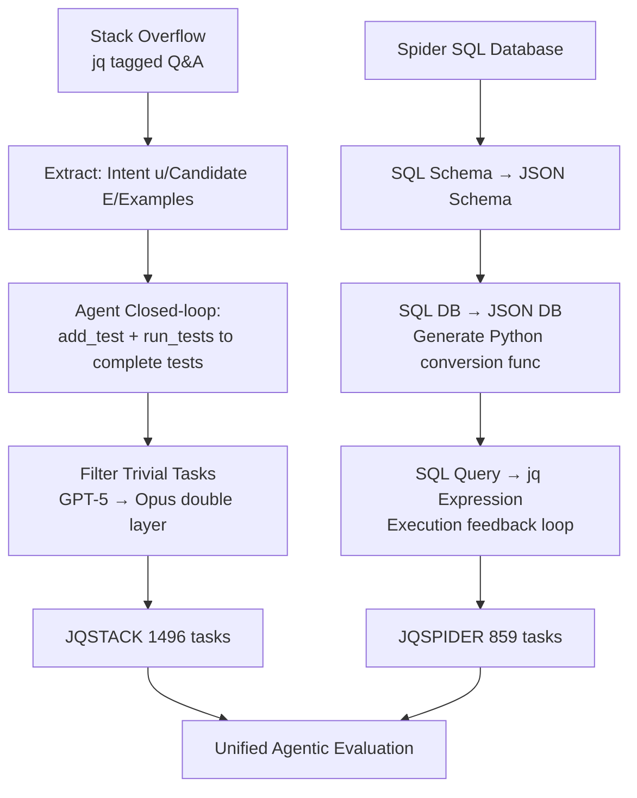

# JQBench: A Benchmark for Reading and Writing JSON from Natural Language and/or Examples

**Conference**: ICLR 2026  
**OpenReview**: [https://openreview.net/forum?id=VStKtgGXUc](https://openreview.net/forum?id=VStKtgGXUc)  
**Code**: [https://github.com/PidgeyUsedGust/jqBench](https://github.com/PidgeyUsedGust/jqBench)  
**Area**: LLM Evaluation / Code Generation Benchmark  
**Keywords**: jq, JSON transformation, natural language to code, programming-by-example, agentic evaluation, low-resource language  

## TL;DR
This paper constructs **JQBench**, a benchmark for evaluating the ability of LLMs to translate natural language and/or I/O examples into `jq` expressions (querying, filtering, and transforming JSON). Generated via two automated pipelines—Stack Overflow (JQSTACK, 1496 tasks) and Spider (JQSPIDER, 859 tasks)—it reveals three counter-intuitive findings: the "Documentation Trap," "jq lagging behind Python," and "Example feedback is crucial."

## Background & Motivation
- **Background**: JSON has become the de facto standard data format for Web APIs, databases, configuration files, and LLM reasoning/agent workflows. Querying and transforming JSON is a high-frequency task. Tools like `jq` are expressive but have obscure syntax. While NL-to-code benchmarks (HumanEval, Spider, etc.) are emerging, none **simultaneously cover natural language intent and executable JSON querying/transformation**.
- **Limitations of Prior Work**: Although `jq` is powerful, its concise and rare syntax makes it difficult for models to generate correct expressions from natural language. For example, when asked to "find common elements between two arrays," GPT-5 might write a long, incorrect nested `index` call, whereas the correct solution is simply `.[0] - (.[0] - .[1])`. No existing benchmark systematically measures such problems.
- **Key Challenge**: JSON data forms are free and varied, input signals are diverse (NL, examples, JSON Schema), and `jq` is a low-resource language with high expressivity but rare usage. This combination makes "constructing a high-quality benchmark" difficult, especially for evaluation. **Manual annotation is costly and error-prone** (e.g., 30%+ NL-SQL mapping errors found in Spider), while pure synthesis loses the robustness of real-world user queries.
- **Goal**: Construct a jq benchmark that is low-cost, auto-verifiable, close to real-world developer problems, and capable of challenging the strongest models, while analyzing LLM capabilities in low-resource languages, agentic feedback, and PBE settings.
- **Core Idea**: **Use LLM agents and execution feedback to automatically "translate" two types of high-quality resources (real Q&A from Stack Overflow and relational databases from Spider) into machine-verifiable jq tasks.** The former provides diverse real-world problems and I/O examples, while the latter provides large-scale structured data with deep nesting, resulting in a complementary, executable benchmark.

## Method

### Overall Architecture
JQBench = JQSTACK $\cup$ JQSPIDER. The data for both are generated by independent automated pipelines and evaluated using a unified agentic protocol. JQSTACK follows the process: "Extract intent + candidate solutions + examples from Stack Overflow → Agent-based completion of test cases → Filter trivial problems." JQSPIDER follows a step-by-step conversion: "SQL Schema → JSON Schema → JSON Database → jq Query." All intermediate steps use compilation/execution feedback for closed-loop validation to ensure tasks have automatically verifiable correct answers.

### Key Designs

**1. JQSTACK: "Distilling" verifiable tasks from real Q&A.** The pipeline comprises four steps: extraction, conversion, filtering, and manual review. In the **Extraction** stage, GPT-5 distills from each jq-tagged Q&A: (1) original quotes of key questions/solutions, (2) precise intent description $u$, (3) all candidate jq expressions $E$ satisfying the intent, and (4) optional I/O examples, resulting in 15,860 raw extractions. The **Conversion** stage is the core: agents are given two tools: `add_test(n,i,o)` (add a test named $n$ with expected input $i$ and output $o$) and `run_tests(e)` (run expression $e$ on all tests and return results). This allows the model to reflect and correct test outputs in a closed loop (7.5% of conversions involved such self-correction). Finally, candidate expressions are executed on the testing set to determine correct answers, yielding 14,620 (GPT-5) + 923 (Opus) valid conversions. The ingenuity of this design is that **it does not require the model to write solutions from scratch; instead, it provides candidate solutions and examples, reducing open-ended generation to a verifiable alignment problem.**

**2. Double-layer filtering + manual review for difficulty and quality.** Many tasks in real-world Q&A are trivial (e.g., "print field named text" where the solution is `.text`), which allows strong models to score perfectly without providing discriminative value. The authors use "zero-shot, temperature 0 jq generation" as a filter: GPT-5 first filters out 11,066 tasks solvable directly, then Opus 4.1 filters out another 1,913, leaving **1,496 challenging tasks**. Finally, manual review is performed on tasks that no baseline could solve—mostly due to **under-specification** (hard-coded constants, adversarial boundaries, schema mutations in unseen samples, or ambiguity). About 25 were fixed and 43 were discarded. The 13K filtered simple tasks were released as **fine-tuning seeds**.

**3. JQSPIDER: "Lifting" relational databases into nested JSON queries.** Starting from the fixed Spider dataset, a three-step conversion is applied: (1) The model converts the SQL Schema (columns, types, foreign keys) into a **JSON Schema**, choosing appropriate root tables and using nested objects/arrays to represent 1:1 and 1:N relationships. (2) The SQL database is converted into a **JSON database** matching the schema—first by flattening tables into trivial JSON, then iteratively writing Python conversion functions using `jsonschema` for validation (197 out of 202 databases successful). (3) Given NL instructions, SQL queries, the JSON Schema, and expected SQL output, the model iteratively writes equivalent **jq expressions**, verified by execution feedback, producing 893 tasks. The value of this line is: **more tables $\rightarrow$ deeper JSON nesting $\rightarrow$ jq requires longer `map`/`select` pipeline chains** (correlation between SQL JOINs and jq pipes $r=0.326$), systematically creating "long-chain reasoning" challenges.

**4. Unified agentic evaluation protocol: Decoupling feedback, language, and instructions.** The default setting is based on SELF-DEBUG—always providing compilation feedback, execution feedback when input exists, and test results for output (i.e., **implicit feedback**). Based on this, three variables are compared: (a) **Implicit vs. Explicit tools**—adding `run_code` (run expressions on synthetic input) and `search_docs`/`print_docs` (retrieve jq docs) to see if active exploration helps; (b) **jq vs. Python**—using similar prompts to solve the same task in Python, isolating the "language unfamiliarity" bottleneck; (c) **NL vs. PBE**—removing natural language instructions and leaving only "match the query to following I/O examples," regressing the task to programming-by-example. All settings use a maximum of 8 iterations at temperature 0, with value-match as the metric (ignoring record keys or order when unordered).

## Key Experimental Results

### Main Results (Value-match, excerpt)

| Dataset | Model | Language | Implicit Feedback | Value Acc | iter@1 |
|---------|-------|----------|-------------------|-----------|--------|
| JQSTACK | Opus 4.1 | jq | ✓ | **0.76** (Best jq) | 0.30 |
| JQSTACK | GPT-5 | jq | ✓ | 0.68 | 0.11 |
| JQSTACK | GPT-5-mini | jq | ✓ | 0.59 | 0.10 |
| JQSTACK | Phi-4 | jq | ✓ | 0.10 | 0.02 |
| JQSTACK | Opus 4.1 | Python | ✓ | **0.83** (Best overall) | 0.69 |
| JQSTACK | GPT-5 | Python | ✓ | 0.82 | 0.66 |
| JQSPIDER | Opus 4.1 | jq | ✓ | **0.81** (Best) | – |
| JQSPIDER | GPT-5 | jq | ✓ | 0.78 | – |
| JQSPIDER | Phi-4 | jq | ✓ | 0.43 | – |

### Ablation Study

| Comparison | Phenomenon | Data |
|------------|------------|------|
| Implicit → Add `run_code` explicit tool | Performance **decreases** | GPT-5 −53%, Opus 4.1 −22% |
| jq → Python (JQSTACK) | jq lags behind | Phi-4 54%→10%, GPT-5 82%→68%, Opus only −5% |
| With vs. Without Docs (Opus 4.1) | "Documentation Trap" | 76% → 31% |
| NL → Pure Example PBE | Slight decrease | Opus 76%→71%, GPT-5 68%→63%, mini 59%→53% |

### Key Findings
- **Language unfamiliarity is the primary bottleneck**: Models often "understand the task but cannot express it in jq," especially smaller models (Phi-4: 10% in jq vs 54% in Python); Opus 4.1 has strong coding abilities and is nearly unaffected (only 1% compilation failure).
- **"Free exploration" is harmful**: With explicit tools, GPT-5 did not use tools in 78% of tasks and had low example coverage (27.8% vs. Opus 68.5%). It often persisted with wrong answers despite seeing error outputs—active exploration is less effective than passive implicit feedback.
- **"Documentation Trap"**: Opus 4.1, the best at jq, suffered a performance crash when given documentation because it entered loops of repeated documentation requests (5x higher request rate than the second highest model). Beyond a certain capability, SELF-DEBUG is more cost-effective than RAG documentation retrieval.
- **Feedback is crucial, with diminishing returns after 4 rounds**: Every model has a low iter@1 and requires multiple rounds of feedback. Performance plateaus after 4 (Opus) or 7–8 rounds; stagnation is primarily due to **overfitting on examples** (despite instructions emphasizing generalization).
- **Hard-to-construct tasks are hard to solve, but no contamination**: There is no correlation between the distance of the generated solution from the original candidate and accuracy, suggesting no data contamination issues.

## Highlights & Insights
- **The "Reduction to Alignment" Philosophy**: Instead of having the model write solutions from scratch, the pipeline provides candidates and examples, requiring agents only to complete executable tests. This is a reusable paradigm for building high-quality benchmarks at low cost using LLMs.
- **Dual-Source Complementarity**: JQSTACK tests "deep knowledge" (116 built-in functions, 99 tasks requiring custom operators), while JQSPIDER tests "long-chain composition" (median of 4 pipes). One tests breadth, the other depth.
- **Counter-intuitive discoveries as contributions**: The Documentation Trap, the harm of explicit tool use, and jq lagging behind Python all suggest that in agentic workflows, "giving models more power" is not always better.
- **Release of 13K fine-tuning data**: The benchmark serves not just evaluation but can also drive research into low-resource language fine-tuning (as suggested by Phi-4's struggle).

## Limitations & Future Work
- **Single Input Restriction**: Current tasks only support a single JSON input and do not handle multi-input/multi-file jq programs, failing to cover real multi-source workflows.
- **Difficulty ceiling of automatic construction**: Dependence on LLMs to generate solutions from rich signals may limit the number of extremely difficult tasks; the authors plan to use manual annotation + stronger models to complete remaining failed conversions.
- **English Only**: Source data (Stack Overflow, Spider) are in English; the benchmark currently lacks multilingual support.
- **Relaxed Equivalence Criteria**: Evaluation relaxes equivalence (ignoring key names, order, or wrap-in-list), which might be too loose for strict semantic equivalence scenarios.

## Related Work & Insights
- **Nearest Neighbors**: DOCSPIDER (Spider $\rightarrow$ MongoDB) and JSONSCHEMABENCH (constrained decoding). JQBench differs by translating SQL ($\rightarrow$ jq) and scraping real Stack Overflow problems to cover diverse, irregular JSON forms.
- **NL-to-CLI**: NL2Bash (12K commands, but only 2 for jq) and Terminal-Bench (Terminal agents, fewer data-op tasks). jq is essentially a CLI tool, and JQBench fills the gap for "data-transformative CLIs."
- **Benchmark Methodology**: Echoes ODEX (Stack Overflow + manual tests) and BigCodeBench (LLM + human expansion), emphasizing the importance of "real-world queries + execution validation" for robustness.
- **Value for PBE Research**: By removing NL, JQSTACK regresses into a challenging programming-by-example benchmark, bridging symbolic and neural PBE research.

## Rating
- **Novelty**: ⭐⭐⭐⭐ First benchmark combining NL + Examples + Executable JSON transformation. Targets jq as a neglected low-resource language. Original construction paradigm and counter-intuitive findings.
- **Experimental Thoroughness**: ⭐⭐⭐⭐ Systematically compares multiple models (Opus/GPT-5/GPT-5-mini/Phi-4) and diverse settings (Implicit vs. Explicit, jq vs. Python, NL vs. PBE, w/ vs. w/o Docs). Detailed analysis of difficulty proxies.
- **Writing Quality**: ⭐⭐⭐⭐ Clear diagrams for pipelines and storytelling in the findings (e.g., "Documentation Trap"). However, tables have many symbols and can be difficult to read.
- **Value**: ⭐⭐⭐⭐ Provides an auto-verifiable challenging benchmark + 13K fine-tuning data. Directly impacts agent feedback design, low-resource code generation, and execution-guided decoding.

<!-- RELATED:START -->

## Related Papers

- [\[ICLR 2026\] Towards Personalized Deep Research: Benchmarks and Evaluations](towards_personalized_deep_research_benchmarks_and_evaluations.md)
- [\[ICLR 2026\] RedacBench: Can AI Erase Your Secrets?](redacbench_can_ai_erase_your_secrets.md)
- [\[ICLR 2026\] Evaluating Language Models' Evaluations of Games](evaluating_language_models_evaluations_of_games.md)
- [\[ICLR 2026\] Culture in Action: Evaluating Text-to-Image Models through Social Activities](culture_in_action_evaluating_text-to-image_models_through_social_activities.md)
- [\[ICLR 2026\] Talk, Evaluate, Diagnose: User-aware Agent Evaluation with Automated Error Analysis](talk_evaluate_diagnose_user-aware_agent_evaluation_with_automated_error_analysis.md)

<!-- RELATED:END -->
