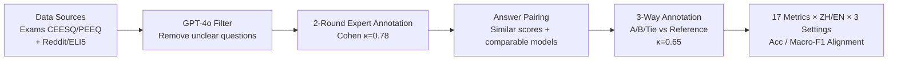

# LFQA-E: Carefully Benchmarking Long-form QA Evaluation

**Conference**: ICLR 2026  
**OpenReview**: [https://openreview.net/forum?id=bJYm4v0Spr](https://openreview.net/forum?id=bJYm4v0Spr)  
**Code**: [https://github.com/YuchenFan48/LFQA-E](https://github.com/YuchenFan48/LFQA-E)  
**Area**: LLM Evaluation / Long-form QA Evaluation / Benchmark  
**Keywords**: Long-Form QA, automatic evaluation metrics, reference answers, multilingual benchmark, LLM-as-a-Judge, Reward Model  

## TL;DR
The authors constructed LFQA-E, a long-form QA evaluation benchmark featuring expert reference answers, covering 15 domains in both Chinese and English, with 1,618 questions and 7,323 comparison pairs. The study systematically demonstrates that none of the 17 existing automatic evaluation metrics can approximate human judgment and analyzes the root causes of their failure.

## Background & Motivation

Long-form QA (LFQA) requires models to generate paragraph-level, information-dense responses to open-ended questions. However, automatically evaluating the quality of these long answers remains an unresolved challenge. Manual evaluation requires domain expertise and is costly, while crowdsourced labeling is unreliable due to a lack of professional knowledge, making automatic evaluation metrics indispensable.

**Background**: Metrics have proliferated, ranging from lexical similarity measures like ROUGE/BERTScore to LLM-as-a-Judge (prompting/fine-tuning) and utilizing LLMs as Reward Models for scoring. However, systematic verification of which metrics most closely align with human judgment is lacking.

**Limitations of Prior Work**: The only existing expert-annotated LFQA benchmark (Xu et al. 2023) suffers from three major flaws: (1) **Lack of authoritative reference answers**, where preference between two responses depends solely on the annotator's subjectivity; (2) **Small scale and English-only**, consisting of only 260 entries with limited diversity in topics and language; (3) **Binary A/B choice only**, whereas real-world responses are often evenly matched, necessitating a "tie" option.

**Key Challenge**: Long-form answers are information-dense and flexible in format. Candidate responses often revolve around the same topic with high lexical overlap but subtle differences in whether they capture core points—a blind spot for existing metrics that previous benchmarks failed to expose due to the lack of references.

**Goal**: To create a "challenging yet reasonable" benchmark that realistically reflects the difficulties of long-form evaluation and to systematically scrutinize all current mainstream evaluation paradigms.

**Key Insight**: By using **reference answers as anchors + forcing difficult-to-distinguish comparisons + multi-lingual/multi-domain settings**, the benchmark can truly distinguish which metrics "understand" long-form content. This is achieved only when metrics must check information coverage point-by-point against expert references for two responses of similar quality.

## Method

### Overall Architecture
The core of LFQA-E is its "data construction + evaluation protocol" rather than a specific model. Questions were collected from offline exams and recent Reddit/ELI5 posts, filtered by GPT-4o, and annotated by experts in two rounds to create a question bank with reference answers. Each question is paired with two candidate answers (human-written or model-generated) with similar scores/upvotes that are difficult to distinguish at a glance. Domain annotators then perform a three-way choice (A better / B better / Tie) against the reference. Finally, 17 metrics are tested across Chinese/English and three settings, using their alignment with human judgment as the sole measure of quality.

### Key Designs

**1. "Hard Comparison" Evaluation Anchored by Expert References:** This is the fundamental difference between LFQA-E and previous benchmarks. Each question is equipped with a reference answer audited by two domain experts covering all key points. Evaluation thus evolves from "judging by feeling" to "point-by-point verification of information coverage." To maximize difficulty, human candidate answers are selected based on similar upvotes, while model responses are generated using Llama-3-8B-Instruct and GPT-3.5-turbo ($temperature=1.0$) with similar LMSYS Arena rankings. Stronger models like GPT-4o/Claude are intentionally avoided to ensure candidates are evenly matched. Annotation follows a FActScore-style "information unit" decomposition.

**2. Three-way Choice (Including Tie) Annotation Protocol:** Unlike the traditional binary A/B choice, LFQA-E introduces a "tie" option. Long-form answers often have comparable information coverage, where extra content might be irrelevant or redundant without affecting understanding. Forcing a choice in such cases introduces noise. Judgment focuses on "factuality" and "completeness relative to the reference." This subtle change effectively exposes metric flaws; experiments show almost all automatic metrics "fear to judge a tie." Even GPT-4o achieves only 9.2% accuracy on the English tie subset, which explains why Accuracy is consistently higher than Macro-F1.

**3. Three Settings + Multilingual + 15 Domains:** Comparisons are categorized into human vs. human (h v. h), human vs. model (h v. m), and model vs. model (m v. m) to observe performance variations across sources. It covers 15 domains from engineering to law and medicine in both Chinese and English. This stratification allows the benchmark to diagnose where metrics fail rather than providing a single score. Results show accuracy for all metrics crashes in the Chinese m v. m setting (DeepSeek-V3 dropped by up to 14.2%), confirming that current metrics cannot distinguish between two subtly different responses.

**4. Anti-contamination Data Collection + TTRL Improvement:** Data is sourced from 2024 offline exam PDFs (not available online) and recent ELI5 posts. Perplexity (PPL) and n-gram overlap tests ($PPL \approx 7-12$, n-gram overlap $0.025-0.093$) prove the data is essentially uncontaminated. Additionally, the authors attempted to enhance small model evaluation through structured prompting (wrapping answers in `<answer>...</answer>`) and TTRL (Test-Time Reinforcement Learning based on DeepSeek-R1 style rule rewards). Qwen2.5-7B improved from 53.3% with CoT to 68.2% with TTRL. To prevent TTRL from over-fitting to triple classification and losing rollout diversity, a clip-higher mechanism from DAPO was introduced, further increasing performance to 68.6%.

## Key Experimental Results

### Main Results (Alignment of 17 Metrics on LFQA-E, AvgF1 / AvgAcc)

| Metric Category | Representative Model | AvgF1 | AvgAcc |
|---|---|---|---|
| **Human Baseline** | Human Baseline | **73.3** | **79.9** |
| Static Metrics | ROUGE | 35.8 | 52.6 |
| Static Metrics | BERTScore | 36.3 | 53.3 |
| LLM | GPT-4o | 44.5 | 57.5 |
| LLM | Qwen2.5-32B-Instruct | 43.8 | 60.1 |
| RM | RM-R1-DeepSeek-Distilled-Qwen-14B | 40.3 | 59.5 |
| LRM | o1-mini | 45.6 | 60.9 |
| Specially Trained | Auto-J-6B-bilingual | 40.7 | 59.4 |

**Core Conclusion**: The best automatic metric (o1-mini) achieved an AvgAcc of only 60.9%, nearly 20 percentage points behind the human baseline of 79.9%. No metric currently approaches human performance.

### Tie Subset / Cross-Benchmark Comparison Table

| Dimension | Key Figure |
|---|---|
| Tie Subset Best Accuracy (GPT-4o) | EN 9.2% / ZH 14.6% (Rarely predicts a tie) |
| Chinese m v. m Setting | All metrics drop significantly; DeepSeek-V3 by 14.2% |
| Cross-Benchmark Difficulty (GPT-4o) | Feedback-Bench 89.2% → Expert 70.0% → **LFQA-E 57.5%** |
| TTRL Gain (Qwen2.5-7B, EN) | CoT 53.3% → Structured Prompt 60.6% → TTRL 68.2% → +Clip-Higher 68.6% |

### Key Findings
- **Scale $\neq$ Ability**: Qwen2.5-32B outperformed the 72B version by approximately 3%, showing that blindly increasing parameters is ineffective for long-form evaluation.
- **Reasoning and Specialization are Key**: LRMs (long CoT) and specifically trained generative RMs significantly lead over standard LLMs, indicating that "reasoning" and "targeted fine-tuning" are crucial for LFQA evaluation.
- **Temperature Sensitivity**: Reducing temperature from 1.0 to 0 makes LLM metrics more stable but causes LRMs to collapse (o1-mini Acc dropped from 58.9% to 5.8% in Chinese).
- **Metric Disagreement**: Cohen's $\kappa$ among the top six metrics is generally very low, with English even showing negative correlation, indicating no stable or consistent evaluation results.
- **Four Root Causes of Failure** (LLM-as-a-Judge): Key point identification errors, failure to penalize irrelevant/incorrect info, self-contradictory reasoning (hallucinations), and formatting errors—with the first two being the most prevalent.

## Highlights & Insights
- The **"Reference + Hard Comparison + Tie Option"** combination accurately targets the pain points of long-form evaluation. The dismal performance on the tie subset provides the most convincing evidence of failure: current metrics do not fail to "choose" but fail to "admit" that two answers are equally good.
- Designing the benchmark as a **diagnostic tool rather than just a leaderboard**: The 3 settings $\times$ bilingual $\times$ 15 domains structure allows for pinpointing where metrics fail, providing far more information than a single aggregate score.
- **Solid Anti-contamination**: Use of offline PDFs, recent ELI5 data, and PPL/n-gram double-testing directly addresses whether the benchmark was memorized during pre-training.
- TTRL + clip-higher exploration provides a **practical direction for improvement**: Instead of seeking larger off-the-shelf models, performing test-time reinforcement learning on smaller models is more effective.

## Limitations & Future Work
- **TTRL was only demonstrated for English**, and the issues of rapid convergence or over-fitting to triple classification are not fully resolved; clip-higher is merely a mitigation.
- Model responses were generated only by Llama-3-8B and GPT-3.5-turbo, which **diverges from the output distribution of current frontier models**. Evaluation difficulty for the "strong model era" may take different forms.
- The judgment focus is restricted to factuality and completeness, **omitting evaluation of creative or stylistic long-form writing**.
- The benchmark scale (1,618 questions) is still small compared to general benchmarks and depends on expert annotation, making it difficult to scale cost-effectively.
- While providing a diagnosis of why metrics fail, the paper **does not propose a new, fully competent metric**, leaving this for future work.

## Related Work & Insights
- **Extending and repairing Xu et al. (2023)**: This work uses experts for long-form evaluation but adds reference answers, expands to bilingual/multi-domain settings, and includes tie options, upgrading a small 260-entry English benchmark into a systematic diagnostic platform.
- **Information Unit Annotation (FActScore, Min et al. 2023)**: Decomposing answers into atomic info-points for verification is the key methodology for transforming "long-form evaluation" into "key-point coverage evaluation."
- **TTRL (Zuo et al. 2025) + DAPO clip-higher (Yu et al. 2025) + DeepSeek-R1 style rule rewards**: Integrating test-time reinforcement learning into evaluation models is the most valuable technical takeaway.
- A **warning for researchers in LLM-as-a-Judge / Reward Models**: Strong RMs with 70%+ on RM-Bench/Reward-Bench drop to 52-59% on LFQA-E, indicating that current RM benchmarks fail to cover long-form info-dense scenarios and that their generalizability is significantly overestimated.

## Rating
- **Novelty**: ⭐⭐⭐⭐ — The value lies not in a new model, but in the combination of "Reference + Hard Comparison + Tie + Multi-lingual/Multi-domain/Multi-setting" protocols. Tie diagnostics and root cause analysis provide genuine insights.
- **Experimental Thoroughness**: ⭐⭐⭐⭐ — 17 metrics $\times$ 5 paradigms $\times$ bilingual $\times$ 3 settings, plus temperature ablation, inter-metric trust, anti-contamination, and TTRL improvements.
- **Writing Quality**: ⭐⭐⭐⭐ — Clear logic from motivation to flaws to construction and diagnosis. Tie analysis and failure causes are well-supported by data.
- **Value**: ⭐⭐⭐⭐ — Provides a high-quality, credible, and anti-contaminated bilingual benchmark and diagnostic framework for LFQA evaluation. One star is deducted for not proposing a new successful metric.

<!-- RELATED:START -->

## Related Papers

- [\[ICLR 2026\] ExpertLongBench: Benchmarking Language Models on Expert-Level Long-Form Generation Tasks with Structured Checklists](expertlongbench_benchmarking_language_models_on_expert-level_long-form_generatio.md)
- [\[ACL 2025\] Atomic Calibration of LLMs in Long-Form Generations](../../ACL2025/llm_evaluation/atomic_calibration_of_llms_in_long-form_generations.md)
- [\[ACL 2026\] Illusions of the Gold Standard: A Large-scale Analysis of Human Evaluation Protocols for Long-form Text Generation](../../ACL2026/llm_evaluation/illusions_of_the_gold_standard_a_large-scale_analysis_of_human_evaluation_protoc.md)
- [\[ICLR 2026\] AirQA: A Comprehensive QA Dataset for AI Research with Instance-Level Evaluation](airqa_a_comprehensive_qa_dataset_for_ai_research_with_instance-level_evaluation.md)
- [\[ICLR 2026\] Same Content, Different Representations: A Controlled Study for Table QA](same_content_different_representations_a_controlled_study_for_t.md)

<!-- RELATED:END -->
