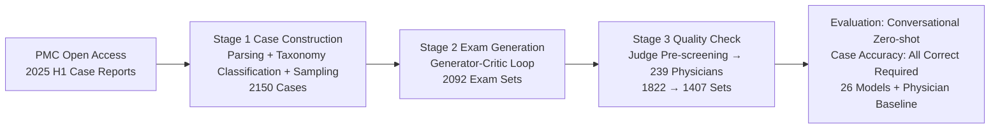

# LiveClin: A Live Clinical Benchmark without Leakage

**Conference**: ICLR 2026  
**OpenReview**: [https://openreview.net/forum?id=E0WSAugJ0j](https://openreview.net/forum?id=E0WSAugJ0j)  
**Code**: [https://github.com/AQ-MedAI/LiveClin](https://github.com/AQ-MedAI/LiveClin)  
**Area**: LLM Evaluation / Medical LLMs / Dynamic Benchmarks  
**Keywords**: Data Contamination, Knowledge Obsolescence, Medical LLM, Clinical Pathway, Multimodal Evaluation, AI-Human Collaboration  

## TL;DR
LiveClin introduces a "live benchmark" updated every six months using the latest peer-reviewed case reports. It upgrades single-question Q&A into multimodal sequential exams simulating complete clinical pathways to fundamentally resist data contamination and knowledge obsolescence—the strongest model achieved a Case Accuracy of only 35.7%, still trailing behind chief physicians.

## Background & Motivation
**Background**: Medical LLMs are expected to assist in diagnosis and personalized treatment, but safe deployment depends entirely on rigorous evaluation. Current evaluations rely on static, single-turn Q&A sets like MedQA, MedXpertQA, and AgentClinic.

**Limitations of Prior Work**: Static benchmarks suffer from two fatal flaws. First, questions and answers are inevitably "absorbed" into training sets as models train on web-scale corpora, causing **data contamination**—models are tested on data they have already seen, leading to inflated scores. Second, static databases face **knowledge obsolescence** as clinical medicine evolves. Furthermore, single-turn evaluations misalign with the longitudinal nature of patient management, treating diagnosis as a series of unrelated snapshots and failing to assess integrated reasoning from initial visit to long-term care.

**Key Challenge**: A longitudinal pilot experiment quantified this conflict—GPT-5 achieved 45.0% on data prior to its knowledge cutoff but dropped by nearly 10 percentage points on new cases published after the cutoff. This pattern was consistent across multiple models, indicating that static benchmarks are unreliable proxies for real clinical reasoning.

**Goal**: Construct a dynamic, anti-contamination, multimodal benchmark covering full clinical pathways, supported by a sustainable and verifiable production pipeline.

**Core Idea**: **(1) Live benchmark**—source only contemporary, peer-reviewed case reports from the PubMed Central (PMC) Open Access subset, updated semi-annually to avoid contamination and obsolescence. **(2) Clinical pathway-oriented**—transform static reports into sequential MCQs (3–6 questions) that introduce new information (imaging, labs, etc.) as the disease progresses. **(3) AI-Human Collaborative Factory**—utilize a Generator-Critic-Judge multi-agent system combined with two-stage verification by 239 physicians to balance scale with clinical rigor.

## Method

### Overall Architecture
LiveClin is a three-stage pipeline guided by a three-layer clinical taxonomy. The taxonomy provides an analysis framework: Level 1 (16 ICD-10 chapters), Level 2 (72 disease clusters), and Level 3 (specific ICD-10 codes). The pipeline performs: ① Case Construction (stratified sampling of latest cases) → ② Exam Generation (Generator-Critic rewriting reports into sequential reasoning tasks) → ③ Quality Check (Judge agent pre-screening + multi-level physician verification). The evaluation uses a "conversational, zero-shot, history-retaining" protocol, where Case Accuracy requires all sequential questions in a case to be answered correctly.

### Key Designs

**1. "Live" data foundation for anti-contamination: Contemporary corpora via peer-reviewed cases.** Departing from passive "decontamination," LiveClin proactively scrapes XML-formatted case reports published in the first half of 2025 from PMC Open Access. "Patient journey" segments (e.g., Case Presentation) are aggregated into case timelines, "Discussion" segments form the ground truth, and tables/images are processed into Markdown or persistent URLs to support multimodality. Stratified sampling across 72 Level-2 disease clusters (30 cases per cluster) ensures diversity and prevents over-representation of common diseases, resulting in 2,150 high-quality cases. The semi-annual update ensures cases remain beyond the models' knowledge cutoffs.

**2. Generator-Critic loop for longitudinal clinical pathways.** This upgrades "single-point snapshots" to "longitudinal pathways." A Generator Agent (driven by o3) creates an initial clinical scenario based only on information available at presentation, then generates 3–6 sequential MCQs (10 options each) labeled by clinical stage (e.g., Initial Assessment). New clinical details are introduced strategically at relevant nodes. A Critic Agent then enters a peer-review loop, scoring and providing feedback on Clinical Accuracy and Cognitive Complexity until the set reaches 100% accuracy and >60% high complexity. This process refined 2,150 cases into 2,092 high-quality exam sets.

**3. Judge pre-screening + 239 physicians for clinical rigor.** Quality control follows a conservative "reject if flawed" principle. A Judge Agent (o3) performs pre-screening based on Factual Validation (alignment with source) and Logical Solvability (answerable from history), filtering out cases with "privileged information" leaks. Then, 239 practicing physicians execute two-stage verification: Attending Physicians evaluate each question (Annotation stage), and Senior Physicians perform audits (Inspection stage). Disagreements (occurring in 8.7% of cases) were resolved through revision cycles. This process took 1,772.18 man-hours and cost \$42,304.39, yielding 1,407 finalized cases.

**4. Conversational zero-shot protocol + Strict Case Accuracy.** To simulate real consultations, the full dialogue history is provided as context for each subsequent question. Most models are tested at temperature 0 for reproducibility. The primary metric, Case Accuracy, counts a case as correct only if every question in the sequence is answered correctly, intentionally suppressing scores to highlight benchmark difficulty.

## Key Experimental Results

### Main Results (26 Models + Physician Baseline, Case Accuracy)

| Subject | Performance / Rank |
|---|---|
| Strongest Model (o3 / GPT-5) | Case Accuracy only **35.7%** (Top tier) |
| Chief Physician | Highest accuracy, **leading all models** |
| Attending Physician | Slightly lower than Chief, but **higher than most models** |
| o3 / GPT-5 vs. Attending | "Barely exceeding Attending," significantly behind Chief |
| Open-source Models | InternVL-3.5-241B nears proprietary leaders; GLM-4V-9B outperforms weaker proprietary ones (e.g., GPT-4o) |
| Counter-intuitive Finds | Claude 3.5 Sonnet > Claude 3.7 Sonnet; Gemini 2.0 Flash > Gemini 2.5 Flash — Scaling does not automatically yield clinical gains |

### Ablation Study (Generation Method, 200 Cases, cost normalized per 100)

| Method | Factual Validation Acc (%) | Trival Question Rate (%) | Time (hrs) | Cost ($) |
|---|---|---|---|---|
| Physicians (Pure Manual) | 92.5 | 38.5 | 188.9 | 4534.30 |
| Generator | 84.5 | 16.5 | 0.13 | 35.34 |
| Generator-Critic | 93.0 | 5.5 | 0.45 | 221.69 |
| Generator-Critic-Judge | 89.5* | 5.5 | 0.55 | 244.19 |

*The Judge pass rate drops to 89.5% due to its stricter standard, while its accuracy on the subset reached 98.4%. The Generator reduced time/cost by two orders of magnitude while decreasing trivial questions from 38.5% to 16.5%. Adding the Critic improved accuracy from 84.5% to 93.0%.

### Key Findings
- **Data recency directly impacts scores**: GPT-5's performance dropped by nearly 10% on post-cutoff cases, proving static benchmarks are inflated.
- **Failure modes vary by model category**: Top proprietary models (o3) failed most in the cognitively dense middle stages (Diagnosis & Interpretation). Open-source medical models struggled in the final stage (Follow-up), indicating long-context retention issues. General models (GLM-4V-9B) failed early in initial assessments.
- **Domain and modality gaps**: Models performed well in logically clear systems (Endocrinology) but poorly in Oncology. Multimodally, they handled structured Diagrams (75.1%) well but failed in Pathology (59.6%) and Biosignals (53.6%) requiring expert reasoning.

## Highlights & Insights
- **Proactive anti-contamination**: "Semi-annual updates + latest peer-reviewed cases" ensures new questions always follow the knowledge cutoff, a more fundamental solution than passive decontamination.
- **Clinical pathway evaluation paradigm**: Sequential MCQs with full history upgrade "point-in-time Q&A" to "longitudinal management reasoning," allowing dissection of model failures at different stages.
- **Proven AI-Human synergy**: Ablations show the Generator-Critic factory outperforms "pure manual generation" in accuracy, complexity, and cost, providing a reproducible recipe for sustainable benchmarking.
- **Challenging "bigger is better"**: Newer/larger versions sometimes underperformed older/smaller ones, suggesting the need for targeted domain optimization over blind scaling.

## Limitations & Future Work
- **Source bias**: Dependence on PMC case reports may favor published "rare/complex cases" over common outpatient disease distributions.
- **MCQ constraints**: 10-option MCQs still cannot fully evaluate open-ended inquiry, patient communication, or physical operational decisions.
- **Reliance on closed-source models for production**: The pipeline (Generator/Critic/Judge/Translation) is constrained by the capabilities and availability of models like o3.
- **Multi-language/Cross-region**: English material translated for Chinese experts requires further validation regarding cross-linguistic medical equivalence and different healthcare system adaptations.

## Related Work & Insights
- **Static medical benchmarks**: MedQA, MedXpertQA, and AgentClinic represent the static/single-turn paradigm that LiveClin targets.
- **Contamination & Obsolescence research**: Echoes recent work on benchmark reliability and knowledge cutoffs, proposing "live benchmarks" as a systemic solution.
- **Insights**: The paradigm of dynamic, anti-contamination, task-sequenced, AI-human collaborative production can be transferred to other high-stakes professional fields like law or finance.

## Rating
- **Novelty**: ⭐⭐⭐⭐⭐ — The combination of live benchmarking, longitudinal sequencing, and an AI-Human factory is a systemic innovation.
- **Experimental Thoroughness**: ⭐⭐⭐⭐⭐ — Comprehensive coverage across 26 models, physician baselines, recency pilots, and fine-grained failure analysis.
- **Writing Quality**: ⭐⭐⭐⭐ — Clear logic and rich visualization; some detailed analyses are dense and deferred to appendices.
- **Value**: ⭐⭐⭐⭐⭐ — Provides a robust, evolving framework for measuring real-world medical AI capabilities.

<!-- RELATED:START -->

## Related Papers

- [\[ICLR 2026\] LiveResearchBench: A Live Benchmark for User-Centric Deep Research in the Wild](liveresearchbench_a_live_benchmark_for_user-centric_deep_research_in_the_wild.md)
- [\[ICLR 2026\] Preference Leakage: A Contamination Problem in LLM-as-a-judge](preference_leakage_a_contamination_problem_in_llm-as-a-judge.md)
- [\[ACL 2026\] When Vision-Language Models Judge Without Seeing: Exposing Informativeness Bias](../../ACL2026/llm_evaluation/when_vision-language_models_judge_without_seeing_exposing_informativeness_bias.md)
- [\[ICLR 2026\] CMT-Benchmark: A Benchmark for Condensed Matter Theory Built by Expert Researchers](cmt-benchmark_a_benchmark_for_condensed_matter_theory_built_by_expert_researcher.md)
- [\[ICLR 2026\] DeepResearch Bench: A Comprehensive Benchmark for Deep Research Agents](deepresearch_bench_a_comprehensive_benchmark_for_deep_research_agents.md)

<!-- RELATED:END -->
