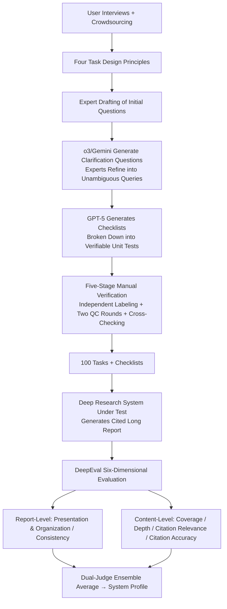

# LiveResearchBench: A Live Benchmark for User-Centric Deep Research in the Wild

**Conference**: ICLR 2026  
**OpenReview**: [https://openreview.net/forum?id=ghwbZ3uhEd](https://openreview.net/forum?id=ghwbZ3uhEd)  
**Code**: [https://github.com/SalesforceAIResearch/LiveResearchBench](https://github.com/SalesforceAIResearch/LiveResearchBench)  
**Area**: LLM Evaluation / Deep Research / Agentic Benchmark  
**Keywords**: deep research, live benchmark, long-form report, citation grounding, LLM-as-a-judge  

## TL;DR
LiveResearchBench utilizes 100 expert-refined "dynamic real-time web retrieval" tasks equipped with checklists, alongside the DeepEval evaluation suite using six distinct dimensions and specific evaluation protocols. It places single/multi-agent deep research systems on a unified, anti-cheating, and highly human-aligned scale for the first time, revealing systematic weaknesses where current systems "know how to collect but fail to analyze deeply, with frequent citation errors."

## Background & Motivation
**Background**: Deep research refers to systems autonomously searching hundreds of real-time web pages to synthesize structured long-form reports with citations for open-ended complex problems. This represents a frontier for agentic systems evolving from "chatbots" to "independent problem solvers." Numerous systems like OpenAI o3 Deep Research, Gemini Deep Research, Manus, and Grok-4 Heavy have emerged.

**Limitations of Prior Work**: Progress is hindered by a "benchmark and evaluation crisis." Existing benchmarks—such as DeepResearch Bench, Deep Research Bench, Mind2Web2, LiveDRBench, and DeepScholarBench—suffer from combinations of the following: (1) **Narrow domains** (e.g., ResearcherBench focuses only on AI); (2) **Static and time-closed tasks**, making them prone to pre-training data contamination and obsolescence; (3) **Limitation to short answers or closed-set retrieval** (e.g., "how many accounts were closed on chess.com in 2024," which is search-intensive but low in reasoning load); (4) **Question ambiguity**, often omitting target audience, output format, and scope, leading to inconsistent interpretations across multiple model runs.

**Key Challenge**: Evaluating long-form reports is inherently difficult—answers are too diverse for string matching, real-time queries lack fixed ground truth, and tasks are naturally multi-dimensional (requiring assessment of coverage, reasoning, evidence usage, and presentation). Manual evaluation is expensive and hard to scale, while naive LLM-as-a-judge yields unstable results. Thus, whether we are evaluating high-quality research or a collection of "plausible but hollow synthesis" remains an open question.

**Goal**: To establish a deep research benchmark that reflects real information needs, resists contamination, and is evaluation-friendly, while using it to systematically diagnose the capability boundaries of frontier systems.

**Core Idea**: **Principle-first benchmark design** — four principles (user-centric / dynamic / unambiguous / multi-faceted & search-intensive) are distilled from user surveys to derive 100 tasks; **Multi-protocol evaluation suite** — different quality dimensions are paired with specific evaluation protocols (checklist / pointwise / pairwise / rubric-tree), using a dual-judge ensemble to approximate human judgment.

## Method

### Overall Architecture
LiveResearchBench consists of two components: the **benchmark data** (100 tasks + checklists, generated via a six-stage process and five-stage verification) and the **DeepEval evaluation suite** (six dimensions, each with a specific protocol + dual LLM judge ensemble). The evaluation workflow for a task is: replace `{{date}}` with the current date → feed to the target system to generate a cited long report → DeepEval scores each dimension → aggregate into a comparable system profile.

### Key Designs

**1. Four Task Design Principles: Defining "What Makes a Good Deep Research Task."** The paper derives four principles from a user survey (covering corporate practitioners, scholars, and daily users): **user-centric** (tasks must fit the target audience), **dynamic / time-varying** (requiring real-time retrieval and `{{date}}` placeholders to resist contamination), **unambiguous** (explicit scope, audience, and format), and **multi-faceted & search-intensive** (requiring multi-hop retrieval and deep analysis beyond simple factoids).

**2. Six-Stage Generation + Five-Stage Verification: 100 High-Quality Tasks from 1500+ Man-Hours.** The pipeline involves: user interviews → determining domain distributions → expert drafting → dual-model (o3/Gemini) clarification generation → expert refinement based on clarifications → GPT-5 generating checklists (e.g., "does the report provide market sizes for both 2024 and 2025?"). Verification involves independent judging by annotators, two rounds of blind QC, and final cross-checking by a third expert group to resolve conflicts.

**3. DeepEval's "Dimension-Protocol" Matching.** Authors argue against simple 0-10 holistic scoring (where alignment with humans was <60%). Instead, six dimensions use tailored protocols: ❶ **Presentation & Organization** (10-item error checklist, 98.3% human alignment) and ❸ **Coverage & Comprehensiveness** (checklist-based unit tests, 100% alignment); ❷ **Fact & Logic Consistency** and ❺ **Citation Relevance** use **pointwise (additive)** scoring (judges deduct points for substantive errors, $\text{score} = 100 - \sum_i \text{penalty}_i$); ❹ **Analysis Depth** uses **pairwise comparison** against a baseline (e.g., Open Deep Research) across five sub-dimensions (92.5% alignment); ❻ **Citation Accuracy** uses a **rubric-tree** where an agentic judge verifies each (statement, URL) pair.

**4. Agent-Ensemble-as-a-Judge.** To reduce inductive bias, all evaluations use a dual-judge ensemble of Gemini 2.5 Pro and GPT-5, taking the average of the two as the final score.

## Key Experimental Results
Evaluation included **17** SoTA systems: single-agent web search (GPT-5, Gemini 2.5 Pro, etc.), single-agent deep research (o3 DR, Gemini DR, etc.), and multi-agent deep research (Manus, Open Deep Research, Deerflow+, etc.).

### Main Results (DeepEval 4-Dimensions, 0-100, Selected)

| System | Presentation & Org | Fact & Logic Consistency | Coverage | Citation Relevance |
|------|:---:|:---:|:---:|:---:|
| GPT-5 (Single Agent Web) | 71.6 | 68.3 | 83.4 | 67.6 |
| Gemini 2.5 Pro (Single Agent Web) | 51.9 | **76.5** | 73.1 | 38.5 |
| Claude 4 Sonnet (Single Agent Web) | 81.9 | 67.3 | 49.2 | 37.9 |
| o3 Deep Research (Single DR) | 71.3 | 64.2 | 85.0 | 25.6 |
| Grok-4 Deep Research (Single DR) | 69.1 | 57.4 | 86.3 | 49.5 |
| Manus (Multi-agent) | 75.0 | 63.1 | 73.3 | 45.6 |
| Grok-4 Heavy (Multi-agent) | 75.9 | 59.4 | **89.3** | 48.0 |
| Deerflow+ (Multi-agent, GPT-5) | 78.8 | 69.9 | 61.6 | 77.0 |
| Open Deep Research (Multi-agent, GPT-5) | 81.0 | 71.3 | 65.3 | 76.9 |

Overall ranking: Open Deep Research (73.6) > GPT-5 (72.7) > Deerflow+. By family: Multi-agent (69.5) > Single-agent web (62.8) > Single-agent DR.

### Analysis Depth (Win Rate vs. Open Deep Research)

| System | Win Rate |
|------|:---:|
| Deerflow+ | 55.2% |
| Gemini Deep Research | 63.3% |
| GPT-5 | 28.4% |
| o3 Deep Research | 14.3% |
| Grok-4 Heavy | 15.9% |

Only Deerflow+ and Gemini Deep Research outperformed ODR; o3 DR and Grok-4 Heavy rarely won on depth despite high coverage.

### Key Findings
- **Obs.❶ Longer is not necessarily better**: Single-agent DR reports are significantly longer, but much is "fluff" from citation formatting and redundant links.
- **Obs.❷ Citations and formatting are the bottlenecks**: Multi-agent systems lead in citation relevance due to specialized alignment, while single-agent DR systems often fail at inline citation consistency.
- **Obs.❼ "Deep Searchers" rather than "Deep Researchers"**: Most systems focus on information gathering but fail to synthesize tiered insights or cross-source argumentation.
- **Obs.❽ Even SoTA systems generate non-trivial citation errors**: Rubric-tree evaluation shows significant counts of "unsupported claims" (hallucinations despite web access), especially in broad search tasks.

## Highlights & Insights
- **"Principle → Task → Verification" Loop**: Operationalizes task quality by enforcing principles during generation rather than as an afterthought.
- **Anti-contamination Live Design**: Use of dynamic placeholders ensures the benchmark remains robust as web content evolves and pre-training data expands.
- **Evidence against Single Holistic Scoring**: Proves that LLMs suffer from a "lazy bias" once they commit to a generic high score, justifying phased, protocol-based evaluation.
- **Diagnosis over Ranking**: The 6-dimensional profiles highlight clear trade-offs (e.g., consistency vs. coverage) under current context limits, providing a roadmap for future work in long-term memory and explicit synthesis modules.

## Limitations & Future Work
- **Small Scale**: 100 tasks are high-quality but limited in number; the high manual cost makes frequent scaling difficult.
- **Reliance on Closed-Source Judges**: Performance and reproducibility are tied to proprietary APIs (Gemini/GPT).
- **Temporal Volatility**: The rubric-tree evaluation depends on real-time URL accessibility, which may change over time.
- **Future Direction**: Need for importance-aware information compression and explicit synthesis modules to move from "deep search" to genuine "deep research."

## Related Work & Insights
- **vs DeepResearch Bench (Du et al.)**: Ours addresses ambiguity by defining target audience/scope/format.
- **vs LiveDRBench**: Ours emphasizes long-form report generation rather than closed-set retrieval.
- **Insights**: (1) Agentic evaluation should be multidimensional and protocol-based; (2) Live tasks are a viable paradigm for anti-contamination; (3) The gap between search and research suggests the next competitive edge lies in memory architecture and synthesis logic.

## Rating
- **Novelty**: ⭐⭐⭐⭐ First benchmark to integrate principle-driven design, live anti-contamination, and multi-protocol evaluation for deep research.
- **Experimental Thoroughness**: ⭐⭐⭐⭐⭐ Evaluates 17 frontier systems with 6-dimensional profiles and robust human-alignment studies.
- **Writing Quality**: ⭐⭐⭐⭐ Clear structure and high-density information in figures; technical details are well-documented.
- **Value**: ⭐⭐⭐⭐⭐ Provides a repeatable and resistant scale for a chaotic field, pointing towards memory and synthesis as the next research frontiers.

<!-- RELATED:START -->

## Related Papers

- [\[ICLR 2026\] DRBench: A Realistic Benchmark for Enterprise Deep Research](drbench_a_realistic_benchmark_for_enterprise_deep_research.md)
- [\[ICLR 2026\] DeepResearch Bench: A Comprehensive Benchmark for Deep Research Agents](deepresearch_bench_a_comprehensive_benchmark_for_deep_research_agents.md)
- [\[ICLR 2026\] Characterizing Deep Research: A Benchmark and Formal Definition](characterizing_deep_research_a_benchmark_and_formal_definition.md)
- [\[ICLR 2026\] ResearchRubrics: A Benchmark of Prompts and Rubrics For Evaluating Deep Research Agents](researchrubrics_a_benchmark_of_prompts_and_rubrics_for_evaluating_deep_research_.md)
- [\[ICLR 2026\] Towards Personalized Deep Research: Benchmarks and Evaluations](towards_personalized_deep_research_benchmarks_and_evaluations.md)

<!-- RELATED:END -->
