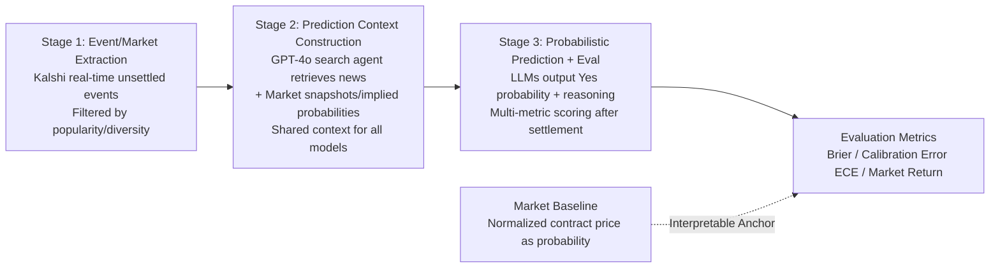

# LLM-as-a-Prophet: Understanding Predictive Intelligence with Prophet Arena

**Conference**: ICLR 2026  
**OpenReview**: [https://openreview.net/forum?id=VpiHkMSPqI](https://openreview.net/forum?id=VpiHkMSPqI)  
**Code**: [https://www.prophetarena.co](https://www.prophetarena.co)  
**Area**: LLM Evaluation / Predictive Intelligence / Live Benchmarks  
**Keywords**: Prediction Markets, Open-domain Prediction, Calibration Error, Brier Score, Data Contamination, Live Benchmark  

## TL;DR
This paper proposes the "LLM-as-a-Prophet" evaluation paradigm and **Prophet Arena**, a live benchmark. By using continuously updated real-world future events from the Kalshi prediction market to assess the predictive intelligence of LLMs, the framework is naturally immune to data contamination. It systematically decomposes bottlenecks in event recall, information source understanding, and information aggregation near settlement using Brier scores, calibration errors, and market returns.

## Background & Motivation
- **Background**: As LLMs are trained on nearly all available data, traditional static benchmarks increasingly suffer from data contamination and overfitting, making it difficult to reliably measure "intelligence." Meanwhile, although open-domain prediction (accurate forecasting without domain-specific fine-tuning) has traditions in ML (e.g., time series, online learning, conformal prediction), it remains a gap for LLMs.
- **Limitations of Prior Work**: Few existing prediction benchmarks (ForecastBench, FutureBench, FutureX, MIRAI, etc.) focus on single metrics (Brier, calibration, or accuracy) and often lack support for real-time events, probabilistic/multi-horizon evaluation, or modular assessment, failing to diagnose why a model succeeds or fails.
- **Key Challenge**: Prediction is both a complex synthesis of abilities (requiring information retrieval + complex reasoning + data analysis + calibrated uncertainty estimation) and an ideal evaluation ground because it is objectively verifiable and **naturally immune to training data contamination** due to its focus on future events.
- **Goal**: To use prediction as a "lens" to study the core components of intelligence (reasoning, calibration, evidence aggregation), identifying emerging versus limited capabilities and guiding the development of more reliable predictive intelligence.
- **Core Idea**: **Using prediction market events as a live benchmark + modular decomposition of the forecasting process.** By using Kalshi's real trading events (standardized settlement with crowdsourced consensus) as task sources, the process is split into "event extraction → context construction → probability prediction and evaluation," introducing a "market baseline" as an interpretable anchor.

## Method

### Overall Architecture
Prophet Arena is a continuously running, real-time evaluation pipeline consisting of a three-stage end-to-end workflow: extracting unsettled events from Kalshi → constructing a unified context shared across all models (retrieved news + market snapshots) → generating probabilistic predictions from LLMs, followed by multi-metric evaluation after event settlement. The pipeline is designed to be modular, multi-horizon, and probabilistic to support controlled attribution of predictive capabilities.

### Key Designs

**1. Three-Stage Modular Pipeline: Decomposing "Prediction" into Attributable Components.** Prophet Arena treats prediction not as a black box but as a three-stage pipeline. Stage 1 periodically crawls unsettled events from Kalshi, filtering by Popularity, Diversity, and Recurrence to ensure the tasks remain fresh and objectively verifiable—the foundation of the "live benchmark." Stage 2 constructs a **unified context identical for all models**: a GPT-4o-based search agent retrieves news (titles/dates/URLs), overlaid with market snapshots (latest Yes/No prices, volumes, and implied probabilities). This **isolates retrieval capability differences**, allowing the evaluation to focus on reasoning and calibration. Stage 3 requires models to output a probability $p_{ij}\in[0,1]$ and a natural language reason for each market.

**2. Three Complementary Metrics + Market Baseline Anchor: Characterizing Prediction Across Quality, Reliability, and Economic Value.** Single metrics can be misleading. The Brier Score measures **absolute quality**, defined for event $E_i$ as $BS_i=\frac{1}{m_i}\sum_{j=1}^{m_i}(p_{ij}-o_{ij})^2$. Expected Calibration Error (ECE) measures **reliability**—the gap between predicted probability and the true frequency of "Yes." Average Return measures **relative economic value**: how much profit an LLM-based strategy would generate under a risk-neutral budget allocation. The **Market Baseline**, which uses normalized contract prices as probabilities, serves as an interpretable anchor; outperforming it indicates a real predictive advantage over crowdsourced consensus.

**3. Multi-horizon Protocol: Examining Temporal Dynamics.** Prediction is inherently temporal. Prophet Arena prompts models to predict at multiple timestamps before settlement (e.g., "0-3h", "1-2d", ">4d" lead-time bins), enabling analysis of how models update predictions as market conditions and public information evolve.

**4. Modular Attribution Experiments: Mechanism Analysis via Controlled Variables.** Because context construction is decoupled, the authors perform systematic "ablation" analyses: providing None / News-only / Market-only / Both context conditions to observe Brier changes; using recall prompts on 100 past events to test internalized knowledge; and checking logical consistency (mutually exclusive/nested markets). This allows for individual probing of internalized knowledge, source utilization, information aggregation, and logical consistency.

## Key Experimental Results

Evaluation was conducted on **1,367 settled events** (as of 2025-10-11). The category distribution reflects Kalshi: 81% sports, 5% entertainment, 5% politics, 9% others.

### Main Results (Representative Models, R denotes Reasoning)

| Model | ↓Brier (95% CI) | Rank | ↓ECE | Rank | ↑Avg Return (95% CI) | Rank |
|------|------|------|------|------|------|------|
| GPT-5 R | 0.184 (±0.006) | ① | 0.042 | ② | 0.943 (±0.042) | ① |
| Grok 4 R | 0.189 (±0.005) | ② | 0.043 | ③ | 0.864 (±0.052) | ④ |
| Claude Sonnet 4 R | 0.194 (±0.006) | ③ | 0.041 | ① | 0.909 (±0.101) | ② |
| Gemini 2.5 Flash R | 0.197 (±0.007) | ④ | 0.067 | ⑤ | 0.883 (±0.053) | ③ |
| Llama 4 Scout | 0.219 (±0.008) | ⑤ | 0.060 | ④ | 0.805 (±0.040) | ⑤ |
| **Market Baseline** | 0.187 (±0.006) | N/A | 0.069 | N/A | 0.899 (±0.043) | N/A |

- Leading proprietary models consistently **outperform the market baseline** across metrics, though rankings vary by metric (e.g., Claude excels in calibration, while GPT-5 leads in Brier/Return).
- Brier scores fall within a narrow band [0.17, 0.24] (random guessing ≈ 0.25); calibration differences are more pronounced (Strong models ECE ≤ 0.05).
- **Even the strongest model (GPT-5) fails to reach break-even** (Avg Return < 1), indicating that profiting against the market remains difficult.

### Ablation Study

| Experiment | Key Finding |
|------|----------|
| Context Ablation (Brier) | Both 0.169 < Market-only 0.173 < Sources-only 0.191 < None 0.235. Market data alone is close to Both, but adding news sources **reduces prediction variance**. |
| Knowledge Recall | Recall for entertainment is reliable; recall for weather/politics is low and prone to hallucinations. GPT-5 is accurate on recalled economic/political events, while others show "false memories." |
| Conservativeness | Models are generally more conservative than the market, especially when the market is near certainty. |
| Multi-horizon | LLMs beat the market in long-range predictions; the market quickly surpasses LLMs as settlement nears by absorbing news faster. |
| Mature Capabilities | Probability elicitation robustness and logical consistency (nested markets) are already reliable for most models. |

### Key Findings
- LLMs exhibit non-trivial predictive capabilities (low calibration error, stable confidence), but **absolute predictive skill and relative profitability remain challenging**.
- The advantage of strong models stems from extreme probability ranges (0-0.1 and 0.9-1.0), where they are highly accurate.
- Bottlenecks include inaccurate event recall, misunderstanding data sources, and slower information aggregation compared to markets as settlement approaches.
- "More information is not necessarily better"; the marginal value of news sources varies by category.

## Highlights & Insights
- **Prediction markets offer an elegant solution to contamination**: Using future events and crowdsourced consensus provides an objectively verifiable and difficulty-referenced benchmark.
- **Threeway Orthogonal Metrics**: This is the first systematic look at absolute quality, reliability, and economic value, demonstrating how they can diverge.
- **Modular Pipeline for Attribution**: Isolating context and using recall probes allows the study of why a model is "smart" (internal knowledge vs. source usage vs. reasoning).
- **Diagnostics of Failure Modes**: Findings like "approximate recall" (right song, wrong date) and "systemic conservativeness" provide concrete directions for model improvement.

## Limitations & Future Work
- **Category Bias**: 81% of events are sports-related; conclusions on politics/economics are based on sparser samples.
- **Single Source**: Relies only on Kalshi; regulatory constraints on US election markets may bias the pool of political questions.
- **Small Mechanism Subsets**: Many mechanism experiments use only 100 sampled events due to resource constraints.
- **Fixed Searcher**: All experiments use a single GPT-4o agent, potentially capping context quality by its retrieval limits.

## Related Work & Insights
- **Evolution of Prediction Benchmarks**: Prophet Arena distinguishes itself from prior work (ForecastQA, FutureX, etc.) by being live, probabilistic, multi-horizon, modular, and return-indexed.
- **Insight**: As static benchmarks saturate, using objectively verifiable future events with modular attribution provides a robust paradigm for evaluating predictive intelligence in risk-sensitive tasks.

## Rating
- Novelty: ⭐⭐⭐⭐⭐ 
- Experimental Thoroughness: ⭐⭐⭐⭐ 
- Writing Quality: ⭐⭐⭐⭐ 
- Value: ⭐⭐⭐⭐⭐ 

<!-- RELATED:START -->

## Related Papers

- [\[ICLR 2026\] Fewer Battles, More Gain: An Information-Efficient Framework for Arena-based LLM Evaluation](fewer_battles_more_gain_an_information-efficient_framework_for_arena-based_llm_e.md)
- [\[ICLR 2026\] Computer Agent Arena: Toward Human-Centric Evaluation and Analysis of Computer-Use Agents](computer_agent_arena_toward_human-centric_evaluation_and_analysis_of_computer-us.md)
- [\[ICLR 2026\] DAComp: Benchmarking Data Agents across the Full Data Intelligence Lifecycle](dacomp_benchmarking_data_agents_across_the_full_data_intelligence_lifecycle.md)
- [\[ICLR 2026\] ParallelBench: Understanding the Trade-offs of Parallel Decoding in Diffusion LLMs](parallelbench_understanding_the_trade-offs_of_parallel_decoding_in_diffusion_llm.md)
- [\[ICLR 2026\] VideoJudge: Bootstrapping Enables Scalable Supervision of MLLM-as-a-Judge for Video Understanding](videojudge_bootstrapping_enables_scalable_supervision_of_mllm-as-a-judge_for_vid.md)

<!-- RELATED:END -->
