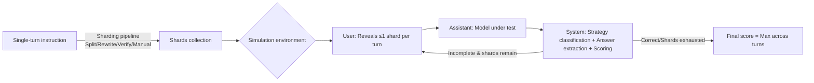

# LLMs Get Lost In Multi-Turn Conversation

**Conference**: ICLR 2026  
**arXiv**: [2505.06120](https://arxiv.org/abs/2505.06120)  
**OpenReview**: [https://openreview.net/forum?id=VKGTGGcwl6](https://openreview.net/forum?id=VKGTGGcwl6)  
**Code**: TBD  
**Area**: LLM Evaluation / Multi-turn Dialogue  
**Keywords**: Multi-turn dialogue, Underspecification, Reliability, Simulated evaluation, Lost-in-Conversation  

## TL;DR
Through large-scale experiments involving "instruction sharding + simulated dialogue" (200k+ dialogues, 15 LLMs), this paper demonstrates that all top-tier LLMs suffer an average performance drop of 39% in multi-turn underspecified conversations compared to single-turn full instructions. This degradation is primarily caused not by a decline in aptitude, but by a **reliability collapse**—once a model takes a wrong turn, it becomes "lost" and cannot recover.

## Background & Motivation
**Background**: LLMs are inherently dialogue interfaces. Users often fail to articulate requirements clearly at first, relying on multi-turn interactions for clarification. However, existing LLM evaluations are mostly confined to "single-turn, complete instruction" settings, which are disconnected from real-world usage.

**Limitations of Prior Work**: Existing multi-turn evaluations largely treat dialogues as **episodic**—where each turn is a self-contained sub-task that can be scored in isolation. This design avoids the core characteristic of human dialogue: **underspecification**, where information is scattered across turns and requires the model to integrate fragmented clues cross-turn.

**Key Challenge**: Single-turn episodic evaluations overestimate model capabilities. When models must assemble clues scattered across turns to complete the same task, performance drops sharply and consistently—a phenomenon completely invisible in traditional benchmarks.

**Goal**: Construct a fair evaluation environment capable of transforming existing high-quality single-turn benchmarks into multi-turn underspecified dialogues. Running single-turn and multi-turn evaluations on the **same set of tasks** allows for precise measurement of the degradation magnitude and analysis of its causes.

**Key Insight**: **[Instruction Sharding + Controlled Simulation]** A single complete instruction is split into multiple "shards," with at most one shard revealed per turn, forcing information to emerge gradually. Simulations are run using LLMs playing three roles (user/assistant/system), and degradation is decomposed into two quantifiable dimensions: **aptitude** and **unreliability**.

## Method

### Overall Architecture
The method consists of two steps: first, transforming single-turn complete instructions into a set of shards via a "sharding pipeline," and then feeding these shards into a "sharded simulation environment" for multi-turn dialogue. The simulation environment is a three-role cycle—the assistant under test answers freely, the user (GPT-4o-mini) holds the complete instruction and decides which shard to reveal each turn, and the system labels the assistant's response (using one of seven strategies) and assigns a score. When the assistant provides an "answer attempt," the answer fragment is extracted for the task evaluator. The final dialogue score is the maximum score across all turns, continuing until the correct answer is given or shards are exhausted.

### Key Designs

**1. Instruction Sharding: From "All at Once" to "Gradual Clarification"** The goal of sharding is to ensure that a set of small instructions is **jointly equivalent** to the original complete instruction, while explicitly scattering information across shards. To ensure fairness, a set of required properties for shards (information preservation, clear intent in the first turn, order insensitivity, etc.) was defined. Shards are generated via a semi-automated "split → rewrite → automated verification → manual review" process (taking ~3 hours of manual labor per 100 items). The manual phase involves merging/splitting/reordering shards to ensure each is a "natural information unit a user would say in one turn," rather than an adversarial cut. This step is the foundation of the evaluation's credibility—if shards lose information, the degradation would be an artifact.

**2. Three-Role Simulation and Scoring: Allowing Space for Recovery** The user simulator, provided with the full instruction and dialogue history, can **select and lightly rewrite** the next shard that best fits the current context (e.g., responding with a relevant shard if the assistant asks a clarification question), making it closer to human behavior than templates or random selection. The assistant receives minimal context (e.g., tool list) in the first turn and is never told the dialogue is "underspecified/multi-turn" to measure default behavior. Notably, in a dialogue with $N$ shards, the assistant has up to $N$ answer attempts with the best score recorded. This sharding setup is actually **more favorable than single-turn** (which only allows one attempt)—yet multi-turn performance still lags significantly, confirming the degradation is real.

**3. Five Simulation Types: Isolating Multi-Turn Underspecification** Based on the same shards, five information revelation rhythms were designed for comparison. Single-turn groups include FULL (original complete instruction, baseline) and CONCAT (all shards concatenated into one bulleted list in one turn—removing underspecification but keeping shard rewrites to exclude the possibility that rewriting itself causes the drop). Multi-turn groups include SHARDED (core underspecified setting), RECAP (SHARDED followed by a final turn summarizing all shards to test if agentic finalization helps), and SNOWBALL (revealing a new shard while repeating all previous shards each turn to test if constant reminders reduce the load). CONCAT achieved 95.1% of FULL's performance, proving the drop **stems from multi-turn underspecification itself** rather than information loss or rewriting.

**4. Aptitude / Unreliability Metrics: Decomposing "Dropping Points" into "Getting Dumber" or "Getting Volatile"** After running $N=10$ simulations per instruction to obtain a score set $S=\{S_i\}$, three metrics are defined: average performance $P=\frac{1}{N}\sum_i S_i$, aptitude $A^{90}=\text{percentile}_{90}(S)$ (the top 10% performance, measuring the "ceiling"), and unreliability $U^{90}_{10}=\text{percentile}_{90}(S)-\text{percentile}_{10}(S)$ (difference between 90th and 10th percentiles, measuring "volatility"). Reliability is defined as $R^{90}_{10}=100-U^{90}_{10}$. The elegance of this design lies in the fact that a drop from 90% to 60% could be due to a lowered ceiling or inconsistent performance; these metrics separate them to locate the true cause of degradation.

## Key Experimental Results

### Main Results

Evaluations were conducted on 15 LLMs across 6 tasks (Code/Database/Actions/Math/Data-to-Text/Summary), totaling 200k+ simulated dialogues costing approximately \$5,000. Average performance across settings (relative degradation to FULL):

| Setting | Average Performance | Degradation vs. FULL | Description |
|------|---------|---------------|------|
| FULL (Single-turn) | ~90% | — | Baseline |
| CONCAT (Single-turn concat) | ~95.1% × FULL | ≈ -5% | Isolates rewrite/info loss interference |
| SHARDED (Multi-turn) | ~65% | **-39%** | Consistent drop across all models/tasks |

Representative models' SHARDED degradation (strong and weak models suffer equally):

| Model | FULL → SHARDED Degradation |
|------|------|
| GPT-4o-2024-05-13 | ~ -32% |
| Gemini 1.5 Pro | -30~40% |
| Claude 3.5 Sonnet | -30~40% |
| o1 / Deepseek-R1 (Reasoning models) | Similar degradation to non-reasoning models |
| Llama-3.1-8B / Phi-4 (Small models) | -30~40% |

### Ablation Study

| Experiment | Action | Conclusion |
|------|------|------|
| Aptitude vs Reliability | Decomposing $A$ and $U$ | In multi-turn, aptitude drops only **16%**, while unreliability surges **+112%** (more than doubled); difference between best/worst runs is ~50 points. |
| Progressive Sharding (1→8 shards) | Fixed complexity, varied shard granularity | **Models get lost if turns ≥ 2**; the only effective way to improve reliability is to provide everything in 1 shard. |
| RECAP / SNOWBALL (Agentic) | Summarization / Cumulative reminders | Better than SHARDED but fails to reach FULL; SNOWBALL gains +15~20%. |
| Temperature Ablation (T=1/0.5/0) | Does lower T improve reliability? | Effective for single-turn, ineffective for multi-turn; even at T=0, multi-turn unreliability remains at 30%. |
| System prompt intervention | Informing "dialogue is multi-turn underspecified" | Only +1% gain, no substantive help. |

### Key Findings
- **High Aptitude ≠ Low Lostness**: While higher aptitude models are more reliable in single-turn (GPT-4o, Gemini 1.5 Pro have the lowest unreliability), **all models' unreliability converges to a high level** in multi-turn settings.
- **Degradation is driven by unreliability rather than aptitude**: This is the core refinement of the "Lost in Conversation" phenomenon.
- **Four root causes**: Models tend to (1) produce full answers too early by making assumptions about underspecified details, (2) over-rely on previous (incorrect) answer attempts leading to "bloated" responses, (3) focus excessively on the first and last turns resulting in "middle-turn loss," and (4) generate excessively long responses that introduce more assumptions and distract from user input. Reasoning models have 33% longer responses on average and make more assumptions, making them even more prone to failure.

## Highlights & Insights
- **Paradigm Value**: This is the first work to precisely quantify single-turn to multi-turn degradation using the "same task set, fair comparison" approach, turning the intuition that "models aren't as good in real dialogues" into a reproducible -39% figure.
- **Aptitude/Unreliability dichotomy** is the primary conceptual contribution—it explains why "switching to a stronger model" does not solve multi-turn problems: the root cause is reliability, while the community has focused solely on optimizing aptitude.
- **Actionable advice for four groups**: LLM builders (jointly optimize aptitude and reliability, target $U<15$ at T=1), agent builders (don't rely on external memory fixes; models need native multi-turn support), NLP researchers (release shard variants for tasks prone to degradation), and general users ("restart if time is out," "summarize before retrying").

## Limitations & Future Work
- **Simulation ≠ Humans**: Relying on LLMs to simulate users results in narrow shard structures and guaranteed complete information in the last turn, missing dynamic human behaviors like terminology misunderstandings, giving up, or unsolvable goals. Ours explicitly states that measured degradation is likely an **underestimation** of the real world.
- **Task Constraints**: Only covers tasks with analytical solutions; creative writing or open-ended tasks were not verified for "lostness."
- **English Text Only**: Does not involve other languages or multimodality.
- **Reproducibility Constraints**: Most experiments use closed-source API models, making precise replication difficult once models are retired; probabilistic nature also introduces variance.

## Related Work & Insights
- **Comparison with episodic multi-turn benchmarks** (e.g., MT-Bench): This work argues that episodic frameworks systematically overestimate capabilities because turns are scored in isolation, whereas underspecification is the key missing dimension.
- **User Simulation Spectrum**: Moving from templates and fixed labels to humans, this work chooses LLM simulation to balance diversity and controllability, emphasizing it as a "probe for LLM behavior" rather than a "human model."
- **Insights**: (1) Evaluations should treat "reliability/variance" as first-class citizens instead of reporting only average scores; (2) external "memory" in agent frameworks is not a silver bullet; multi-turn robustness must be built into the model; (3) "Sharding" can serve as a general tool to upgrade any single-turn benchmark into a multi-turn stress test.

## Rating
- Novelty: ⭐⭐⭐⭐⭐ Establishes "underspecified multi-turn" as a fair and quantifiable evaluation paradigm; the aptitude/unreliability dichotomy is a genuine conceptual innovation.
- Experimental Thoroughness: ⭐⭐⭐⭐⭐ 15 LLMs across 6 tasks with multiple settings, 200k+ dialogues, and a full suite of ablations including sharding granularity, temperature, system prompts, and agentic remedies.
- Writing Quality: ⭐⭐⭐⭐⭐ Clean logical chain (the CONCAT control variable is particularly elegant), actionable conclusions, and a strong "Lost in Conversation" narrative.
- Value: ⭐⭐⭐⭐⭐ Reveals a blind spot in evaluation that is disconnected from real-world usage, providing direct guidance for LLM builders, agent developers, and users with high impact.

<!-- RELATED:START -->

## Related Papers

- [\[ICLR 2026\] Multi-turn Evaluation of Anthropomorphic Behaviours in Large Language Models](multi-turn_evaluation_of_anthropomorphic_behaviours_in_large_language_models.md)
- [\[ICLR 2026\] When LLMs Get Significantly Worse: A Statistical Approach to Detect Model Degradations](when_llms_get_significantly_worse_a_statistical_approach_to_detect_model_degrada.md)
- [\[ACL 2026\] Evaluating Temporal Consistency in Multi-Turn Language Models](../../ACL2026/llm_evaluation/evaluating_temporal_consistency_in_multi-turn_language_models.md)
- [\[ACL 2026\] Beyond Itinerary Planning: A Real-World Benchmark for Multi-Turn and Tool-Using Travel Tasks](../../ACL2026/llm_evaluation/beyond_itinerary_planning-a_real-world_benchmark_for_multi-turn_and_tool-using_t.md)
- [\[ACL 2025\] StructFlowBench: A Structured Flow Benchmark for Multi-turn Instruction Following](../../ACL2025/llm_evaluation/structflowbench_a_structured_flow_benchmark_for_multi-turn_instruction_following.md)

<!-- RELATED:END -->
