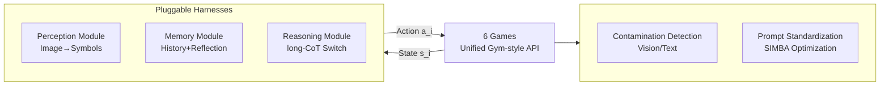

# LMGame-Bench: How Good are LLMs at Playing Games?

**Conference**: ICLR 2026  
**OpenReview**: [https://openreview.net/forum?id=qeziG97WUZ](https://openreview.net/forum?id=qeziG97WUZ)  
**Code**: To be confirmed  
**Area**: LLM Evaluation / Game Agent Benchmark  
**Keywords**: Game Benchmark, LLM/VLM Evaluation, Agent Harness, Data Contamination, Capability Decoupling  

## TL;DR
LMGame-Bench converts six classic games into a **pluggable and modular** evaluation benchmark using a unified Gym-style API. By enabling or disabling three types of harnesses (perception/memory/reasoning), it **individually probes** capabilities such as visual perception, long-range planning, and reflection. Combined with data contamination detection and prompt standardization, it allows for the clear differentiation of 13 frontier models under unsaturated conditions.

## Background & Motivation
**Background**: Interactive games are becoming robust testbeds for evaluating LLMs/VLMs due to their clear rules, quantifiable results, and inherent difficulty gradients from easy to hard, making them naturally resistant to saturation by existing models. From TD-Gammon and AlphaGo to OpenAI Gym, games have been classic environments for studying planning and sequential decision-making, and they have recently been used to evaluate LLM agents.

**Limitations of Prior Work**: Previous game benchmarks **entangled** multiple capabilities—visual perception, reasoning, and memory were tested simultaneously. Consequently, when a model failed, it was unclear whether it "misunderstood the graphics" or "could not plan," thereby masking failure modes. Furthermore, difficulty is often polarized: benchmarks like VideoGameBench are too difficult for models to make progress, while others like LMAct feature tasks that are already half-solved by existing models, losing discriminative power.

**Key Challenge**: Using a naive "screenshot $\to$ action" setting for evaluation often results in even the strongest reasoning models performing close to random baselines (40% of runs without harnesses do not beat random strategies). Such low scores are drowned out by game randomness, making it **numerically impossible to distinguish models**. It is difficult to maintain challenge while isolating individual capabilities for fine-grained diagnosis.

**Goal**: To create a **modular** game benchmark that is both unsaturated and capable of decoupling abilities, while addressing engineering issues like data contamination and prompt variance that render evaluations unreliable.

**Core Idea**: **"Pluggable Harnesses as Capability Probes"**—implementing perception, memory, and reasoning as independent modules attached to the agent workflow. While keeping the underlying game constant, specific skills (e.g., perception vs. planning) are isolated by toggling modules, thereby decomposing model strengths and weaknesses while maintaining the original game difficulty.

## Method

### Overall Architecture
LMGame-Bench abstracts each game as a (partially/fully observable) MDP: state space $S$, action space $A$, and reward $R: S \times A \times S \to \mathbb{R}$. A model $M$ receives states $s_i$ and generates actions $a_i$ across multiple interaction rounds to maximize rewards. Above this unified interface, the framework consists of two layers: the bottom layer comprises 6 authentic games (covering platformers, puzzles, and narrative genres), and the top layer consists of a set of toggleable harness modules (perception/memory/reasoning) plus two enhancement components: contamination detection and prompt standardization.

### Key Designs

**1. Six Games with Scalable Difficulty: Using classic games' natural difficulty gradients for discrimination.** The authors deliberately reuse Super Mario Bros (platformer, testing spatio-temporal reasoning and goal planning), Tetris / Sokoban / Candy Crush / 2048 (grid puzzles, testing pattern recognition, spatial reasoning, and long-range planning), and Ace Attorney (courtroom narrative visual novel, testing long-context understanding and causal deduction). Selection is based on two dimensions: **Fault Tolerance** (low = one mistake leads to failure, e.g., Sokoban; medium = cumulative and recoverable; high = tolerates multiple errors) and **State-Action Space Complexity**. Retaining original game settings preserves the challenges refined by human designers, ensuring the benchmark remains unsaturated. Rewards are split into two categories: **Progressive Rewards** for linear/infinite games (e.g., Mario's horizontal distance, 2048 cumulative score) and **Long-range Rewards** for multi-step goals (e.g., clearing all boxes in Sokoban, completing a trial segment in Ace Attorney), all mapped to continuous raw scores.

**2. Three Classes of Toggleable Harnesses—The Core Capability Probes.** This is the central design of the paper. The **Perception Module** converts multimodal UIs into symbols/text: for grid games, it reads coordinate-object tables (e.g., `"Box at (2,3)"`) directly from the game backend to bypass visual bottlenecks; for complex visuals like Mario, it uses o3 to generate text descriptions. The **Memory Module** contains two optional components: short-term memory (recording the last $N$ state-action pairs) and a reflection module (encoding failure lessons into explicit experiences to avoid repeated invalid actions), specifically targeting games where the decision space explodes like Sokoban or Tetris. The **Reasoning Module** allows switching between settings with or without long-CoT. By fixing the game and toggling modules, failures such as "poor perception" can be diagnosed separately from "poor planning." Experiments show that with harnesses enabled, 86.7% of runs exceed the random baseline (compared to only 60% without), with paired t-tests confirming significant improvements.

**3. Data Contamination Detection and Mitigation—Distinguishing "Understanding" from "Memorization".** Since public game assets are reused, images/scripts may have entered pre-training data. The authors perform contamination tests on two widely circulated titles: at the **Vision Level**, they task models with reordering shuffled RGB frames in Super Mario Bros, finding only weak correlations that do not significantly affect rankings, indicating reliance on local perception rather than frame sequence memorization. At the **Text Level**, they use Sentence-BERT on Ace Attorney to measure output similarity with public fan transcripts. They find strong correlations, hence apply structural mitigation (entity masking, paraphrasing, forced reasoning), after which the correlation disappears and rankings align with "judged reasoning quality." Other combinatorial games (Tetris/2048/Candy Crush/Sokoban) have negligible overlap with training data due to their massive state spaces.

**4. Two-stage Prompt Standardization—Reducing Evaluation Variance.** Even with expert-tuned prompts, scores can fluctuate by more than $\pm 1\sigma$. The authors first fix a normalized agent input format $[\{J_{[\min(0,i-N):i-1]}\}, R_{i-1}, s_i] \mapsto a_i$ (where $J$ is the recent trajectory and $R_{i-1}$ is memory reflection), then refine the prompts iteratively using the SIMBA optimizer from DSPy with game rewards as the signal. Across three runs, prompt variance for games like 2048 decreased by 33.8%–63.5%, making cross-model comparisons more consistent.

## Key Experimental Results

### Main Results (13 Models, Raw Scores, Partial Excerpts)

| Model | Harness | Sokoban | Mario | Tetris | 2048 | Candy Crush | Ace Attorney |
|------|---------|---------|-------|--------|------|-------------|--------------|
| o3-2025-04-16 | No | 2.0 | 1955 | 31.0 | 128.2 | 106.0 | 8.0 |
| o3-2025-04-16 | **Yes** | **8.0** | **2267** | **42.0** | 128.6 | **647.0** | 11.3 |
| o1-2024-12-17 | Yes | 2.3 | 855 | 35.0 | 128.9 | 159.0 | **16.0** |
| Gemini-2.5-pro | Yes | 4.3 | 1498 | 23.3 | 117.3 | 416.3 | 7.7 |
| Claude-3.7(think) | Yes | 2.3 | 1419 | 16.3 | 113.3 | 484.0 | 7.0 |
| GPT-4.1 | Yes | 0.0 | 2126 | 13.7 | 105.7 | 182.0 | 3.3 |
| Random | – | 0.0 | 987 | 10.2 | 100.4 | 116.5 | 0.0 |
| Human (avg) | – | 9.7 | 4333 | 353.3 | 115.5 | 283.3 | 17.3 |

**Conclusion**: o3 and o1 secured the Top-2 positions across all games, followed by Gemini-2.5-pro and Claude-3.7-Sonnet; GPT-4.1 led among non-reasoning models. The benchmark is far from saturated (humans score 353 in Tetris vs. 42 for the strongest model).

### Ablation Study (Harness Contribution by Model Group)

| Model Group | Game | ZS | +Mem | +Perc | +Both |
|--------|------|-----|-------|-------|-------|
| Reasoning Models | Sokoban | 0.9 | 0.9 | 4.0 | 4.0 |
| Reasoning Models | Tetris | 13.4 | 15.1 | **26.4** | 21.6 |
| Reasoning Models | Candy Crush | 138.1 | 161.1 | 229.7 | **462.5** |
| Non-Reasoning Models | 2048 | 57.6 | **102.5** | 71.1 | 107.0 |
| Non-Reasoning Models | Candy Crush | 36.1 | 97.6 | 66.3 | 127.3 |

**Conclusion**: The perception module provides the greatest gain for reasoning models in Sokoban/Tetris/Candy Crush (structured spatial input unlocks planning capabilities suppressed by raw images). The memory module significantly improves non-reasoning models in long-range games like 2048/Candy Crush, increasing means while reducing variance.

### Key Findings
- **Capability Correlation**: Sokoban strongly correlates with math/coding benchmarks; Tetris/2048 align with pattern recognition tasks like EnigmaEval and NYT-Connections; Candy Crush relates to programming (algorithmic reasoning); Ace Attorney relates to LiveBench-Language (narrative understanding). Low-rank matrix factorization decomposes games into sparse combinations of 4 latent abilities (language multi-tasking, programming, symbolic puzzles, physical reasoning), proving that **games test composite abilities rather than isolated skills**.
- **Four Exposed Weaknesses**: (1) VLMs struggle to extract board states directly from images (failing tasks intuitive to humans like Tetris/Sokoban); (2) Non-reasoning models frequently fall into repeated invalid action loops (e.g., 2048 attempts at impossible merges) and require memory+reflection for self-correction; (3) Misalignment between spatial selection and temporal dynamics (incorrect frame counts for Mario jumps); (4) Long-context retrieval failure (inability to retrieve evidence present in the window in Ace Attorney).

## Highlights & Insights
- **"Harness Toggling = Capability Probing" is a significant methodological contribution**: It upgrades evaluation from "assigning a total score" to "fixing the game, performing module-wise ablation, and locating individual capabilities," which is more diagnostic than merely adding more games.
- **Handling Contamination as a First-class Citizen**: The dual-path vision/text detection and the validation of effectiveness through correlation changes before and after mitigation provide a solid methodology. This addresses the common criticism that game assets are present in pre-training data.
- **Quantitatively Linking Games to Existing Benchmarks**: Correlation analysis and low-rank decomposition provide an explainable framework for "which game tests which capability," making game scores less of a black box.

## Limitations & Future Work
- **High Variance in Partially Observable Games**: Due to stochastic dynamics in Super Mario Bros, both models and humans show high variance, making stable differentiation difficult.
- **High Computational Cost**: Multi-round interactions generate large volumes of highly repetitive long reasoning chains, incurring significant operational overhead and requiring more efficient inference.
- **Limited Gains from Mario Perception Module**: A gap remains between text descriptions and the required spatio-temporal information; the perception bottleneck for complex visuals is not fundamentally solved by the harness.

## Related Work & Insights
- **Games as AI Testbeds**: From TD-Gammon and AlphaGo to Gym, and recently BALROG (grid navigation + text reasoning), LMAct (expert demonstration count), and VideoGameBench (3D but extremely difficult). This work differentiates itself through game selection (inherent difficulty gradients), harness design, contamination mitigation, and quantitative evaluation.
- **LLM Agent Benchmarks**: Compared to domain-specific benchmarks like code editing (SWE-bench), web browsing, or GUI control, games provide a complementary setting that is both scalable and skill-diverse.
- **Insights**: The approach of using modular harnesses for "itemized ablation" can be transferred to any agent evaluation involving entangled capabilities. In contamination detection, checking if correlations disappear after mitigation is a robust paradigm for verifying benchmark credibility.

## Rating
- **Novelty**: ⭐⭐⭐⭐ The combination of modular harnesses as capability probes, contamination detection, and quantitative capability decomposition is pioneering in game evaluation, though individual components (Gym interfaces, DSPy optimization) utilize existing tools.
- **Experimental Thoroughness**: ⭐⭐⭐⭐ Covers 13 models across 6 games with multiple harness configurations, human baselines, paired t-tests, correlation analysis, and low-rank decomposition. However, some models/games were only run once due to cost, leading to variance.
- **Writing Quality**: ⭐⭐⭐⭐ The logic from motivation to pain points to design is clear. Charts and failure analyses are well-executed, and the narrative of capability decoupling is complete.
- **Value**: ⭐⭐⭐⭐ Provides the community with an unsaturated, diagnostic, and contamination-resistant game evaluation framework, clearly identifying four directions for improvement: visual extraction, reflection, spatio-temporal reasoning, and long context.

<!-- RELATED:START -->

## Related Papers

- [\[ICLR 2026\] Evaluating Language Models' Evaluations of Games](evaluating_language_models_evaluations_of_games.md)
- [\[ICLR 2026\] DARE-bench: Evaluating Modeling and Instruction Fidelity of LLMs in Data Science](dare-bench_evaluating_modeling_and_instruction_fidelity_of_llms_in_data_science.md)
- [\[ICLR 2026\] PCB-Bench: Benchmarking LLMs for Printed Circuit Board Placement and Routing](pcb-bench_benchmarking_llms_for_printed_circuit_board_placement_and_routing.md)
- [\[ICLR 2026\] TrustJudge: Inconsistencies of LLM-as-a-Judge and How to Alleviate Them](trustjudge_inconsistencies_of_llm-as-a-judge_and_how_to_alleviate_them.md)
- [\[ICLR 2026\] DeepResearch Bench: A Comprehensive Benchmark for Deep Research Agents](deepresearch_bench_a_comprehensive_benchmark_for_deep_research_agents.md)

<!-- RELATED:END -->
