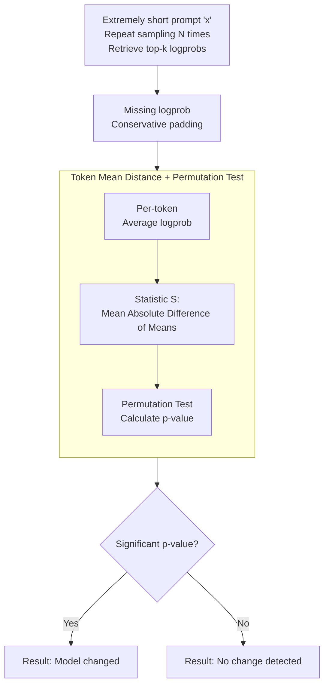

# Log Probability Tracking of LLM APIs

**Conference**: ICLR 2026  
**arXiv**: [2512.03816](https://arxiv.org/abs/2512.03816)  
**Code**: [Yes](https://github.com/timothee-chauvin/track-llm-apis)  
**Area**: LLM Evaluation  
**Keywords**: LLM API monitoring, log probabilities, model change detection, hypothesis testing, non-determinism

## TL;DR

Proposes the Logprob Tracking (LT) method, which utilizes log probabilities of single-token inputs and single-token outputs to detect minute changes in LLM APIs (e.g., single-step fine-tuning). It achieves sensitivity 2-3 orders of magnitude higher than existing methods at a 1000x lower cost.

## Background & Motivation

LLM API providers typically offer version-fixed endpoints, implying that the models remain consistent. Users (developers, researchers, regulators) rely on this consistency for application reliability and research reproducibility. However, users currently lack the means to practically verify this consistency.

In practice, providers may change models for various reasons:
- **Performance Optimization**: Updating inference software/hardware infrastructure.
- **Safety Response**: Addressing new jailbreak attacks or modifying model behavior.
- **Cost Savings**: Silently deploying quantized versions.
- **Traffic Management**: Switching to lighter models during peak hours.
- **Security Incidents**: For instance, Grok experienced three incidents of tampered system prompts in 2025.

Existing change detection methods (e.g., MET, MMLU benchmarks) are prohibitively expensive, requiring massive queries and token generation, which leaves LLM APIs largely unmonitored by third parties in practice.

Key Insight: Although log probabilities are non-deterministic in practice, single-token logprobs still contain sufficiently rich distributional information to detect extremely subtle changes through simple statistical tests.

## Method

### Overall Architecture

LT aims to answer a fundamental question: Is a supposedly "version-fixed" LLM API the same model today as it was last week? Instead of running expensive benchmarks, it leverages an undervalued signal—log probabilities of individual tokens. Specifically, for two points in time (or two endpoints) to be compared, LT sends the same extremely short prompt (as brief as a single letter "x") and requests only 1 output token along with its top-k logprobs, repeating this sampling $N$ times. Since APIs only return top-k values, certain tokens may be missing in some samples; LT first uses conservative padding to fill these gaps, then calculates a test statistic based on the mean logprob of each token and performs a permutation test to determine the "consistency of the two distributions" via a p-value. The entire pipeline requires no training or long-text generation, with a single comparison costing only dozens of tokens. Additionally, to quantify "how fine a change can be detected," the authors constructed the TinyChange benchmark (see Key Design 4), which serves as an evaluation metric and is not part of the active detection pipeline.

### Key Designs

**1. Treating non-determinism as a distribution rather than noise to be eliminated**

Logprobs returned by LLMs are unstable in practice due to two sources of jitter. One is **intentional non-determinism**, i.e., temperature sampling—but LT reads logprobs directly rather than the sampled token, making it unaffected by temperature. The other is **unintentional non-determinism**, arising from interference from other requests within the same batch or numerical differences from routing requests to different GPUs. LT's approach is to work with this jitter rather than fight it: it treats each logprob as a sample from an underlying distribution. Thus, "whether the model has changed" is translated into a standard hypothesis testing problem of "whether two distributions are identical," allowing the jitter to be absorbed into the variance of the distribution.

**2. Using token mean distance + permutation test for two-sample testing**

Let $\mathcal{V} = \{t_1, \dots, t_{n_{\text{tok}}}\}$ be the set of all observed tokens. For two time points, calculate the average logprob for each token:

$$\bar{a}_i^{(1)} = \frac{1}{N}\sum_{j=1}^{N} T_{j,i}^{(1)}, \quad \bar{a}_i^{(2)} = \frac{1}{N}\sum_{j=1}^{N} T_{j,i}^{(2)}$$

The test statistic is the average of the absolute differences between the two means across all tokens, measuring the overall shift between the two distributions:

$$S = \frac{1}{n_{\text{tok}}} \sum_{i=1}^{n_{\text{tok}}} |\bar{a}_i^{(1)} - \bar{a}_i^{(2)}|$$

The p-value is obtained via a permutation test without assuming any specific distribution: combine the $2N$ samples from both sets and randomly redistribute them into two halves, recalculating the statistic $S^{(b)}$ for $B$ iterations. The p-value is the proportion of random permutations where the statistic exceeds the real $S$:

$$\hat{p} = \frac{1}{B}\sum_{b=1}^{B} \mathbf{1}\{S^{(b)} \geq S\}$$

A smaller p-value indicates that the observed difference is unlikely to be explained by random jitter, providing grounds to determine that a model change has occurred. Consequently, even if single-token logprobs are noisy, systematic shifts at the distributional level can be captured, which is why LT's sensitivity far exceeds benchmark-based methods.

**3. Conservative padding for missing logprobs caused by top-k truncation**

APIs only return top-k logprobs, and the set of tokens exposed in different samples may not be identical, leading to "missing" tokens in some samples. Simply discarding them would bias the statistic. LT's solution is to fill missing tokens in a sample with the minimum logprob observed in that specific sample. The rationale is direct: since the token did not make it into the top-k, its true logprob must be no greater than the minimum observed value. Padding with this upper bound is conservative and avoids artificially exaggerating differences.

**4. TinyChange Benchmark: A quantifiable ruler for "micro-changes"**

To systematically measure sensitivity, the authors constructed the TinyChange benchmark, mapping model modifications across a spectrum. It covers three types of modifications: standard and LoRA fine-tuning (1 to 512 steps of single-sample fine-tuning), unstructured weight pruning (by magnitude or random, with ratios from $2^{-10}$ to $1$), and parameter noise (Gaussian noise with standard deviation $\sigma$ from $2^{-15}$ to $1$). These modifications were applied to 5 open-source models (0.5B–8B parameters), with each intensity level corresponding to a variant, resulting in approximately 290 variants (including 58 core variants across 5 intensity levels). This continuous scale from "almost no change" to "significant change" allows for an objective comparison of how subtle a change different methods can detect.

### Loss & Training

LT is a purely statistical inference method and involves no training. It relies on a few inference-side hyperparameters: number of samples $N=10$, number of permutations $B$, significance level $\alpha$, and an extremely short prompt requiring only 1–2 tokens.

## Key Experimental Results

### Main Results

| Method | Overall AUC (95% CI) | Input tokens/test | Output tokens/test | Annual cost (GPT-4.1 prices) |
|------|:-:|:-:|:-:|:-:|
| MMLU-ALG | 0.878 | $2.1 \times 10^5$ | $9.9 \times 10^3$ | $332 |
| MET | 0.670 | $2.9 \times 10^4$ | $2.0 \times 10^4$ | $146 |
| **LT (Ours)** | **0.915** | **28** | **20** | **$0.14** |

LT not only achieves the highest AUC (0.915) but also costs only 48 tokens (28 input + 20 output), making it approximately 1,000x cheaper than MET and 2,400x cheaper than MMLU-ALG.

| Modification Type | Highest difficulty where LT reaches AUC > 0.9 | MET | MMLU-ALG |
|---------|:-:|:-:|:-:|
| Weight Pruning | $\leq 2^{-10}$ | $2^{-1}$ | $2^{-4}$ |

LT's sensitivity to weight pruning is $2^9=512$ times higher than MET and $2^6=64$ times higher than MMLU-ALG.

### Ablation Study

**Impact of Prompt Length**: The difference in AUC between the shortest prompt (1.5 tokens) and the longest prompt (33 tokens) is only about 1%, demonstrating that extremely short prompts are effective for detection.

**Real-world Deployment**: Monitoring 189 endpoints over 4 months with over 1.7 million responses collected, LT detected 37 suspected changes involving 29 endpoints and 7 providers. Almost all detected changes (34/37) affected models with open-source weights.

### Key Findings

- Prompts as short as a single letter "x" are sufficient to reliably detect changes.
- LoRA fine-tuning is the most difficult modification for all methods to detect.
- Open-weight models are frequently subjected to undisclosed changes.
- Some providers (e.g., OpenAI) have begun restricting minimum output tokens (≥16), potentially to hinder monitoring.

## Highlights & Insights

1. **Extreme Simplicity**: 1-token input + 1-token output + simple statistical testing > complex methods.
2. **Information Density Perspective**: Logprobs contain richer distributional information than generated tokens, representing a severely undervalued signal source.
3. **High Practicality**: Costs only $0.14 per year for hourly monitoring, making large-scale continuous monitoring feasible.
4. **Call for Transparency**: 34/37 changes involved open-source models, revealing that open weights do not equate to deployment transparency.

## Limitations & Future Work

- Requires API support for returning logprobs (currently supported by only ~23% of endpoints).
- Cannot distinguish between infrastructure changes and specific types of model updates.
- Providers might evade detection by caching logprobs or identifying monitoring queries.
- Certain modifications (e.g., adjusting end-of-sequence bias) might not affect the first token.
- The method focuses on change detection and does not provide detailed information about the nature of the change.

## Related Work & Insights

- Highly related to LLM fingerprinting but with a different goal: LT pursues sensitivity to minute changes.
- Zero-knowledge proofs (zkLLM, TOPLOC) provide stronger guarantees but at much higher computational costs.
- Complementary to existing auditing pipelines: LT serves as a low-cost, high-sensitivity first line of defense.
- Directly relevant to AI safety and reproducibility research.

## Rating

- Novelty: ⭐⭐⭐⭐⭐ — The insight of using logprobs as a monitoring signal is highly innovative.
- Technical Depth: ⭐⭐⭐⭐ — Statistical methods are simple but effective, with clear theoretical analysis.
- Experimental Thoroughness: ⭐⭐⭐⭐⭐ — Validated with the TinyChange benchmark and large-scale real-world deployment.
- Practical Value: ⭐⭐⭐⭐⭐ — Directly deployable with extremely low costs.

<!-- RELATED:START -->

## Related Papers

- [\[ICML 2026\] Beyond Log Likelihood: Probability-Based Objectives for Supervised Fine-Tuning across the Model Capability Continuum](../../ICML2026/llm_evaluation/beyond_log_likelihood_probability-based_objectives_for_supervised_fine-tuning_ac.md)
- [\[ICLR 2026\] DeepTRACE: Auditing Deep Research AI Systems for Tracking Reliability Across Citations and Evidence](deeptrace_auditing_deep_research_ai_systems_for_tracking_reliability_across_cita.md)
- [\[ICLR 2026\] Sci2Pol：评测与微调 LLM 的「科学→政策简报」生成能力](sci2pol_evaluating_and_fine-tuning_llms_on_scientific-to-policy_brief_generation.md)
- [\[ICLR 2026\] Multi-LLM Adaptive Conformal Inference for Reliable LLM Responses](multi-llm_adaptive_conformal_inference_for_reliable_llm_response.md)
- [\[ICLR 2026\] RouterArena: An Open Platform for Comprehensive Comparison of LLM Routers](routerarena_an_open_platform_for_comprehensive_comparison_of_llm_routers.md)

<!-- RELATED:END -->
