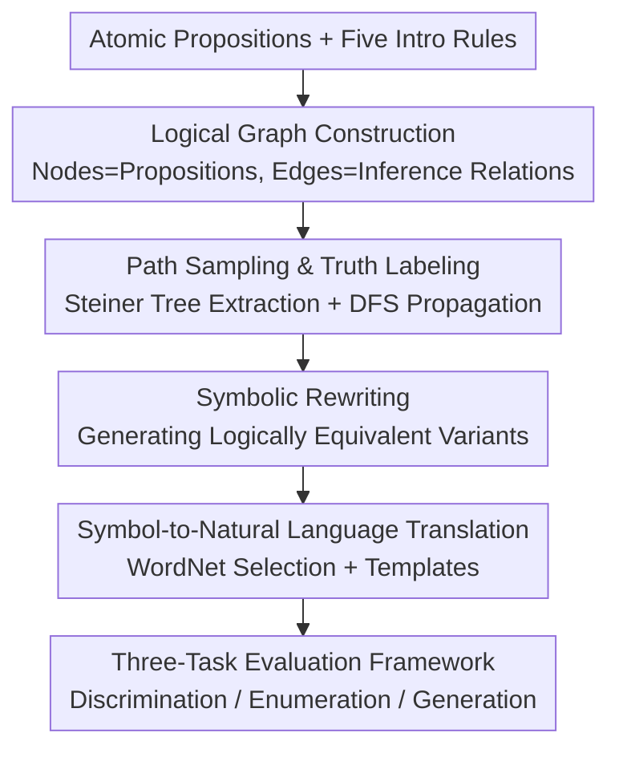

# LogiConBench: Benchmarking Logical Consistencies of LLMs

**Conference**: ICLR 2026  
**OpenReview**: [https://openreview.net/forum?id=ULEHJkolxB](https://openreview.net/forum?id=ULEHJkolxB)  
**Code**: https://github.com/Bellafc/LogiConBench.git  
**Area**: LLM Evaluation / Logical Reasoning / Benchmark  
**Keywords**: Logical Consistency, Automated Data Generation, Logical Graph, Reasoning Path, Enumeration Task

## TL;DR
LogiConBench utilizes a pipeline of "automated logical graph generation → proposition sampling and truth value propagation along reasoning paths → translation to natural language" to construct an infinitely scalable, depth-controllable logical consistency evaluation set of 280K samples with explicit reasoning paths. By designing three categories of tasks — discrimination, enumeration, and generation — the study reveals a critical weakness in frontier LLMs, with the highest exact accuracy on enumeration tasks reaching only 34%.

## Background & Motivation
**Background**: Logical consistency refers to a set of statements not contradicting each other under logical rules, serving as the foundation for trustworthy reasoning—if P entails H and H entails Z, the model should conclude that P entails Z. Existing benchmarks for evaluating consistency include BeliefBank (entity constraints based on commonsense knowledge bases), EntailmentBank (multi-step entailment trees), LFC (logical fact-checking via knowledge graphs), and Set-LConVQA / Set-SNLI (extending VQA / NLI into set-level consistency checks).

**Limitations of Prior Work**: These datasets generally suffer from four issues: small scales and limited numbers of rules (BeliefBank has only 2 rules, EntailmentBank has 1,840 samples), shallow reasoning depths without explicit reasoning paths, and an inability to scale due to reliance on manual writing or derivation from existing datasets. More critically, they have become "saturated," with models like GPT-5 and Grok-4-fast generally exceeding 95% accuracy, losing the ability to distinguish between frontier models.

**Key Challenge**: A robust consistency benchmark must simultaneously satisfy "infinite scalability + precise labels + challenging for the strongest models." Manual or derivative construction naturally hits ceilings in scale and difficulty, as these methods cannot consistently surpass increasingly powerful models.

**Goal**: To create a consistency evaluation framework capable of automatically generating infinite combinations of logical rules with controllable depth, explicit reasoning paths, and sustained difficulty even for SOTA models.

**Key Insight**: Rather than starting from predefined axioms or expensive natural language explanations, the authors revert to **atomic propositions** — the finest granularity of reasoning. They use five basic logical rules to combine atomic propositions into "logical graphs" that can grow infinitely, ensuring that structural complexity and label correctness are guaranteed by the construction process itself.

**Core Idea**: Transform the generation of logical consistency data into a programmable process of "sampling subsets on logical graphs + propagating truth values along the shortest reasoning paths." This allows infinite scale, precise labels, and controllable depth through automatic graph expansion.

## Method

### Overall Architecture
The construction of the LogiConBench corpus follows a five-stage pipeline: first, a **logical graph** (where nodes are propositions and edges are inference relations) is generated from atomic propositions using five natural deduction introduction rules; then, $k\in\{2,3,4,5\}$ target nodes are randomly sampled, and a Steiner tree is solved to extract the shortest sub-graph as the reasoning path; Boolean truth values are propagated along this path via DFS to enumerate all consistent assignments (consistent lists), with the remaining $2^k$ assignments designated as inconsistent; nodes in the sub-graph undergo **symbolic rewriting** to create logically equivalent but formally different formulas; finally, symbolic formulas are **translated into natural language** using WordNet selections and templates. A three-task evaluation system (discrimination / enumeration / generation) is then built upon this corpus to evaluate 14 frontier models.

### Key Designs

**1. Logical Graph Construction: Enabling Infinite Growth with Five Introduction Rules**

Existing benchmarks are limited by manual authoring, capping their scale and depth. The authors instead start with atomic propositions and use five introduction rules from natural deduction—implication $I_\rightarrow:(\varphi\vdash\psi)\Rightarrow(\varphi\rightarrow\psi)$, disjunction $I_\vee$, conjunction $I_\wedge$, negation $I_\neg:(\varphi\vdash\bot)\Rightarrow(\neg\varphi)$, and biconditional $I_\leftrightarrow$—to incrementally combine atomic propositions into complex formulas. Clear roles are assigned in the graph: implication $\rightarrow$ and biconditional $\leftrightarrow$ are expressed as **edges**, while disjunction $\vee$ and conjunction $\wedge$ are expressed as **nodes**. Negation $\neg$ can appear on both nodes and edges (contradictory edges are marked with "×"). For example, starting from an atomic proposition $p$, one can generate $\neg p$, a conjunction expansion $p\wedge q$, and an implication expansion $p\vee q$, resulting in an initial structure $p\vee q\rightarrow p\rightarrow p\wedge q$ with $p\times\neg p$. Each new node can be further expanded in the same manner, allowing the logical graph to grow infinitely through iterative applications of basic rules. This provides the qualitative leap in scale (280K rules and depth up to 32) compared to older benchmarks (2–51 rules and depth 1–6).

**2. Path Sampling and Truth Labeling: Precise Consistency Labels via Steiner Trees and DFS**

Constructing the graph is insufficient; one must precisely calculate "which assignments are consistent" while keeping samples bounded and constrained. The authors sample 10,000 instances for each $k\in\{2,3,4,5\}$, requiring the distance between target nodes in the global graph to be no more than 6. This ensures that every sample has at least one inconsistent assignment, maintaining sufficient local constraints. They also ensure a uniform distribution of atoms per sample to vary complexity. After sampling the target set $S=\{v_1,\dots,v_k\}$, a Steiner tree problem (solved via permutation-based shortest walk search) extracts the sub-graph connecting all targets, resulting in an ordered edge list $E$. The consistency of truth values is defined by the ruleset; for instance, $\rightarrow$ allows $\{(T,T),(F,T),(F,F)\}$, while contradiction edges $\times$ only allow $\{(T,F),(F,T)\}$. DFS is performed on $E$ to incrementally assign Boolean values, collecting all projections onto the target nodes that satisfy the rules as "consistent lists." The remaining of the $2^k$ possible assignments are "inconsistent lists." The authors ensure every sample contains both non-empty consistent and inconsistent lists.

**3. Symbolic Rewriting and Language Translation: Preventing Overfitting via Variants**

Models can easily cheat through surface patterns if all problems follow identical symbolic formats. The authors apply elimination rules (e.g., equivalent elimination, conversion to CNF/DNF) to each node in the sampled sub-graphs. Any logically equivalent formula generated is retained as an additional node, expanding the variety of expressions without altering the logic labels. Symbolic formulas are then translated into natural language: nouns, adjectives, or verbs are randomly selected from WordNet for each atomic proposition to cover both positive and negative variants. This high lexical diversity prevents models from memorizing specific phrasing. Compound formulas are mapped using templates to translate logical connectives into natural language operators. This ensures linguistic similarity to real text while decoupling "logical structure" from "linguistic shell"—further experiments show that switching to commonsense, counterfactual, or human-style phrasing has minimal impact, indicating that the benchmark measures reasoning rather than vocabulary memorization.

**4. Three-Task Evaluation Framework: Progressive Difficulty through Discrimination, Enumeration, and Generation**

To expose model weaknesses from multiple angles, three categories of tasks are designed. **Task 1: Discrimination**: Given $k$ statements and a Boolean assignment, determine if the assignment causes a contradiction—requiring verification of a single assignment, this is the easiest. It includes "hard sample" variants (where consistent and inconsistent labels differ by only one position) and "label completion" variants. **Task 2: Enumeration**: Given a set of statements, **enumerate all** logically consistent Boolean assignment lists. This requires a full search of the $2^k$ label space, preventing "guessing" strategies prevalent in discrimination, and thus represents the highest difficulty. Evaluation metrics include Format (executability), Exact (exact accuracy of the set of consistent lists), and F1. **Task 3: Generation**: Given $n$ sets of mutually consistent premises, the model must generate $n$ new statements that remain logically consistent. The core challenge lies in performing exhaustive consistency checks across all cross-set combinations.

## Key Experimental Results

### Main Results
Evaluation was conducted on 14 frontier models (including GPT-5, Grok-4-fast, DeepSeek-V3, Gemini-2.1-Pro, Claude-3.5-Sonnet, Qwen-2.5-72B, O1-mini, Llama-3.1-405B, etc.) under zero-shot, 3-shot, and 3-shot + reasoning path settings. 1,000 problems were randomly sampled per configuration with temperature set to 0.

| Task | Metric | Top Model Performance | Majority Performance |
|------|------|--------------|--------------|
| Task 1 Discrimination | Overall Acc | GPT-5 / Grok-4-fast / DeepSeek / Gemini stable at 85–95% | Small models (Llama-3.1-8B, GPT-4o-mini) approx. 31–35% |
| Task 2 Enumeration | Exact Acc | GPT-5 (3-shot+Path) ≈ 0.51, Grok-4-fast ≈ 0.20 | **Most models < 1%** |
| Task 3 Generation | Consistency | O1-mini / Grok-4-fast approx. 0.79–0.84 (2 statements) | Rapid drop as $n$ increases; collective best approx. 0.42 |

Enumeration is the primary bottleneck: even for the strongest models, the average exact accuracy is only about 34%, while most models scored nearly zero, confirming that "systematic search of the label space" remains a significant obstacle for LLMs.

### Difficulty and Prompt Analysis
| Dimension | Key Findings |
|------|---------|
| Prompting (Task 1) | Average accuracy: Zero-shot 59.21% → 3-shot 65.70% → 3-shot+Path 67.58%. Reasoning path supervision is most effective. |
| Statements $k$ (Task 1) | Accuracy drops from 66.87% at $k{=}2$ to 59.59% at $k{=}5$; as scale increases, difficulty rises. |
| Task 1 Hard Samples | All models show significant drops on samples where consistent/inconsistent labels differ by only one bit. Strong models (GPT-5, Gemini) maintain 80–86% on label completion, while small models (Claude-3.5-Haiku) drop below 40%. |
| Task 2 Short Paths | Under 3-shot+Path, GPT-5’s Exact Acc rises from ~34% to 58%, and Grok-4-fast rises from 12% to 31%. Short statement subsets provide much smaller gains. |
| Style (Commonsense/Counterfactual/Human) | Virtually no impact on large models; small models degrade significantly without template regularities, proving the benchmark measures true reasoning. |

### Key Findings
- **Discrimination is easy, but enumeration is hard**: This is the strongest signal. Models can judge if an assignment is contradictory but cannot enumerate all consistent assignments, indicating a lack of systematic search capability.
- **Value of reasoning path supervision**: In both Task 1 and Task 2, few-shot with ground-truth reasoning paths is the most effective setting, suggesting consistency failure is often due to an inability to "step through" rather than a lack of knowledge.
- **Decoupling logical structure from linguistic shell**: Strong models show almost no performance drop when statements are changed to counterfactual or human-style phrasing, proving LogiConBench measures logic itself. Small models rely on surface patterns.
- **Strong correlation with real downstream tasks**: Performance on the three tasks shows Pearson/Spearman correlation coefficients of 0.6–0.79 with LiveCodeBench, InfiniteBench, AIME, AA-LCR, and ACEBench, indicating logical consistency is a good proxy for general capabilities.

## Highlights & Insights
- **"Graph Growth + Path Propagation" makes data generation a programmable infinite process**: Using Steiner trees for shortest reasoning paths and DFS for truth value propagation ensures precise labels and controllable depth (dist ≤ 6). This framework means the currently released 280K samples are just the beginning; the framework itself can expand indefinitely.
- **Effective distribution of operators on nodes/edges**: Placing $\vee, \wedge$ on nodes and $\rightarrow, \leftrightarrow$ on edges (with $\neg$ on both) allows logical formulas to map naturally to graph structures, facilitating both growth and truth-value constraint propagation.
- **The "Difficulty Cliff" between Discrimination and Enumeration** has high diagnostic value: Using the same logical structure, simply changing the task from "verifying one assignment" to "enumerating all consistent assignments" causes SOTA models to crash from 90%+ to 34%, exposing the lack of systematic search in LLMs.
- **Decoupling logic and language through symbolic rewriting and WordNet**: This is a reusable trick to prevent models from gaming benchmarks via surface patterns, applicable to any benchmark aiming to measure "true capability vs. memorization."

## Limitations & Future Work
- The tasks rely entirely on synthetic logical graphs and template/WordNet translations. Although mitigated by style variants, there remains a gap between this and real-world reasoning involving world knowledge and implicit premises.
- Truth labels depend on the correct implementation of Steiner tree pathing and DFS propagation. Scaling to extremely large sub-graphs may incur computational costs that require further investigation.
- For most models, the exact accuracy on enumeration tasks is < 1%. Distinguishing power currently relies on frontier models like GPT-5. Over time, these tasks may also approach saturation as models improve.
- Future directions: Injecting real domain knowledge (legal, medical) into logical graphs, introducing robust consistency evaluations with noisy or incomplete premises, and exploring reasoning paradigms capable of explicit label space search.

## Related Work & Insights
- **vs. BeliefBank / EntailmentBank**: These rely on commonsense KBs or manual entailment trees, with rules 2–6, depths 1–6, and no scalability. Ours uses automated graph generation, offering 280K rules, depth up to 32, and explicit reasoning paths.
- **vs. LFC / Set-LConVQA / Set-SNLI**: These are derived from existing KG / VQA / NLI datasets and lack explicit reasoning paths or scale. Ours constructs from the bottom-up, ensuring paths and labels are precisely defined by the generation process.
- **Insight**: When benchmarks for a specific capability become saturated, rather than just writing harder problems, one should find a formal skeleton (like a logical graph) that allows for "programmable generation + label self-consistency + adjustable difficulty," letting data evolve alongside the models.

## Rating
- Novelty: ⭐⭐⭐⭐⭐ Transforming consistency generation into sampling/propagation on logical graphs is elegant and powerful.
- Experimental Thoroughness: ⭐⭐⭐⭐⭐ 14 models × 3 tasks × 3 settings + multi-dimensional analysis (difficulty, style, correlation).
- Writing Quality: ⭐⭐⭐⭐ Clear pipeline and task definitions, though some metric details require checking the appendix.
- Value: ⭐⭐⭐⭐⭐ Restores distinction in saturated consistency evaluations; the enumeration "cliff" specifically highlights a major LLM bottleneck.

<!-- RELATED:START -->

## Related Papers

- [\[ICLR 2026\] Benchmarking Overton Pluralism in LLMs](benchmarking_overton_pluralism_in_llms.md)
- [\[ICLR 2026\] PCB-Bench: Benchmarking LLMs for Printed Circuit Board Placement and Routing](pcb-bench_benchmarking_llms_for_printed_circuit_board_placement_and_routing.md)
- [\[ICLR 2026\] Beyond a Million Tokens: Benchmarking and Enhancing Long-Term Memory in LLMs](beyond_a_million_tokens_benchmarking_and_enhancing_long-term_memory_in_llms.md)
- [\[ACL 2026\] Personalized Benchmarking: Evaluating LLMs by Individual Preferences](../../ACL2026/llm_evaluation/personalized_benchmarking_evaluating_llms_by_individual_preferences.md)
- [\[AAAI 2026\] Benchmarking LLMs for Political Science: A United Nations Perspective](../../AAAI2026/llm_evaluation/benchmarking_llms_for_political_science_a_united_nations_perspective.md)

<!-- RELATED:END -->
## Related Papers

- [\[ICLR 2026\] Benchmarking Overton Pluralism in LLMs](benchmarking_overton_pluralism_in_llms.md)
- [\[ICLR 2026\] PCB-Bench: Benchmarking LLMs for Printed Circuit Board Placement and Routing](pcb-bench_benchmarking_llms_for_printed_circuit_board_placement_and_routing.md)
- [\[ICLR 2026\] Beyond a Million Tokens: Benchmarking and Enhancing Long-Term Memory in LLMs](beyond_a_million_tokens_benchmarking_and_enhancing_long-term_memory_in_llms.md)
- [\[ACL 2026\] Personalized Benchmarking: Evaluating LLMs by Individual Preferences](../../ACL2026/llm_evaluation/personalized_benchmarking_evaluating_llms_by_individual_preferences.md)
- [\[AAAI 2026\] Benchmarking LLMs for Political Science: A United Nations Perspective](../../AAAI2026/llm_evaluation/benchmarking_llms_for_political_science_a_united_nations_perspective.md)

<!-- RELATED:END -->
