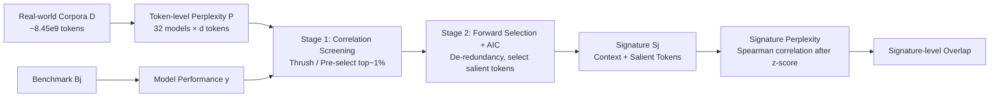

# Mapping Overlaps in Benchmarks through Perplexity in the Wild

**Conference**: ICLR 2026  
**OpenReview**: [https://openreview.net/forum?id=QD0cuAmi9z](https://openreview.net/forum?id=QD0cuAmi9z)  
**Code**: Open source (GitHub link provided in paper)  
**Area**: LLM Evaluation / Benchmark Meta-evaluation  
**Keywords**: benchmark overlap, perplexity, benchmark signature, meta-evaluation, in-the-wild corpora  

## TL;DR
This paper proposes **benchmark signature**—extracting a set of "salient tokens" from large-scale real-world corpora and using the perplexity of LLMs on these tokens to predict their performance on a specific benchmark. This characterizes the capabilities actually tested by each benchmark and quantifies the true overlap structure among 89 benchmarks that is otherwise obscured by semantic similarity and performance correlation.

## Background & Motivation
- **Background**: There is an explosive growth in LLM benchmarks (submissions to the NeurIPS Datasets & Benchmarks track rose from 252 in 2021 to 1820 in 2024, a 7x increase). Every benchmark claims to measure a "unique ability," but whether they are truly unique and how much they overlap has long remained unclear.
- **Limitations of Prior Work**: The two mainstream approaches to measuring benchmark overlap are unreliable. **Semantic-level** (using sentence embeddings to compare prompt similarity) only captures surface phrasing; similarities are often compressed into a narrow range of 0.1–0.4, offering poor discriminative power. **Performance-level** (comparing the correlation of model scores across two benchmarks) is almost universally high and contaminated by "benchmark-irrelevant factors"—for instance, the correlation between MMLU-history and MMLU-chemistry is higher than between two history benchmarks from different sources, indicating that it measures surface attributes like "belonging to the MMLU family" or "multiple-choice format" rather than actual capabilities.
- **Key Challenge**: Different phrasing $\neq$ non-overlapping capabilities; high performance correlation $\neq$ capability correlation. This is because solving any problem involves a mix of common skills like reading, instruction following, and comprehension, which dilutes behavioral alignment into indistinguishability. A metric is needed that can penetrate surface phrasing while filtering out format/family noise.
- **Goal**: Through a meta-evaluation of 32 LLMs $\times$ 89 benchmarks, identify a robust overlap measure unaffected by phrasing and format confounding to answer: "Do we really need this many benchmarks, how much do they overlap, and which capabilities are actually left untested?"
- **Core Idea**: **Use perplexity as a bridge**. The capabilities tested by benchmarks (common sense, factual recall, reasoning, programming) originate from real-world text distributions. Low perplexity on a text segment indicates the model encountered similar patterns during training and mastered that capability. Therefore, the **token-level perplexity distribution on real-world corpora serves as a fingerprint of model exposure/capabilities**, and different benchmarks map to different perplexity distributions—this is the signature. **[Core Assumption: Benchmarks are not external impositions post-training, but structured samplings of capability distributions in real data.]**

## Method

### Overall Architecture
The method decomposes "benchmark overlap" into three complementary levels: **Semantic-level** (cosine similarity of prompt embeddings, using size-matched bootstrap to eliminate volume bias), **Performance-level** (Spearman rank correlation of model score vectors), and the newly proposed **Signature-level**. Signature extraction is central: for each benchmark, the perplexities of billions of real-world tokens are treated as covariates and model scores as regression targets. In an ultra-high-dimensional sparse regression where $d \gg m$ ($d \approx 8.45 \times 10^9$ tokens, $m=32$ models), a small subset of the most predictive tokens is selected. Their "context + salient token" forms the benchmark's signature. The overlap between two benchmarks is the Spearman correlation of normalized perplexities calculated by the 32 models on their respective signatures.

### Key Designs

**1. Three levels of overlap definition**: Breaking "overlap" into surface, behavioral, and fingerprint perspectives. The semantic level uses sentence vectors $f$ under size-matched sampling to calculate $\widehat{A}_{\text{sem}}(B_a,B_b)=\frac{1}{T}\sum_t s\big(f(\text{concat}(q^{(a)}_t)),f(\text{concat}(q^{(b)}_t))\big)$, eliminating the bias where larger benchmarks naturally appear more similar. The performance level uses Spearman rank correlation $\rho(B_a,B_b)=\text{corr}(\text{rank}(y_{:,a}),\text{rank}(y_{:,b}))$. These two serve as control groups to demonstrate that signatures are the truly discriminative layer.

**2. Two-stage extraction under ultra-high-dimensional sparsity**. Directly performing multivariate regression on $P \in \mathbb{R}^{m \times d}$ is ill-posed when $d \approx 10^9 \gg m = 32$. The authors rely on a **sparsity hypothesis** (the vast majority of tokens are uninformative) and use two steps. The first is $O(md)$ linear-time **per-token correlation screening**: calculating a robust correlation coefficient between each token's perplexity vector and the performance vector, retaining the top ~1% ($d' \approx 1.69 \times 10^7$). This is theoretically grounded in Sure Independence Screening (SIS, Fan & Lv 2008)—under ultra-high dimensionality, marginal screening possesses the "sure screening property," discarding noise while retaining true signals with high probability.

**3. Robust correlation coefficients**: Magnitude-agnostic statistics. To avoid being influenced by absolute perplexity values, screening uses two rank-based coefficients. **Thrush correlation** is a variant of Kendall's $\tau$, calculating $\gamma_j=\sum_{1\le k<l\le m}\text{sign}(y_{k,j}-y_{l,j})(\text{rank}_j(p_{k,j})-\text{rank}_j(p_{l,j}))$ to count concordant minus discordant pairs. **Pre-select correlation** $\eta_j=\sum_{1\le k<l\le m}\mathbf{1}\{p_{k,j}>p_{l,j}\}/Z$ ($Z=\binom{m}{2}$) counts the proportion of misordered model pairs. Both rely only on ranks, naturally resisting systematic biases like "weak models always have high perplexity."

**4. Forward selection + AIC for de-redundancy and signature refinement**. Candidate tokens from the first stage remain redundant (multiple tokens reflecting the same linguistic phenomenon). Therefore, the second stage performs **greedy forward selection regression**: adding one token at a time that maximizes fit, using **AIC** to balance explanatory power against model size until no token meaningfully reduces AIC. The resulting sparse token set is the signature. Overlap calculation also involves within-group z-score normalization of perplexities to prevent system differences between models from contaminating alignment.

## Key Experimental Results

### Main Results and Three-Level Comparison
- Scale: **32 LLMs × 89 Benchmarks**, using **RedPajama** for real-world corpora.

| Overlap Level | Typical Values/Behavior | Discriminative Power |
|---|---|---|
| Semantic-level | Both similar/dissimilar fall in 0.1–0.4 | Weak, almost indistinguishable |
| Performance-level | Almost universally high, ≈0.8 within same family/format | Heavily contaminated by format/family |
| **Signature-level** | High for similar, low for dissimilar; clear structure | **Strongest, statistically significant** |

### Evaluation Bias Mitigation (Ablative Control)

| Comparison Dimension | Performance-level Result | Signature-level Result |
|---|---|---|
| Same family vs. Cross-family / Same format vs. Different format | Significant increases in overlap (≈0.8) | Mann–Whitney U test difference ≈0, **not significant** |
| Conclusion | Performance correlation is contaminated by benchmark-irrelevant factors | Signature filters noise, approaching true overlap |

### Key Findings
- **Cross-capability overlap structure**: Logic, instruction-following, language, math, and world-modeling (mostly cultural benchmarks) form an interconnected capability cluster. Math and logic overlap at 0.21, close to the intra-functional average of 0.285 and far exceeding the cross-functional average of 0.105, aligning with the intuition that math requires logic.
- **Coding is most isolated**: Programming benchmarks have very low cross-functional overlap, correlating moderately only with "detecting missing information in sequences" (AbsenceBench), as programming relies on highly specialized pre-training corpora like GitHub.
- **Mismatch between design and execution**: Instances occur where cross-functional overlap between instruction-following and logic exceeds intra-functional overlap—indicating many benchmarks claiming to test "logic" are actually measuring "instruction following."
- **Qualitative analysis**: Only "knowledge-based" benchmark signatures are truly "about" that domain. Signature tokens for meta-capability benchmarks like logic are often unrelated to their stated functions—suggesting LLM semantic organization may differ from human conceptual structures.

## Highlights & Insights
- The perspective of **perplexity as a fingerprint** is elegant: it allows "reverse engineering" what a benchmark tests without direct evaluation on it, grounding the concept of an "interconnected capability space."
- **A critique of existing benchmark agreement research**: It reveals that performance correlation is heavily contaminated by question types and benchmark families. The counter-intuitive evidence that "MMLU-history is more like MMLU-chemistry than another history benchmark" is highly persuasive.
- The method assembles SIS theoretical guarantees, empirical data screening, and AIC forward selection into a reproducible pipeline for **ultra-high-dimensional sparse regression**, emphasized by the authors as reproducible even with small-scale compute.

## Limitations & Future Work
- **Inherent limitations of marginal screening**: Stage one only considers single-token marginal correlation, potentially missing "suppressor" tokens that are only predictive in multivariate contexts.
- **Weak interpretability of signatures**: Signatures for many meta-capability benchmarks do not match their stated functions; the authors offer theoretical explanations but lack systematic causal validation.
- **Dependence on real-world corpora approximation**: Signature quality is affected by the choice of "in-the-wild" corpora. While robustness tests were conducted, whether RedPajama sufficiently represents the training distribution remains an open question.
- **Operational suggestions**: Transitioning from "mapping overlap" to "which benchmarks to remove or which capabilities to add" requires further work.

## Related Work & Insights
- Directly engages with **benchmark agreement / performance correlation studies** (Perlitz et al., 2024), pointing out their contamination by confounding factors.
- The lineage of **perplexity for data selection** (Thrush et al., 2025; Shum et al., 2025) provides the empirical basis for the correlation coefficients and sparse screening.
- Theoretically supported by **Sure Independence Screening** (Fan & Lv, 2008) for ultra-high-dimensional marginal screening.

## Rating
- **Novelty**: ⭐⭐⭐⭐⭐ "Benchmark signature = real-world perplexity fingerprint" is a novel and elegant perspective.
- **Experimental Thoroughness**: ⭐⭐⭐⭐ 32 models × 89 benchmarks is a significant scale; three-level controls and robustness tests are solid.
- **Writing Quality**: ⭐⭐⭐⭐ Motivations are progressive and the three-level framework is clear.
- **Value**: ⭐⭐⭐⭐⭐ Significant contribution to understanding LLM evaluation validity and the "interconnected capability space."

<!-- RELATED:START -->

## Related Papers

- [\[ICLR 2026\] Mapping Post-Training Forgetting in Language Models at Scale](mapping_post-training_forgetting_in_language_models_at_scale.md)
- [\[ICLR 2026\] LiveResearchBench: A Live Benchmark for User-Centric Deep Research in the Wild](liveresearchbench_a_live_benchmark_for_user-centric_deep_research_in_the_wild.md)
- [\[ACL 2026\] WildIFEval: Instruction Following in the Wild](../../ACL2026/llm_evaluation/wildifeval_instruction_following_in_the_wild.md)
- [\[ICLR 2026\] Towards Personalized Deep Research: Benchmarks and Evaluations](towards_personalized_deep_research_benchmarks_and_evaluations.md)
- [\[ICLR 2026\] Culture in Action: Evaluating Text-to-Image Models through Social Activities](culture_in_action_evaluating_text-to-image_models_through_social_activities.md)

<!-- RELATED:END -->
