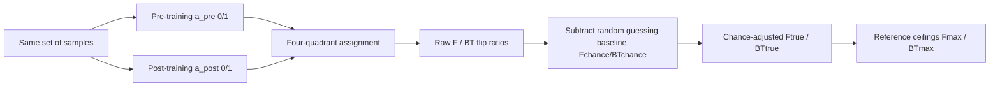

# Mapping Post-Training Forgetting in Language Models at Scale

**Conference**: ICLR 2026  
**OpenReview**: [https://openreview.net/forum?id=qCIg2WGudx](https://openreview.net/forum?id=qCIg2WGudx)  
**Code**: [https://post-forget.github.io/](https://post-forget.github.io/)  
**Area**: LLM Evaluation, Continual Learning, Post-training Analysis  
**Keywords**: post-training, catastrophic forgetting, backward transfer, sample-wise metrics, chance adjustment  

## TL;DR
The authors propose a **sample-wise + chance-adjusted** forgetting and backward transfer measurement framework. Large-scale empirical testing on nearly 30 base→post-trained model pairs across approximately 100 sub-benchmarks reveals that real-world post-training forgetting is significantly milder than predicted by continual learning literature, while backward transfer in mathematics and logic is prevalent.

## Background & Motivation
**Background**: Scaling post-training (instruction tuning, SFT/RL for reasoning, domain-continual pretraining) has become the primary driver for modern LLM capability enhancement. Practitioners generally assume that "each post-training step only builds new capabilities without eroding the extensive world knowledge embedded during pretraining." Conversely, classic conclusions in continual learning suggest the opposite: sequential training leads to **catastrophic forgetting**. These two intuitions conflict sharply and have never been systematically quantified across real post-training pipelines.

**Limitations of Prior Work**: Traditional evaluation uses the "difference in aggregate accuracy before and after training" to measure forgetting. This implicitly treats a benchmark as a **single task with interchangeable samples** (similar to classifying cat images). However, pretrained knowledge does not meet this assumption—knowing one U.S. president does not compensate for forgetting another, and remembering NumPy broadcasting rules does not offset forgetting a specific cloud API syntax. Aggregation causes significant real knowledge loss and gain to **cancel each other out**, masking drastic changes. Furthermore, most knowledge-intensive benchmarks are Multiple Choice Questions (MCQs), where random guessing creates **false 1→0 / 0→1 flips** (guessing correctly by luck then failing later). When there are only 4 options, this can occupy a significant proportion, distorting both the level and trend estimates of forgetting.

**Key Challenge**: To answer "what exactly is forgotten, when, and by how much," it is necessary to **reduce results to the sample level** and **explicitly subtract the contribution of random guessing**—neither of which can be achieved by task-level aggregate metrics.

**Goal**: Establish a practical, large-scale reproducible "forgetting map" framework to answer three questions: At which step of the pipeline is forgetting most severe (instruction tuning vs. reasoning training)? Which types of pretrained knowledge are most affected (culture vs. logic)? Exactly how much knowledge was forgotten or reactivated?

**Core Idea**: **[Sample-wise Transfer Counting]** Each sample is classified into four quadrants based on correctness before and after training (1→0 flip for forgetting, 0→1 flip for backward transfer). **[Chance Adjustment]** The contribution of lucky guesses is analytically subtracted using only the aggregate accuracy and number of options $k$ without requiring logits or repeated sampling, enabling low-cost deployment across nearly 100 benchmarks.

## Method

### Overall Architecture
The core of the framework is a sample-level transfer map generated from the "pre-training correctness $a^{pre}_i$" and "post-training correctness $a^{post}_i$" labels. Each sample falls into one of four quadrants: Maintained (1→1), Backward Transfer (0→1), Forgetting (1→0), or Unlearned (0→0). Raw forgetting and backward transfer are the proportions of the latter two flips, but they are corrupted by false flips from random guessing. A simple response model—"answer correctly if known, guess uniformly among $k$ options if unknown"—is used to analytically estimate and subtract the guessing baseline, yielding corrected $F_{true}$, $BT_{true}$, and theoretical ceilings $F_{max}$, $BT_{max}$. This metric relies only on aggregate accuracy and the number of options, allowing uniform testing across nearly 30 model pairs.

### Key Designs
**1. Sample-wise Flip Counting: Rejecting "mutual cancellation" in task averages.** For an evaluation set containing $N$ questions with $k$ options each, forgetting and backward transfer are defined as the proportions of two types of sample flips:

$$F = \frac{1}{N}\sum_{i=1}^{N}\mathbb{1}\{a^{pre}_i=1 \wedge a^{post}_i=0\}, \quad BT = \frac{1}{N}\sum_{i=1}^{N}\mathbb{1}\{a^{pre}_i=0 \wedge a^{post}_i=1\}$$

Crucially, the comparison must be conducted on the **same set of samples** before and after training to distinguish "what is retained, what is forgotten, and where losses are concentrated," rather than allowing a +5% in one area to offset a -5% in another. This step transforms forgetting from a scalar into a localizable map.

**2. Random Guessing Baseline: Stripping "luck flips" from real knowledge changes.** A 1→0 flip due purely to luck requires "guessing correctly before training + guessing incorrectly after training" to occur simultaneously. Assuming uniform guessing among $k$ options for unknown questions, the probability of a lucky guess is $x=\frac{1-\bar a}{k-1}$. Under the assumption of independent guessing before and after training:

$$F_{chance} = \frac{1-\bar a^{pre}}{k-1}\cdot(1-\bar a^{post}), \quad BT_{chance} = (1-\bar a^{pre})\cdot\frac{1-\bar a^{post}}{k-1}$$

This explains a counterintuitive phenomenon: two independent random binary classifiers ($k{=}2$) would "measure" a forgetting rate of $F=0.5\times0.5=0.25$, which is pure noise. The baseline depends only on aggregate accuracy and $k$, requiring neither logits nor repeated sampling.

**3. Chance-adjusted Metrics and Ceilings: Providing a meaningful scale for forgetting.** The baseline is subtracted from the raw metric and truncated at 0 to obtain the corrected amount reflecting "real knowledge change beyond luck." Meanwhile, the "proportion of truly known questions" provides the upper bound for potential forgetting/transfer:

$$F_{true}=\max(F-F_{chance},0), \quad F_{max}=\bar a^{pre}_{true}=\max\!\Big(\frac{k\bar a^{pre}-1}{k-1},0\Big)$$

For example, if the accuracy of a 4-choice MCQ drops from 80% to 70%, the raw forgetting is 10%, while the chance-adjusted value is only about 6%. Reporting $F_{true}$ alongside $F_{max}$ distinguishes real knowledge loss from luck and provides context for "how much more degradation is possible." The authors emphasize that $F_{true}$ measures the "loss of accessibility of previously elicitable knowledge," which **does not necessarily mean information was erased from the weights**—many $BT_{true}$ changes reflect better knowledge **elicitation** rather than new acquisition.

## Key Experimental Results

### Main Results (Forgetting/Backward Transfer patterns across four post-training mechanisms)
Using the LightEval framework, Zero-shot CoT (Instruct models) / Few-shot (Base models for format), 32,768 token sequence length, temperature 0.6 + top-p 0.95. Forgetting is defined as "Medium = 15±5%, Low = below this, High = above this."

| Post-training Mechanism | Forgetting Level | Backward Transfer | Key Observation |
|---|---|---|---|
| Domain-continual pretraining (Coder/Math) | Low to Medium, consistent across categories | Weak | Math-specialized models forget significantly more; larger models forget less |
| Instruction tuning (Qwen2.5/Llama3.1) | Low to Medium, peaks in Culture/Knowledge | Significant on Math | Larger scale leads to less forgetting and more backward transfer |
| Reasoning SFT/RL (from Base) | Minimal overall, High Culture, Medium Knowledge | Medium to High on Math/Logic | Most gains stem from improved instruction following |
| Reasoning training (from Instruct, low-data s1.1/LIMO) | Minimal | Low (except generative math) | Low-data, few-epoch training barely touches pretrained knowledge |
| Reasoning training (from Instruct, high-data OpenThinker etc.) | Low to Medium (High for narrow data like OpenCodeReasoner) | Medium | No single dominant factor explains it; mixed-domain training yields less forgetting |

### Ablation Study: Can model merging mitigate forgetting?
Testing EMA / LERP / SLERP merging (linear interpolation between two checkpoints $\theta_{EMA}(\alpha)=\alpha\theta_{pre}+(1-\alpha)\theta_{post}$) on Qwen2.5-Coder-7B and OpenThinker-7B/3-7B:

| Merge Target | Result |
|---|---|
| Qwen2.5-Coder-7B / OpenThinker3-7B | Even small amounts of base model mixing degrade performance, especially for the latter |
| OpenThinker-7B | Slight overall gain accompanied by medium forgetting |
| Overall | Merging **failed** to reliably mitigate forgetting (suspected due to merging only two checkpoints versus 8+ in literature, causing excessive weight drift) |

### Key Findings
- **Real-world post-training forgetting is much smaller than predicted by continual learning literature**—this is the core contrasting conclusion, indicating a significant gap between "CL experimental setups" and "real post-training pipelines."
- **Scale is almost always beneficial**: Larger models forget less and exhibit more backward transfer across most sub-domains.
- **Backward transfer in Math/Logic is prevalent**, but a large part is "better knowledge elicitation" rather than new knowledge acquisition; gains in reasoning training from base models primarily reflect improved instruction following.
- **Narrow-data post-training (e.g., pure code reasoning) results in the most severe forgetting**, often due to instruction-following degradation (refusal to use letters for answers, embedding answers in Python code), necessitating LLM-as-a-judge for recovery.

## Highlights & Insights
- **Restoring "forgetting" from a scalar to a localizable map**: The four-quadrant + sample-wise counting allows for a clear view of "what knowledge, at which step, and how much is lost," addressing the blind spots caused by task-average cancellation.
- **Chance adjustment requires only $\bar a$ and $k$**: This engineering-friendly approach is the key to scaling across hundreds of MCQ benchmarks without requiring logits or repeated sampling, and it corrects systematic overestimations such as "two random classifiers measuring 0.25 forgetting."
- **Important conceptual clarification**: $F_{true}$ measures knowledge "accessibility" rather than "erasure," while BT often reflects elicitation improvements—this decouples "forgetting" from "changes in elicitation ability."
- **Policy significance of conclusions**: Modern post-training does not erode world knowledge as suggested by CL literature, providing empirical backing for "scaling post-training with confidence" while identifying narrow-domain training and model merging as real risks/unresolved points.

## Limitations & Future Work
- **Chance adjustment relies on two strong assumptions**: Uniform random guessing for unknowns and independence between pre- and post-training guesses. Biased model guesses (e.g., favoring a specific option) may reduce adjustment accuracy.
- **Accessibility ≠ Forgetting**: $F_{true}$ cannot distinguish between "knowledge erasure" and "failure to elicit," particularly in narrow-data models where instruction-following degradation makes observed forgetting highly dependent on extraction methods.
- **No single dominant factor for high-data reasoning training**: Initialization, data scale, and model size are insufficient to robustly explain the dynamics; the authors acknowledge these conclusions are preliminary and require finer training quality control.
- **Limited model merging experiments**: Merging only two checkpoints is not comparable to the 8+ checkpoints used in literature; the conclusion that "merging is ineffective" requires cautious extrapolation.

## Related Work & Insights
- The sample-wise transfer concept builds on backward transfer (Lopez-Paz & Ranzato, 2017) but localizes it to the sample level with chance adjustment.
- Contrasts with LLM forgetting studies: Kotha et al. (2024) argue fine-tuning distorts implicit task inference rather than erasing capability, and Li et al. (2025) propose "temporal forgetting"—the "accessibility versus erasure" stance in this paper aligns with these views.
- Insights for practice: When evaluating post-training, use sample-wise comparisons + chance-adjusted reporting + knowledge categorization rather than aggregate scores; be extra vigilant about "pseudo-forgetting" caused by instruction-following degradation during narrow-domain post-training.

## Rating
- **Novelty**: ⭐⭐⭐⭐ The metric itself (sample-wise + analytical chance-adjustment) is a solid improvement over classic forgetting evaluation; components are simple but well-combined and practical.
- **Experimental Thoroughness**: ⭐⭐⭐⭐⭐ Nearly 30 model pairs, ~100 sub-benchmarks, four post-training mechanisms + merging experiments; coverage is rare for analysis papers, and per-sample logs are open-sourced.
- **Writing Quality**: ⭐⭐⭐⭐ Problem motivation is clear, formula derivations are clean, and takeaways are prominent; figures depend heavily on text descriptions, making it slightly difficult for text-only readers.
- **Value**: ⭐⭐⭐⭐⭐ Provides a reproducible quantitative answer and toolkit for the critical practical question of whether scaling post-training erodes world knowledge, offering direct guidance for pipeline design and CL research.

<!-- RELATED:START -->

## Related Papers

- [\[ICLR 2026\] Mapping Overlaps in Benchmarks through Perplexity in the Wild](mapping_overlaps_in_benchmarks_through_perplexity_in_the_wild.md)
- [\[ACL 2026\] Enhancing Linguistic Competence of Language Models through Pre-training with Language Learning Tasks](../../ACL2026/llm_evaluation/enhancing_linguistic_competence_of_language_models_through_pre-training_with_lan.md)
- [\[ICLR 2026\] Evaluating Language Models' Evaluations of Games](evaluating_language_models_evaluations_of_games.md)
- [\[NeurIPS 2025\] ConfTuner: Training Large Language Models to Express Their Confidence Verbally](../../NeurIPS2025/llm_evaluation/conftuner_training_large_language_models_to_express_their_confidence_verbally.md)
- [\[ICLR 2026\] Truthfulness Despite Weak Supervision: Evaluating and Training LLMs Using Peer Prediction](truthfulness_despite_weak_supervision_evaluating_and_training_llms_using_peer_pr.md)

<!-- RELATED:END -->
