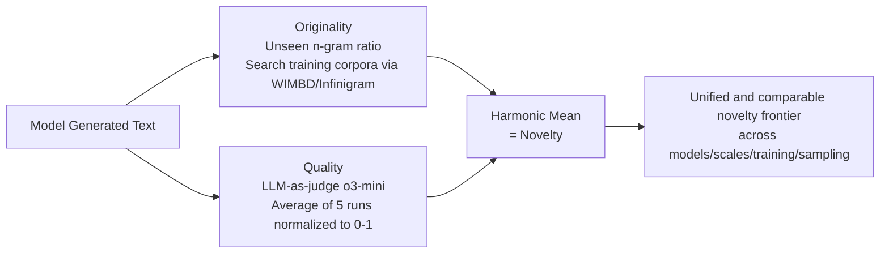

# Measuring LLM Novelty as the Frontier of Original and High-Quality Output

**Conference**: ICLR 2026  
**OpenReview**: [https://openreview.net/forum?id=i7QNKZioN6](https://openreview.net/forum?id=i7QNKZioN6)  
**Code**: To be confirmed (Authors promise to release 5000+ generated data points, quality scores, and duplicate n-grams)  
**Area**: LLM Evaluation / Creativity and Novelty Measurement  
**Keywords**: Novelty Measurement, n-gram Originality, LLM-as-judge, Creativity Evaluation, Post-training, Inference-time methods  

## TL;DR
This paper proposes defining LLM "novelty" as the **harmonic mean of originality (the proportion of n-grams not seen in training data) and quality (task-specific scoring)**. Using this unified metric, the authors systematically characterize the factors that drive the novelty frontier across three open-data model families and three creative tasks.

## Background & Motivation
**Background**: As LLMs are increasingly utilized for creative writing and scientific discovery, the ability of models to generate original content has become a critical evaluation dimension. Two independent measurement approaches currently exist: one focuses on **memorization/originality** (e.g., Creativity Index and n-novelty by McCoy, Merrill, Lu et al.), which calculates the proportion of high-order n-grams in generated text that do not appear in the training data; the other uses **human preference** (e.g., leaderboards like Chatbot Arena) to measure quality.

**Limitations of Prior Work**: Neither metric is sufficient on its own. If only originality is considered, models can exploit the metric by outputting gibberish or obscure sentences—long-tail generation is often original yet meaningless. If only human preference is considered, non-expert reviewers may fail to distinguish high-quality sentences "copied verbatim from pre-training corpora" from genuine creations, thereby rewarding plagiarized answers. **Key Challenge**: Originality and quality are two dimensions that often pull against each other; focusing on either one in isolation allows for exploitation.

**Goal**: To develop a unified novelty metric for the horizontal comparison of models across different families, scales, and training methods, and to decompose "what factors actually influence LLM novelty." **Core Idea (Harmonic Mean of Originality × Quality)**: True novelty must be **simultaneously** original and high-quality. The harmonic mean is used to penalize the collapse of either dimension. The study deliberately selects **open-data models** (OLMo / OLMo-2 / Pythia), as public training corpora are required for the accurate measurement of originality.

## Method

### Overall Architecture
The methodology consists of three steps: first, formalizing novelty as the harmonic mean of originality and quality (metric definition); second, applying this to three open-ended creative tasks (story continuation, rhythmic poetry, and creative tool use); finally, calculating originality via public corpora indexing and quality via LLM-as-judge. This allows for comparable novelty scores across any set of models or sampling strategies. The evaluation is designed to answer which **model-modifying** factors push the novelty frontier (Section 3) and whether **non-modifying** inference-time methods are effective (Section 4).

### Key Designs

**1. Fusing Originality and Quality via Harmonic Mean: Penalizing the "Bottleneck".** This is the pivot of the paper. Originality $O$ is defined as the proportion of $n$-grams in the generated text that do not appear in the training corpus $C$ (including both pre-training and post-training data). Quality $Q$ is measured by an LLM-as-judge on a 0–5 scale and then normalized to $[0,1]$. Novelty is defined as the harmonic mean of the two:

$$\text{Novelty} = \frac{2 \cdot O \cdot Q}{O + Q}$$

The harmonic mean is chosen over the arithmetic mean because it is **extremely sensitive to low values in either dimension**: an output that is original but incoherent (low $Q$) or high-quality but plagiarized (low $O$) will yield a novelty score near zero. This explicitly addresses the blind spots of the Creativity Index (which only considers $O$) and Chatbot Arena (which only considers $Q$). Values of $n$ are set to 4, 5, and 6—smaller values result in nearly all n-grams being seen ($O\to0$), while larger values result in nearly all being unseen ($O\to1$), whereas 4–6 provide discriminative power.

**2. Precise Originality Measurement with Open-Data Models + Corpus Indexing.** To calculate the "unseen n-gram ratio," one must be able to verify exactly what text the model has seen. Consequently, the study focuses on OLMo, OLMo-2, and Pythia. Originality is calculated via n-gram retrieval using the WIMBD API and Infinigram across relevant corpora including Pile, Dolma, Dolmino, Tulu SFT/RLVR mixtures, and Ultrafeedback. Human reference texts are used as a baseline, with their originality calculated against Dolma (for OLMo) or Pile (for Pythia) and quality scored by o3-mini to represent "standard human web writing."

**3. LLM-as-judge Quality Scoring and Calibration via Human Study.** Since large-scale human evaluation is impractical, the authors use LLM-as-judge as an approximation. To ensure reliability, they recruited annotators from Upwork to provide three human labels for 100 instances per task, using the same rubric provided to the judge LLM. Inter-annotator agreement (Krippendorff's α) was 0.68 for CoPoet, 0.64 for MacGyver, and 0.59 for TinyStories, which is consistent with other creative task benchmarks. Spearman correlation between model scores and mean human ratings showed that **o3-mini with 5-trial averaging** achieved the highest correlation (~0.50–0.52 across tasks).

**4. Metrics as Probes: Isolating "Quality-Driven" vs. "Originality-Driven" Novelty Gains.** The metric allows changes in novelty to be **attributed** to either quality or originality improvements. The authors analyzed three types of model interventions—scale (1B→32B), post-training (base→SFT→DPO/RLVR), and base model upgrades (OLMo→OLMo-2)—as well as inference-time interventions (sampling temperature, novel ICL examples, Denial Prompting). By plotting movement on the $O$-$Q$ plane, they determined whether a method pushes the Pareto frontier outward or merely shifts trade-offs between originality and quality.

## Key Experimental Results

### Main Results (Model Modifications on TinyStories / CoPoet / MacGyver, ∆ relative to Human Baseline)

| Model | TinyStories ∆Novelty (n=5) | CoPoet ∆Novelty (n=5) | MacGyver ∆Novelty (n=5) |
|---|---|---|---|
| OLMo-1B (base) | −0.096* | −0.108* | −0.416 |
| OLMo-7B (base) | −0.026 | −0.105 | −0.294 |
| OLMo-7B-Instruct | +0.044* | +0.231* | −0.168 |
| OLMo-2-7B (base) | +0.225* | +0.180* | −0.141 |
| OLMo-2-7B-Instruct | **+0.378*** | **+0.409*** | +0.142* |
| OLMo-2-32B-Instruct | +0.376* | +0.386* | +0.198* |

Note: `*` indicates statistical significance at α=0.05 via paired t-test. Some base models exhibit novelty **lower than human references** (negative values), but scaling, post-training, and base model upgrades can pull them into significantly positive territory.

### Ablation Study (Decomposition of Novelty Gains)

| Intervention | Change in Novelty | Primary Driver |
|---|---|---|
| Scaling 1B→7B | Increase | Primarily **Quality** (TinyStories +19%, MacGyver +39%); Originality +20% for CoPoet |
| Scaling 7B→32B | Plateau/Mixed | Average gains saturate, but **top 10% generations still improve with scale** |
| Base Upgrade (OLMo→OLMo-2) | Increase | Primarily **Originality** (more pronounced in poetry/stories than tool use) |
| Post-training base→Instruct | Increase | Primarily **Quality**, with slight increase in Originality |
| SFT Stage | Stagnant | Quality increases but Originality decreases by a comparable amount (more memorization) |
| RLVR/DPO Stage | Recovery | Preference fine-tuning recovers the originality lost during SFT |

### Key Findings
- **Sampling temperature follows a U-shape (effectively peaking then declining)**: Increasing temperature from 0.5 to 2.0 increases originality but decreases quality. Optimal temperature is task-dependent and must be tuned rather than fixed.
- **Inference-time methods rarely push the frontier**: Novel ICL examples were only significantly effective for OLMo-7B on CoPoet (+15.5%) and MacGyver (+5.5%), and slightly decreased performance for OLMo-2. Asking-for-novelty and Denial Prompting primarily squeeze out more originality at the cost of quality, resulting in a zero-sum movement between $O$ and $Q$.
- **Training-side >> Inference-side**: Scaling, alignment, and base model upgrades truly push the Pareto frontier outward. Given the limited gains from inference-time tricks, the authors call for more effective elicitation strategies.

## Highlights & Insights
- **Turning "Novelty" from a Vague Slogan into an Operable 2D Frontier**: The use of the harmonic mean closes common loopholes for "gaming" originality or human preference scores, naturally distinguishing genuine novelty from degenerate random output in the long tail.
- **Metric as a Probe**: By attributing changes to quality vs. originality, the authors provide counter-intuitive conclusions—SFT increases memorization while RL recovers originality, corroborating observations from Chu et al. (2025) that SFT memorizes while preference fine-tuning generalizes.
- **Correcting Previous Conclusions**: While Lu et al. (2024a) reported that RLHF reduces the Creativity Index, this paper finds that alignment can increase both originality and quality. The difference stems from the reference corpora (previous work used massive internet text; this work uses the model's actual training data).
- **Extensibility to Black-box Models**: Providers can report aggregated novelty scores without exposing private data, providing an interface for the community to track novelty and assess true generalization (from an AI safety perspective).

## Limitations & Future Work
- **Dependency on Open-Data Models**: Accurate originality measurement requires access to training corpora, limiting the main experiments to the OLMo/Pythia families. Application to black-box models requires cooperation from vendors.
- **Quality Scores rely on LLM-as-judge**: Despite human calibration, Spearman correlation remains at ~0.50, and creative tasks themselves exhibit low human consensus (TinyStories α=0.59), introducing noise into the quality dimension.
- **Originality Proxy via n-grams**: Surface-level absence does not equate to semantic novelty; paraphrasing might bypass n-gram detection. Higher-level semantic originality measurement remains an open research direction.
- **Limited Task Scope**: The three creative tasks focus on literary and physical reasoning; generalizability to high-value scenarios like scientific discovery remains to be verified.

## Related Work & Insights
This work sits at the intersection of two evaluation traditions: the originality side (McCoy 2023, Merrill 2024, Elazar 2024 WIMBD, Lu 2024 Creativity Index, Liu Infinigram) and the quality/preference side (Chiang 2024 Chatbot Arena). The core contribution is demonstrating that these two must be considered **jointly**. Insights for practitioners: (1) Do not evaluate creativity via a single dimension; joint metrics like the harmonic mean are harder to exploit. (2) To improve novelty, prioritize training-side investments (scale/alignment/base) over inference-side prompt engineering. (3) Sampling temperature must be tuned per task to find the novelty peak.

## Rating
- **Novelty**: ⭐⭐⭐⭐ — Formalizing the fuzzy concept of "novelty" into a comparable originality × quality frontier and using it to reveal counter-intuitive attributions is a solid conceptual contribution.
- **Experimental Thoroughness**: ⭐⭐⭐⭐ — Covers three families, multiple scales, three tasks, and multiple n-values, including human calibration and various inference interventions with significance testing.
- **Writing Quality**: ⭐⭐⭐⭐ — Figure 1 effectively illustrates the core concept; research questions are clear, and the narrative regarding attribution is coherent.
- **Value**: ⭐⭐⭐⭐ — Provides a unified, extensible, and trackable metric for creativity evaluation, along with 5000+ data points for the community.

<!-- RELATED:START -->

## Related Papers

- [\[ACL 2026\] Same Voice, Different Lab: On the Homogenization of Frontier LLM Personalities](../../ACL2026/llm_evaluation/same_voice_different_lab_on_the_homogenization_of_frontier_llm_personalities.md)
- [\[ICLR 2026\] NAIPv2: Debiased Pairwise Learning for Efficient Paper Quality Estimation](naipv2_debiased_pairwise_learning_for_efficient_paper_quality_estimation.md)
- [\[ICLR 2026\] Can LLMs Refuse Questions They Do Not Know? Measuring Knowledge-Aware Refusal in Factual Tasks](can_llms_refuse_questions_they_do_not_know_measuring_knowledge-aware_refusal_in_.md)
- [\[ICLR 2026\] CLASH: Evaluating Language Models on Judging High-Stakes Dilemmas from Multiple Perspectives](clash_evaluating_language_models_on_judging_high-stakes_dilemmas_from_multiple_p.md)
- [\[ICML 2026\] Estimating Tail Risks in Language Model Output Distributions](../../ICML2026/llm_evaluation/estimating_tail_risks_in_language_model_output_distributions.md)

<!-- RELATED:END -->
