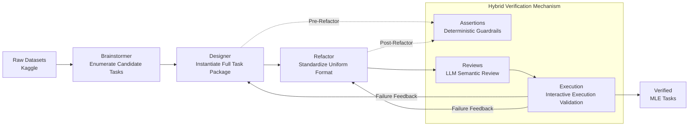

# MLE-Smith: Scaling MLE Tasks with Automated Multi-agent Pipeline

**Conference**: ICLR 2026  
**OpenReview**: [https://openreview.net/forum?id=mXQslpfSU5](https://openreview.net/forum?id=mXQslpfSU5)  
**Code**: To be confirmed  
**Area**: LLM Evaluation / Agent Benchmark  
**Keywords**: MLE Agent, Automated Task Generation, Multi-agent Pipeline, Benchmark Construction, Verification Mechanism  

## TL;DR
MLE-Smith utilizes a three-stage "generation–verification–execution" multi-agent pipeline to automatically transform raw datasets into competition-style Machine Learning Engineering (MLE) tasks. It produces 606 high-quality, executable, and discriminative benchmark tasks without human intervention.

## Background & Motivation
- **Background**: LLM Agents have shown significant progress in automated Machine Learning Engineering (MLE, from data preprocessing to hyperparameter tuning and deployment). Benchmarks or interactive environments like MLE-Bench, DS-Bench, MLE-Dojo, and MLGym are critical infrastructures for evaluating and training these agents.
- **Limitations of Prior Work**: These benchmarks are entirely **static and manually curated** task collections. Competitions are carefully selected by human experts, and substantial engineering effort is required to convert them into standard formats (splitting train/test, writing evaluation scripts, defining scoring mechanisms). This manual pipeline is extremely time-consuming, limiting the scale and diversity of tasks.
- **Key Challenge**: Training and evaluating next-generation MLE agents requires **massive, diverse, and realistic** tasks. However, the "production speed" of tasks lags far behind the "consumption speed," creating a scalability bottleneck. The difficulty lies in ensuring quality: a valid MLE task must simultaneously satisfy a three-fold intertwined standard—**structural integrity** (end-to-end runnable scripts/directories/evaluation), **semantic rationality** (self-consistent learning objectives, input-output reflecting real data signals, no degradation into trivial mappings), and **empirical solvability** (non-trivial but solvable, where baselines achieve meaningful and stable improvements). Failure in any dimension renders the task useless for distinguishing agent capabilities.
- **Goal**: To build a fully automated framework capable of continuously **generating, verifying, and evolving** MLE tasks, liberating humans from tedious task curation.
- **Core Idea**: A **generate–verify–execute paradigm**. Three specialized agents (Brainstormer / Designer / Refactor) structurally design and standardize tasks, accompanied by a **hybrid verification mechanism** (deterministic assertions + LLM semantic review + interactive execution verification) to provide multi-layered quality control. Only tasks passing all three stages are retained.

## Method

### Overall Architecture
MLE-Smith takes raw datasets from sources like Kaggle as input and produces competition-style MLE tasks through a sequentially structured pipeline. First, a multi-agent generation workflow proposes and instantiates multiple candidate tasks. Then, a hybrid verification mechanism integrated throughout the process enforces hard structural constraints and soft semantic constraints. Finally, the entire pipeline is run within an interactive MLE environment to confirm empirical solvability. These three phases are concatenated to preserve task diversity while providing strong guarantees for structural correctness and downstream usability. All agents are driven by GPT-5 by default, though the pipeline is compatible with any LLM.

### Key Designs

**1. Multi-agent Generation Workflow: Separating Hypotheses from Commitment:** Three specialized agents hand over products sequentially, with controlled feedback loops for upstream refinement. Each agent utilizes domain tools such as file I/O, shell, and code execution, with outputs standardized in a structured format for automated verification. **Brainstormer**, after multiple rounds of data exploration, does not provide a single design but **enumerates a set of candidate task formats** (the number of candidates is determined adaptively by dataset attributes, up to 3 per dataset). It explicitly specifies prediction targets, evaluation metrics, data utilization methods, and design rationale. A key principle is that all labels and features must realistically originate from the data itself (explicitly provided or deterministically derived) rather than being synthetic or heuristically constructed. **Designer** instantiates an end-to-end runnable, complete task package for each candidate without human intervention. This includes four major components: deterministic train/test splits, input-output schemas, task-specific evaluation metrics with numerical stability, and a full suite of auxiliary components (task descriptions, `prepare.py` scripts, sample valid submissions, evaluation scripts, and test scripts). **Refactor** rewrites candidate tasks into a shared consistent schema (preparation interfaces, I/O specifications, `metric.py` implementation, standardized directory structures like `raw/ private/ public/`, and feedback reporting mechanisms), ensuring format consistency and cross-file coherence. This design of "first separating hypothesis generation, then committing to specific implementation" preserves flexibility and diversity without sacrificing feasibility.

**2. Hybrid Verification Mechanism: A Three-Layer Contract of Hard and Soft Constraints:** Verification is not a one-time check at the end of the pipeline but a **persistent multi-layer contract integrated across the generate–verify–execute stages**, consisting of three complementary strategies. **Assertions (Deterministic Gatekeepers)** encode mandatory structural constraints: checking file existence, directory layout, and schema compliance for functions/classes/scripts. The Pre-Refactor stage confirms the completeness of the Designer's output (e.g., `metric.py` and `prepare.py` can run, sample submissions and test answers are generated), while the Post-Refactor stage enforces full compliance with the uniform schema (function signatures, interface formats, execution scripts). **Reviews (Semantic Review)** use LLM agents to evaluate the clarity of task descriptions, the appropriateness of metrics, and whether the task encourages meaningful behavior rather than shortcuts—catching issues that are formally correct but semantically invalid, such as "passing assertions but leaking ground truth or missing info in descriptions." **Execution-based Validation (Empirical Solvability)** runs the full task in an interactive environment based on MLE-Dojo. A ReAct-style coding agent with an action budget simulates real MLE interactions, monitoring two aspects: real pipeline verification (data prep → training → evaluation → scoring can run without human help) and performance verification (ensuring a test agent can achieve a non-trivial score and that the metric is sensitive to method quality). Failures in any dimension are recorded as structural defects, triggering **feedback loops** for targeted refinement by the Designer/Refactor or re-running the corresponding stage. The three layers cooperate—assertions handle structure, reviews handle semantics, and execution handles realistic solvability—ensuring only high-quality tasks pass all three stages.

**3. Execution Validation and Feedback Loop: Feeding Failure Modes Back into the Pipeline:** Execution validation sits at the end of the pipeline as the final safety net for failure modes that escape static/semantic checks. It reuses APIs exposed by MLE-Dojo (retrieving task metadata, validating code, executing scripts, evaluating submissions), remaining transparent to the agent's step-by-step actions and providing fine-grained feedback. Upon failure, defects are routed back into the verification mechanism to form a closed loop rather than being simply discarded. In practice, the Designer's role is lighter (>99% success on first pass, 92% completed within 15 steps), while Refactor is heavier (approx. 6% require a second attempt, approx. 1% require a third, typically using 13–22 steps) because it must analyze how to standardize code and file structures while passing all tests—consistent with the design intent of each agent.

## Key Experimental Results

### Main Results: Elo Ratings of Eight LLMs (Excerpt from Combined set)
The authors evaluated eight cutting-edge LLMs on 100 MLE tasks (50 from the MLE-Dojo real task Dojo set + 50 from the MLE-Smith generated Smith set), using Chatbot Arena-style Elo rankings as the primary metric.

| Model | MLE-Dojo Overall | MLE-Smith Overall | Combined |
|---|---|---|---|
| Gemini-2.5-Pro | 1254.6 | **1179.7** | **1214.3** |
| Gemini-2.5-Flash | 1146.7 | 1079.3 | 1111.3 |
| o4-mini | 1068.0 | 1114.6 | 1097.6 |
| DeepSeek-Reasoner | 1064.8 | 1059.1 | 1061.8 |
| o3-mini | 1011.9 | 1003.3 | 1007.6 |
| DeepSeek-Chat | 990.7 | 1030.2 | 1011.2 |
| GPT-4o | 776.5 | 808.8 | 794.1 |
| GPT-4o-mini | 686.7 | 742.0 | 716.8 |

Model rankings on the Smith set are highly consistent with those on the human-designed Dojo set—Gemini-2.5-Pro consistently leads, while the two GPT-4o series models remain at the bottom.

### Elo Consistency Statistics (Generated Tasks vs. Manual Tasks Alignment)

| Pair | Pearson r | $R^2$ | Spearman $\rho$ | Kendall $\tau_b$ | CCC | Top-3 / Top-5 |
|---|---|---|---|---|---|---|
| Dojo–Smith | 0.982 | 0.964 | 0.952 | 0.857 | 0.958 | 1.0 / 0.8 |
| Dojo–Combined | 0.996 | 0.992 | 0.976 | 0.929 | 0.989 | 1.0 / 0.8 |
| Smith–Combined | 0.995 | 0.990 | 0.976 | 0.929 | 0.989 | 1.0 / 1.0 |

Cronbach's $\alpha = 0.993$ and ICC(2,1) = 0.981 indicate that the three sets of Elos are nearly interchangeable as evaluators.

### Scale, Cost, and Diversity
- **Scale**: 224 Kaggle datasets → 606 fully verified tasks, averaging 2.71 tasks per dataset.
- **Cost**: Average of 419.98 seconds and $\$0.78$ per task; average of 1136.20 seconds and $\$2.11$ per dataset (excluding execution validation), significantly lower than manual curation.
- **Diversity**: Modal coverage includes Tabular (43.5%), NLP (21.7%), Vision-Image (11.8%), Audio, and Time-Series; targets include Classification (57.9%), Regression (27.4%), Ranking, Multi-label, Structured Prediction, and Generation; metrics include F1/P/R (24.7%), AUC (18.3%), RMSE-style (17.3%), and custom domain metrics (16.2%).

### Key Findings
- The Elo distribution induced by generated tasks is **statistically indistinguishable** from manual benchmarks (near-perfect linear $r \approx 0.98–0.996$, stable ranking, negligible Bland–Altman bias), proving that tasks generated by MLE-Smith possess realistic difficulty and can distinguish model capabilities.
- The framework can autonomously organize and define features/labels from unstructured raw data (e.g., tables without predefined targets, raw server logs, raw scientific sensor data) to produce valid tasks, demonstrating generalization beyond competition-ready datasets.

## Highlights & Insights
- **First Fully Automated Task Generation Framework for the MLE Domain**: By automating the process of "how to build a benchmark," it fundamentally resolves the scalability bottleneck of static manual curation.
- **Verification as a Contract, Not Post-processing**: Integrating three layers of verification (hard assertions, soft semantic reviews, and real execution) into the pipeline with failure loops is key to task quality credibility. This "structural/semantic/empirical" standard serves as a reference for any automated item generation system.
- **Proving Task Quality via Downstream Model Ranking Consistency**: Instead of directly rating tasks, the authors check if generated tasks can replicate the discriminative structure of manual tasks on models (highly correlated Elo), providing a clean, quantifiable criterion for benchmark equivalence.
- **Separation of Generation and Commitment**: Brainstormer first explores and enumerates candidates, then Designer converges and instantiates, achieving diversity while ensuring feasibility.

## Limitations & Future Work
- **Dependence on Strong Backbone**: The full process is driven by GPT-5; the trade-off between generation quality and cost under weaker models has not been fully explored.
- **Source Data Bias**: Kaggle data results in a higher proportion of Tabular/NLP tasks, while modalities like Vision-Video are sparse. The distribution of generated tasks is constrained by source data characteristics.
- **Evaluation Subset**: Model evaluation was conducted using a subset of 50 generated tasks; consistency on a larger scale or for long-tail tasks remains to be verified.
- **Empirical Solvability Proxy**: empirical solvability is proxied by the performance of a specific ReAct agent, which might have systematic biases compared to "human expert solvability."
- **Future Directions**: Directly utilizing generated tasks for RL training of MLE agents (self-play style continuous task generation) and expanding to real-world industrial data beyond Kaggle.

## Related Work & Insights
- **MLE Benchmarks/Environments**: MLAgentBench (13 tasks), MLE-Bench (75 Kaggle), DS-Bench (74), MLGym, and MLE-Dojo (200+ executable tasks)—all are static manual curations. MLE-Smith complements these with "continuous automated generation" and reuses MLE-Dojo as the execution environment.
- **Automated Task Generation**: TaskCraft (multi-tool agentic tasks), AutoCodeBench (reverse synthesizing code problems), SWE-Smith (synthesizing bug tasks from real repos), Self-Challenging / SQLM (self-play generation and solving)—MLE-Smith is the first such work in the MLE domain, introducing "automated problem creation" to machine learning engineering evaluation.
- **Inspiration**: The "generation–verification–execution" + failure loop paradigm is transferable to any agent evaluation scenario requiring "automated production of executable, verifiable, and discriminative tasks." Using downstream model ranking consistency as a quality criterion is a general methodology for measuring if synthetic benchmarks are "indistinguishable from reality."

## Rating
- **Novelty**: ⭐⭐⭐⭐ — The first fully automated task generation framework in the MLE domain; the combined design of the three-layer contract and failure loop is original.
- **Experimental Thoroughness**: ⭐⭐⭐⭐ — Scale of 224 datasets → 606 tasks, 8-model Elo + various consistency statistics + human evaluation + raw data generalization provide a complete evidence chain; however, model evaluation only used a 50-task subset.
- **Writing Quality**: ⭐⭐⭐⭐ — The triple quality standards (structural/semantic/empirical solvability) align clearly with the pipeline; charts (diversity distribution, Elo, consistency tables) provide strong support.
- **Value**: ⭐⭐⭐⭐ — Directly addresses the scalability bottleneck of MLE benchmarks, providing a sustainable task source for the evaluation and training of next-generation MLE agents, with both engineering and methodological value.

<!-- RELATED:START -->

## Related Papers

- [\[ICLR 2026\] Talk, Evaluate, Diagnose: User-aware Agent Evaluation with Automated Error Analysis](talk_evaluate_diagnose_user-aware_agent_evaluation_with_automated_error_analysis.md)
- [\[ACL 2026\] Automated Creativity Evaluation of Language Models Across Open-Ended Tasks](../../ACL2026/llm_evaluation/automated_creativity_evaluation_of_language_models_across_open-ended_tasks.md)
- [\[ICLR 2026\] Foundational Automatic Evaluators: Scaling Multi-Task Generative Evaluator Training for Reasoning-Centric Domains](foundational_automatic_evaluators_scaling_multi-task_generative_evaluator_traini.md)
- [\[ICLR 2026\] Holistic Agent Leaderboard: The Missing Infrastructure for AI Agent Evaluation](holistic_agent_leaderboard_the_missing_infrastructure_for_ai_agent_evaluation.md)
- [\[ICLR 2026\] Towards Self-Evolving Agent Benchmarks: Validatable Agent Trajectory via Test-Time Exploration](towards_self-evolving_agent_benchmarks_validatable_agent_trajectory_via_test-tim.md)

<!-- RELATED:END -->
