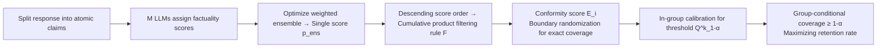

# Multi-LLM Adaptive Conformal Inference for Reliable LLM Responses

**Conference**: ICLR 2026  
**OpenReview**: [https://openreview.net/forum?id=opuQH9Xyu9](https://openreview.net/forum?id=opuQH9Xyu9)  
**Code**: [https://github.com/MLAI-Yonsei/MACI](https://github.com/MLAI-Yonsei/MACI)  
**Area**: LLM Evaluation / Factuality Assurance / Conformal Inference  
**Keywords**: Conformal Inference, Factuality Filtering, Group-Conditional Coverage, Retention Rate, Multi-LLM Ensemble  

## TL;DR
The authors model LLM factuality as a "cumulative product of per-claim scores," apply group-conditional conformal calibration to provide distribution-free coverage guarantees, and employ a multi-LLM ensemble to refine factuality score estimation. This approach strictly controls error rates while retaining as much truthful information as possible.

## Background & Motivation
**Background**: Deploying LLM outputs in high-risk scenarios (e.g., medical, legal) requires guaranteed factuality. Conformal Inference (CI) has become a popular tool for providing statistical backstops for LLM factuality due to its distribution-free, finite-sample guarantees. A typical approach involves decomposing responses into atomic claims, assigning a factuality score to each claim, and filtering out untrustworthy claims based on a threshold.

**Limitations of Prior Work**: The first-generation method, BCI (Mohri & Hashimoto 2024), uses a **single global threshold** for all data, which only provides marginal coverage; this leads to inconsistent performance across subgroups of varying difficulty. Furthermore, it uses the "worst-case claim score" as the document-level conformity score, making it extremely sensitive to estimation errors for that single claim. Consequently, calibration often results in overly conservative thresholds, **discarding a large volume of true claims** (retention rates are often as low as 0.01~0.06). The second-generation method, CCI (Cherian et al. 2024), introduces conditional threshold functions but relies on an **adaptive error rate (adaptive α)**. High-risk scenarios require fixed rather than floating guarantees, and CCI's linear threshold functions struggle to characterize the complex group structures arising from semantic segmentation of LLM responses.

**Key Challenge**: There is a fundamental conflict between achieving target coverage and maintaining high retention. Either coverage is met with extremely low retention (loss of information), or retention is increased by relaxing statistical guarantees. This tension between validity and efficiency is further tightened in high-risk domains.

**Goal**: To maximize the retention of true claims while strictly satisfying user-specified low error rates $\alpha$ and achieving **group-conditional coverage**.

**Core Idea**: **① Multiplicative Filtering Framework**—Modeling the document-level "entire retained set is true" event as a cumulative product of per-claim probabilities, creating a conformity score that aggregates information from all claims rather than relying on a single worst-case value. **② Retention Rate Theory**—Providing the first theoretical proof that the retention rate gap is determined by the MSE of the factuality score estimation, establishing the principle that "more accurate estimation leads to higher retention." **③ Multi-LLM Ensemble**—Using an ensemble to reduce estimation variance and approach oracle scores, thereby capturing the theoretical upper bound of retention.

## Method

### Overall Architecture
MACI operates within a Mondrian conformal framework: decomposing responses into claims, using a set of LLMs to assign factuality scores to each claim, constructing a document-level conformity score based on the cumulative product, and calibrating thresholds within each group to achieve group-conditional coverage. As the pipeline only requires scalar scores for each claim, it serves as a plug-and-play filter for any generator.

### Key Designs

**1. Multiplicative Filtering Framework: Modeling "set-level truth" as a cumulative product.** The starting point of MACI is the optimal filtering rule under the oracle scenario. Given claims sorted by oracle scores $p^*_i(c_{\pi(1)})\ge\cdots\ge p^*_i(c_{\pi(N_i)})$, define the prefix product $\Pi_k=\prod_{j=1}^{k}p^*_i(c_{\pi(j)})$. For a threshold $\tau$, the first $K^*_i(\tau)=\max\{k:\Pi_k\ge\tau\}$ claims are retained. This product represents the probability that the first $k$ claims are all true under an independent Bernoulli assumption, naturally converting the document-level coverage constraint $\Pr(\text{set retained}\subseteq\text{set true})\ge\tau$ into a scalar condition. Compared to BCI's focus on the single worst claim, the cumulative product aggregates the credibility of all retained claims, making it more robust to individual estimation errors. To achieve an "exact coverage" of $\tau$ rather than a conservative overshoot, the authors apply randomization at the boundary index $K^*_i(\tau)$: an additional claim is included with probability $\gamma_i(\tau)=\frac{\Pi_{K^*}-\tau}{\Pi_{K^*}-\Pi_{K^*+1}}$, maximizing the expected retention rate.

**2. Group-Conditional Adaptive Conformal Calibration: Finite-sample guarantees under fixed α.** In practice, the oracle score $p^*$ is unknown and replaced by $\hat p$ estimated by black-box LLMs. To compress the document-level filtering event into a calibratable scalar, the authors define a conformity score $E_i=\inf\{\tau:F(\hat p,\tau,U_i;P_i,C_i)\subseteq A_i\}$, representing the "minimum threshold required for the retained set to be entirely true." Under exchangeability assumptions, taking the $1-\alpha$ quantile of $E_i$ across all samples yields the marginal coverage guarantee $\Pr(\text{set retained}\subseteq\text{set true})\ge 1-\alpha$ (Theorem 1). Following the Mondrian framework, calibration is **restricted to the subset** $I_k$ belonging to the same group as the test sample. The threshold $\hat Q^{(k)}_{1-\alpha}=\text{Quantile}(\{E_i:i\in I_k\},1-\alpha)$ then provides the **group-conditional coverage** guarantee (Theorem 2). Unlike CCI, $\alpha$ is fixed by the user, meeting the requirements of high-risk scenarios.

**3. Theory of Retention Decaying with Estimation Error: Quantifying "higher accuracy" as "higher retention".** Validity alone is insufficient—a conservative rule can be valid but useless. Under oracle + Bernoulli assumptions, the authors prove the conformity score follows a uniform distribution on $[0,1]$, meaning Theorem 2 can exhaust the potential retention rate without conservatism. More crucially, Theorem 3 states that if the retention rate gap is $\Delta=|R(\hat p,\tau)-R(p^*,\tau)|$, under a margin condition near the threshold $\Pr(|p^*-\tau|\le\epsilon)\le C\epsilon^\beta$, then:
$$\Delta\le C'\big(\mathbb{E}[(\hat p-p^*)^2]\big)^{\frac{\beta}{\beta+2}},$$
meaning the retention gap converges at a polynomial rate relative to the estimation MSE. This provides the first quantitative link between "estimation quality" and "true claim retention" in conformal inference, directly motivating the use of ensembles.

**4. Multi-LLM Ensemble: Approaching the oracle via variance reduction.** Since lower MSE leads to higher retention, an ensemble is a natural choice. However, directly minimizing MSE is unfeasible (the oracle is unobservable, and binary labels would push predictors toward overconfidence). Instead, the authors use a proxy objective based on a retention rate decomposition: $R(p,\tau)=\rho\cdot\text{TPR}+(1-\rho)\cdot\text{FPR}$. They minimize the FPR under the constraint $\text{TPR}\ge 1-\delta$ (to prevent artificially high scores by sacrificing recall) to find the optimal weights $w$ for the weighted ensemble $p_\text{ens}=\sum_m w_m p_m$. This proxy objective avoids overconfidence and effectively lowers the MSE in experiments, realizing the theoretical gains in retention.

## Key Experimental Results

### Main Results (Group-conditional coverage / Retention rate, mean of 30 trials)
Comparisons were conducted against BCI and CCI on MedLFQA, WikiBio, and ExpertQA. Coverage within $1-\alpha\pm0.01$ is marked as reaching the target (•). Responses were generated by GPT-4 / GPT-3.5-turbo, and factuality scores were estimated by an ensemble of Llama-3.3-70B, Qwen-2.5-72B, and DeepSeek-V3.

| Dataset / Group (α=0.1) | BCI Cov./Ret. | CCI Cov./Ret. | MACI Cov./Ret. |
|---|---|---|---|
| MedLFQA (Marginal) | 0.90• / 0.02 | 0.90• / 0.31 | 0.90• / **0.50** |
| MedLFQA · False-Claim Risk-High | 0.88↓ / 0.01 | 0.89• / 0.22 | 0.89• / **0.41** |
| WikiBio (Marginal) | 0.90• / 0.01 | 0.89• / 0.11 | 0.90• / **0.25** |
| WikiBio · View Count-Low | 0.87↓ / 0.01 | 0.88↓ / 0.11 | 0.91• / **0.21** |

MACI consistently met the target coverage across almost all groups and target levels (80/90/95%) while achieving the highest retention—often 10–30x higher than BCI and 1.5–2x higher than CCI. BCI frequently under- or over-covered on heterogeneous groups (e.g., False-Claim Risk / View Count), and CCI failed to meet coverage targets multiple times under fixed α.

### Ablation Study
- **Ensemble vs. Single Model**: The multi-LLM ensemble significantly reduces the MSE of factuality scores compared to any single model (Figure 3), validating Theorem 3’s link between "reduced MSE" and "increased retention."
- **Conformity Score Form**: The cumulative product score is more robust to estimation errors than BCI's single worst-case score, preventing an extreme claim from forcing an overly conservative threshold for the entire document.
- Appendix results also cover variants like MultiValid CI, Group Clustering, Joint Probability Modeling, and performance comparisons under covariate shift.

### Key Findings
- Using a single extremum claim for the conformity score is the root cause of BCI's low retention; switching to an aggregated cumulative product of all claims significantly alleviates this.
- The core practical value of MACI over CCI is the ability to simultaneously achieve group-conditional coverage and high retention under a fixed α (rather than adaptive α).
- Time complexity is lower than baselines that require repeated sampling for consistency checks.

## Highlights & Insights
- **Translating statistical objectives into optimizable engineering goals**: The "cumulative product conformity score" is derived from the oracle optimal rule, and the "constrained FPR minimization" proxy aligns the pursuit of the oracle with solvable optimization. The theory and method are tightly coupled.
- **First retention rate theory for conformal inference**: Theorem 3 quantitatively links estimation MSE to true claim retention, providing a rigorous justification for ensembles beyond empirical intuition.
- **Plug-and-play**: Relying only on per-claim scalar scores allows it to be applied to any black-box generator with low deployment hurdles.

## Limitations & Future Work
- **Group definitions rely on manual priors**: Group partitioning $g$ uses dataset-specific high-level categories (e.g., medical question types). Applying it to new domains requires re-designing grouping criteria.
- **Bernoulli independence assumption**: The proof for retention optimality assumes claim labels within a document are conditionally independent. In reality, claims often have factual dependencies, which might make the product score slightly optimistic.
- **Ensemble costs**: Main experiments use three 70B-class models for scoring, involving significant inference overhead; group-level calibration thresholds may remain conservative when sample sizes are small.
- **Difficulty in verifying β/margin conditions**: The convergence rate in Theorem 3 depends on an unknown margin exponent $\beta$, making the tightness of practical bounds difficult to evaluate.

## Related Work & Insights
- **BCI** (Mohri & Hashimoto 2024): The pioneering approach using a single global threshold and worst-case scores; MACI directly addresses its conservatism.
- **CCI** (Cherian et al. 2024): Conditional conformal inference with adaptive α. It shares similar goals with MACI but differs in the form of guarantees; it is the most direct competitor.
- **Multi-calibration / MultiValid CP** (Hébert-Johnson 2018; Jung et al. 2023): The theoretical foundation for group-conditional coverage, which typically sacrifices efficiency. MACI attempts to recover retention within this framework.
- **Insight**: In the presence of conflicting constraints like "distribution-free guarantees vs. information retention," a valuable methodology is to derive the oracle optimal solution first and then use theory (quantifying the impact of estimation error) to align engineering improvements (ensembles, smarter score aggregation) with statistical objectives.

## Rating
- **Novelty**: ⭐⭐⭐⭐ The multiplicative filtering framework + first retention rate theory for CI + multi-LLM ensemble motivation form a cohesive and theoretically grounded new approach.
- **Experimental Thoroughness**: ⭐⭐⭐⭐ Three datasets × multiple group partitions × three target coverage levels × 30 repetitions, with extensive analysis of variants and covariate shifts in the appendix.
- **Writing Quality**: ⭐⭐⭐⭐ Clear logical progression from oracle rules to practical methods; theorems correspond directly to design choices.
- **Value**: ⭐⭐⭐⭐ Provides a practical filter that balances coverage and retention under fixed α for high-risk scenarios; highly valuable for real-world deployment.

<!-- RELATED:START -->

## Related Papers

- [\[ICLR 2026\] AdaBlock-dLLM: Semantic-Aware Diffusion LLM Inference via Adaptive Block Size](adablock-dllm_semantic-aware_diffusion_llm_inference_via_adaptive_block_size.md)
- [\[ICML 2026\] Margin-Adaptive Confidence Ranking for Reliable LLM Judgement](../../ICML2026/llm_evaluation/margin-adaptive_confidence_ranking_for_reliable_llm_judgement.md)
- [\[ACL 2026\] Statistically Reliable LLM-Based Ranking Evaluation via Prediction-Powered Inference](../../ACL2026/llm_evaluation/statistically_reliable_llm-based_ranking_evaluation_via_prediction-powered_infer.md)
- [\[ICLR 2026\] Sci2Pol：评测与微调 LLM 的「科学→政策简报」生成能力](sci2pol_evaluating_and_fine-tuning_llms_on_scientific-to-policy_brief_generation.md)
- [\[ICLR 2026\] Log Probability Tracking of LLM APIs](log_probability_tracking_of_llm_apis.md)

<!-- RELATED:END -->
