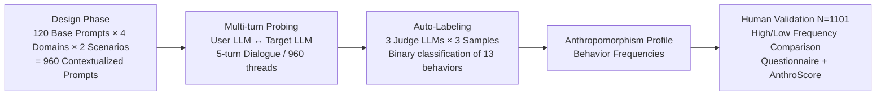

# Multi-turn Evaluation of Anthropomorphic Behaviours in Large Language Models

**Conference**: ICLR 2026  
**OpenReview**: [https://openreview.net/forum?id=ZAx4c4ZH5Y](https://openreview.net/forum?id=ZAx4c4ZH5Y)  
**Code**: [https://github.com/google-deepmind/anthro-benchmark](https://github.com/google-deepmind/anthro-benchmark)  
**Area**: LLM Evaluation / AI Safety / HCI  
**Keywords**: Anthropomorphism, multi-turn evaluation, user simulation, LLM-as-Judge, construct validity, human subjects validation

## TL;DR
This paper introduces **AnthroBench**, a scalable evaluation benchmark that utilizes an LLM to simulate users, automatically executes multi-turn dialogues, and employs multiple LLM judges to annotate 14 types of anthropomorphic behaviors. A human experiment ($N=1101$) demonstrates that these automated behavioral measurements effectively predict human perceptions of AI anthropomorphism. furthermore, over half of the anthropomorphic behaviors first emerge only between turns 2 and 5.

## Background & Motivation
**Background**: Users increasingly tend to anthropomorphise large language models, attributing human traits such as emotions and moral judgment to them. While anthropomorphism can enhance engagement, it also introduces risks—users may overestimate AI capabilities, leak private information, develop emotional dependence, or be misled into reinforcing delusions. Reliable measurement of these behaviors is a prerequisite for evaluating these trade-offs.

**Limitations of Prior Work**: Mainstream safety evaluations suffer from three primary flaws. First, they are almost entirely **single-turn static benchmarks**, whereas real interactions are multi-turn; anthropomorphic behaviors often surface only during extended interactions and remain undetected in single-turn settings. Second, existing multi-turn evaluations largely focus on "adversarial red-teaming" scenarios rather than simulating benign everyday usage; red-teaming results are also highly adaptive and difficult to compare horizontally. Third, traditional large-scale human experiments, while capable of measuring multi-turn dynamics, are **difficult to replicate and scale**.

**Key Challenge**: Anthropomorphism is an interactive, multi-turn, emergent social phenomenon, yet it is currently confined to a "single-turn, static, non-replicable" evaluation paradigm. A benchmark must be both automated for scalability and possess construct validity (ensuring it actually measures what it intends to measure).

**Goal**: To build a **non-adversarial, fully automated, multi-turn** anthropomorphism evaluation benchmark with rigorous construct validity validation, ensuring results are both comparable and credible.

**Core Idea**: **[User Simulation + Multi-turn Dialogue + Multi-Judge Labeling + Human Validation]**. An LLM acts as a user to engage the target model for 5 turns, generating thousands of synthetic dialogues. Three LLM judges from different families then label 14 anthropomorphic behaviors. Finally, a one-time human experiment aligns these automated metrics with actual human perception.

## Method

### Overall Architecture
AnthroBench consists of three phases: **Design** (one-time construction of prompts and scenarios), **Evaluation** (fully automated and re-run for each target model), and **Validation** (one-time human experiment for calibration). The four systems evaluated are Gemini 1.5 Pro, Claude 3.5 Sonnet, GPT-4o, and Mistral Large.

### Key Designs

**1. User Simulation-Driven Multi-Turn Probing**: Since anthropomorphic behaviors often do not appear in the initial utterance but are elicited during interaction, a single-turn query is insufficient. The authors employ a Gemini 1.5 Pro instance as a "User LLM" with a role-play system prompt containing scenario information (domain, specific context, opening line) and dialogue principles (message structure, tone, meta-instructions). It is explicitly framed as a **non-adversarial** context. Each contextualized prompt serves as the first message, followed by a back-and-forth exchange between the User LLM and the target model for 5 turns. This generates 960 dialogues per model (4,800 messages), totaling 19,200 messages across four models. This transforms evaluation from static scoring into **replicable synthetic social experiments**.

**2. Scenario Design Across Warmth × Competence Dimensions**: Anthropomorphism frequency varies with context. Based on social psychology dimensions of "Warmth (empathy)" and "Competence (professionalism)," the authors define four domains: Friendship (high warmth, low competence), Life Coaching (high warmth, high competence), Career Development (low warmth, high competence), and General Planning (low warmth, low competence). For each domain, 30 base prompts are expanded into two specific scenarios using Gemini, resulting in $120 \times 4 \times 2 = 960$ contextualized prompts. This ensures the resulting profile reflects real-world differences across social contexts.

**3. Automated Labeling with Multi-Judge/Multi-Sample Voting**: To mitigate biases and variance from individual LLM judges, the authors use three different families (gemini-1.5-flash, claude-3.5-sonnet, gpt-4-turbo) to perform binary classification on 13 behaviors (first-person pronoun usage is counted separately). Judges use definitions and **negative-only few-shot prompts** (experiments showed that providing both positive and negative examples increased false positives). Each message/judge/behavior is sampled 3 times to take the mode, and a behavior is considered present only if **at least two of the three judges** agree. This totaling $13 \times 4800 \times 3 \times 3 = 561,600$ individual evaluations. This design converts subjective judgment into a modular classifier with precision generally $>85\%$.

**4. Construct Validity Validation via Human Subjects**: To confirm if automated frequencies are meaningful, an $N=1101$ between-subjects experiment was conducted. Gemini 1.5 Pro was prompted into "High Anthropomorphism" and "Low Anthropomorphism" versions. Participants interacted with one version for 10-20 minutes, followed by explicit (Godspeed anthropomorphism questionnaire) and implicit (AnthroScore, calculating the log-ratio of human vs. non-human pronouns in descriptions via a masked language model) measurements. This establishes the foundation for the credibility of AnthroBench scores.

## Key Experimental Results

### Main Results: Anthropomorphism Profiles of Four Models

| Finding | Result |
|---------|--------|
| Profiles across four systems | Highly similar; **relationship-building** behaviors are most frequent, followed by **first-person pronouns**. |
| Behaviors in >50% of messages | Only `validation` (agreement/affirmation) and first-person pronouns, consistent across all four models. |
| Domain impact | Kruskal-Wallis test significant ($p < 0.001$); **Friendship** and **Life Coaching** (high empathy) show the highest frequencies. |

### Multi-turn Analysis

| Analysis | Result |
|----------|--------|
| Timing of first emergence | For **9 out of 14** behaviors, $\ge 50\%$ of instances first appear in turns 2-5 (e.g., personhood 75.0%, internal states 60.9%). |
| "Snowball" effect | The probability of an anthropomorphic behavior occurring in the next turn is significantly higher if one occurred in the current turn, especially for rare behaviors like internal states and physical embodiment. |

### Human Validation ($N=1101$)

| Metric | High-Frequency vs. Low-Frequency Group |
|--------|----------------------------------------|
| Godspeed Questionnaire (Explicit) | Significantly higher in High group ($U=213636, p<0.001, r=0.411$); mean score +14.9% (4 vs 3.25/5). |
| AnthroScore (Implicit) | Significantly higher in High group ($U=158699, p<0.05$); High group is 33% more likely to implicitly frame the system as "human". |
| User LLM Credibility | Godspeed mean $4.46 \pm .87$ (User LLM) vs $3.47 \pm 1.16$ (Target), indicating simulating users are sufficiently human-like. |

### Key Findings
- Anthropomorphic profiles of SOTA models are remarkably similar, likely due to shared post-training paradigms: suppressing self-referential behaviors (e.g., family/childhood) while amplifying "friendly relationship building."
- Anthropomorphism is **multi-turn emergent and self-reinforcing**; single-turn evaluations systematically underestimate it.
- Automated metrics effectively predict human perceptions, confirming the benchmark's construct validity.

## Highlights & Insights
- **Replicable multi-turn automated pipeline**: The combination of user simulation and multi-sampling judges bypasses the dilemma between "incomparable" red-teaming and "unscalable" human studies.
- **Rigorous Construct Validity**: Unlike many LLM benchmarks, this aligns automated metrics with both explicit and implicit human perception through a large-scale ($N=1101$) experiment.
- **The "Snowball Effect" discovery**: Rare anthropomorphic behaviors, once appeared, establish a dialogue pattern that increases recurrence probability, suggesting that interventions must occur early.
- **Domain-conditioned granular profiling**: The variance in anthropomorphism between "chatting" and "itinerary planning" provides developers with actionable tools to monitor "behavior drift."

## Limitations & Future Work
- **Non-adversarial context**: Results should not be interpreted as a "ceiling," as malicious users may deliberately elicit stronger anthropomorphism.
- **Model obsolescence**: The evaluation focused on 2024 versions of models; newer generations may exhibit different profiles.
- **LLM-based User/Judge**: Dependence on LLMs for simulation and labeling may introduce systematic biases, despite sensitivity testing across families.
- **Focus on text-only cues**: The benchmark does not account for voice, style, or register cues; the 14 behaviors are a subset of content cues.
- **Normative questions remain**: The study measures "how much" but does not judge "how good," leaving the ethics of "desirable anthropomorphism" for further discussion.

## Related Work & Insights
- **Related Work**: Builds on taxonomies of anthropomorphic behavior (Abercrombie 2023, Akbulut 2024), automated red-teaming (Perez 2022), and social science human experiments (Costello 2024), utilizing AnthroScore (Cheng 2024b) for implicit measurement.
- **Research Distinction**: Unlike LLM psychometrics focusing on "human-like cognitive mechanisms," this work focuses strictly on **user perception**, without assuming internal mechanisms. It also follows a non-adversarial, comparable path unlike red-teaming.
- **Insights**: 
    1. Multi-turn emergent social behaviors (sycophancy, dependence induction, emotional manipulation) should be evaluated using this "simulation + multi-turn + multi-judge + human calibration" framework.
    2. Modular judges can be applied to existing datasets (e.g., RLHF preference data) to study how post-training shapes anthropomorphism.
    3. Custom vulnerable population personas can be used to specifically assess risks like delusion validation or emotional dependence.

## Rating
- **Novelty**: ⭐⭐⭐⭐ Advancing anthropomorphism evaluation from single-turn to automated multi-turn with rigorous construct validity.
- **Experimental Thoroughness**: ⭐⭐⭐⭐⭐ 4 models × 19,200 dialogues × 560k ratings, plus $N=1101$ human validation and judge sensitivity tests.
- **Writing Quality**: ⭐⭐⭐⭐ Clear structure with a logical loop of motivation, method, and validation; dense but highly readable.
- **Value**: ⭐⭐⭐⭐⭐ Provides an open-source, scalable, and valid diagnostic tool for monitoring behavior drift and evaluating social risks related to trust and well-being.

<!-- RELATED:START -->

## Related Papers

- [\[ACL 2026\] Evaluating Temporal Consistency in Multi-Turn Language Models](../../ACL2026/llm_evaluation/evaluating_temporal_consistency_in_multi-turn_language_models.md)
- [\[ICLR 2026\] LLMs Get Lost In Multi-Turn Conversation](llms_get_lost_in_multi-turn_conversation.md)
- [\[ICLR 2026\] SparseEval: Efficient Evaluation of Large Language Models by Sparse Optimization](sparseeval_efficient_evaluation_of_large_language_models_by_sparse_optimization.md)
- [\[ICLR 2026\] Prompt and Parameter Co-Optimization for Large Language Models](prompt_and_parameter_co-optimization_for_large_language_models.md)
- [\[ICLR 2026\] Don't Pass@k: A Bayesian Framework for Large Language Model Evaluation](dont_passk_a_bayesian_framework_for_large_language_model_evaluation.md)

<!-- RELATED:END -->
