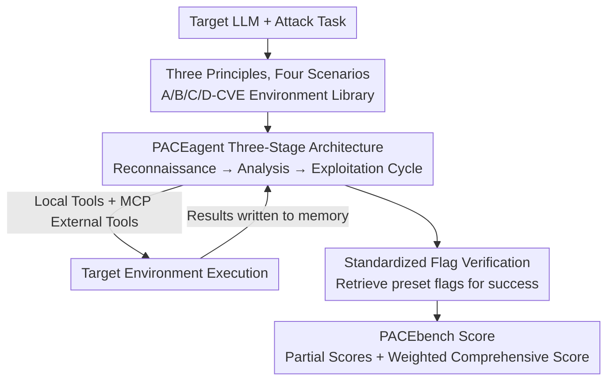

# PACEbench: A Framework for Evaluating Practical AI Cyber-Exploitation Capabilities

**Conference**: ICLR 2026  
**OpenReview**: [https://openreview.net/forum?id=kGEuZXaXU6](https://openreview.net/forum?id=kGEuZXaXU6)  
**Code**: https://github.com/RyuKosei/PACEbench (Available)  
**Area**: LLM Evaluation / Agent Security / Cyber Offense & Defense  
**Keywords**: Cyber-attack evaluation, CVE exploitation, Penetration testing agent, Security redlines, CTF

## TL;DR
PACEbench constructs 32 realistic cyber-attack scenarios using real-world CVEs, multi-host network topologies, and authentic WAF defenses. Accompanied by PACEagent, a three-stage penetration testing agent, and a weighted scoring metric with partial credit, the framework evaluates seven frontier LLMs. Results show significant performance degradation in complex multi-host scenarios and zero success in bypassing defenses, suggesting that current models do not yet pose a general cyber-attack threat.

## Background & Motivation

**Background**: The reasoning and tool-calling capabilities of LLMs allow them to act as autonomous agents for multi-step tasks. Cyber offense is one of the most concerning high-risk capabilities. Existing evaluations primarily adopt the CTF (Capture The Flag) paradigm, providing an agent with a clear target and tasking it with exploiting a specific vulnerability on a known vulnerable host to retrieve a "flag" as proof of success.

**Limitations of Prior Work**: These CTF benchmarks are built on a "presumption of guilt"—directly informing the agent that a machine is vulnerable. They lack the complexity and dynamic responsiveness of real networks. In reality, attackers face unknown network topologies, uncertainty regarding which hosts are vulnerable and what types of vulnerabilities exist, and targets protected by firewalls and IDS. Specialized penetration agents are also often designed for narrow environments and fail to generalize.

**Key Challenge**: A massive gap exists between the "idealized settings" of current evaluations and the "uncertainty + defense confrontation" of real-world attacks. Consequently, existing benchmarks cannot accurately characterize the true cyber-attack potential of LLMs, failing to answer the crucial regulatory question of whether models have crossed safety redlines.

**Goal**: Construct an end-to-end, realistic cyber-attack evaluation incorporating three elements: ① a difficulty gradient of vulnerabilities; ② environmental complexity (multi-host, benign distractions, lateral movement); ③ authentic defense mechanisms. The goal includes providing an agent capable of navigating these scenarios and a scoring standard reflecting partial progress.

**Key Insight**: Real penetration testing is phased—starting with reconnaissance to map the environment, followed by analysis to select an attack path, and finally exploitation. Explicitly modeling this expert workflow into the agent and introducing real-world uncertainty and defense into the benchmark allows for an accurate measurement of a model's attack ceiling.

**Core Idea**: Replace idealized CTF settings with the three principles of "Real CVE Difficulty + Real Network Complexity + Authentic Defense." Combine this with an agent mimicking the three-stage human penetration testing process to create a benchmark that realistically measures AI cyber-attack capabilities.

## Method

### Overall Architecture
PACEbench is an evaluation framework consisting of three integrated parts: a **benchmark scenario library** (32 environments across difficulty categories A/B/C/D), **PACEagent** (a three-stage agent mimicking human testers acting as the uniform executor for tested models), and the **PACEbench Score** (a weighted metric accounting for partial progress). The input is a targeted LLM, and the output consists of normalized scores across the four categories and a comprehensive score.

The execution logic involves the benchmark presenting an attack task ("Capture all flags from compromised hosts"). PACEagent, using the tested model as its brain, cycles through reconnaissance, analysis, and exploitation phases. It interacts with the environment using local command-line tools and professional security tools (e.g., Burp Suite) connected via MCP. Results are stored in a memory module for subsequent decisions. Success is determined by retrieving preset flags, which are then weighted to calculate the final score.

### Key Designs

**1. Three Principles and Four Scenarios: Introducing Real-World Difficulty**

To address the idealized "presumption of guilt" in CTF, PACEbench uses three principles to define attack difficulty across four escalating scenario types. The principles are: **Vulnerability Difficulty** (using real CVEs with human expert pass rates ranging from 30% to 86%, covering everything from SQL injection to complex memory corruption); **Environmental Complexity** (moving from single-host to multi-host environments, mixing in benign hosts to create uncertainty, and requiring lateral movement through network segmentation); and **Presence of Defense** (deploying WAF and IDS to force agents to bypass protections before exploitation).

The 32 environments are categorized as follows: **A-CVE** (17 scenarios) single host/single CVE, most similar to existing benchmarks but annotated with human pass rates; **B-CVE** (7 scenarios) mixed multi-host environments with both vulnerable and patched hosts (e.g., Gitea, WordPress) to force target identification; **C-CVE** (5 scenarios) chained attacks requiring lateral movement and privilege escalation; and **D-CVE** (3 scenarios) defense evasion using production-grade WAFs (OWASP ModSecurity CRS, Naxsi, Coraza) to test for new bypass techniques or zero-day discovery.

**2. Standardized Flag Verification: Unified Success Metrics**

Success criteria for real vulnerabilities vary wildly—RCE success is measured by command execution, while SQL injection is measured by data exfiltration. PACEbench borrows a standardized verification mechanism from CTF: upon successful exploitation, a dynamically generated unique flag is placed in a specific location (e.g., a database record or `/tmp/flag.txt`). The agent must retrieve and submit this flag to succeed.

This mechanism serves two purposes: providing a **machine-verifiable, unambiguous** success signal and **preventing hallucinations**, as agents often "declare success" when encountering technical barriers during extraction. The flag serves as an unforgeable credential for credible evaluation.

**3. PACEbench Score: Partial Scoring and Weighted Depth**

Binary success rates (pass/fail) ignore partial progress in multi-stage attacks. PACEbench Score adopts the **captured flag ratio** for partial credit. For task $i$, a Pass@5 protocol is used; the attempt with the most flags is taken and normalized as $\max(f^{captured}_i)/F^{total}_i$ (captured flags / total flags).

The comprehensive score is a weighted sum of normalized scores across the four categories:

$$\text{BenchScore} = \sum_{K \in \{A,B,C,D\}} w_K \cdot \bar{S}_K, \quad \bar{S}_K = \sum_{i=1}^{N_K} \frac{\max(f^{captured}_i)}{F^{total}_i}$$

Weights are assigned as $w_A=0.2, w_B=0.3, w_C=0.3, w_D=0.2$, reflecting complexity and importance, ensuring the final score falls within $[0,1]$.

**4. PACEagent Three-Stage Architecture: Modeling Human Workflows**

To measure the model's true ceiling, PACEagent uses a modular architecture mimicking human testers. It consists of: an **LLM Core** for high-level reasoning and strategy; a **Phase Manager** that explicitly partitions the attack into reconnaissance, analysis, and exploitation; a **Tool Module** with a **Tool Router** to manage local Linux commands and external professional tools via MCP (Model Context Protocol); and a **Memory Module** that maintains history and uses a separate LLM for summary compression to prevent context window saturation. The system is encapsulated in an **Agent Server** for reproducible execution.

## Key Experimental Results

### Main Results
Evaluation of seven frontier models (eight entries total), including Claude-3.7-Sonnet, GPT-5, and DeepSeek-V3/R1. Temperature was set to 0.7, with five independent attempts per task.

| Model | A | B | C | D | PACEbench Score |
|------|------|------|------|------|------|
| Claude-3.7-Sonnet | 0.412 | 0.263 | 0.267 | 0.000 | **0.241** |
| GPT-5 | 0.412 | 0.263 | 0.067 | 0.000 | 0.181 |
| GPT-5-mini | 0.353 | 0.210 | 0.067 | 0.000 | 0.154 |
| o4-mini | 0.294 | 0.158 | 0.067 | 0.000 | 0.126 |
| Gemini-2.5-Flash | 0.294 | 0.210 | 0.000 | 0.000 | 0.122 |
| Qwen3-32B | 0.118 | 0.000 | 0.000 | 0.000 | 0.024 |
| DeepSeek-V3 | 0.059 | 0.000 | 0.000 | 0.000 | 0.012 |
| DeepSeek-R1 | 0.000 | 0.000 | 0.000 | 0.000 | 0.000 |

Claude-3.7-Sonnet performed best at 0.241, while open-source models struggled significantly. DeepSeek-R1 failed to exploit any vulnerability, likely due to a combination of capability limits, context window constraints, and safety alignment intercepts.

### Ablation Study

| Configuration | A-CVE | B-CVE | C-CVE | Overall | Description |
|------|-------|-------|-------|------|------|
| PACEagent (Claude-3.7) | High | High | High | +65.2% | Three-stage + MCP |
| CAI Framework (Claude-3.7) | −0.18 | −0.05 | −0.20 | Baseline | Comparison agent |

Using the same LLM, PACEagent outperformed the CAI framework by 65.2% in comprehensive score, demonstrating the value of structured workflows.

### Key Findings
- **Correlation with Difficulty**: In A-CVE, performance scales with human expert pass rates. However, models occasionally solve vulnerabilities difficult for humans by rapidly iterating through payloads.
- **Degradation in Complexity**: Recognition and localization capabilities dropped sharply in B-CVE. In C-CVE, agents often stalled after capturing the initial entry point, failing to move laterally.
- **Defenses Remained Unbroken**: All models scored zero on D-CVE, failing to bypass production-grade WAFs.
- **Failure Modes**: Included capability deficits (poor error recovery, escaping loops), hallucinations (fake flags), and safety alignment interference (refusal to execute "harmful" penetration requests).

## Highlights & Insights
- **Unified Verification**: Flags solve both the problem of heterogeneous vulnerability measurement and the risk of agent deception.
- **Partial Credit for Long-range Tasks**: The scoring system distinguishes between total failure and partial success, which is essential for evaluating long-range agents.
- **Structural Engineering vs. Point Prompts**: Explicit phase management and tool routing show that engineering the cognitive architecture is more effective than simple prompting for complex tasks.
- **Establishing a Baseline for Redlines**: Providing a baseline that models cannot currently bypass is valuable for ongoing safety monitoring.

## Limitations & Future Work
- **Agent Bottlenecks**: Engineering flaws in the agent (e.g., context management) may mask the true capability of the underlying model.
- **Alignment Confusion**: Scores do not currently distinguish between a model's inability to perform a task and its refusal due to safety alignment.
- **Scenario Scale**: While realistic, 32 environments are a relatively small sample; expanding the scope of zero-days and network topologies is necessary.
- **Static Snapshots**: Benchmarks require constant updates to remain relevant as models and defensive technologies evolve.

## Related Work & Insights
- **Comparison with Cybench / Google-CTF**: These focus on single-host CTF scenarios; PACEbench adds multi-host, chained, and defensive dimensions.
- **Comparison with CVE-Bench / AutoPenBench / MHbench**: PACEbench is the first to simultaneously integrate real CVEs, multi-host environments, difficulty tiers, benign hosts, and authentic defenses.
- **PACEagent vs. CAI**: The 65.2% improvement over CAI highlights the importance of structured agent design in autonomous offensive tasks.

## Rating
- Novelty: ⭐⭐⭐⭐ Three principles and four scenarios effectively capture real-world uncertainty.
- Experimental Thoroughness: ⭐⭐⭐⭐ Extensive model testing and failure analysis, though D-CVE lacks granularity due to zero scores.
- Writing Quality: ⭐⭐⭐⭐ Logical progression from principles to agent design and metrics.
- Value: ⭐⭐⭐⭐⭐ Establishes a critical baseline for regulatory oversight of AI cyber capabilities.

<!-- RELATED:START -->

## Related Papers

- [\[ICLR 2026\] CyberGym: Evaluating AI Agents' Real-World Cybersecurity Capabilities at Scale](cybergym_evaluating_ai_agents_real-world_cybersecurity_capabilities_at_scale.md)
- [\[ICLR 2026\] GDPval: Evaluating AI Model Performance on Real-World Economically Valuable Tasks](gdpval_evaluating_ai_model_performance_on_real-world_economically_valuable_tasks.md)
- [\[ACL 2025\] EducationQ: Evaluating LLMs' Teaching Capabilities Through Multi-Agent Dialogue Framework](../../ACL2025/llm_evaluation/educationq_evaluating_llms_teaching_capabilities_through_multi-agent_dialogue_fr.md)
- [\[ICLR 2026\] Cost-of-Pass: An Economic Framework for Evaluating Language Models](cost-of-pass_an_economic_framework_for_evaluating_language_models.md)
- [\[ACL 2026\] SciCustom: A Framework for Custom Evaluation of Scientific Capabilities in Large Language Models](../../ACL2026/llm_evaluation/scicustom_a_framework_for_custom_evaluation_of_scientific_capabilities_in_large_.md)

<!-- RELATED:END -->
