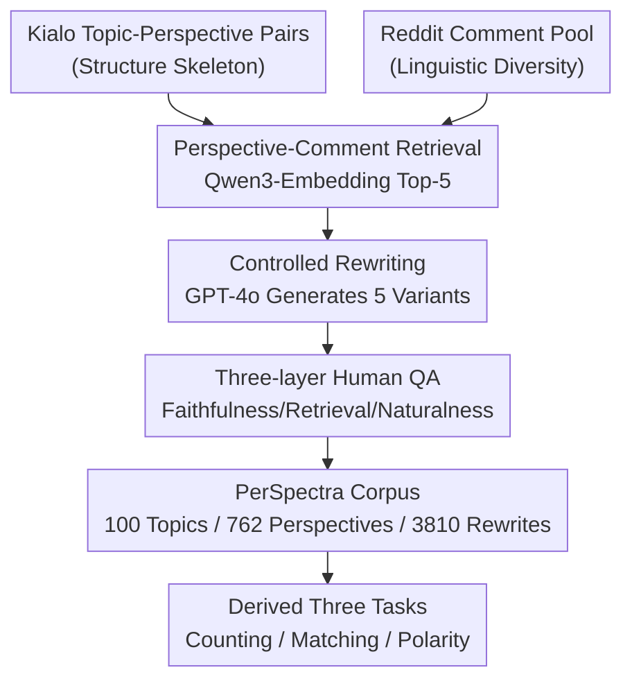

# PerSpectra: A Scalable and Configurable Pluralist Benchmark of Perspectives from Arguments

**Conference**: ICLR 2026  
**OpenReview**: [https://openreview.net/forum?id=dyooGJcKJg](https://openreview.net/forum?id=dyooGJcKJg)  
**Code**: https://github.com/caisa-lab/ICLR-2026-Pespectra  
**Area**: LLM Evaluation / Datasets & Benchmarks / Pluralistic Alignment  
**Keywords**: Pluralism, perspective understanding, debate corpus, benchmark construction, Kialo+Reddit

## TL;DR
PerSpectra integrates the "clear structure" of Kialo debate graphs with the "linguistic diversity" of real Reddit discussions through a retrieval-rewriting pipeline. It constructs a configurable benchmark featuring 100 controversial topics, 762 pro/con stances, and 3,810 naturalized arguments. Three derived tasks—perspective counting, perspective matching, and polarity judgment—reveal systematic failures in current LLMs regarding multi-perspective understanding, such as overestimating perspective counts, confusing fine-grained viewpoints on the same side, and being biased by concessive clauses.

## Background & Motivation
**Background**: As LLMs increasingly serve populations with diverse values, their outputs should ideally reflect a "plurality of reasonable perspectives" rather than flattening all voices into an "average answer." Existing pluralism datasets like OpinionQA and GlobalOpinionQA (aligning model predictions with poll distributions) or DICES (collecting culturally diverse safety judgments) prove that pluralistic evaluation is feasible.

**Limitations of Prior Work**: These resources almost entirely rely on manual annotation or curated questionnaires, making them **expensive to scale, narrow in topic coverage, and difficult to adapt to new pluralist tasks.** Another approach using "naturally occurring debates" also has shortcomings: online debate datasets like PerSpectrum are high-quality but rely on intensive manual verification and cannot scale. Reddit is massive and linguistically natural but **lacks clear argumentative structure, has high annotation costs, and contains significant label noise (irony, ambiguity).** Kialo provides explicit pro/con graphs, but its arguments are **too brief and formalized, detached from the stylistic richness of real discourse.**

**Key Challenge**: Existing debate corpora are either "small-scale but clean in structure" (Kialo, PerSpectrum) or "large-scale but noisy and diverse" (Reddit, IAC); both cannot be achieved simultaneously. There is a natural trade-off between structural clarity and linguistic diversity. Furthermore, alignment techniques like RLHF concentrate probability mass on a few answers for safety and consistency, **actively suppressing perspective heterogeneity**, leaving "pluralistic capabilities" without synthetic data for training or benchmarks for testing.

**Goal**: To build a pluralist benchmark that possesses both the structural clarity of Kialo and the linguistic diversity of Reddit, while being **programmatically scalable and configurable**, to quantify whether models can represent, distinguish, and reason across multiple perspectives.

**Key Insight**: It is observed that the "structural skeleton" of Kialo and the "linguistic flesh" of Reddit are complementary. By using a Kialo perspective as an anchor to retrieve semantically similar real comments from Reddit, LLMs can "rewrite" them into arguments that remain faithful to the original stance while adopting Reddit’s natural style. Structure is guaranteed by Kialo, diversity is injected by Reddit, and scale is ensured by an automated pipeline.

**Core Idea**: A pipeline of "Kialo viewpoint + retrieved Reddit comment → controlled rewriting" is used to expand brief structured viewpoints into multiple naturalistic variants, constructing a configurable pluralism benchmark with zero additional manual annotation.

## Method

### Overall Architecture
PerSpectra is essentially a **dataset plus evaluation tasks derived from its structure**, rather than a new model. Its core output is a data construction pipeline: using Kialo (topic, perspective) pairs as the skeleton, several semantically closest comments are retrieved from a massive Reddit pool for each perspective. GPT-4o then performs controlled rewriting to generate 5 argument variants that are faithful to the original stance but natural in style. The final corpus consists of 100 topics, 762 perspectives, and 3,810 rewrites. Since each rewrite "knows" its corresponding Kialo original viewpoint and pro/con stance, these **structural labels allow for zero-cost derivation of ground truth** for three tasks: perspective counting, perspective matching, and polarity judgment.

The pipeline is divided into five stages: "Data Source → Retrieval → Rewriting → Quality Check → Derived Tasks." The framework is shown below:

### Key Designs

**1. Dual-source Stitching: Kialo as Skeleton, Reddit as Flesh**

This design addresses the core contradiction where structural clarity and linguistic diversity are mutually exclusive. Kialo organizes content into hierarchical trees of "Topic → Pro/Con Perspective," where each perspective is a clear, moderated unit, ideal as an anchor for data generation. However, Kialo viewpoints are too short and formal. Reddit provides the opposite: no explicit debate tree, but plenty of informal, stylistically rich real arguments. The approach uses Kialo for "reliable skeleton" and Reddit for the "contextual variant pool," achieving both structure and diversity—something single-source resources like KialoPrime or PerSpectrum cannot provide.

**2. Controlled Retrieval: Finding Semantically Closest Real Comments**

To ground structured viewpoints into natural discourse, a multi-stage retrieval-filtering pipeline is designed. For each topic, the top 20 most relevant threads are ranked, and up to 100 comments per thread are selected based on score, yielding up to 2,000 candidates per topic. Quality filtering removes comments with fewer than 5 words, no identifiable author, or those from moderators/bots. **Qwen3-Embedding-8B** is then used to encode Kialo perspectives and candidates, retaining the top-5 based on cosine similarity. The top match serves as the "best match," while others serve as additional material for stylized rewriting. Fixed retrieval budgets per thread prevent any single source from dominating, preserving diversity.

**3. Controlled Rewriting: Injecting Reddit Style While Remaining Faithful**

To ensure linguistic naturalness without drifting from the original stance, GPT-4o is prompted for each (topic, perspective, comment) triplet with explicit requirements to: (i) maintain argumentative faithfulness, (ii) ignore irrelevant content, and (iii) mimic Reddit's informal, contextual style. Each perspective is expanded into **5 variants** (3,810 total), averaging ~100 words per unit, compared to the brief original viewpoints (~14 words). This provides natural difficulty for evaluation: models must abstract away surface differences to cluster synonymous variants into the same perspective.

**4. Three-layer Quality Check + Five-dimensional Scoring**

Quality checks are divided into three complementary layers across five dimensions (0–5 scale). **Faithfulness and Coherence**: Rewrites must preserve the core stance and reasoning; added material must be on-topic. **Mechanism Specific Reliability**: Since retrieval relies on embedding similarity, "best matches" can sometimes be loosely related or off-topic. Scores evaluate how models handle these matches—good generation should selectively integrate relevant info or ignore irrelevant matches. **Writing Naturalness**: The text must read like human-written Reddit posts. On 100 randomly sampled pairs, faithfulness (4.92) and naturalness (4.42) were high, while the **largest source of variance was "Best Match Relevance to Topic" at 3.31 (std 1.37)**, identifying retrieval as the quality bottleneck.

### Mechanism
Consider the topic "The Marvel Cinematic Universe is better than the DC Universe" and the Kialo perspective "DC characters are better." Retrieval finds a Reddit comment stating: "DC characters stand on their own better, while Marvel is better at ensemble pieces." GPT-4o rewrites this to: "While Marvel excels at epic team dynamics... DC's strength lies in its iconic, standalone characters. Heroes like Batman and Superman have rich, layered narratives... this ability to carry a story solo is what sets DC characters apart." The rewrite successfully integrates the "standalone" clue while expanding the original stance.

## Key Experimental Results

### Main Results
500 evaluation samples were sampled for each sub-task. 12 LLMs were evaluated against humans. Metrics: **Perspective Counting** (Accuracy $\hat{y}=y$, MAE, NIE); **Perspective Matching** (Exact Accuracy and Stance Accuracy); **Polarity Judgment** (Accuracy). NIE (Normalized Inverse Error) is defined as:

$$\text{NIE} = \frac{1}{N}\sum_{i=1}^{N}\left(1 + \frac{|\hat{k}_i - k_i|}{\max(1, k_i)}\right)^{-1}$$

| Model | T1 Count Acc↑ | T1 MAE↓ | T1 NIE↑ | T2 Match Acc↑ | T2 Stance↑ | T3 Polarity Acc↑ |
|------|------|------|------|------|------|------|
| LLaMA-3.1-8B-I | 6.4% | 3.17 | 0.57 | 6.0% | 10.4% | 29.6% |
| Qwen3-8B | 33.6% | 1.26 | 0.79 | 83.6% | 92.4% | 64.0% |
| QwQ-32B | 36.2% | **0.97** | **0.82** | 72.0% | 80.2% | 66.4% |
| Qwen2.5-32B | **35.2%** | 1.25 | 0.79 | 72.2% | 80.4% | 55.2% |
| DS-R1-Dist-Qwen-32B | 31.2% | 1.48 | 0.77 | **85.4%** | **95.0%** | 67.2% |
| GPT-4o | 29.2% | 1.38 | 0.76 | 74.8% | 81.2% | **76.4%** |
| GPT-4o-mini | 34.0% | 0.94 | 0.81 | 71.6% | 81.6% | 72.8% |
| **Human** | **44.0%** | 1.01 | 0.81 | **90.6%** | **94.3%** | **85.6%** |

Key Observation: No single model leads in all three tasks. QwQ-32B is strong in counting, DeepSeek-R1-Distill-Qwen-32B excels in matching, and GPT-4o leads in polarity. **Humans outperform all models significantly**, indicating substantial headroom.

### Ablation Study
A quantitative analysis of three systematic failure modes was conducted:

| Failure Mode | Task | Evidence | Root Cause |
|------|------|------|------|
| Oversplitting | T1 Count | 71.5% of errors in 47 all-model-fail cases were overestimations | Treating surface/style differences as distinct perspectives. |
| Intra-side Confusion | T2 Match | Stance Acc is 8-24% point higher than Exact Acc | Difficulty in distinguishing fine-grained perspectives on the same side. |
| Concession Trap | T3 Polarity | 59% of failures in 34 cases featured "concession-refutation" | Models follow local polarity of "While/Although" vs. final stance. |

### Key Findings
- **Semantic normalization is the core difficulty of pluralistic understanding**: The primary failure in counting is "over-splitting" (71.5%), where models fail to realize that different phrasings represent the same underlying perspective.
- **Stance determination is robust; fine-grained discrimination is fragile**: Models are reliable at picking the pro/con side but struggle when rewrites introduce specific details that make same-side perspectives harder to distinguish.
- **Concessive clauses are systematic killers of polarity judgment**: Models are easily misled by the initial polarity in "concession-refutation" structures.

## Highlights & Insights
- **"Structural Source × Diversity Source + LLM Rewriting" is a reusable paradigm**: Combining small high-quality structured data with large noisy data using LLMs as "glue" produces automatic labels and natural language simultaneously.
- **Zero-cost label derivation and configurability**: Since rewrites inherit Kialo labels, counting, matching, and polarity tasks can be generated programmatically from the same corpus.
- **Honest reporting of bottlenecks**: Disclosing the low 3.31 score for "best-match relevance" highlights that retrieval is the quality bottleneck and justifies training models to ignore irrelevant information.

## Limitations & Future Work
- **Dependency on a single closed-source model (GPT-4o)**: Synthesis may reflect GPT-4o's specific biases or systematic artifacts.
- **Retrieval is the bottleneck**: Retrieval was not optimized end-to-end, offloading the burden of "ignoring irrelevant matches" to the rewriting model.
- **Task coverage focuses on "understanding" rather than "generating" diversity**: The demo tasks are discriminative; they do not directly measure the model's ability to actively generate multiple reasonable perspectives.
- **Perspective boundaries are constrained by Kialo**: Viewpoints are inherited from Kialo's moderated graph, meaning minority or fringe perspectives might be missing.

## Related Work & Insights
- **vs OpinionQA / DICES**: These rely on manual alignment with population distributions; PerSpectra exchanges some human representativeness for algorithmic scalability and configurability.
- **vs PerSpectrum**: PerSpectrum uses intensive manual verification; PerSpectra reduces human cost to sampling-based quality checks via retrieval-rewriting.
- **vs Pure Reddit/Kialo**: Pure Reddit lacks structure; pure Kialo lacks linguistic richness. PerSpectra bridges this gap.

## Rating
- **Novelty**: ⭐⭐⭐⭐ A clever dual-source stitching paradigm, though the components (retrieval, LLM rewriting) are mature.
- **Experimental Thoroughness**: ⭐⭐⭐⭐ Solid evaluation across 12 models, human baselines, and quantitative attribution of failures.
- **Writing Quality**: ⭐⭐⭐⭐ Clear motivation, actionable failure analysis, and complete statistical presentation.
- **Value**: ⭐⭐⭐⭐ Fills a gap in scalable pluralistic evaluation benchmarks and provides an open, growing platform.

<!-- RELATED:START -->

## Related Papers

- [\[ICLR 2026\] VideoJudge: Bootstrapping Enables Scalable Supervision of MLLM-as-a-Judge for Video Understanding](videojudge_bootstrapping_enables_scalable_supervision_of_mllm-as-a-judge_for_vid.md)
- [\[ICLR 2026\] CLASH: Evaluating Language Models on Judging High-Stakes Dilemmas from Multiple Perspectives](clash_evaluating_language_models_on_judging_high-stakes_dilemmas_from_multiple_p.md)
- [\[ACL 2026\] TaxPraBen: A Scalable Benchmark for Structured Evaluation of LLMs in Chinese Real-World Tax Practice](../../ACL2026/llm_evaluation/taxpraben_a_scalable_benchmark_for_structured_evaluation_of_llms_in_chinese_real.md)
- [\[AAAI 2026\] LLM-as-a-Judge for Scalable Test Coverage Evaluation](../../AAAI2026/llm_evaluation/llm-as-a-judge_for_scalable_test_coverage_evaluation_accuracy_operational_reliab.md)
- [\[ACL 2026\] ScaleBox: Enabling High-Fidelity and Scalable Code Verification for Large Language Models](../../ACL2026/llm_evaluation/scalebox_enabling_high-fidelity_and_scalable_code_verification_for_large_languag.md)

<!-- RELATED:END -->
