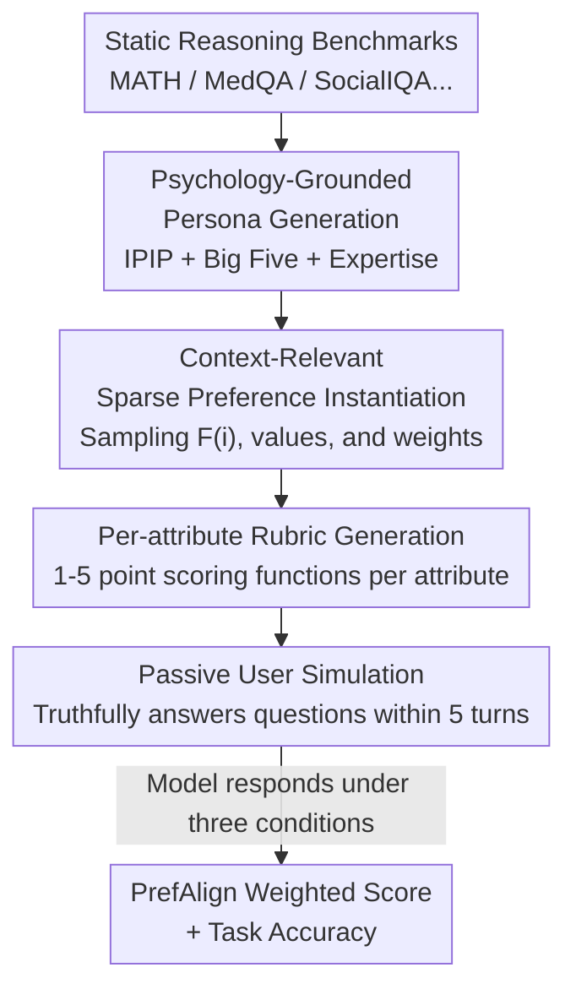

# PrefDisco: Benchmarking Proactive Personalized Reasoning

**Conference**: ICLR 2026  
**OpenReview**: [https://openreview.net/forum?id=O1hfVE0UxG](https://openreview.net/forum?id=O1hfVE0UxG)  
**Code**: https://github.com/stellalisy/PrefDisco  
**Area**: LLM Evaluation / Personalized Reasoning / Preference Alignment  
**Keywords**: Personalized reasoning, preference discovery, cold start, rubric evaluation, proactive questioning

## TL;DR
This paper proposes PrefDisco—a suite of evaluation methods that transform any static reasoning benchmark into an "interactive personalized task." It requires models to proactively ask questions to discover hidden user preferences under cold-start conditions (no history), adjust reasoning chains accordingly, and measure the degree of alignment using fine-grained rubric metrics (PrefAlign). Testing 21 frontier models across 10 tasks revealed that 29.0% of personalization attempts performed worse than generic responses.

## Background & Motivation

**Background**: Current LLM development treats "solving tasks correctly" and "aligning with human preferences" as two independent, sequential stages—first optimizing objective accuracy via instruction tuning/RL, then aligning with "aggregated mass preferences" via RLHF. Evaluations also typically score these two tracks separately.

**Limitations of Prior Work**: In real human-centric applications, solving a problem correctly is insufficient. For the same medical explanation, a clinical intern (User A) might require clinical analogies, while User B requires formal definitions. If a model provides identical responses regardless of the target, it fails to serve specific individuals despite high benchmark scores. Existing personalized benchmarks (PersoBench, PrefEval, PersonaMem, UserBench, etc.) either explicitly include preferences in the context or require long histories, **assuming preferences are known or inferable from context**. Furthermore, they only evaluate matching "expressive style" rather than requiring modifications to the underlying reasoning process.

**Key Challenge**: The most difficult real-world scenarios are **cold-start / just-in-time**—where no interaction history exists due to privacy constraints or new users. Additionally, users often struggle to articulate their needs or provide effective feedback. This requires the model to **proactively** identify "what it does not yet know about this user" and extract it through questioning, rather than shifting the cognitive burden to the user. No existing work recognizes that different users fundamentally require **different reasoning chains**, rather than the same chain rephrased.

**Goal**: Decompose "personalized reasoning" into three evaluable steps: (1) inferring which attributes are important for the current user-task pair; (2) efficiently discovering the values and weights of these attributes within limited turns; (3) reshaping reasoning chains and responses accordingly, and jointly scoring based on "correctness + preference alignment."

**Key Insight**: The authors argue that personalization is not "surface presentation," but the **selection of the reasoning chain itself**. For the same lattice path counting problem, one could use inclusion-exclusion, recursive DP, or generating functions. Each method fits different user backgrounds while yielding the same correct answer—selecting the chain is the core of personalization.

**Core Idea**: Use an automated pipeline to "upgrade" existing static benchmarks into interactive personalized testing grounds—sampling **sparse, context-relevant** preference subsets for each persona-task pair, automatically generating **attribute-specific rubrics**, and driving the model to discover preferences via passive user simulation, finally measuring alignment with the weighted rubric score PrefAlign.

## Method

### Overall Architecture

PrefDisco is essentially an **evaluation method + a metric**, involving no model training. Its input is any reasoning benchmark with standard answers (e.g., MATH, MedQA, SocialIQA), and its output is a score for PrefAlign (preference alignment) and task accuracy for the model under test in an interactive personalized scenario.

The pipeline consists of two parts. **Problem Formulation** (§2) defines "personalized reasoning": a large but finite global attribute set $\Theta=\{\theta_1,\dots,\theta_d\}$ (e.g., use of analogies, terminology density, empathy level) exists. For any task $i$, only a small subset $F(i)\subseteq\Theta$ is relevant. A user $p$’s preference profile for instance $i$ is $P_{p,i}=\{(\theta_j,v_j,w_j):\theta_j\in F(i)\}$, where $v_j$ is the value (e.g., "high terminology" vs. "low terminology") and $w_j\ge 0$ is the relative weight such that $\sum_{\theta_j\in F(i)} w_j=1$. Since $P_{p,i}$ is invisible to the model, preference discovery is modeled as a **sequential decision process**: at each turn $t$, the model chooses an action $a_t\in\{\text{ask}(\theta)\mid\theta\in F(i)\}\cup\{\text{answer}\}$. Questioning yields attribute values to refine the estimate $\hat P_{p,i}$, while answering terminates the process.

**Benchmark Construction** (§3) maps this formulation into a four-step pipeline: generating psychology-grounded personas, instantiating sparse preferences for each persona-task pair, automatically generating attribute-specific rubrics, and driving interaction via passive user simulation. The data flow is illustrated below:

### Key Designs

**1. Sparse, Instance-level Preference Modeling: Precision in Personalization**

Traditional personalization assumes a **fixed** preference profile per user. This paper argues otherwise: psychological research shows individuals prioritize different attributes depending on context (e.g., prioritizing precision in professional settings vs. ease of understanding in casual chat). Thus, preferences are only activated on a small subset $F(i)$ and maintained at the **instance level**. The preference value $v_j$ may drift across instances. A critical distinction is the **decoupling of value $v_j$ and weight $w_j$**: $v_j$ denotes the "direction" of preference, while $w_j$ denotes the "importance." Two users might share the same relevant attributes but assign entirely different weights. $F(i)$ is determined by LLM classification and validated with human annotation across 20 scenarios, yielding a Fleiss kappa of 0.463 (moderate agreement). This sparse modeling allows evaluation to **attribute failures to specific attributes** rather than a single holistic satisfaction score.

**2. PrefAlign Metric: Per-attribute Rubrics over Holistic Scoring**

To quantify how well a response matches user preferences, the authors avoid a single LLM-judge subjective score. Instead, they generate a scoring function $g_j(r,v_j)\in[0,5]$ for each relevant attribute $\theta_j$, measuring the alignment of response $r$ with value $v_j$ (e.g., "Does the terminology match the user's tolerance?"). The total alignment score is aggregated by weight:

$$\mathrm{PrefAlign}(r,P_{p,i})=\sum_{\theta_j\in F(i)} w_j\cdot g_j(r,v_j).$$

Successful personalized reasoning requires a **joint objective**: $\mathrm{Correct}(r,i)=1$ and maximizing $\mathrm{PrefAlign}$. The advantage of per-attribute rubrics is that each attribute is scored against an explicit standard, **reducing hallucinations and bias** while enabling scalable evaluation across 10K scenarios. To eliminate single-model bias, API calls for construction are randomized across GPT-4o, Gemini-1.5-Flash, and Claude-3-Sonnet.

**3. Psychology-Grounded Persona Generation: Real Distributions**

Instead of arbitrary user archetypes, personas are linked to the International Personality Item Pool (IPIP), incorporating demographic features, Big Five personality dimensions, and domain expertise. High-temperature sampling ($t=0.7$) with rejection sampling ensures diverse coverage. Consistency of personas across instances allows the evaluation to examine the model's ability to **transfer discovered preferences to new tasks** within the same session.

**4. Passive User Simulation + 5-Turn Budget: Isolating Proactive Questioning**

To cleanly evaluate the model's own questioning ability, **passive user** simulation is implemented: the user only truthfully answers the specific attribute questioned and **never volunteers additional information**. This forces the model to develop **strategic questioning**, isolating questioning capability from user communication styles. A 5-turn limit reflects realistic attention constraints in human-computer interaction; sensitivity analysis and fixed-turn experiments show performance plateaus around 3–5 turns.

## Key Experimental Results

The evaluation covers **10 benchmarks** across math, logic, science, and social reasoning and **21 frontier models**. Each model is tested under three conditions: **Baseline** (problem only), **Discovery** (multi-turn proactive questioning), and **Oracle** (provided with full ground-truth preference profiles).

Alignment scores are normalized for comparability:

$$\mathrm{NormAlign}=100\times\frac{\mathrm{PrefAlign}(r_{\text{discovery}})-\mathrm{PrefAlign}(r_{\text{baseline}})}{\mathrm{PrefAlign}(r_{\text{oracle}})-\mathrm{PrefAlign}(r_{\text{baseline}})},$$.

A score of 0 indicates no improvement over baseline, 100 indicates matching the oracle, and negative values indicate personalization attempts performed worse than the generic response.

### Main Results: Normalized Preference Alignment (Discovery Mode, Select Models)

| Task | gpt-4o | o4-mini | gemini-1.5-flash | gemini-2.5-pro | claude-3-opus | claude-3-5-sonnet-v1 |
|------|--------|---------|------------------|----------------|---------------|----------------------|
| MATH | 4.9 | 21.9 | 20.7 | -13.5 | 16.9 | 15.6 |
| LogiQA | 7.7 | 26.0 | 23.5 | -0.3 | 14.7 | 38.8 |
| MedQA | -6.6 | 23.8 | 6.7 | 35.7 | 33.0 | 24.0 |
| SocialIQA | 21.2 | 17.4 | 27.0 | 29.3 | 7.7 | -8.7 |
| CommonsenseQA | 25.2 | 16.0 | 24.9 | 20.2 | 2.2 | 1.8 |

Overall: Across 210 "model $\times$ task" combinations, **61 (29.0%) resulted in negative NormAlign**. MATH and LogiQA suffered the most degradation, while SocialIQA benefited most.

### Key Findings

| Analysis | Key Data | Description |
|----------|----------|------|
| Questioning vs. Alignment | $r=0.445$, $p<0.001$; Avg **1.48** questions | More questions lead to better alignment, but most models ask too few. |
| Questioning Efficiency | Gemini $\beta$=0.474 > OpenAI 0.379 | Gemini gains the most alignment per question, indicating higher quality/timing. |
| Accuracy Cost | Baseline 65.2% → Oracle 61.8% | Personalization has an **inherent cognitive cost**; even Oracle scores drop. |
| Domain Divergence | AIME down 12.1%; CommonsenseQA up 5.4% | Math suffers severe degradation; social tasks are more robust. |

- **Over-correction is the primary cause of negative scores**: Models tend to modify parts of the baseline that were already correct; naive personalization often makes things worse.
- **Root cause of Math degradation**: SOTA models are heavily optimized via RL on verifiable math benchmarks, converging to a narrow set of high-reward reasoning paths. Personalization requires changing the core reasoning steps, which causes "rigid" models to fail.
- **Failures are structural, not strategic**: Even with a fixed number of questions, domain divergence persists, suggesting the issue lies in the cognitive load of maintaining logical precision while adapting to preferences.

## Highlights & Insights
- **Redefining Personalization**: Evolves from "rephrasing" to "selecting the reasoning chain itself." The example of different methods for lattice path counting is highly persuasive.
- **Sparse + Instance-level Modeling**: Precisely defines "when and how to personalize" via $(v_j, w_j)$, acknowledging that user preferences shift with context and allowing for per-attribute failure attribution.
- **Transferable Methodology**: PrefDisco can upgrade **any** static benchmark into an interactive personalized arena with minimal overhead.
- **Revealing the Alignment-Reasoning Conflict**: The discovery that even the Oracle condition results in accuracy drops suggests that the cost of personalization stems from the training paradigm itself (e.g., RL-induced reasoning rigidity).

## Limitations & Future Work
- The study focuses only on **beneficial** personalization, not involving harmful personalization (echo chambers), sycophancy, or conflicting preferences.
- It evaluates communication preferences rather than content preferences.
- Passive user simulation is a deliberate simplification; real users might introduce extra noise through ambiguous behavior.
- The use of LLMs to generate rubrics and preference sets introduces potential bias.

## Related Work & Insights
- **vs. PersoBench / UserBench**: These provide preferences in-context or require long histories and evaluate expressive style. PrefDisco is the first to require proactive discovery under **true cold-start** conditions to **alter reasoning chains**.
- **vs. MediQ / GATE**: These demonstrate clinical information seeking or intent clarification but are limited to narrow domains and lack the "reasoning adaptation" component.

## Rating
- Novelty: ⭐⭐⭐⭐⭐ Redefines personalization as "chain selection" and creates the first cold-start proactive discovery paradigm.
- Experimental Thoroughness: ⭐⭐⭐⭐⭐ Comprehensive analysis across 21 models and 10 tasks with solid ablation studies.
- Writing Quality: ⭐⭐⭐⭐ Clear formalization and excellent illustrative examples, though slightly notation-heavy.
- Value: ⭐⭐⭐⭐⭐ Exposes the inherent conflict between alignment and reasoning, providing an extensible foundation for personalized AI.

<!-- RELATED:START -->

## Related Papers

- [\[ACL 2026\] Personalized Benchmarking: Evaluating LLMs by Individual Preferences](../../ACL2026/llm_evaluation/personalized_benchmarking_evaluating_llms_by_individual_preferences.md)
- [\[ICLR 2026\] Towards Personalized Deep Research: Benchmarks and Evaluations](towards_personalized_deep_research_benchmarks_and_evaluations.md)
- [\[ACL 2025\] Mis-prompt: Benchmarking Large Language Models for Proactive Error Handling](../../ACL2025/llm_evaluation/mis-prompt_benchmarking_large_language_models_for_proactive_error_handling.md)
- [\[ICLR 2026\] Benchmarking Overton Pluralism in LLMs](benchmarking_overton_pluralism_in_llms.md)
- [\[ICLR 2026\] LogiConBench: Benchmarking Logical Consistencies of LLMs](logiconbench_benchmarking_logical_consistencies_of_llms.md)

<!-- RELATED:END -->
