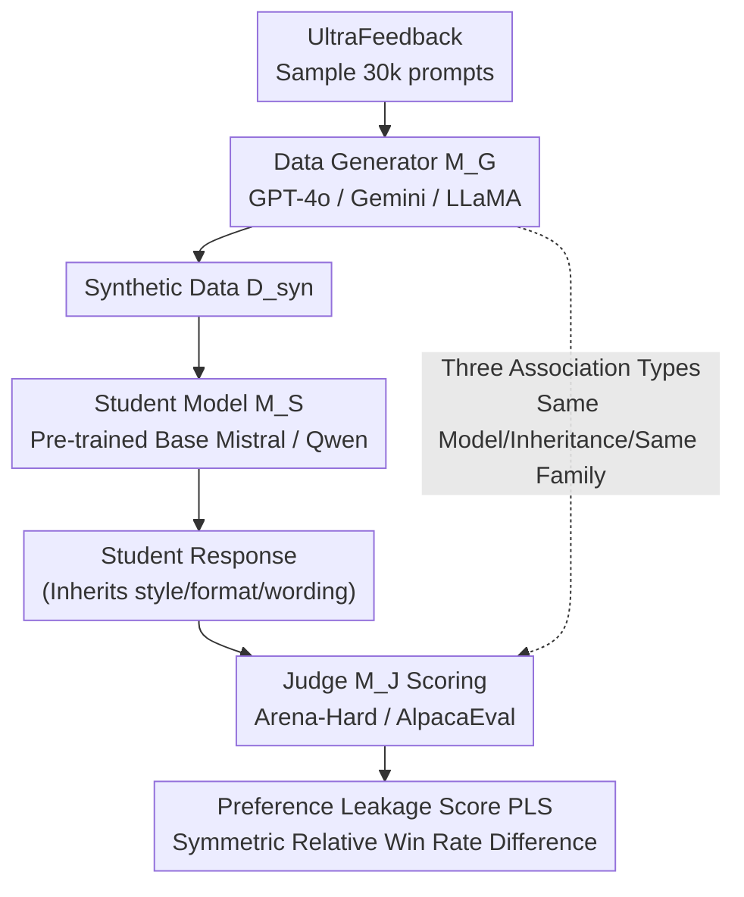

# Preference Leakage: A Contamination Problem in LLM-as-a-judge

**Conference**: ICLR2026  
**arXiv**: [2502.01534](https://arxiv.org/abs/2502.01534)  
**Code**: [David-Li0406/Preference-Leakage](https://github.com/David-Li0406/Preference-Leakage)  
**Area**: LLM Evaluation  
**Keywords**: LLM-as-a-Judge, Preference Leakage, Data Contamination, Evaluation Bias, Synthetic Data

## TL;DR

This paper defines and systematically investigates **Preference Leakage (PL)** in LLM-as-a-Judge—a phenomenon where judge $M_J$ systematically favors "related student models" when the synthetic data generator $M_G$ is associated with $M_J$ (same model, inheritance, or same family). In same-model scenarios, the PLS reaches 28.7% (Arena-Hard), and this bias is more insidious and harder to detect than egocentric bias.

---

## Background & Motivation

**LLM-as-a-Judge as the dominant paradigm**: Traditional n-gram matching (BLEU/ROUGE) fails to effectively evaluate the open-ended long-form generation of LLMs. Consequently, the community has shifted toward using powerful LLMs as judges for scoring, a method widely adopted by leaderboards like AlpacaEval 2.0 and Arena-Hard.

**Prevalence of synthetic data training**: To improve training efficiency, researchers extensively use synthetic data generated by LLMs to fine-tune student models (e.g., using GPT-4o to generate instruction data for training student models).

**High overlap between data generators and judges**: Due to the limited number of "strongest models," the community frequently uses GPT-4 as both the data generator and the evaluator. This overlap resembles data leakage in traditional machine learning but occurs on the evaluation side and remains much more covert.

**Existing biases are insufficient to cover this issue**: Previous works have revealed position bias, length bias, and egocentric bias in LLM evaluation. However, preference leakage is a novel systemic contamination triggered by the coupling of the data generation-evaluation pipeline, which has not been systematically studied until now.

**Detection is extremely difficult**: Most LLMs do not disclose their training data, and distillation relationships are hard to quantify, making preference leakage more difficult to discover than standard data contamination.

**Core Problem**: This study revolves around three RQs—(RQ1) Does preference leakage introduce systematic bias? (RQ2) What is the severity of preference leakage across different scenarios? (RQ3) What is the underlying mechanism of preference leakage?

---

## Method

### Overall Architecture

Ours does not propose a new model but rather deconstructs the mainstream evaluation pipeline of "synthetic data generation → student model training → judge scoring." It identifies a neglected coupling point: when the data generator $M_G$ is associated with the judge $M_J$, the judge systematically overestimates student models $M_S$ trained on data from $M_G$. This preference stems not from better responses, but from $M_S$ inheriting surface-level features like style, format, and wording from $M_G$, which happen to be naturally favored by $M_J$. The methodology is implemented in three stages: **formalizing** the intuition into an inequality testable by win rate data, decomposing "association" from binary into a **three-tier gradient spectrum**, quantifying the bias into a single value using a symmetric **PLS metric**, and finally isolating the leakage from noise through a controlled "3 generators × 2 students × 3 judges" **experimental matrix**. The following diagram illustrates the pipeline and the coupling path where leakage occurs (the dashed line represents the association between $M_G$ and $M_J$, the source of leakage):

### Key Designs

**1. Problem Formulation: Expressing "Judge Favoritism" as a Testable Inequality**

To transform "judge favoritism" from an intuition into a falsifiable proposition, the authors first define symbols for the three entities in the pipeline: data generator $M_G$ produces synthetic set $D_{syn}$ (conditional distribution $P_{M_G}(y|x)$), student model $M_S$ is trained on $D_{syn}$ to obtain output distribution $P_{M_S}(y|x)$, and judge $M_J$ provides a scoring function $S_{M_J}(y|x)$. Preference leakage is defined as follows: when $M_G$ and $M_J$ are associated, the expected score given by $M_J$ to $M_S$ is artificially inflated because the spurious features $M_S$ inherits from $M_G$ happen to align with $M_J$'s preferences. This is formulated as an expectation inequality:

$$\mathbb{E}_{x, y_S \sim P_{M_S}}[S_{M_J}(y_S|x) \mid M_G \sim_{rel} M_J] > \mathbb{E}_{x, y_S \sim P_{M_S}}[S_{M_{J'}}(y_S|x) \mid M_G \not\sim_{rel} M_{J'}]$$

That is, the expected score given by an associated judge is higher than the expected score given by a non-associated judge for the same set of student responses. The value of this step lies in turning a vague sense of favoritism into a formal assertion that can be verified using win rate data.

**2. Three Association Types: Decomposing "Association" into a Gradient Spectrum**

In reality, the relationship between generators and judges is far more than "being the same model." Testing only the extreme of "same model" would underestimate the problem's scope. The authors thus divide the association into three tiers based on coupling tightness, allowing experiments to detect the trend of leakage diminishing as association strength weakens:

| Type | Definition | Typical Scenario |
|------|------------|------------------|
| **Same Model** | $M_G \equiv M_J$ | Using GPT-4o to generate data and GPT-4o as the judge |
| **Inheritance** | $M_J \leftarrow \text{FineTune}(M_G, D)$ or vice-versa | GPT-4o generates data → Fine-tuned model acts as judge |
| **Same Family** | $M_G, M_J \in \text{Family}(A_X, D_X)$ | GPT-4o generates data, GPT-4-turbo acts as judge |

This categorization aims to verify a core hypothesis: leakage is not an isolated case occurring only in "same model" scenarios; as long as a lineage relationship exists, leakage occurs proportionally. If proven, the problem's impact expands from a few self-evaluation cases to entire model families—even if you switch to a "seemingly different" judge, as long as it shares the same origin as the generator, the leaderboard remains distorted.

**3. Preference Leakage Score (PLS): Quantifying Bias as a Single Value using Symmetric Win Rate Difference**

With a formalized target, a scalar indicator is needed to answer "how much favoritism is shown." The authors define the Preference Leakage Score by taking the judge's win rate for the associated student, comparing it relatively to a neutral baseline, and averaging the results symmetrically across two controlled model pairs:

$$\text{PLS}(i,j) = \frac{\left(\frac{\text{WR}(i,i) - \text{AVG}(i,j)}{\text{AVG}(i,j)}\right) + \left(\frac{\text{WR}(j,j) - \text{AVG}(j,i)}{\text{AVG}(j,i)}\right)}{2}$$

Where $\text{WR}(i,j)$ is the win rate of student $i$ given by judge $j$, and $\text{AVG}(i,j) = \frac{\text{WR}(i,i) + \text{WR}(i,j)}{2}$ serves as the reference baseline "without favoritism." A $\text{PLS} > 0$ indicates that the judge indeed favors students associated with itself. Symmetric averaging is crucial—it cancels out the interference caused by the inherent strength differences between student models, ensuring the final value reflects only the contribution of the "association."

**4. Controlled Experimental Matrix: Isolating Leakage from Noise using Pre-trained Bases**

For the metric to be accurate, the detected bias must originate solely from the synthetic data itself. The authors sampled 30,000 prompts from UltraFeedback and generated responses using three generators: GPT-4o, Gemini-1.5-flash, and LLaMA-3.3-70B. Student models chose Mistral-7B-v0.1 and Qwen-2.5-14B, and crucially, always used **pre-trained versions rather than instruct versions**—since instruct bases might already contain distilled data that could introduce additional leakage signals. Evaluations were run on Arena-Hard (500 questions) and AlpacaEval 2.0 (805 questions). This matrix ensures every PLS group has a comparable control, serving as the experimental foundation for all subsequent findings (e.g., tighter association leads to heavier leakage, SFT is heavier than DPO, etc.).

---

## Key Experimental Results

### Main Results: Pervasiveness of Preference Leakage (Table 1)

| Student Model | Generator & Judge Pair | Arena-Hard PLS | AlpacaEval PLS | Average |
|---------------|------------------------|----------------|----------------|---------|
| Mistral-7B    | GPT-4o & Gemini-1.5    | 28.7%          | 18.4%          | **23.6%** |
| Mistral-7B    | GPT-4o & LLaMA-3.3     | -1.5%          | 1.4%           | -0.1%   |
| Mistral-7B    | LLaMA-3.3 & Gemini-1.5 | 13.1%          | 19.8%          | 16.4%   |
| Qwen-14B      | GPT-4o & Gemini-1.5    | 37.1%          | 18.6%          | **27.9%** |
| Qwen-14B      | GPT-4o & LLaMA-3.3     | 1.0%           | 2.3%           | 1.7%    |
| Qwen-14B      | LLaMA-3.3 & Gemini-1.5 | 25.4%          | 18.4%          | 21.9%   |

**Key Finding**: The majority of model pairs exhibit significant positive PLS, indicating judges clearly favor their associated student models.

### Association Analysis (Table 2)

| Association Type | Arena-Hard | AlpacaEval 2.0 | Average |
|------------------|------------|----------------|---------|
| Same Model       | 28.7%      | 18.4%          | **23.6%** |
| Inherit + Same Ins. | 17.8%      | 20.7%          | 19.3%   |
| Inherit + Diff Ins. | 18.3%      | 26.3%          | 22.3%   |
| Same Fam + Same Ser. | 10.1%      | 7.6%           | 8.9%    |
| Same Fam + Diff Ser. | 3.3%       | 2.2%           | 2.8%    |

**Conclusion**: Preference leakage severity is strongly positively correlated with the degree of association: Same Model > Inheritance > Same Family (Same Series) > Same Family (Different Series).

### Learning Method Comparison (Table 3)

| Learning Method | Arena-Hard | AlpacaEval 2.0 | Average |
|-----------------|------------|----------------|---------|
| SFT             | 28.7%      | 18.4%          | **23.6%** |
| DPO             | 7.7%       | 2.7%           | 5.2%    |
| ICL             | -4.2%      | -1.1%          | -2.7%   |

**Finding**: SFT suffers the most leakage. DPO's pairwise optimization mechanism significantly reduces leakage, while ICL is largely unaffected as it does not update parameters.

### Spurious Feature Ablation (Table 6)

| Setting | GPT & Gemini | GPT & LLaMA | LLaMA & Gemini |
|---------|--------------|-------------|----------------|
| Baseline | 17.5%       | 2.3%        | 18.8%          |
| − Remove style | 9.0% | 3.3%        | 14.6%          |
| − Remove format | 9.8% | 1.9%        | 14.5%          |
| − Remove wording | 11.2% | 2.4%        | 18.2%          |

**Finding**: Style and format are the primary carriers of preference leakage; removing them leads to a significant decrease in PLS. Word-level substitution has limited effect, suggesting leakage is driven by surface-level stylistic features rather than semantic similarity.

### Mitigation Exploration (Table 7)

| Method | Error Bias ↓ |
|--------|--------------|
| Baseline | 17.8       |
| + Prompting | 18.3    |
| + Chain-of-Thought | 15.6 |
| + Paraphrase | 18.7   |
| + Auto Calibration | 20.7 |
| + Contextual Calibration | **7.3** |

**Finding**: Only Contextual Calibration (post-calibration based on a held-out set) effectively alleviates preference leakage, reducing Error Bias from 17.8 to 7.3. Simple prompting and paraphrasing are largely ineffective.

### Key Findings

- **Smaller models suffer more**: PLS for smaller models (e.g., LLaMA-3-1B) is higher than for larger ones. Small models may rely more on repeating surface features (format/style), which carry the leakage.
- **Judges cannot self-identify associated students**: Judges' accuracy in identifying content generated by "their own student models" is near chance level (~41-53%), indicating leakage is unconscious and implicit. However, a BERT classifier can distinguish student outputs with 82.4% accuracy, proving features are present.
- **Subjective tasks exhibit worse leakage**: PLS for subjective tasks (coding, writing) is much higher than for objective tasks (math).
- **Linear correlation with data mixing**: Even 10% synthetic data introduces measurable leakage, and PLS increases linearly with the proportion of synthetic data without a clear threshold effect.
- **Real-world leaderboard impact**: On the AlpacaEval 2.0 leaderboard, rank changes caused by preference leakage (Vicuna series average +1.33) are even larger than those caused by egocentric bias (GPT-4 Preview +1.00).

---

## Highlights & Insights

- **Novel Problem Definition**: Conceptualizes the data generation-evaluation coupling in LLM pipelines as "Preference Leakage," drawing a parallel to traditional data leakage.
- **Systematic Experimental Design**: Coverage across 3 association types, 3 learning methods, various mixing ratios, and multiple model scales.
- **Mechanism Analysis**: Proves leakage is implicit via identification tasks and locates style/format as carriers through spurious feature ablation.
- **PLS Metric**: Introduces a standardized metric for quantifying preference leakage, facilitating future research.
- **Practical Advice**: Urges the community to avoid associations between generators and judges when using LLM-as-a-Judge.

---

## Limitations & Future Work

1. **Preliminary Mitigation**: Only contextual calibration worked effectively, but it requires an additional held-out dataset, limiting practical utility.
2. **Limited Real-world Coverage**: Main experiments were in controlled SFT settings; complex real-world pipelines (multi-round distillation, multi-source mixing, RLHF) were not fully covered.
3. **Leaderboard Analysis Constraints**: Only two leaderboards were analyzed due to the lack of traceable distillation metadata for most others.
4. **English Only**: All experiments were conducted on English benchmarks.
5. **Coarse Association Definitions**: Real-world model associations are likely more complex than the three defined tiers (e.g., indirect distillation chains).

---

## Related Work & Insights

- **LLM-as-a-Judge**: Zheng et al. (2023) pioneered automated evaluation with LLMs; Prometheus (Kim et al., 2023/2024) developed open-source evaluators. Existing works revealed position and length biases.
- **Egocentric Bias**: Koo et al. (2024) and Panickssery et al. (2024) found LLM judges favor their own generation. Preference Leakage is a generalized scenario where the judge and generator need not be identical, only "associated."
- **Data Leakage/Contamination**: Deng et al. (2024) studied overlaps between training data and evaluation sets. Preference leakage is a new variant of contamination on the evaluation side.

---

## Rating

- **Novelty**: ⭐⭐⭐⭐⭐
- **Experimental Thoroughness**: ⭐⭐⭐⭐⭐
- **Writing Quality**: ⭐⭐⭐⭐⭐
- **Value**: ⭐⭐⭐⭐⭐
- **Overall Rating**: ⭐⭐⭐⭐⭐

<!-- RELATED:START -->

## Related Papers

- [\[ICLR 2026\] Doubly-Robust LLM-as-a-Judge: Externally Valid Estimation with Imperfect Personas](doubly-robust_llm-as-a-judge_externally_valid_estimation_with_imperfect_personas.md)
- [\[ICLR 2026\] LiveClin: A Live Clinical Benchmark without Leakage](liveclin_a_live_clinical_benchmark_without_leakage.md)
- [\[ICLR 2026\] Detecting Data Contamination in LLMs via In-Context Learning](detecting_data_contamination_in_llms_via_in-context_learning.md)
- [\[ICML 2026\] Nonparametric LLM Evaluation from Preference Data](../../ICML2026/llm_evaluation/nonparametric_llm_evaluation_from_preference_data.md)
- [\[ICLR 2026\] BiasScope: Towards Automated Detection of Bias in LLM-as-a-Judge Evaluation](biasscope_towards_automated_detection_of_bias_in_llm-as-a-judge_evaluation.md)

<!-- RELATED:END -->
