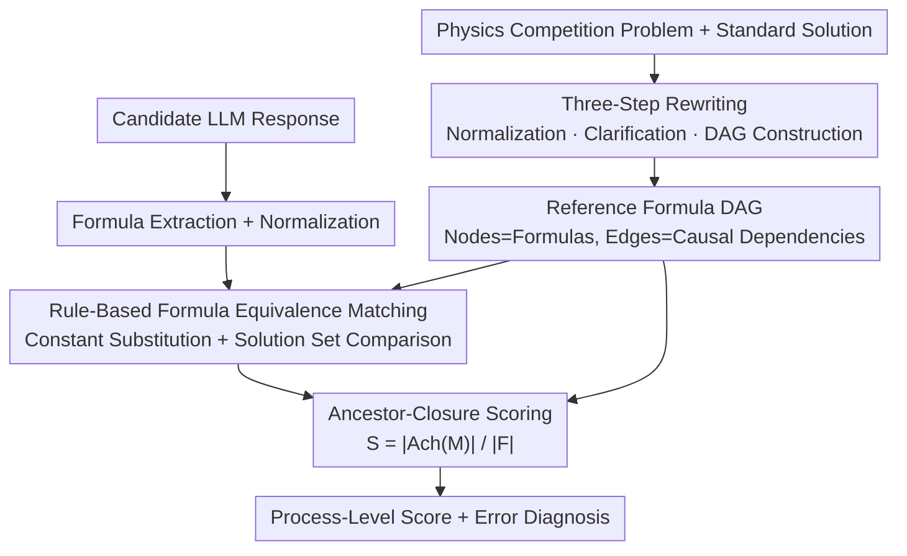

# PRISM-Physics: Causal DAG-Based Process Evaluation for Physics Reasoning

**Conference**: ICLR 2026  
**OpenReview**: [https://openreview.net/forum?id=4PZMeopXzP](https://openreview.net/forum?id=4PZMeopXzP)  
**Project Page**: [https://open-prism.github.io/PRISM-Physics/](https://open-prism.github.io/PRISM-Physics/)  
**Code**: To be confirmed (public release planned on project page)  
**Area**: LLM Evaluation / Physics Reasoning / Process-level Scoring / Benchmark  
**Keywords**: Physics reasoning, process-level evaluation, Directed Acyclic Graph (DAG), formula equivalence matching, ancestor-closure scoring

## TL;DR
PRISM-Physics models the reference solutions of physics competition problems as "formula DAGs" (where nodes represent formulas and edges represent causal dependencies). Combined with a rule-based physical formula equivalence matcher and an "ancestor-closure scoring" method with proven theoretical optimality, it introduces the first benchmark for step-by-step scoring of physics reasoning. This approach aligns more closely with human expert ratings than LLM-as-judge or existing linear process scoring models.

## Background & Motivation

**Background**: Mature competition-level benchmarks already exist for mathematics (IMO) and programming (IOI) to evaluate Large Language Model (LLM) reasoning, but physics competitions have long been neglected. Physics requires domain knowledge, modeling assumptions, multi-step symbolic derivation, and precise numerical calculations, making it an excellent probe for measuring "scientific reasoning ability."

**Limitations of Prior Work**: Existing physics benchmarks suffer from three major flaws. First, most consist of multiple-choice or fill-in-the-blank questions that only evaluate the final answer, completely discarding the reasoning process and offering low diagnostic value. Second, attempts to evaluate the process largely rely on LLM-as-judge, which is plagued by hallucinations, prompt sensitivity, and scoring inconsistency. Third, the few works attempting step-by-step scoring (such as PSAS-S in PhysReason) assume a "strict linear sequence of steps" or perform shallow expression matching, failing to capture the actual dependency logic between steps.

**Key Challenge**: Physics derivation is inherently **nonlinear**—the problem-solving process involves branching, merging, and reusing intermediate results. Current scoring strategies are either "strict matching" (too rigid, penalizing equivalent derivations) or "prefix scoring" (overestimating performance by crediting all previous steps once a single formula matches). Neither naive strategy characterizes the causal structure of "which step is a prerequisite for another."

**Goal**: To construct a framework and benchmark capable of providing step-by-step, interpretable, and theoretically grounded scoring for physics reasoning, while eliminating reliance on LLM judges.

**Key Insight**: The authors observe that the logical backbone of a physics solution is naturally a **Directed Acyclic Graph (DAG)**, where key formulas are nodes and the derivation "v is derived from u" is an edge. By representing the reference solution as a DAG, "credit" can propagate backward along the causal chain to prerequisites (ancestors). This is neither as rigid as strict matching nor as lenient as prefix scoring.

**Core Idea**: Replace "linear step sequences + LLM judge" with "formula DAG + ancestor-closure scoring + rule-based formula equivalence matching" to ensure process-level scoring has both structural rigor and theoretical optimality.

## Method

### Overall Architecture

PRISM-Physics consists of two parallel pipelines: the **Data side** processes each competition physics problem's standard solution through a three-step rewrite into a reference formula DAG; the **Evaluation side (PRISM-DAG)** takes an LLM-generated solution, extracts and normalizes its formulas, uses a rule-based equivalence matcher to identify which nodes in the reference DAG were hit (forming a matching set $M$), and finally calculates a process score in $[0,1]$ using "ancestor-closure scoring." The entire pipeline involves no LLMs in the scoring phase, ensuring reproducibility and interpretability.

### Key Designs

**1. Three-Step Rewriting for Dataset Construction: Cleaning messy competition solutions for machine evaluation**

Direct competition solutions from the web cannot be easily scored due to inconsistent notation, ambiguous problem statements, and implicit dependencies. The authors designed a three-stage pipeline: (1) **Formula Normalization**, unifying expressions into standard LaTeX with consistent symbol rules and numerical precision; (2) **Problem Clarification**, rewriting the prompt to clarify variable definitions and answer requirements; (3) **DAG Construction**, representing the solution as a formula DAG and verifying it via combined rule-based and LLM checks. Feedback loops correct formatting or dependency errors. Difficulty is calculated using concept depth, calculation load, and an "entropy-based DAG complexity" score, mapping to Easy/Medium/Hard across seven domains (Mechanics, Electromagnetism, Optics, Atomic/Nuclear, Thermal/Stat-Mech, Quantum, and Solid State/Others).

**2. Representing Solutions with Formula DAGs: Explicitly encoding causal dependencies**

This is the structural foundation. A solution is systematically converted into a DAG $G=(V,E)$, where each node $v\in V$ is a canonicalized key formula (laws, intermediate equations, simplifications), and edge $(u,v)\in E$ denotes that "formula $v$ is derived from formula $u$." The graph must satisfy two constraints: **Minimality** (removing redundant algebraic steps) and **Completeness** (every node must lead to a "final answer node"). This ensures the derivation is a machine-interpretable logical skeleton. The authors prove (Theorem 1) that under certain assumptions, a "justification system" and a forward-edge DAG share a bijection—meaning the DAG is the **minimal encoding** of the proof system.

**3. Ancestor-Closure Scoring: Propagating credit only along causal chains**

With the DAG, the question is how much credit to give for a match. The authors define the **ancestor closure** $Ach(M):=M\cup Anc(M)$, where $Anc(M)$ contains all ancestors (backward reachable nodes) of the set $M$ in the DAG. The scoring strategy is:

$$S=\frac{|Ach(M)|}{|F|},$$

where $F$ is the set of all formulas in the DAG. If a formula is matched, all prerequisites on the path leading to it are also considered "achieved." This avoids the pitfalls of naive strategies by neither ignoring equivalent derivations nor crediting unrelated steps. The authors also prove its **Optimality/Admissibility** (Theorem 2): any admissible scoring strategy $S$ satisfying certain axioms must equal the ancestor-closure score.

**4. Rule-Based Physics Formula Equivalence Matching: Determining equivalence without LLMs**

Scoring relies on knowing if a student's formula hits a reference node. This is harder than expression comparison due to **equation equivalence**, **constant substitution**, and **unit conversion**. The authors proposed a two-stage algorithm: **[Stage 1] Constant Substitution**—replacing variables with expressions and unifying constants/units; **[Stage 2] Solution Set Equivalence Testing**—for two equations with $N$ variables, assign random values to $N-1$ variables and solve for the $N$-th; if the solution sets match across multiple rounds, the equations are considered equivalent. This process is purely rule-based and reproducible.

## Key Experimental Results

### Main Results: Process Scoring vs. Final Answer Only

Evaluation across numerous frontier models shows that **looking only at the final answer significantly underestimates reasoning capability**. Accuracy drops by over 40% from Easy to Medium and often falls below 10% on Hard problems. However, step-level scoring reveals that even when models fail the final answer, they often correctly apply key laws and derive valid intermediate equations.

| Model | Setting | Final-Avg | Step-Avg | Description |
|------|------|-----------|----------|------|
| GPT-5 (High) | Reasoning | 29.36 | 54.13 | Strongest text setting |
| GPT-5-mini (High) | Reasoning | 26.01 | 48.78 | |
| Grok-4 | Reasoning | 23.34 | 47.29 | |
| Gemini-2.5-Pro | Reasoning | 23.99 | 41.19 | |
| Deepseek-Reasoner | Reasoning | 23.25 | 43.39 | |
| Deepseek-chat | Chat | 23.40 | 41.36 | Strongest open-source chat |
| GPT-OSS-20B | Reasoning | 8.72 | 16.27 | Lowest overall performance |

Wait times and Step scores confirm that "correct intermediate derivation but final failure" is a common phenomenon. Multimodal settings generally provide higher gains at the Step level (supporting intermediate reasoning), though they may hinder weaker models if diagrams are illustrative rather than informative.

### Alignment with Human Experts

Randomly selecting 70 problems across all domains, two physics experts (including an IPhO gold medalist) scored DeepSeek-V3 responses. Consistency was measured using Kendall's $\tau_b$.

| Method | $\tau_b$ ↑ | Asymptotic p-value ↓ | Permutation p-value ↓ |
|------|-----------|------------|------------|
| LLM-as-Judge | 0.294 | 6.90×10⁻³ | 6.00×10⁻³ |
| PSAS-S | 0.213 | 2.20×10⁻² | 2.09×10⁻² |
| **PRISM-DAG** | **0.346** | **1.31×10⁻⁴** | **1.00×10⁻⁴** |

PRISM-DAG achieved the highest $\tau_b$ and lowest p-value. Unlike LLM-as-judge (outcome-oriented) or PSAS-S (independent step evaluation), PRISM-DAG explicitly models causal dependencies, making it closer to human judgment.

### Key Findings
- **Difficulty Sensitivity**: Accuracy in all domains declines as difficulty increases from Easy to Hard, while response time rises; Quantum Mechanics is the hardest, while Thermal/Stat-Mech is the easiest.
- **Cost of Reasoning Budgets**: Higher reasoning tiers for GPT-5-mini improve scores but increase latency significantly; GPT-5's medium tier actually performed worse than low (likely "over-thinking"), stabilizing only at the high tier.
- **Error Profiling**: Categorizing the first error in each solution revealed that Condition/Assumption Errors (CAE), Derivation-Calculation Errors (DCE), and Modeling/Process Understanding Errors (MPUE) dominate—indicating LLMs struggle to maintain consistent physical assumptions and stable algebraic derivations.
- **Value for Training**: Step-level scores provide dense reward signals, which are highly valuable for Reinforcement Learning (RL) fine-tuning and constructing high-quality training data where final answer rewards are sparse.

## Highlights & Insights
- **Transforming "Scoring" into a "Graph Closure" Problem**: The ancestor-closure scoring turns the vague question of "how much partial credit to give" into a calculated value $|Ach(M)|/|F|$, which is proven to be the uniquely admissible solution. This axiomatic approach is rare and exemplary for benchmark design.
- **Using Solution Set Equivalence as a Proxy**: Random assignment and solution set comparison bypass the difficulty of symbolic equation matching. It is a fast, stable, and practical trick transferable to any scenario requiring equation equivalence checks.
- **Process Signals as both Evaluation and Supervision**: The authors highlight that step-level scores can serve directly as dense rewards for RL, bridging the gap between evaluation benchmarks and training signals.

## Limitations & Future Work
- The current scope is limited to physics, though the framework is domain-agnostic and could extend to math, chemistry, or biology.
- Data construction relies heavily on LLMs for normalization and initial DAG drafting (even with verification), and the selection of the "minimal formula set" remains somewhat subjective.
- Solution set equivalence is a probabilistic proxy that may misjudge pathological or degenerate equations. Constant substitution relies on predefined rule tables with finite coverage.
- The human alignment experiment used a relatively small sample (70 problems) and a single model; while $\tau_b=0.346$ is significantly better than baselines, it shows there is still room to perfectly match human intuition.

## Related Work & Insights
- **Comparison to OlympiadBench / SeePhys / PhyBench**: These benchmarks mostly evaluate final answers and cannot provide fine-grained process scores. PRISM-Physics focuses on step-level accuracy with explicit causal modeling.
- **Comparison to PSAS-S (PhysReason)**: PSAS-S is the most similar work but assumes steps are strictly linear and evaluates them independently. PRISM-DAG uses DAGs to handle nonlinear causality, resulting in better human alignment ($\tau_b$ 0.346 vs 0.213).
- **Comparison to LLM-as-Judge**: PRISM-DAG removes reliance on hallucination-prone LLM judges by using rule-based matching and graph-based scoring, improving reproducibility and interpretability.

## Rating
- Novelty: ⭐⭐⭐⭐⭐ Modeling physics solutions as formula DAGs with theoretically proven ancestor-closure scoring is a distinguished "structure + theory" approach in process-level evaluation.
- Experimental Thoroughness: ⭐⭐⭐⭐ Coverage of frontier models, multimodal settings, and error classification is excellent, though the human alignment sample size is small.
- Writing Quality: ⭐⭐⭐⭐ The link between motivation, structure, theory, and experiments is clear, though the theorems require some mathematical effort to parse.
- Value: ⭐⭐⭐⭐⭐ Fills a gap in physics process-level evaluation and provides a path for dense RL signals, making the benchmark and methodology highly reusable.

<!-- RELATED:START -->

## Related Papers

- [\[ACL 2025\] PhysReason: A Comprehensive Benchmark towards Physics-Based Reasoning](../../ACL2025/llm_evaluation/physreason_a_comprehensive_benchmark_towards_physics-based_reasoning.md)
- [\[ICLR 2026\] CMPhysBench: A Benchmark for Evaluating Large Language Models in Condensed Matter Physics](cmphysbench_a_benchmark_for_evaluating_large_language_models_in_condensed_matter.md)
- [\[ICML 2026\] BuildArena: A Physics-Aligned Interactive Benchmark of LLMs for Engineering Construction](../../ICML2026/llm_evaluation/buildarena_a_physics-aligned_interactive_benchmark_of_llms_for_engineering_const.md)
- [\[ICLR 2026\] FinSearchComp: Towards a Realistic, Expert-Level Evaluation of Financial Search and Reasoning](finsearchcomp_towards_a_realistic_expert-level_evaluation_of_financial_search_an.md)
- [\[ICLR 2026\] PrefDisco: Benchmarking Proactive Personalized Reasoning](prefdisco_benchmarking_proactive_personalized_reasoning.md)

<!-- RELATED:END -->
