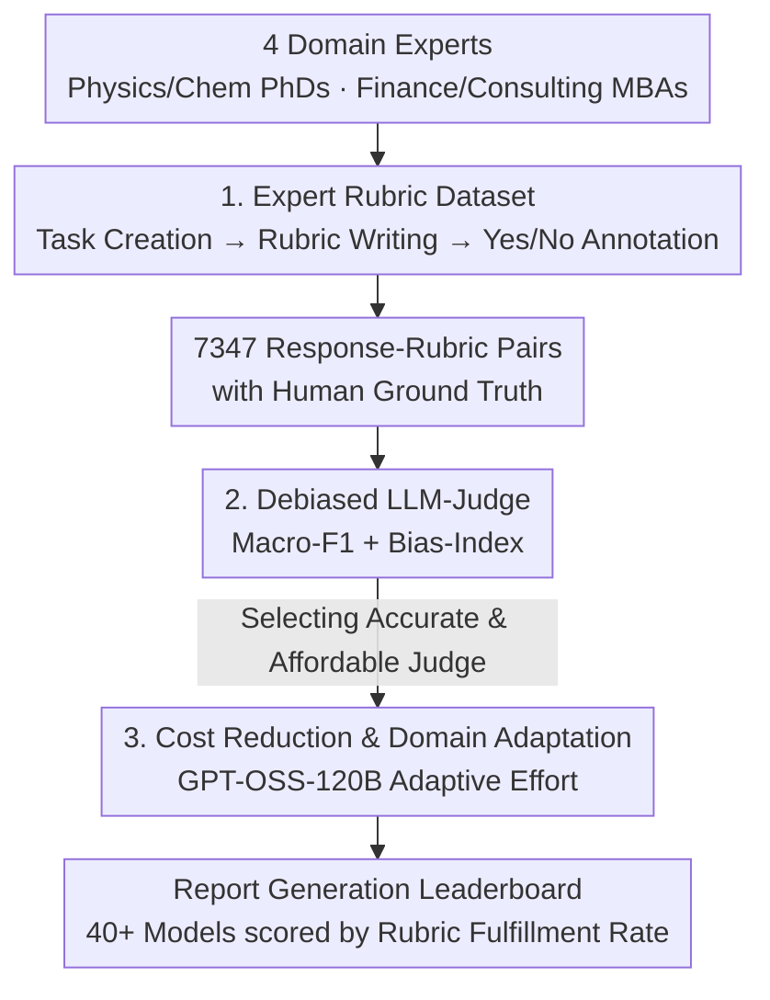

# ProfBench: Multi-Domain Rubrics requiring Professional Knowledge to Answer and Judge

**Conference**: ICLR 2026  
**OpenReview**: [https://openreview.net/forum?id=VwNzKPqBxk](https://openreview.net/forum?id=VwNzKPqBxk)  
**Code**: https://github.com/NVlabs/ProfBench (Data [HuggingFace](https://huggingface.co/datasets/nvidia/ProfBench))  
**Area**: LLM Evaluation / Benchmarking  
**Keywords**: rubric evaluation, professional domains, LLM-as-Judge, self-enhancement bias, report generation

## TL;DR
ProfBench utilizes 7,000+ "response-rubric" pairs authored by experts (Physics/Chemistry PhDs and Finance/Consulting MBAs) to establish a cross-domain rubric benchmark requiring professional knowledge for both answering and judging. Accompanied by a debiased, cost-effective LLM-Judge—which is 2-3 orders of magnitude cheaper—the study finds that even GPT-5-high achieves an overall score of only 65.9%.

## Background & Motivation
**Background**: Evaluation of Large Language Model (LLM) capabilities relies heavily on "answer verifiability." Tasks like Mathematics (AIME), Competitive Programming (LiveCodeBench), and Precise Instruction Following (IFBench) are popular because they allow for automatic correctness checks via scripts or unit tests, thereby supporting Reinforcement Learning from Verifiable Rewards (RLVR). Consequently, scientific benchmarks (MMLU-Pro, GPQA, HLE) are often forced into multiple-choice or short-answer spans to ensure a "single correct answer."

**Limitations of Prior Work**: Real-world professional tasks—such as synthesizing information from numerous documents to draft multi-page reports—lack a unique correct answer and cannot utilize standard verification methods. Existing rubric-based benchmarks either cover a single domain (PaperBench for ML papers, HealthBench for medical) or suffer from quality issues. For instance, questions in DeepResearch-Bench RACE (e.g., "What is the investment philosophy of Buffett and Munger?") can be answered by an undergraduate via simple searches. Moreover, its rubrics and reference answers are synthesized by Gemini-2.5-Pro, leading to an artificially high score (>97%) for the model itself across four dimensions.

**Key Challenge**: It is difficult to simultaneously satisfy the requirements of tasks being "professional and authentic" while ensuring evaluations are "verifiable, affordable, and fair." Professional rubrics must be authored by actual experts (costly and difficult to recruit), while using LLMs as judges introduces self-enhancement bias (models favoring their own or related models' responses) and can cost thousands of dollars per run.

**Goal**: (1) Construct a difficult cross-domain benchmark with expert-written rubrics; (2) Develop an LLM-Judge that aligns with human annotation, remains fair across models, and is affordable for the community; (3) Systematically evaluate 40+ models to identify strengths and weaknesses in professional domains and analyze the impact of "reasoning" (thinking).

**Key Insight**: Decompose "complex professional problems" into a set of "binary criteria that a good response must satisfy." By having experts author the criteria and employing a debiased, cost-optimized LLM to judge satisfaction line-by-line, unverifiable open-ended professional tasks are transformed into quantifiable and reproducible evaluations.

## Method

### Overall Architecture
ProfBench is not a model architecture but an evaluation pipeline consisting of "Data Collection → Judge Selection → Model Evaluation." Input consists of real-world tasks designed by experts (Physics PhDs, Chemistry PhDs, Finance MBAs, Consulting MBAs), and the output is a leaderboard ranking both judging and report-generation capabilities. The pipeline follows three stages: first, experts complete the "Task Creation → Rubric Writing → Response Annotation" process to obtain 7,347 response-rubric pairs with human ground truth; second, these truths are used to benchmark the judging capabilities of various LLMs (measuring alignment via Macro-F1 and fairness via Bias-Index) to select an optimal judge; finally, this judge evaluates reports generated by 40+ models.

### Key Designs

**1. Expert-Written Multi-Domain Rubric Dataset: Decomposing Professional Tasks into Verifiable Binary Criteria**

To address the lack of unique answers in professional tasks, ProfBench decomposes each task into a set of independent rubrics that a high-quality response must satisfy. Data was produced by 38 experts from 8 countries (44.7% PhD holders, 18.4% MBA holders) with an average of 5.24 years of experience, with **LLM usage strictly prohibited** during the process. Experts followed a "Prompt Ideation → Rubric Creation → Response Annotation" workflow, spending 10-20 hours per task, with a limit of 5 tasks per person to ensure diversity. Tasks were designed to challenge state-of-the-art models (o3, Grok4, etc.)—typically multi-step problems yielding multi-page reports (e.g., an investment memo analyzing how IFFIm finances vaccines). Each task includes 15-60 rubrics with descriptions, reasoning, importance, and labels. Rubrics are categorized into Reasoning (62.9%), Extraction (34.1%), and Style (3.0%). Quality control involved marking 41.4% of rubrics for improvement and cross-validating 1,127 labels with two additional experts, achieving a Fleiss' $\kappa = 0.912$.

**2. Debiased LLM-Judge: Quantifying "Fairness" into the Overall Score via Bias-Index**

Matching human consistency is insufficient because LLMs exhibit self-enhancement bias. ProfBench frames judging as a binary Natural Language Inference (NLI) problem: given a "Response + Single Rubric," the judge determines satisfaction (Yes/No). Crucially, the **original prompt is withheld** to prevent interference. Consistency is measured by Macro-F1. Fairness is quantified using a custom Bias-Index: first, for each evaluated model, the bias is calculated as $\frac{1}{N}\sum_{i=1}^{N}(c_i^{\text{model}} - c_i^{\text{human}})$; then, the Bias-Index is defined as the range (max bias - min bias) across three benchmarked models (o3, Grok4, R1-0528). An Overall score is defined as $\text{Overall} = \text{Macro-F1} - \text{Bias-Index}$, effectively coupling accuracy and neutrality.

**3. Cost-Effective and Domain-Adaptive Judge: Reducing Evaluation Costs by 2-3 Orders of Magnitude**

To make the benchmark affordable, non-reasoning LLMs generate only 1 token (Yes/No), while reasoning LLMs utilize up to 32,000 tokens, making non-reasoning judges significantly cheaper. After benchmarking 40+ judges, the authors selected the open-source GPT-OSS-120B based on the "Overall score vs. cost." They observed that high-reasoning versions excel in Physics, Chemistry, and Style rubrics, while lower-reasoning versions perform better elsewhere. Thus, they implemented a domain-adaptive judge that switches effort based on domain/type. This judge achieves a 78.2% Overall score, **matching the proprietary Gemini-2.5-Pro at only 1.68% of the cost** ($0.70 vs. $41.46).

### Mechanism: A Finance MBA Task Example
For a task like "Evaluating a new Health Finance unit and research on GAVI financing via IFFIm," the expert creates a multi-page report prompt with 6 sub-questions. Dozens of rubrics are written, such as: Extraction ("State that violating IFFIm liquidity policy harms its rating"), Reasoning ("Identify vaccines as high cost-benefit health investments"), and Style ("Clear presentation of conclusions"). Models generate responses, and the expert annotates them. During evaluation, the judge receives the response and a single rubric, determines fulfillment, and calculates a weighted score based on rubric importance (additional=1, minor=2, major=3, critical=4).

## Key Experimental Results

### Main Results: LLM-as-Judge (Consistency + Fairness)
The judge leaderboard indicates proprietary models lead, but open-source alternatives are competitive and far cheaper.

| Judge Model | Macro-F1 (All) | Bias-Index ↓ | Overall ↑ | Cost (\$) |
|:---|:---:|:---:|:---:|:---:|
| Gemini-2.5-Pro (Thinking) | 79.2 | 1.0 | **78.2** | 41.46 |
| GPT-OSS-120B (Domain-Adaptive) | 78.7 | 0.5 | **78.2** | **0.70** |
| o3-low | 78.7 | 2.3 | 76.4 | 14.01 |
| GPT-4.1 (1-token, best non-reasoning) | 76.3 | 0.9 | 75.4 | 11.31 |
| Kimi-K2-Instruct-0711 (OS non-reasoning) | 77.6 | 2.4 | 75.2 | 0.81 |

The domain-adaptive GPT-OSS-120B matches Gemini-2.5-Pro's performance at 1.68% of the cost.

### Main Results: LLM as Report Generator
The benchmark proves exceptionally difficult even for top models.

| Model | Physics | Chemistry | Finance | Consulting | Overall |
|:---|:---:|:---:|:---:|:---:|:---:|
| GPT-5 (high) | 49.3 | 70.6 | 63.7 | 80.0 | **65.9** |
| o3 | 46.1 | 61.8 | 60.9 | 76.8 | 61.4 |
| Gemini-2.5-Pro | 46.8 | 66.3 | 54.0 | 74.2 | 60.3 |
| GPT-OSS-120b (Best OS) | 49.1 | 55.3 | 45.5 | 69.4 | 54.9 |
| DeepSeek-V3.1 (Thinking) | 44.8 | 59.8 | 43.3 | 67.4 | 53.8 |

GPT-5-high leads at 65.9%, demonstrating that ProfBench is significantly harder than AIME 25 (94.6%) or GPQA-Diamond (87.0%). Physics is the most challenging domain (49.3%).

### Key Findings
- **Reasoning vs. Instruction Tuning**: While increasing "thinking" for a specific model often yields small gains (0.3-4.8%), comparing an instruction-tuned model to a reasoning-trained counterpart of the same size often favors the instruction-tuned version if it produces longer responses.
- **Thinking Increases Bias**: Higher reasoning effort generally improves human alignment but also increases bias toward specific models (especially o3), justifying the inclusion of Bias-Index in the overall metric.
- **Scaling Saturation**: Performance gains diminish as model size increases (e.g., Llama-3.3-70B improved more via post-training recipes than Llama-3.1-405B did via raw scaling).
- **Open-Source Gap in Finance**: The performance gap between proprietary and open-source models is largest in Finance (15.0%) compared to Physics (<1%), likely due to a training focus on Math/Code benchmarks rather than professional business domains.

## Highlights & Insights
- **Standardizing the Judge Paradigm**: Defining $\text{Overall} = \text{Macro-F1} - \text{Bias-Index}$ provides a transferable framework for any LLM-as-Judge evaluation to prioritize both accuracy and neutrality.
- **Domain-Adaptive Reasoning**: Using "low effort" for business domains and "high effort" for hard sciences allows an open-source model to reach proprietary-level judging performance at minimal cost.
- **Human-only Annotation**: By prohibiting LLM-assisted rubric creation, ProfBench corrects the systematic favoritism issues found in benchmarks like DeepResearch-Bench.
- **Expanding RLVR**: Rubric decomposition enables the quantification of open-ended professional tasks, paving the way for Reinforcement Learning in high-value, non-MCQ domains.

## Limitations & Future Work
- **Data Scale**: Restricted by the high cost of experts (80 tasks, 38 annotators), leading to limited coverage of sub-domains.
- **Modality and Material**: Limited to text-only, English tasks using public information; lacks multi-modal or proprietary document support.
- **Privacy**: Half of the dataset remains private to mitigate contamination, and the Bias-Index currently relies on a small set of reference models.

## Related Work & Insights
- **Comparison with Benchmarks**: Unlike PaperBench or HealthBench, which are domain-specific, ProfBench covers four professional domains and drastically reduces judging costs.
- **Addressing Synthetic Bias**: ProfBench fixes the "synthetic bias" issue in DeepResearch-Bench RACE by using verified human rubrics instead of LLM-generated ones.
- **Beyond MCQ**: Unlike MMLU-Pro or GPQA, which simplify tasks into multiple-choice formats for ease of verification, ProfBench evaluates the actual synthesis and report-writing capabilities required in professional environments.

## Rating
- **Novelty**: ⭐⭐⭐⭐ Systematically combines multi-domain rubrics, judge debiasing, and cost reduction into a robust benchmark.
- **Experimental Thoroughness**: ⭐⭐⭐⭐⭐ Comprehensive analysis across 40+ models, considering reasoning, scale, and cost, with high inter-annotator agreement ($\kappa = 0.912$).
- **Writing Quality**: ⭐⭐⭐⭐ Clear motivation and robust metric definitions.
- **Value**: ⭐⭐⭐⭐⭐ Provides an affordable and fair platform for evaluating "unverifiable" professional tasks, directly benefiting progress in neglected domains like Finance and Consulting.

<!-- RELATED:START -->

## Related Papers

- [\[ICLR 2026\] ResearchRubrics: A Benchmark of Prompts and Rubrics For Evaluating Deep Research Agents](researchrubrics_a_benchmark_of_prompts_and_rubrics_for_evaluating_deep_research_.md)
- [\[ACL 2026\] DiningBench: A Hierarchical Multi-view Benchmark for Perception and Reasoning in the Dietary Domain](../../ACL2026/llm_evaluation/diningbench_a_hierarchical_multi-view_benchmark_for_perception_and_reasoning_in_.md)
- [\[ICLR 2026\] EARTHSE: A Benchmark for Earth Science Knowledge Exploration](earthse_a_benchmark_evaluating_earth_scientific_exploration_capability_for_large.md)
- [\[ICLR 2026\] Rethinking LLM-as-a-Judge: Representation-as-a-Judge with Small Language Models via Semantic Capacity Asymmetry](rethinking_llm-as-a-judge_representation-as-a-judge_with_small_language_models_v.md)
- [\[ACL 2026\] Multi-Task Reinforcement Learning for Enhanced Multimodal LLM-as-a-Judge](../../ACL2026/llm_evaluation/multi-task_reinforcement_learning_for_enhanced_multimodal_llm-as-a-judge.md)

<!-- RELATED:END -->
