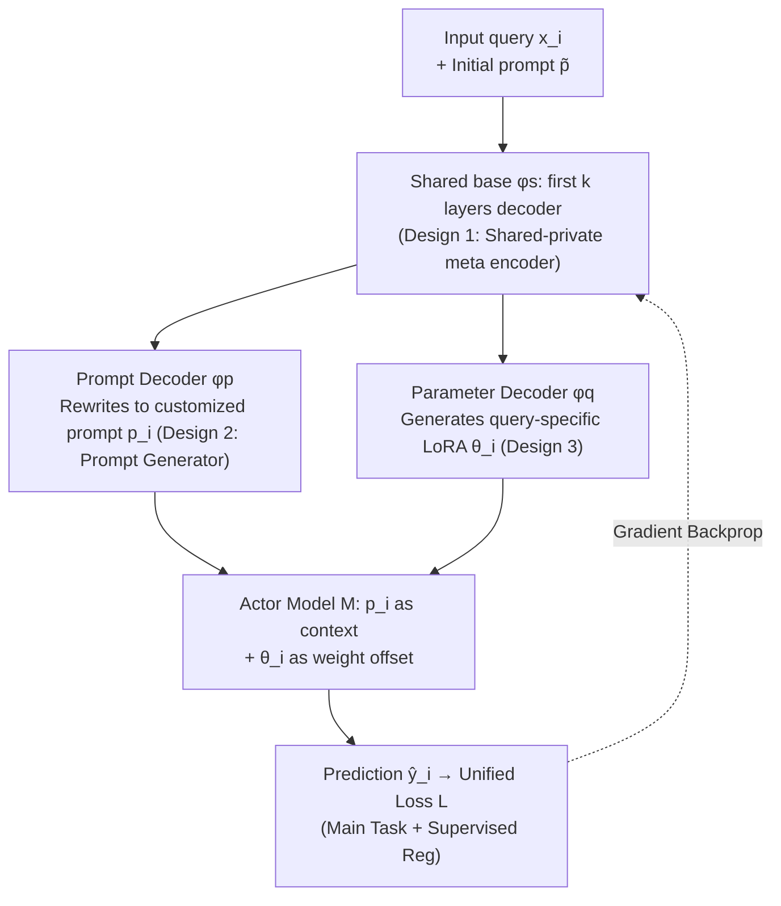

# Prompt and Parameter Co-Optimization for Large Language Models

**Conference**: ICLR 2026  
**arXiv**: [2509.24245](https://arxiv.org/abs/2509.24245)  
**Code**: [https://github.com/BoXiaohe/MetaTuner](https://github.com/BoXiaohe/MetaTuner)  
**Area**: LLM Evaluation  
**Keywords**: prompt optimization, fine-tuning, joint optimization, LoRA, discrete-continuous optimization

## TL;DR
The paper proposes MetaTuner, a framework that simultaneously generates prompts and LoRA parameters via a shared meta encoder. It unifies discrete prompt optimization and continuous parameter fine-tuning into an end-to-end optimizable joint framework, significantly surpassing methods that optimize them independently on mathematical reasoning and question-answering tasks.

## Background & Motivation

**Background**: Post-training for LLMs follows two primary routes: prompt optimization (e.g., OPRO, RLPrompt, BPO), which seeks appropriate input contexts to activate existing model capabilities, and fine-tuning (e.g., SFT, RLHF, DPO), which updates parameters to adapt to the target data distribution. These are typically studied and utilized independently.

**Limitations of Prior Work**: While prompt optimization guides model behavior, it cannot adapt to complex patterns in large-scale task data, especially when prompt information conflicts with knowledge encoded in parameters. Conversely, fine-tuning often uses manually designed prompts as input, yet prompt selection radically affects fine-tuning performance—using sub-optimal prompts can even yield results inferior to pure prompt optimization.

**Key Challenge**: Prompts exist in a discrete optimization space (text tokens), while parameters exist in a continuous optimization space (floating-point weights). Their optimization objectives and execution processes are fundamentally different. The challenge lies in optimizing these two complementary dimensions within a unified framework while addressing the non-differentiability of mixed discrete-continuous optimization.

**Goal**: (a) How to design a framework where prompts and parameters enhance each other? (b) How to conduct effective gradient optimization in a hybrid discrete-continuous space? (c) Can the optimal prompt-parameter combination exceed the upper bound of independent optimization?

**Key Insight**: Pre-experiments reveal that fine-tuning methods are extremely sensitive to prompt selection—SFT performance varies significantly with different prompts and may fall below prompt optimization methods. This confirms the necessity of joint optimization.

**Core Idea**: Treat prompts as "special parameters" and use a shared encoder to simultaneously generate both prompts and model parameters, achieving complementary enhancement.

## Method

### Overall Architecture
MetaTuner integrates "prompt tuning" and "parameter tuning," which are traditionally separate, into a single end-to-end trainable framework. The core insight is to treat the prompt as a "special parameter" and generate it along with LoRA weights via a single network. Specifically, for an input query $x_i$ paired with an initial manual prompt $\tilde{p}$, the input passes through a shared Meta Encoder $\phi_s$. The flow then splits into two private heads: the Prompt Decoder (private parameters $\phi_p$) rewrites it into a customized prompt $p_i$, while the Parameter Decoder (private parameters $\phi_q$) generates query-specific LoRA parameters $\theta_i$. Both are applied to the downstream Actor Model $\mathcal{M}$: the prompt determines the input context, and LoRA determines the weight offset. $\mathcal{M}$ then makes a prediction, and the loss is backpropagated through the entire chain. Sharing $\phi_s$ is critical—knowledge learned on the prompt side can permeate the parameter side and vice versa. By redefining "prompt searching in token space" as "continuous optimization of $\phi_p$," the non-differentiable hybrid problem is converted into a unified differentiable objective.

### Key Designs

**1. Shared-private meta encoder: Mutual error correction between branches**

If the prompt and parameter branches operate independently, their respective sub-optimal solutions become fixed. MetaTuner splits the parameters of the prompt generator $\mathcal{G}$ into $\phi = \{\phi_s, \phi_p\}$, where $\phi_s$ is the shared base (the first $k$ layers of a Transformer decoder acting as the meta encoder) and $\phi_p$ is prompt-specific. The Parameter Decoder $\mathcal{F}$ reuses $\phi_s$ and adds its own private parameters $\phi_q$. The entire system is optimized under a unified objective:

$$\min_{\phi_s, \phi_p, \phi_q} \sum_{i=1}^N \mathcal{L}(\mathcal{M}_{\mathcal{F}_{(\phi_s,\phi_q)}(\tilde{p},x_i)}(\mathcal{G}_{(\phi_s,\phi_p)}(\tilde{p},x_i), x_i), y_i)$$

The shared $\phi_s$ provides mutual regularization—any sub-optimal solution from one branch is corrected by the other via the unified loss. Meanwhile, private $\phi_p$ and $\phi_q$ allow for independent exploration. The sharing depth $k$ is a tunable trade-off: for a 7B model, more private layers ($k=K/4$) are better, while a 3B model benefits from a higher sharing ratio ($k=3K/4$) to enhance consistency.

**2. Prompt Generator $\mathcal{G}$: Turning discrete prompt search into continuous optimization**

The primary difficulty in discrete prompt optimization is that searching in token space is non-differentiable. MetaTuner avoids "generation from scratch" and instead uses "rewriting on an initial prompt": given an initial manual prompt $\tilde{p}$, a learnable LLM $\mathcal{G}_\phi$ rewrites a customized version $p_i = \mathcal{G}_\phi(\tilde{p}, x_i)$ for each query. This optimizes the continuous parameters $\phi$ of $\mathcal{G}$ rather than discrete tokens, drastically compressing the search space. Since all queries share $\tilde{p}$ as a starting point, it eliminates the manual cost of per-query prompt labeling.

**3. Parameter Decoder: Generating query-specific LoRA weights from hidden states**

The parameter branch converts hidden states from the shared encoder into weight offsets. For LoRA updates $\Delta W = \theta_i^b \cdot \theta_i^a$, two small networks (Matrix Multiplication + ReLU) generate the low-rank matrices from hidden states $h_i$. For example, $\theta_i^b = \text{MM}(\text{ReLU}(\text{MM}(W_d^b, h_i)), W_u^b)$. Using LoRA ensures training efficiency, while generating a unique LoRA set per query achieves input-level adaptation.

### Loss & Training

Key challenge: Prompt decoder outputs discrete tokens, preventing direct gradient backpropagation to $\phi_p$. The solution is a **supervised regularization loss**:

$$\min_{\phi_s, \phi_p, \phi_q} \sum_{(x_i,y_i) \in D_1} \mathcal{L}(\mathcal{M}_{\mathcal{F}}(\mathcal{G}_{(\phi_s,\phi_p')}(\tilde{p},x_i), x_i), y_i) + \sum_{(x_i,p_i) \in D_2} \alpha \cdot \mathcal{L}(\mathcal{G}_{(\phi_s,\phi_p)}(\tilde{p},x_i), p_i)$$

- The first term is the main task loss, with $\phi_p'$ (prompt private parameters) frozen to ensure differentiability.
- The second term is supervised regularization, using the optimal prompts sampled via rollout for supervised learning on $D_2 = \{(x_i, p_i)\}$.
- $\phi_p'$ is periodically synchronized with the updated $\phi_p$.
- Gumbel-Softmax was attempted but underperformed compared to supervised regularization due to gradient bias from continuous relaxation.

**Mechanism**: Warm up $\mathcal{G}$ (Qwen2.5-7B) and $\mathcal{M}$ (Qwen2.5-3B) with SFT separately, followed by joint training.

## Key Experimental Results

### Main Results

Comparison across 4 benchmarks (Qwen2.5-7B as generator, Qwen2.5-3B as actor):

| Method | MATH | GSM8K | HotpotQA | CosmosQA | Type |
|------|------|-------|----------|----------|------|
| Qwen2.5 (zero-shot) | 18.44 | 51.63 | 19.85 | 36.80 | Vanilla |
| BPO | 32.67 | 58.00 | 43.90 | 82.05 | Prompt |
| OPRO | 22.00 | 75.06 | 25.55 | 69.10 | Prompt |
| SFT | 41.33 | 61.41 | 43.20 | 82.65 | Fine-tune |
| DPO | 43.78 | 63.68 | 44.70 | 87.90 | Fine-tune |
| BetterTogether | 41.56 | 67.93 | 52.30 | 89.80 | Hybrid |
| **MetaTuner-J** | **48.67** | **78.92** | **54.56** | **92.25** | Hybrid |

MetaTuner-J average improvement over BetterTogether is 10.15% (7B backbone), with gains of +7.11 on MATH and +10.99 on GSM8K.

### Ablation Study

| Configuration | MATH | GSM8K | HotpotQA | CosmosQA | Description |
|------|------|-------|----------|----------|------|
| MetaTuner (w/o F) | 48.00 | 77.79 | 54.05 | 91.10 | Remove fine-tuning branch |
| MetaTuner (w/o P) | 46.22 | 78.54 | 53.90 | 91.00 | Remove prompt branch |
| MetaTuner (w/o S) | 46.67 | 77.86 | 53.65 | 91.50 | No shared parameters |
| **MetaTuner (full)** | **48.67** | **78.92** | **54.56** | **92.25** | Optimal full model |

### Key Findings
- **Both branches are essential**: Removing either the fine-tuning or prompt branch leads to average drops of approx 0.99% and 1.12%, respectively.
- **Shared parameters are crucial**: Performance of the "w/o S" configuration is inferior, proving the effectiveness of mutual enhancement.
- **Sharing ratio correlates with model size**: 7B models perform best with $K/4$ sharing, while 3B models prefer $3K/4$.
- **Supervised regularization outperforms Gumbel-Softmax**: Direct optimization in discrete space avoids the approximation errors of continuous relaxation.
- **Joint optimization (MetaTuner-J) is generally superior** to alternating optimization (MetaTuner-I).

## Highlights & Insights
- **Viewing prompts as "special parameters"**: This unified perspective breaks the traditional barrier between prompt optimization and fine-tuning, allowing them to complement each other under a single objective.
- **Supervised regularization for hybrid optimization**: Using rollout-derived optimal prompts as supervision signals effectively trains the prompt decoder while bypassing the gradient bias issues of relaxation methods.
- **Query-specific adaptation**: Dynamically generating both prompts and LoRA parameters per query enables fine-grained adaptation compared to static global prompts or weights.

## Limitations & Future Work
- **Computational Overhead**: Using a 7B model to serve a 3B actor model introduces significant inference overhead.
- **Dependency on Warmup**: The pipeline is complex, requiring separate SFT stages before joint training.
- **Architecture Generalization**: The method has primarily been validated on the Qwen series.
- **Discrete Prompt Capacity**: Prompt information capacity is limited compared to deep domain knowledge requirements.

## Related Work & Insights
- **vs BetterTogether**: While both attempt joint optimization, MetaTuner achieves deeper synergy through a shared encoder and end-to-end differentiable training via supervised regularization, yielding a 10%+ average improvement.
- **vs OPRO/CFPO**: Pure prompt optimization faces a performance "ceiling" in reasoning tasks. MetaTuner raises MATH performance from OPRO's 22.00 to 48.67.
- **vs DPO/PPO**: Pure fine-tuning is limited by fixed prompts. MetaTuner increases GSM8K performance from DPO's 63.68 to 78.92.

## Rating
- Novelty: ⭐⭐⭐⭐ 
- Experimental Thoroughness: ⭐⭐⭐⭐⭐ 
- Writing Quality: ⭐⭐⭐⭐ 
- Value: ⭐⭐⭐⭐ 

<!-- RELATED:START -->

## Related Papers

- [\[ICLR 2026\] SparseEval: Efficient Evaluation of Large Language Models by Sparse Optimization](sparseeval_efficient_evaluation_of_large_language_models_by_sparse_optimization.md)
- [\[ICLR 2026\] Multi-turn Evaluation of Anthropomorphic Behaviours in Large Language Models](multi-turn_evaluation_of_anthropomorphic_behaviours_in_large_language_models.md)
- [\[ICLR 2026\] CMPhysBench: A Benchmark for Evaluating Large Language Models in Condensed Matter Physics](cmphysbench_a_benchmark_for_evaluating_large_language_models_in_condensed_matter.md)
- [\[ICLR 2026\] SimBench: Benchmarking the Ability of Large Language Models to Simulate Human Behaviors](simbench_benchmarking_the_ability_of_large_language_models_to_simulate_human_beh.md)
- [\[ACL 2025\] Mis-prompt: Benchmarking Large Language Models for Proactive Error Handling](../../ACL2025/llm_evaluation/mis-prompt_benchmarking_large_language_models_for_proactive_error_handling.md)

<!-- RELATED:END -->
