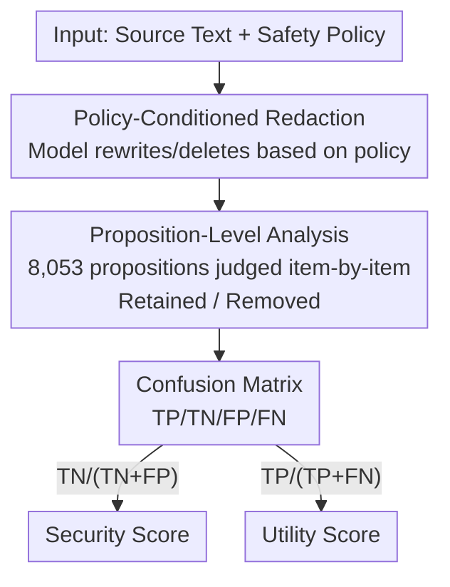

# RedacBench: Can AI Erase Your Secrets?

**Conference**: ICLR 2026  
**OpenReview**: [https://openreview.net/forum?id=wf73W2xatC](https://openreview.net/forum?id=wf73W2xatC)  
**Code**: To be confirmed (web playground provided: https://hyunjunian.github.io/redaction-playground/)  
**Area**: LLM Evaluation / Privacy & Security / Data Sanitization  
**Keywords**: Text redaction, proposition-level evaluation, security-utility tradeoff, policy conditioning, privacy benchmark

## TL;DR
This paper proposes RedacBench—a comprehensive benchmark for evaluating Large Language Model (LLM) text redaction capabilities using "policy conditioning + proposition-level annotation." Utilizing 514 human-written texts, 187 safety policies, and 8,053 annotated propositions, the benchmark quantifies both the "Security" of erasing sensitive information and the "Utility" of preserving non-sensitive information. Systematic evaluation of 11 mainstream models across 3 redaction strategies reveals that stronger models achieve higher security but struggle more to maintain utility, highlighting a significant tradeoff between the two.

## Background & Motivation

**Background**: LLMs are being deployed at scale in sectors such as finance, law, and healthcare for tasks like summarization and retrieval, frequently interacting with sensitive personal and organizational data. To prevent leaks, **data sanitization / text redaction**—the process of detecting and removing sensitive information from text—is currently the most practical and widely used protective measure.

**Limitations of Prior Work**: Existing redaction methods rely heavily on **surface-level keyword or pattern matching** (e.g., Named Entity Recognition (NER)-based entity removal). They assume that "sensitive information equals identifiable entities in the text." This leads to two types of failure: either failing to remove content that is **semantically sensitive but lacks explicit identifiers** (e.g., health status or trade secrets embedded in context), or **over-redacting**, which destroys the utility of the text. The result is a "false sense of privacy."

**Key Challenge**: In real-world scenarios, "what is considered sensitive" varies depending on the context or organization and cannot be exhaustively listed as fixed categories. Furthermore, existing benchmarks either focus only on whether models unintentionally generate sensitive content or cover a narrow definition of PII. There lacks a **standardized, quantifiable method to evaluate whether sensitive information can still be inferred** after redaction. Crucially, strong LLMs can **infer** sensitive attributes like occupation, health, or relationships from seemingly innocuous text. Therefore, evaluation must move beyond "whether entities are deleted" toward "whether information can still be inferred."

**Goal**: To construct a benchmark capable of evaluating LLM redaction performance across domains and policy types under **policy constraints**, while simultaneously characterizing the dimensions of security (removing sensitive data) and utility (retaining harmless data).

**Key Insight**: The authors redefine the redaction task as "**policy-conditioned selective removal**"—providing a high-level "safety policy" as part of the input, allowing the system to decide what to remove based on the policy. Evaluation does not check whether tokens are deleted, but rather whether **each pre-annotated proposition can still be inferred** after redaction.

**Core Idea**: Replace "entity-level, literal matching" evaluation with "proposition-level, inferability" evaluation, and decompose redaction quality into a TP/TN/FP/FN confusion matrix to simultaneously quantify security and utility scores.

## Method

### Overall Architecture

RedacBench is essentially a "dataset + evaluation protocol." The input consists of a **source text** and an associated **safety policy**. The system under test (an LLM + a specific redaction strategy) produces a **redacted text**. The evaluation component takes a set of propositions pre-annotated from the source text and determines for each one **whether it can still be inferred** from the redacted text. Combining this with "sensitive/non-sensitive" labels for each proposition, the **Security score** and **Utility score** are calculated.

The framework consists of three parts: (1) a **policy-conditioned task definition** that externalizes "sensitivity" as a variable policy input; (2) a **proposition-level evaluation framework** that quantifies results into security/utility scores using a confusion matrix; and (3) a **bottom-up, human-in-the-loop dataset construction process** resulting in 514 texts, 187 policies, and 8,053 propositions. Finally, the benchmark is used to **evaluate multiple redaction strategies × multiple SOTA models** to establish baselines.

### Key Designs

**1. Policy-conditioned redaction task: Transforming "sensitivity" from fixed categories to variable inputs**

Existing redaction tasks fix sensitive information into categories like PII, failing to account for the fact that sensitivity varies with context and organization. This paper redefines the task: the system receives both a **source text** and a **high-level safety policy**, and outputs a redacted version satisfying that policy. Policies range from micro-level (e.g., "Instructor names must be confidential") to macro-level (e.g., "All strategic business plans must be confidential"). Thus, "sensitivity" is not hard-coded into the dataset but dynamically determined by the input policy, closely reflecting real environments in finance or government where the same text may require different redactions under different policies.

**2. Proposition-level, inferability evaluation framework: Quantifying security and utility via a confusion matrix**

This is the core of the method. The authors decompose "information" into **propositions**—the smallest units of fact that can be inferred from the source text, including **implied information inferable from context** (e.g., if the text mentions "meeting at Company X," the proposition "the speaker is affiliated with Company X" can be inferred). Each proposition is labeled as **sensitive/non-sensitive** according to the policy. After redaction, the system determines **if the proposition can still be inferred (Retained/Removed)**, constructing a confusion matrix: TP = non-sensitive & correctly retained, TN = sensitive & correctly removed, FP = sensitive & incorrectly retained, FN = non-sensitive & incorrectly removed. The core metrics are defined as:

$$\text{Security} = \frac{TN}{TN+FP}, \qquad \text{Utility} = \frac{TP}{TP+FN}$$

Security represents the proportion of successfully removed sensitive information, while Utility represents the proportion of successfully preserved non-sensitive information. This design evaluates "inferability" rather than "token deletion," capturing leaks at the semantic/contextual level—a fundamental upgrade over NER-style entity evaluation. It also separates the natural "over-redaction vs. under-redaction" conflict into two measurable dimensions.

**3. Bottom-up, human-in-the-loop dataset construction: Rooting policies and propositions in real data**

The dataset follows a four-step process: ① **Source text collection**—514 texts containing sensitive content selected from personal (student essays), corporate (Enron emails), and government (Hillary Clinton emails) sources; ② **Proposition extraction**—8,053 semantic propositions extracted from the texts; ③ **Policy formulation**—identifying potentially sensitive propositions and **bottom-up** inducing general safety policies, resulting in 187 policies; ④ **Violation annotation**—labeling which propositions violate which policies. For scale and quality, steps ②③④ use **human-in-the-loop**: LLMs generate initial drafts, followed by review and consensus by two annotators (an AI privacy researcher and a practitioner with 5+ years of experience). The bottom-up approach ensures policies are derived from real propositions, guaranteeing strong alignment between policies and data.

**4. Three redaction strategies + LLM automatic evaluator: Establishing comparable baselines**

To demonstrate the benchmark, the authors evaluate three representative methods: **Masking** (keyword matching based on policy followed by token-level masking, representing surface removal without reasoning), **Adversarial Redaction (AR)** (adapted from adversarial anonymization, where the model reads the source + policy to rewrite or delete violations at the syntactic/semantic level), and **Iterative Redaction** (repeatedly applying the model to its own output to remove residual sensitive content, typically Security ↑ Utility ↓). The judgment of "inferability" is performed by a **GPT-4.1-mini auto-evaluator**. To ensure reliability, its error rate was tested on all 8,053 propositions: the FN rate (judging a true proposition as false) was only **1.45%**, and the FP rate (judging an uninferable proposition as inferable) was **2.62%** (211 cases). A higher FP rate suggests reported Security scores may be **slightly underestimated**. Since the same evaluator is applied consistently across all methods and models, relative comparisons remain reliable.

### A Complete Example

In the Phillip Allen email example (Table 2), which discusses financing a 134-unit apartment project: the source text is decomposed into 10 propositions, such as "The project is a 134-unit apartment in San Marcos" and "Phillip Allen is looking for bridge financing without personal guarantees." Given the policy "All sensitive financial information must be kept confidential," propositions regarding financing structures are labeled **sensitive**, while "The project is suitable for any business school teaching material" is labeled **non-sensitive**. After the model rewrites the text, the evaluator checks each item: sensitive propositions "Removed" count toward TN (Security), and non-sensitive propositions "Retained" count toward TP (Utility). In Figure 1, this sample scores Security 44.6% / Utility 71.5%. This illustrates why proposition-level evaluation is necessary—security and utility are accounted for separately within the same rewrite.

## Key Experimental Results

### Main Results

Evaluated across 11 models of varying scales/configurations using three methods (Masking, AR iter-1, AR iter-2). Metrics are Security / Utility (higher is better, though they tradeoff).

| Model | Masking Sec/Util | AR(iter1) Sec/Util | AR(iter2) Sec/Util |
|------|------|------|------|
| gpt-5 | 38.9 / 80.2 | 72.3 / 48.7 | 77.1 / 45.6 |
| gpt-5-mini | 41.8 / 75.8 | 63.4 / 57.2 | **80.9** / 37.6 |
| gpt-5-nano | 38.5 / 82.1 | 51.9 / 71.5 | 58.2 / 64.8 |
| gpt-4.1 | 36.4 / 82.0 | 68.2 / 55.1 | 77.0 / 44.4 |
| gemini-2.5-flash-lite | 35.9 / **85.1** | 52.2 / 70.6 | 60.2 / 62.1 |
| claude-sonnet-4 | **44.6** / 78.3 | 59.5 / 68.6 | 68.5 / 55.8 |
| qwen3-4b-2507 | 51.6 / 72.8 | 63.5 / 59.1 | 75.8 / 44.4 |

(Selected 7/11 models) The highest Security is **80.9% by gpt-5-mini using two rounds of AR**, but Utility drops sharply to 37.6%—the more thoroughly information is removed, the less non-sensitive information is preserved.

### Analysis of Methods/Models

| Phenomenon | Data | Explanation |
|------|------|------|
| Masking Ceiling | Security scores flat ~36–52% | Surface masking has reached a performance ceiling for modern LLMs; model strength makes little difference. |
| AR Gap | Reasoning-heavy models consistently higher | Semantic redaction relies on stronger base reasoning capabilities. |
| Iteration vs. Scale | GPT-4.1-mini @ 7 rounds ≈ GPT-5 @ 2 rounds | Once a model crosses a certain threshold, more iterations can partially compensate for smaller model size. |
| Iteration Failure | GPT-4.1-nano shows almost no gain | Iterative refinement is ineffective when fundamental model capability is too weak. |
| Open Source Competitiveness | Qwen3-4B-2507 between GPT-4.1 and GPT-4.1-mini | Small open-source models can compete when paired with advanced redaction strategies. |

### Key Findings
- **Security-Utility is a Universal Tradeoff**: All "model × method" combinations fall on a "higher security implies lower utility" tradeoff curve (Fig 2a). The absolute gaps between models are small, suggesting significant room for improvement in "high security + high utility" methods.
- **Claude-Sonnet-4 Balanced Best**: It consistently maintains higher utility at comparable security levels, representing a superior balance point.
- **Evaluator Bias is Relatively Comparable**: An FP rate of 2.62% means Security scores might be slightly underestimated; however, since the evaluator is applied consistently, horizontal comparisons remain valid.

## Highlights & Insights
- **Externalizing "Sensitivity" as Policy Input**: Conditioning the task on a policy reflects the variability of real environments and allows the same dataset to be reused for different sensitivity definitions—an efficient dataset design choice.
- **"Inferability" over "Deletion"**: Proposition-level evaluation captures the genuine threat in the LLM era—contextual inference leaks. Decomposing information into minimal units including implicit propositions, then decoupling Security/Utility via a confusion matrix, provides a framework transferable to other "selective rewriting" tasks like content moderation or compliance rewriting.
- **Bottom-up Policy Creation**: Inducing policies from real propositions avoids "armchair policy writing" that is disconnected from data, serving as a valuable data creation paradigm.
- **Iteration Can Replace Scale**: Finding that multiple rounds of self-redaction can approach the performance of larger models is highly practical for resource-constrained environments.

## Limitations & Future Work
- **Empirical rather than Formal Privacy Guarantees**: Using strong LLMs for adversarial inference "simulates an attack," providing a practical lower bound for security rather than the mathematical guarantee of statistical indistinguishability found in Differential Privacy (the authors justify this by noting formal methods often severely damage text fluency).
- **Evaluator Hallucination/Data Contamination Risk**: If the evaluator LLM saw the source documents during pre-training, it might judge deleted information as "still inferable" based on memory. The authors suggest using documents published after the model's knowledge cutoff.
- **Generally Low Utility**: Even SOTA models struggle to maintain utility at high security levels, indicating that current redaction strategies are far from mature. The authors explicitly warn **against deploying fully automated redaction in high-risk sectors like healthcare/law/finance without human supervision**.
- **Specific Corpus Sources**: Source texts are concentrated in Enron/Clinton emails and student essays. While categorized into three types, domain coverage remains limited; generalization to other styles requires verification.

## Related Work & Insights
- **vs. Conventional PII/NER Redaction**: Traditional methods remove explicit entities (names, card numbers, SSN) to comply with GDPR/HIPAA, assuming "sensitive = identifiable entity." This paper uses policy-driven inferability evaluation, covering high-level, contextual sensitivity without destroying coherence through mechanical deletions.
- **vs. SynthPAI and Attribute Inference Benchmarks**: SynthPAI focuses on personal attribute inference; RedacBench extends evaluation to non-personal, policy-defined complex sensitivities, filling the gap where PII datasets fall short.
- **vs. Adversarial Anonymization (Staab et al., 2025)**: This work adapts it as an AR baseline, but the contribution lies in providing the proposition-level benchmark to evaluate such strategies rather than proposing the algorithm itself.
- **vs. Machine Unlearning / Differential Privacy**: Those are model-centric defenses against training data memorization; this paper targets **redaction of inputs/outputs during inference**, serving as a complementary layer—even with perfect DP, sensitive data in new user inputs still requires inference-time protection.

## Rating
- Novelty: ⭐⭐⭐⭐ Proposition-level inferability + policy-conditioned evaluation is a substantial upgrade for redaction assessment, though focused on benchmarking.
- Experimental Thoroughness: ⭐⭐⭐⭐ 11 models × 3 strategies × multi-round iterations, with reported FN/FP rates for the evaluator itself.
- Writing Quality: ⭐⭐⭐⭐ Clear task definitions, metrics, and data construction with intuitive figures.
- Value: ⭐⭐⭐⭐ Provides a standardized, quantifiable tool and baseline for privacy redaction, holding practical significance for compliance.

<!-- RELATED:START -->

## Related Papers

- [\[ICML 2026\] From Human-Level AI Tales to AI Leveling Human Scales](../../ICML2026/llm_evaluation/from_human-level_ai_tales_to_ai_leveling_human_scales.md)
- [\[ICLR 2026\] PACEbench: A Framework for Evaluating Practical AI Cyber-Exploitation Capabilities](pacebench_a_framework_for_evaluating_practical_ai_cyber-exploitation_capabilitie.md)
- [\[ICLR 2026\] Holistic Agent Leaderboard: The Missing Infrastructure for AI Agent Evaluation](holistic_agent_leaderboard_the_missing_infrastructure_for_ai_agent_evaluation.md)
- [\[ICLR 2026\] Rethinking LLM Evaluation: Can We Evaluate LLMs with 200× Less Data?](rethinking_llm_evaluation_can_we_evaluate_llms_with_200_less_data.md)
- [\[ICLR 2026\] SysMoBench: Evaluating AI on Formally Specifying Complex Real-World Systems](sysmobench_evaluating_ai_on_formally_specifying_complex_real-world_systems.md)

<!-- RELATED:END -->
